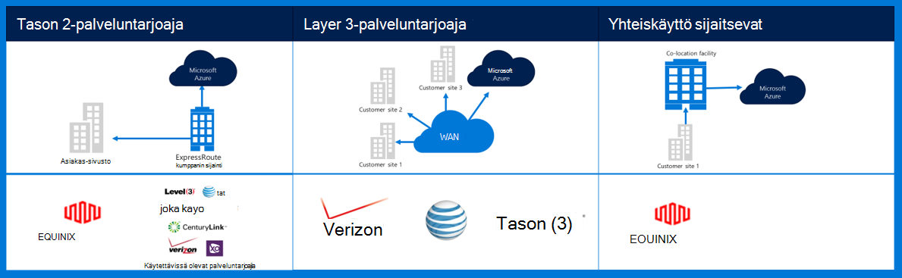
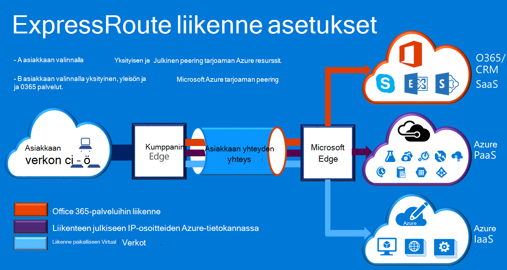

<properties
    pageTitle="Azure Governmenmt dokumentaatio | Microsoft Azure"
    description="Tämä on vertailu ominaisuuksista ja yksityinen yhteys e Government ohjeet"
    services="Azure-Government"
    cloud="gov" 
    documentationCenter=""
    authors="ryansoc"
    manager="zakramer"
    editor=""/>

<tags
    ms.service="multiple"
    ms.devlang="na"
    ms.topic="article"
    ms.tgt_pltfrm="na"
    ms.workload="azure-government"
    ms.date="09/28/2016"
    ms.author="ryansoc"/>

#  Azure Government verkko

##  ExpressRoute (yksityinen Connectivity)

ExpressRoute ei yleensä käytettävissä Azure Government. Katso lisätietoja (mukaan lukien kumppanien ja peering sijainnit) <a href="https://azure.microsoft.com/en-us/documentation/services/expressroute/">ExpressRoute julkisen ohjeissa </a>.

###  Variaatiot

ExpressRoute on yleisesti saatavilla (GA)-Azure Government. 

- Government asiakkaiden yhdistäminen fyysisesti erillään kapasiteetin erillinen Azure Government (gov –) ExpressRoute (Kannattaa)-yhteyden kautta

- Azure gov – tarjoaa entistä enemmän käytettävyys ja kestävyyttä mukaan hyödyntäminen useita alueen paria sijaitsee vähintään 500 Mailia toisistaan 

- Oletusarvon mukaan kaikki Azure gov – Kannattaa yhteys on määritetty aktiivinen-aktiivinen tarpeettomat bursting tuki- ja toimittaa enintään 10 G piiri kapasiteetin (pienin on 50 Mt)

- Azure gov – Kannattaa sijainnit antaa asiakkaat ja Azure gov – geo tarpeettomat alueiden optimoitu kulkeutumisreittien (lyhyimmän siirräntävälien, pieni viive, erinomainen suorituskyky jne.)

- Azure gov – Kannattaa yksityinen yhteys ei käytä ja käy läpi määräytyvät Internetissä

- Azure gov – fyysistä ja loogista infrastruktuuri on varattu ja erotettu ja käyttöä on rajoitettu Yhdysvaltain henkilöille

- Microsoft omistaa, ja se toimii kaikissa fiber infrastruktuuri ja Azure gov – Kannattaa täyttävät Azure gov – alueiden välillä-Me sijainnit

- Azure gov – Kannattaa antaa yhteys Microsoft Azure O365 ja CRM pilvipalveluihin

### Huomioon otettavia seikkoja

On kaksi basic-palveluja, jotka tarjoavat yksityinen verkkoyhteyden kyselyjä Azure Government: VPN (sivuston--sivustoon tyypillinen organisaation) ja ExpressRoute.

Azure ExpressRoute käytetään luomaan yksityisiä yhteyksiä Azure Government palvelinkeskusten ja paikallinen infrastruktuurin tai ulkoistaminen ympäristössä. ExpressRoute yhteydet ei siirry julkisen Internetin välityksellä – tarjoavat luotettavuutta, nopeampi nopeuksia tai alemman viiveet suurempia kuin tavallinen Internet-yhteydet. Joissakin tapauksissa käyttäminen tietojen siirtämiseen välillä paikalliseen järjestelmien ja Azure tuottojen merkittäviä etuja kustannusten ExpressRoute yhteydet.   

ExpressRoute voit muodostaa yhteyksiä Azure ExpressRoute paikkaan (esimerkiksi Exchange-palvelun tilan) tai suoraan yhdistät Azure olemassa olevat WAN verkosta (kuten multiprotocol tarra vaihtaminen (MPLS) VPN-verkon palveluntarjoajan toimittamaan).

    

Verkko-palveluiden tukemaan Azure Government asiakkaan sovelluksia ja ratkaisuja on erittäin suositeltavaa, että ExpressRoute (yksityinen connectivity) on toteutettu muodostaa Azure Government. Jos VPN-yhteydet ilmoitetaan, seuraavat asiat huomioon:

- Asiakkaiden on otettava yhteyttä niiden valtuuttamalla virallinen/viraston, onko pakollinen yksityisen yhteyden tai muun salattua yhteyttä-toiminnon avulla ja tunnistaa mitään rajoituksia ottaa huomioon.

- Asiakkaiden pitäisi päättää, voit määrittää, että sivusto sivusto VPN reititetään yksityinen yhteys vyöhykkeen.

- Asiakkaiden kannattaa hankkia MPLS piiri tai VPN käyttöoikeus yksityinen yhteys access-palvelussa.

Kaikki asiakkaat, joilla käyttämiseen yksityinen yhteys-arkkitehtuuri tulee vahvistaa, että tarvittavat käyttöönoton on vahvistettu ja ylläpitää asiakkaan, yhdyskäytävän verkko ja Internet-yhteyden (GN / voin) reuna reitittimen rajaus pisteen Azure Government varten. Vastaavasti organisaation täytyy vahvistaa verkkoyhteys paikallinen ympäristö ja yhdyskäytävän verkon/asiakkaan (GN/C) reunan reitittimen rajaus pisteen välillä Azure Government.

## Seuraavat vaiheet

Lisätiedot ja päivitykset Ota tilaa varten <a href="https://blogs.msdn.microsoft.com/azuregov/">Microsoft Azure Government-blogi.</a>
