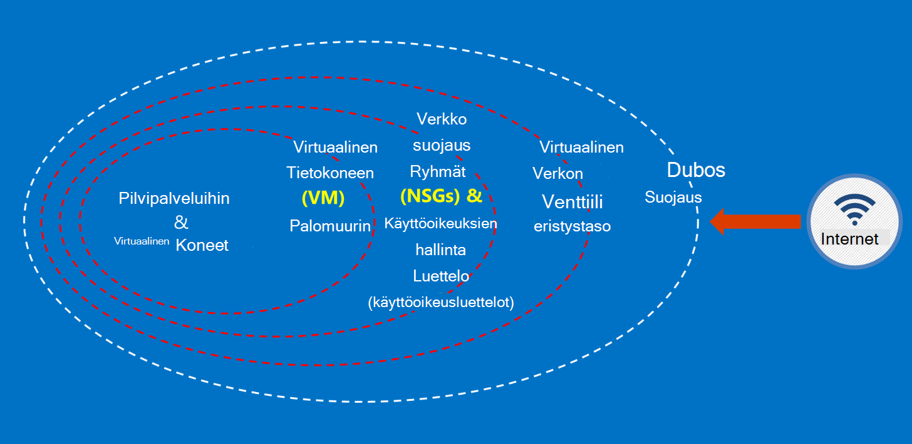

<properties
    pageTitle="Azure Government-ohjeet | Microsoft Azure"
    description="Tämä sisältää ominaisuuksia ja ohjeita vertailua Azure Government-sovellusten kehittäminen"
    services="Azure-Government"
    cloud="gov" 
    documentationCenter=""
    authors="ryansoc"
    manager="zakramer"
    editor=""/>

<tags
    ms.service="multiple"
    ms.devlang="na"
    ms.topic="article"
    ms.tgt_pltfrm="na"
    ms.workload="azure-government"
    ms.date="08/25/2016"
    ms.author="ryansoc"/>

#  Azure Government dokumentaation yleiskatsaus

##  Johdanto Azure Government-ohjeet

Tämän sivuston tässä artikkelissa kuvataan [Microsoft Azure julkishallinnon](https://azure.microsoft.com/features/gov/) palvelut ominaisuuksia ja on yleisiä ohjeita, jotka koskevat kaikkia asiakkaita. Ennen mukaan lukien erityisesti säännellyillä tiedot Azure Government-tilaukseesi, tutustuminen Azure Government-ominaisuuksia ja ota tilin ryhmän, jos sinulla on kysyttävää.

[Microsoft Azure luota Center yhteensopivuuden sivun](http://www.microsoft.com/en-us/TrustCenter/Compliance/default.aspx) tiedot tietyn tunnustukset ja asetusten piiriin Azure Government Services pitäisi viitata. Microsoft-palveluiden myös ole käytettävissä, mutta eivät ole puitteissa kattaa Azure Government-palveluiden ja eivät kata tätä tiedostoa. Azure Government-palveluja myös hyödyntämällä voit käyttää erilaisia lisäresursseja, sovelluksiin tai kolmansien osapuolten tarjoamia palveluita — tai Microsoft eri ehtojen käyttö-ja tietosuoja, jotka eivät näy tässä asiakirjassa-aluetta. Olet vastuussa tarkistaminen kaikkien tällaisten "lisäosa" palveluja, kuten Marketplace-palveluja, varmistaa, että ne vastaavat tarpeitasi siitä ehdot.

Azure Government on käytettävissä kohteisiin, jotka koskevat tiedot, jotka ovat veloittaa tiettyjä government-asetusten ja vaatimusten (kuten NIST 800.171 (DIB), ITAR, IRS 1075, Yhdysvaltain puolustusministeriön käyttöön tason 4 ja CJIS), joissa Azure Government käyttäminen tarvitaan noudattamaan säädösten mukaan. Azure Government-asiakkaat voivat kelpoisuuden tarkistus.

Yhteisöihin Azure Government kelpoisuus kysymyksiä kysyttävä niiden tilin ryhmän.

##  Periaatteet Azure Government asiakkaiden tietojen suojaaminen

Azure Government on erilaisia ominaisuuksia ja palveluita, joiden avulla voit cloud ratkaisuja säännelty ja hallita tietojen omien tarpeiden. Yhteensopiva asiakas-ratkaisun ei ole enää mitään muuta kuin ulos,-valmiilla Azure Government-ominaisuuksia, tasainen tietojen suojauksen käytäntö on tehokasta.
Jos isännöit Azure Government ratkaisu, Microsoft käsittelee monia näistä vaatimuksista cloud infrastruktuurin tasolla.

Seuraavassa kaaviossa on esitetty Azure linnaa syvyys mallia. Esimerkiksi Microsoft toimittaa sekä asiakas-ominaisuudet, kuten suojauksen laitteiden asiakaskohtainen sovelluksen WWW.microsoft.com-sivustoa kohtaan on basic pilvi-infrastruktuuria WWW.microsoft.com-sivustoa-kohtaan.

Tämän sivun ympärille foundational periaatteet suojaaminen palvelut ja sovellukset-ohjeita ja parhaita käytäntöjä antamisen siitä, miten voit käyttää näitä periaatteet; Toisin sanoen kuinka asiakkaat pitäisi tehdä Azure Government Yleiset tehtävät, joita tarvitaan ratkaisun, joka käsittelee ITAR tietoja ja velvoitteiden täyttämiseksi smart käyttö.

Asiakkaiden tietojen suojaaminen erityissuuntaviivat periaatteet ovat seuraavat:
* Käyttämällä salausta tietojen suojaaminen
* Tietoja hallinta
* Eristystaso tietoja käytön rajoittaminen

##  Asiakkaiden tietojen käyttämällä salausta suojaaminen

Pienentävät riskien ja kokouksen säädösten velvoitteiden ajat autoa kasvava kohdistus ja salauksen tärkeyttä. Tehokas salaus toteutus avulla voit parantaa nykyisen verkko- ja sovelluksen tietoturvatoimenpiteistä — tai vähentää yleinen riskiä cloud-ympäristössä.

### Salauksen rest-palvelussa
Tietoja muiden salaus koskee asiakkaan sisällön säilyttämistä levyn suojaus. Näin voi käydä seuraavilla tavoilla:

### Tallennustilan palvelun salaus

Azure tallennustilan palvelun salaus on käytössä tilin tallennustasoa estä BLOB-objektit ja sivun BLOB parhaillaan salattuja automaattisesti, kun kirjoitettu Azure-tallennustilan. Kun tietojen lukeminen Azure-tallennustilan, se puretaan tallennustilan-palvelun ennen palautetaan. Käytä tätä tietojen suojaamiseen eikä sinun tarvitse muokata tai lisätä koodia sovelluksia.

### Azure salauksen
Salaaminen OS levyjen ja tietojen levyjä käytetään mukaan Azure Virtual Machine Azure salauksen avulla. Azure avaimen säilö integrointi tutustutaan ohjausobjekti ja toiminnon avulla voit hallita levyn salausavaimet.

### Asiakkaan salaus
Asiakkaan salaus on valmiina Java ja .NET tallennustilan asiakas-kirjastot, jotka voivat hyödyntää Azure avaimen säilö API, että yksinkertaista toteuttamisesta. Azure avaimen säilö avulla voit hankkia käyttämään tietoja Azure avain säilöön Azure Active Directoryn avulla tietyille käyttäjille.

### Siirron salaus

Azure Government yhteys käytettävissä basic salaus tukee tason TLS (Transport Security) 1.2 protokolla ja X.509-varmenteita. Federal tietojen käsittely FIPS (Standard) 140-2-tason 1 salauksen algoritmit käytetään myös infrastruktuurin verkkoyhteyksien Azure Government palvelinkeskusten välillä.  Windows Server 2012 R2: n ja Windows 8-plus VMs ja Azure tiedostoresurssit käyttää SMB 3.0 salauksen AM ja jaettua tiedostoresurssia välillä. Tiedot salataan, ennen kuin se siirretään varastoon asiakassovellus ja purkaa tiedot jälkeen se on siirretty loppunut asiakaspuolen salausta.

### Salauksen parhaat käytännöt

* IaaS VMs: Azure levyn salausta. Tallennustilan palvelun salaus salata, joiden avulla voit varmuuskopioida ne levyjen Azuren tallennustilaan näennäiskiintolevytiedostoja käyttöön, mutta tämä vain salaa äskettäin kirjoitettujen tiedot. Tämä tarkoittaa, että jos luot AM ja tallennustilaa palvelun salauksen ottaminen käyttöön, joka sisältää Näennäiskiintolevytiedosto tallennustilan tilin, vain muutokset salataan, ei alkuperäinen Näennäiskiintolevytiedosto.
* Asiakkaan salaus: Tämä on turvallisin tapa salaamiseen tietoja, koska se salaa sitä ennen salataanko siirrettävät ja salaa muiden tiedoissa. Kuitenkin edellyttävät koodin lisääminen käyttämällä tallennustilaa, jotka ehkä halua tehdä sovellusten. Tällöin voit HTTPs salataanko siirrettävät ja tallennustilaa palvelun salaus tietojen, loput tiedot salataan. Asiakkaan salaus liittyy myös useita kuormituksen asiakkaan – asiakas tämän skaalattavuus-palvelupakettien, erityisesti, jos ole salaaminen ja siirtäminen paljon tietoja on.

Katso lisätietoja salauksen asetukset Azure- [Tallennustilan Security Guide](/storage-security-guide).

##  Asiakkaiden tietojen suojaaminen toteuttavat tietoja

Suojatun hallintaa on tärkeää suojaaminen pilveen. Asiakkaiden olisi pyri yksinkertaistamaan hallintaa ja hallita näppäinyhdistelmien cloud-sovellusten ja palveluiden käyttämän salaamaan tiedot.

### Tietoja hallinnan parhaista käytännöistä

* Avaimen säilö avulla voit pienentää julkaisemisen koodattu määritysten tiedostot-komentosarjojen kautta tai lähdekoodin tietoja riskeistä. Azure avaimen säilö salaa näppäimet (kuten Azure salauksen salausavaimet) ja tietoja (esimerkiksi salasanat), tallentamalla ne FIPS 140-2 tason 2 vahvistettu laitteiston suojauksen moduulit (HSMs). Lisätty assurance voit tuoda tai luo näppäimet nämä HSMs.
* Sovelluksen koodin ja mallit olisi vain viittauksia URI tietoja (mikä tarkoittaa todellinen tietoja eivät ole koodi, määrittäminen tai lähdekoodin säilöjen tietoihin). Tällöin avaimen tietojen kalastelu-sisäisiä ja ulkoisia repos, kuten korjuun-bots-GitHub.
* Käytä vahva RBAC ohjausobjektien avaimen säilö. Jos luotettu operaattori jättää yrityksen tai siirrot yrityksen omistamien uuteen ryhmään, olisi estettävä ei voi käyttää tietoja.  

Saat lisätietoja artikkelista [Avaimen säilö Azure Government varten](/azure-government/azure-government-tech-keyvault)

##  Eristystaso tietoja käytön rajoittaminen

Eristystaso 's all about käyttämällä rajat Segmentointi ja säilöjen tietojen käyttörajoitukset vain valtuutettujen käyttäjien, palvelut ja sovellukset. Esimerkiksi erottaminen toisistaan alihallinnat, jotka on olennainen suojaus-järjestelmä multitenant cloud ympäristöjen, kuten Microsoft Azure. Loogisen eristystaso auttaa estämään yhdestä vuokraajasta häiritse muiden vuokraajan toimintoja.

### Ympäristön eristystaso
Azure Government-ympäristö on fyysinen ‑esiintymä, jossa on erillinen muusta Microsoftin verkossa. Tämä saavutetaan on siirryttävä fyysistä ja loogista ohjausobjekteja, jotka ovat seuraavat: suojaaminen fyysiset Biometrialaitteet ja kamerat.  Käyttö tietyn tunnistetiedot ja monimenetelmäisen todentamisen Microsoftin henkilöstön tuotantoympäristössä looginen pääsyä.  Kaikki service-infrastruktuurin Azure Government sijaitsee Yhdysvalloissa.

#### Asiakas eristystaso
Azure toteuttaa verkon käytönhallinta ja eriytymistä kautta VLAN eristystaso käyttöoikeusluettelot, lataa tasoitusmääritykset ja IP-suodattimet

Asiakkaat edelleen erottaa resursseille tilaukset, resurssiryhmiä, virtual verkkojen ja aliverkosta välillä.

Lisätietoja Microsoft Azure eristystaso on [eristystaso Azure suojaus-oppaan osio](/azure-security-getting-started/#isolation).

Lisätiedot ja päivitykset Ota tilaa varten <a href="https://blogs.msdn.microsoft.com/azuregov/">Microsoft Azure Government-blogi.</a>
