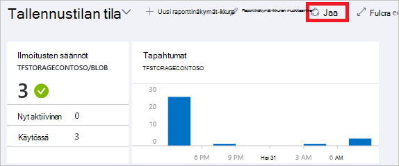
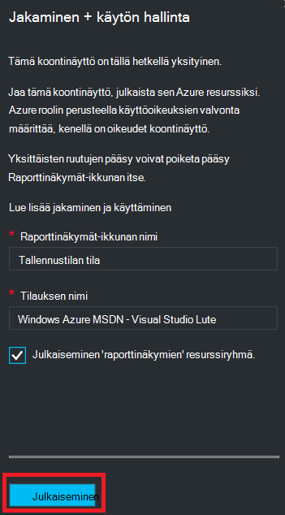
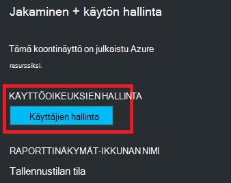
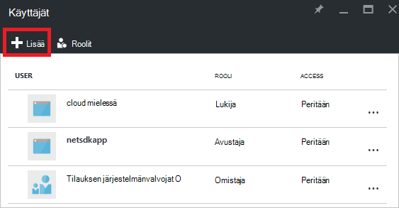
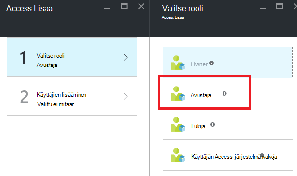
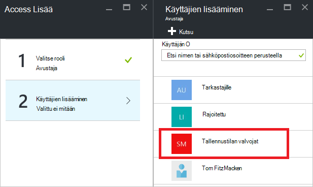
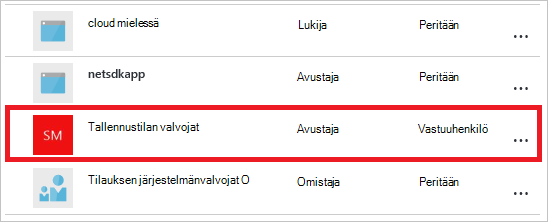

<properties
   pageTitle="Azure portaalin Raporttinäkymät-ikkunan access | Microsoft Azure"
   description="Tässä artikkelissa kerrotaan, miten käytön Azure-portaalissa koontinäytön jakaminen."
   services="azure-portal"
   documentationCenter=""
   authors="tfitzmac"
   manager="timlt"
   editor="tysonn"/>

<tags
   ms.service="multiple"
   ms.devlang="NA"
   ms.topic="article"
   ms.tgt_pltfrm="NA"
   ms.workload="na"
   ms.date="08/01/2016"
   ms.author="tomfitz"/>

# Azure raporttinäkymien jakaminen

Jälkeen määrittäminen Raporttinäkymät-ikkunan, voit julkaista sen ja jakaa sen muiden käyttäjien kanssa organisaation. Voit sallia muita käyttämään raporttinäkymän käyttämällä Azure- [Roolin perusteella käyttöoikeuksien hallinta](../active-directory/role-based-access-control-configure.md). Määrittää käyttäjän tai ryhmän käyttäjien rooliin ja roolin määrittää, onko nämä käyttäjät voi tarkastella tai muokata julkaistua Raporttinäkymät-ikkunan. 

Kaikkien julkaistun raporttinäkymät on toteutettu Azure resurssit, joten ne ovat aina tilauksen helpommin hallittaviin kohteita ja sisältyvät resurssiryhmä.  Access-ohjausobjektin-näkökulmasta Raporttinäkymä on sama asia kuin muut resurssit, kuten virtual machine tai tallennustilan tiliä.

> [AZURE.TIP] Yksittäisten ruutujen koontinäytössä Pakota omia access koskevat ne näyttävät resurssien mukaan.  Tämän vuoksi voit suunnitella Raporttinäkymät-ikkunan, joka on jaettu laajasti ja suojaaminen edelleen yksittäisten ruutujen tiedot.

## Raporttinäkymien tietoja käyttöoikeuksien hallinta

Roolipohjainen käyttöoikeuksien valvonta voit määrittää käyttäjät rooleille laajuus kolme eri tasoilla:

- tilauksen
- resurssiryhmä
- resurssi

Voit määrittää käyttöoikeudet periytyvät ylläpitosopimus resurssin alaspäin. Julkaistun Raporttinäkymät-ikkunan on resurssi. Tämän vuoksi sinulla voi jo olla tilaus roolien sillä se toimii myös julkaistun koontinäytön käyttäjät. 

Tässä on esimerkki.  Oletetaan, että sinulla on Azure tilaus ja eri jäseniltä on määritetty rooli on **omistaja**, **osallistuja**tai **lukija** -tilausta. Käyttäjät, jotka ovat omistajat tai osallistujat voivat luettelon, tarkasteleminen, luominen, muokkaaminen ja poistaminen raporttinäkymät tilauksen piiriin kuuluvien.  Käyttäjät, jotka ovat lukijoiden voivat luettelon ja tarkastella raporttinäkymiä, mutta ei voi muokata tai poistaa niitä.  Käyttäjät, joilla on lukuoikeudet ovat voi tehdä julkaistun Raporttinäkymät-ikkunan paikallisen muokkaukset (kuten ongelman vianmäärityksessä), mutta eivät voi julkaista muutokset palvelimeen.  Heillä on asetus, jos haluat kopioida yksityinen koontinäytön itselleen

-Voi määrittää käyttöoikeudet, joka sisältää useita raporttinäkymien resurssiryhmä tai yksittäisen Raporttinäkymät-ikkunan kautta. Esimerkiksi voivat päättää, että käyttäjäryhmälle olisi on rajoitetut käyttöoikeudet yli tilauksen mutta tietyn Raporttinäkymät-ikkunan käyttöoikeudet. Määrittää kyseisille käyttäjille, että Raporttinäkymät-ikkunan rooli. 

## Julkaista Raporttinäkymät-ikkunan

Oletetaan, että olet määrittäminen raporttinäkymät-ikkuna, jonka haluat jakaa tilauksesi käyttäjäryhmän kanssa. Seuraavia ohjeita kuvaavat mukautetun ryhmän nimeltä tallennustilan valvojat, mutta voi nimetä ryhmän riippumatta siitä, mitä haluat. Lisätietoja Active Directory-ryhmän luominen ja käyttäjien lisääminen ryhmään on artikkelissa [Azure Active Directory-ryhmien hallinta](../active-directory/active-directory-accessmanagement-manage-groups.md).

1. Raporttinäkymät-ikkunassa Valitse **Jaa**.

     

2. Ennen kuin määrität access, voit julkaista koontinäytön. Oletusarvon mukaan raporttinäkymät julkaistaan nimeltä **raporttinäkymät**resurssiryhmä. Valitse **Julkaise**.

     

Raporttinäkymän julkaistaan nyt. Jos käyttöoikeudet periytyvät tilaus soveltuvat, sinun ei tarvitse tehdä mitään Lisää. Organisaation muiden käyttäjien voi käyttää ja muokata Raporttinäkymät-ikkunan tilauksen tason rooli perusteella. Kuitenkin tässä opetusohjelmassa japanin määrittää käyttäjäryhmille, raporttinäkymät-ikkunan rooli.

## Access liittää Raporttinäkymät-ikkunan

1. Kun olet julkaista koontinäytön, valitse **käyttäjien hallinta**.

     

2. Näet luettelon aiemmin luodut käyttäjät, jotka on jo määritetty rooli tämän Raporttinäkymät-ikkunan. Aiemmin luodut käyttäjät luettelo on erilainen kuin alla olevassa kuvassa. Todennäköisesti varaukset periytyvät tilaus. Jos haluat lisätä uuden käyttäjän tai ryhmän, valitse **Lisää**.

     

3. Valitse rooli, joka saadaan, jonka haluat myöntää käyttöoikeuksia. Valitse tässä esimerkissä **avustaja**.

     

4. Valitse käyttäjä tai ryhmä, johon haluat liittää roolin. Jos näkyvissä ei ole käyttäjän tai ryhmän hakua luettelossa, Etsi-ruudun avulla. Käytettävissä olevat ryhmät luettelosta riippuu Active Directoryn luomasi ryhmät.

      

5. Kun olet lisännyt käyttäjät tai ryhmät, valitse **OK**. 

6. Uuden tehtävän lisätään käyttäjäluettelo. Huomaa, että **Access** näy **määritetyt** sen sijaan, että **peritään**.

     

## Seuraavat vaiheet

- Roolien luettelo on artikkelissa [RBAC: valmiin roolien](../active-directory/role-based-access-built-in-roles.md).
- Tietoja resurssien hallinta-kohdassa [Hallitse Azure resurssien yritysportaalin kautta](resource-group-portal.md).