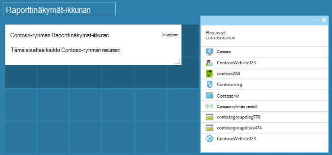

<properties
   pageTitle="Azure portaalin raporttinäkymien | Microsoft Azure"
   description="Tässä artikkelissa kerrotaan, miten voit luoda ja muokata raporttinäkymien Azure-portaalissa."
   services="azure-portal"
   documentationCenter=""
   authors="sewatson"
   manager="timlt"
   editor="tysonn"/>

<tags
   ms.service="multiple"
   ms.devlang="NA"
   ms.topic="article"
   ms.tgt_pltfrm="NA"
   ms.workload="na"
   ms.date="09/06/2016"
   ms.author="sewatson"/>

# Luominen ja jakaminen raporttinäkymien Azure-portaalissa

Voit luoda useita raporttinäkymiä ja jakaa niitä muille käyttäjille, joilla on oikeus Azure-tilauksia.  Tässä artikkelissa käsitellään perustoimintoihin luomista ja muokkaamista, julkaiseminen ja raporttinäkymien käyttöoikeuksien hallinta.

## Raporttinäkymien ja lavat mukauttaminen

Koska avaamista raporttinäkymien muutaman kuukautta, on tapahtunut tasaiseen-sivu mukautukset ja nopean suureneminen Raporttinäkymät-ikkunan mukauttaminen. Tämä vahva käyttö SUUNTAUS näyttää mieluummin mukauttaminen raporttinäkymien lavat päälle. Tukemaan, jonka trendi on poistaa mahdollisuus mukauttaa lavat ja tälle Microsoftin tehokkuutta parantaminen Raporttinäkymät-ikkunan toimintoja. Jos sivu on mukautettu, pian tekemäsi mukautukset poistetaan. Jos haluat säilyttää, mukauttaminen, kiinnitä mukautetut ruudut koontinäyttöön. Hiiren kakkospainikkeella ruutu ja valitse **Kiinnitä Raporttinäkymät-ikkunan** , kuten seuraavan kuvan mukaisesti.

## Koontinäytön luominen

Raporttinäkymä luodaan, valitse nykyinen Raporttinäkymät-ikkunan nimen vieressä **uudet raporttinäkymät** -painike.  

Tämä toiminto luo uuden, tyhjän, yksityiset Raporttinäkymät-ikkunan ja antaa sinulle mukauttaminen-tilaan, jossa voit raporttinäkymän nimi ja Lisää tai ruutujen järjestyksen muuttaminen.  Tässä tilassa tiivistettävä ruutu valikoiman ohittaa vasemmanpuoleisessa siirtymisruudussa.  Ruutu valikoiman avulla voit Etsi ruudut Azure-resursseissa eri tavalla: Voit selata [resurssiryhmä](../azure-resource-manager/resource-group-overview.md#resource-groups), resurssilaji- [tunniste](../resource-group-using-tags.md)tai hakemalla resurssin nimen mukaan.  

Lisää ruudut vetämällä ja pudottamalla sivulle Raporttinäkymät-ikkunan pinta haluamaasi paikkaan.

Uuden luokan nimi **Yleiset** osalta, joka ei ole liitetty tietyn resurssin on.  Tässä esimerkissä on kiinnittää korotuksia-ruutu.  Tämän ruudun avulla voit lisätä mukautetun sisällön koontinäyttöön.  Se tukee vain teksti, [korotuksia syntaksi](https://daringfireball.net/projects/markdown/syntax)ja rajattu HTML-koodin.  (Turvallisuutta, et voi tehdä esimerkiksi lisätä `<script>` tunnisteita tai tietyt CSS-koodin, jotka saattavat vaikuttaa portaalissa tyylejä-elementtiä.) 

## Raporttinäkymät-ikkunan muokkaaminen

Kun olet luonut raporttinäkymän, voit kiinnittää ruutuja ruutu valikoiman tai lavat ruutu esittäminen. Oletetaan, että Kiinnitä Microsoftin resurssiryhmä esittäminen. Voit joko PIN-tunnuksen selattaessa kohteen tai resurssien ryhmä-sivu. Kummassakin johtaa kiinnittäminen resurssiryhmän vierekkäin-esitys.

Jälkeen kiinnittäminen kohteen, se näkyy koontinäyttöön.

Olemme korotuksia-ruutu ja resurssiryhmä kiinnitetyt koontinäyttö, emme kokoa ja järjestää ruudut sopivan asettelun muuttaminen.

Hiiren osoitin ja valitsemalla "..." tai ruutua hiiren kakkospainikkeella näet kaikki ruudun tilannekohtaiset komennot. Oletusarvon mukaan on kaksi osaa:

1. **Raporttinäkymät-ikkunan kiinnitys** – poistaa ruudun koontinäyttö
2.  **Mukauta** – Lisää tilaa mukauttaminen

Valitsemalla Mukauta, kokoa ja järjestää ruudut. Jos haluat muuttaa ruudun kokoa, valitse uusi koko pikavalikosta seuraavassa kuvassa esitetyllä tavalla.

Tai jos se tukee minkä kokoinen, voit vetää oikeaan alakulmaan haluamasi kokoiseksi.

Kun olet koon ruudut, tarkastella koontinäyttö.

Kun olet valmis **Valmis mukauttaminen** Lopeta Raporttinäkymät-ikkunan, riittää, että Valitse mukauttaminen Mukauta tilaa tai napsauttamalla hiiren kakkospainikkeella ja valitse **Valmis mukauttaminen** pikavalikosta.

## Julkaista koontinäytön ja hallita käyttöoikeuksien valvonta

Kun luot Raporttinäkymät-ikkunan, on oletusarvoisesti, mikä tarkoittaa, että olet ainoa henkilö näkee sen yksityinen.  Voit tehdä muut näkevät, käyttää dashboard-komentojen vieressä **Jaa** -painiketta.

Sinua pyydetään valitsemaan tilauksen ja resurssiryhmä raporttinäkymät-ikkunaa voidaan julkaista. Raporttinäkymien integroida saumattomasti ekosysteemissä, indeksoitiin jaetun raporttinäkymien Azure resursseina (jotta et voi jakaa kirjoittamalla sähköpostiosoite).  Useimmat portaalissa ruutujen tiedot löytyvät [Azure roolin perusteella käyttöoikeuksien hallinta](../active-directory/role-based-access-control-configure.md ). Access-ohjausobjektin-näkökulmasta jaetun Raporttinäkymä on ei poikkea virtual machine tai tallennustilan tiliä.  

Oletetaan, että sinulla on Azure tilaus ja ryhmän jäsenillä on myönnetty rooli on **omistaja**, **osallistujan**tai **lukijan** tilauksen.  Käyttäjät, jotka ovat omistajat tai osallistujat voivat luettelon, tarkasteleminen, luominen, muokkaaminen ja poistaminen, tilauksen piiriin kuuluvien raporttinäkymiä.  Käyttäjät, jotka ovat lukijoiden voivat luettelon ja tarkastella raporttinäkymiä, mutta ei voi muokata tai poistaa niitä.  Käyttäjät, joilla on lukuoikeudet eivät voi tehdä paikallisessa muokkaukset jaetun Raporttinäkymät-ikkunan, mutta eivät voi julkaista muutokset palvelimeen.  Kuitenkin he voivat tehdä omia käyttäminen Raporttinäkymät-ikkunan yksityinen kopio.  Tavalliseen tapaan yksittäisten ruutujen koontinäytössä Pakota oman ohjausobjektin käyttösäännöt vastaavat resurssien mukaan.  

Asiasta portaalin kokemusta ohjaa kohti kuvion sijoitetaan raporttinäkymien resurssin ryhmän nimeltä **raporttinäkymiä**.  

Voit myös julkaista koontinäytön tietyn resurssiryhmä.  Tämä koontinäyttö käyttöoikeuksia vastaa resurssiryhmän käyttöoikeuksia.  Käyttäjät, joilla voit hallita resurssin kyseisen ryhmän resursseja on myös pääsy koontinäyttöön.

Raporttinäkymän julkaisemisen jälkeen **jakaminen + käytön** hallinta-ruudussa päivitys ja Näytä tietoja julkaistuihin koontinäyttö, mukaan lukien linkki koontinäyttö käyttäjien käyttöoikeuksien hallinta.  Tämä linkki avaa hallinta access Azure resurssin vakio roolin perusteella käyttöoikeuksien hallinta-sivu.  Voit aina palata tässä näkymässä valitsemalla **Jaa**.

## Seuraavat vaiheet

- Resurssien hallinnasta on artikkelissa [Hallitse Azure resurssien yritysportaalin kautta](resource-group-portal.md).
- Ottaa resursseja, on artikkelissa [Resurssienhallinta mallit ja Azure-portaalin käyttöönotto resursseilla](../resource-group-template-deploy-portal.md).