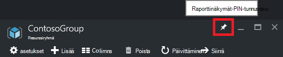
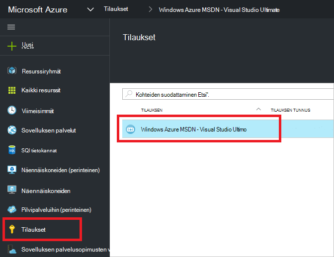
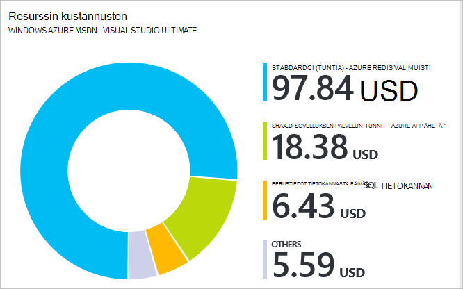

<properties 
    pageTitle="Azure portal avulla voit hallita Azure resursseja | Microsoft Azure" 
    description="Azure-portaaliin ja Azure resurssien hallinta avulla voit hallita resursseja. Näyttää, miten voit seurata resurssien raporttinäkymät-käyttöä varten." 
    services="azure-resource-manager,azure-portal" 
    documentationCenter="" 
    authors="tfitzmac" 
    manager="timlt" 
    editor="tysonn"/>

<tags 
    ms.service="azure-resource-manager" 
    ms.workload="multiple" 
    ms.tgt_pltfrm="na" 
    ms.devlang="na" 
    ms.topic="article" 
    ms.date="09/12/2016" 
    ms.author="tomfitz"/>

# Azure resurssien palvelun-portaalissa

> [AZURE.SELECTOR]
- [Azure PowerShell](../powershell-azure-resource-manager.md)
- [Azure CLI](../xplat-cli-azure-resource-manager.md)
- [Portal](resource-group-portal.md) 
- [REST-OHJELMOINTIRAJAPINNALLA](../resource-manager-rest-api.md)

Tässä ohjeaiheessa esitellään käyttäminen [Azure Resurssienhallinta](../azure-resource-manager/resource-group-overview.md) [Azure portaalissa](https://portal.azure.com) voit hallita Azure resursseja. Tietoja käyttöönotto resursseja portaalin kautta-kohdassa [Ota käyttöön resursseja Resurssienhallinta mallit ja Azure-portaalin](../resource-group-template-deploy-portal.md).

Tällä hetkellä ole jokaisella palvelulla tukee portal tai Resurssienhallinta. Näistä palveluista sinun on käyttää [perinteinen portal](https://manage.windowsazure.com). Artikkelissa [Azure portaalin käytettävyys kaavion](https://azure.microsoft.com/features/azure-portal/availability/)kunkin palvelun tila.

## Resurssiryhmien hallinta

1. Jos haluat nähdä kaikki-tilaukseesi resurssiryhmät, valitse **resurssiryhmät**.

    

1. Luo tyhjä resurssiryhmä, valitsemalla **Lisää**.

    

1. Anna nimi ja sijainti uusi resurssiryhmä. Valitse **Luo**.

    

1. Voit joutua valitsemaan Nähdäksesi hiljattain luodut resurssiryhmä **Päivitä** .

    

1. Voit mukauttaa resurssin ryhmien näytettävät tiedot, valitse **sarakkeet**.

    

1. Valitse lisättävät sarakkeet ja valitse sitten **Päivitä**.

    

1. Tietoja käyttöönotossa resurssien uusi resurssiryhmä-kohdassa [Ota käyttöön resursseja Resurssienhallinta mallit ja Azure-portaalin](../resource-group-template-deploy-portal.md).

1. Resurssiryhmä nopeasti suunnitteluominaisuuksilla voit kiinnittää raporttinäkymät sivu.

    

1. Koontinäytön näyttää resurssiryhmän ja resursseja. Voit valita resurssiryhmät tai sen resursseista kohteeseen siirtyminen.

    

## Tunniste-resurssit

Voit käyttää tunnisteiden resurssiryhmien ja resurssien järjestäminen loogisesti oman varat. Lisätietoja tunnisteiden käyttämisestä on artikkelissa [käyttäminen tunnisteen, kun haluat järjestää Azure resurssit](../resource-group-using-tags.md).

[AZURE.INCLUDE [resource-manager-tag-resource](../../includes/resource-manager-tag-resources.md)]

## Valvonta-resurssit

Kun olet valinnut resurssi, resurssi-sivu näkyy oletusarvo-kaavioita ja taulukoita, resurssityyppi seurantaa varten.

1. Valitse resurssi ja huomaat **Seuranta** -osassa. Se sisältää kuvia, jotka liittyvät resurssin laji. Seuraava kuva esittää tallennustilan tilin-tietojen valvominen oletusarvo.

    

1. Voit kiinnittää osa sivu koontinäyttöön valitsemalla yläpuolella kolmea pistettä (...). Voit mukauttaa kokoa sivu-osassa tai poistaa sen kokonaan. Seuraava kuva esittää kiinnittäminen, mukauttaminen ja poistaminen suorittimen ja muistin-osassa.

    

1. Sen jälkeen kiinnittäminen kohta koontinäyttö, näet yhteenveto koontinäytössä. Ja valitsemalla sen heti Avaa tarkempia tietoja tiedot.

    

1. Voit mukauttaa seurata portaalin kautta tiedot kokonaan, siirry oletusarvon Raporttinäkymät-ikkunan ja valitse **uusi raporttinäkymät-ikkuna**.

    

1. Nimeä uusi raporttinäkymät-ikkuna ja vedä ruutujen koontinäyttö. Ruudut on suodatettu eri vaihtoehtoja.

    

     Lisätietoja raporttinäkymien käsittelemisestä on artikkelissa [luominen ja jakaminen raporttinäkymien Azure-portaalissa](azure-portal-dashboards.md).

## Resurssien hallinta

Resurssin sivu näet hallinta resurssin asetukset. Portaalin näkyy, että tietty resurssityyppi vaihtoehdot hallinta. Hallinta-komentojen yläreunassa resurssi-sivu ja valitse vasemmalla puolella.

Jokin seuraavista vaihtoehdoista voit suorittaa toimintoja, kuten käynnistämisestä ja pysäyttämisestä virtual machine ja uudelleen virtuaalikoneen ominaisuudet.

## Siirrä resurssit

Jos haluat siirtää resursseja toisen resurssiryhmä tai toiseen tilaukseen, katso [resurssien uusi resurssiryhmä tai-Tilaustani siirtäminen](../resource-group-move-resources.md).

## Lukitusresurssit

Voit lukita tilauksen, resurssiryhmä tai resurssi estää muita käyttäjiä organisaation poistetaan vahingossa tai muokkaamasta kriittinen resurssit. Lisätietoja on artikkelissa [Lukitse resurssien Azure resurssien hallinta](../resource-group-lock-resources.md).

[AZURE.INCLUDE [resource-manager-lock-resources](../../includes/resource-manager-lock-resources.md)]

## Tilauksen ja kustannusten tarkasteleminen

Voit tarkastella tietoja tilauksen ja kootut kustannukset kaikkien resurssien. Valitse **tilaukset** ja haluat nähdä tilauksen. Voit joutua vain yksi tilaus, voit valita.

Sisällä tilaus-sivu näkyy tallennus korvaus.

Ja hajautuksen kustannuksia resurssityypin mukaan.

## Vie malli

Kun olet määrittänyt resurssiryhmä, haluat ehkä tarkastella resurssiryhmän Resurssienhallinta-malli. Mallin vieminen on kaksi edut:

1. Voit automatisoida ratkaisun tulevien versioiden helposti, koska mallissa on valmis infrastruktuurin.

2. Voit tutustut mallin syntaksi katsomalla osoitteessa JavaScript Object Notation (JSON), joka edustaa ratkaisu.

Vaiheittaisia ohjeita on artikkelissa [aiemmin resurssien Vie Azure Resurssienhallinta mallia](../resource-manager-export-template.md).

## Resurssiryhmä- tai resurssien poistaminen

Resurssiryhmä poistetaan kaikki sisältämät resurssit. Voit myös poistaa yksittäisiä resursseja resurssiryhmän kuluessa. Haluat varovainen poistaessasi resurssiryhmä, koska muiden resurssin ryhmiin, jotka on linkitetty se saattaa olla resurssit. Resurssienhallinta ei poista linkitetyn resursseja, mutta niitä ei ehkä toimi oikein ilman odotettu resurssit.

## Seuraavat vaiheet

- Valvontalokien on artikkelissa [valvonta toimintojen resurssien hallinta](../resource-group-audit.md).
- Käyttöönoton vianmääritys-artikkelissa [vianmääritys resurssin ryhmän ominaisuuksissa Azure-portaalissa](../resource-manager-troubleshoot-deployments-portal.md).
- Ottaa resursseja portaalin kautta, on artikkelissa [Resurssienhallinta mallit ja Azure-portaalin käyttöönotto resursseilla](../resource-group-template-deploy-portal.md).
- Resurssien käytön hallinnasta on artikkelissa [Käytä roolimäärityksiä Azure tilaus-resurssien käyttöoikeuksien hallintaan](../active-directory/role-based-access-control-configure.md).

