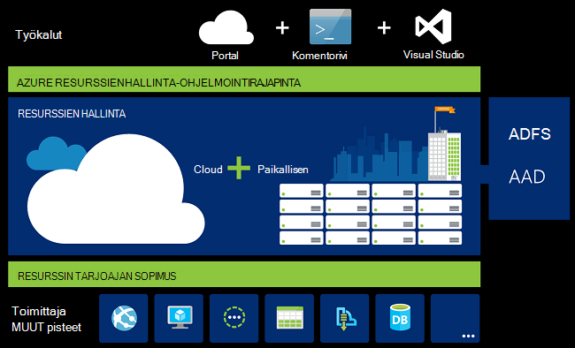
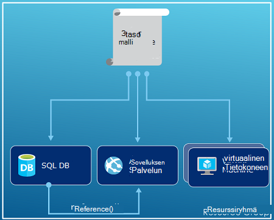
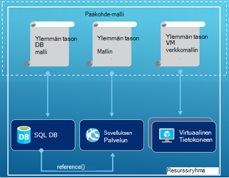
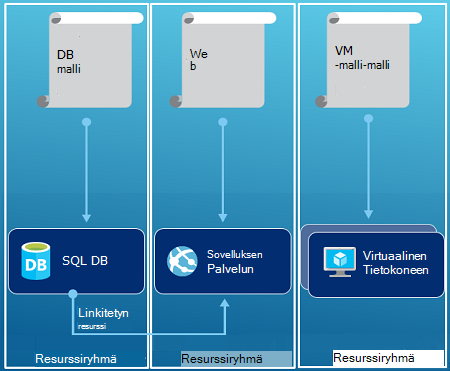

<properties
   pageTitle="Azure resurssin hallinnassa: yleiskatsaus | Microsoft Azure"
   description="Tässä artikkelissa käsitellään Azure Resurssienhallinta käyttöönoton hallinta-ja käyttää Azure resurssien hallinta."
   services="azure-resource-manager"
   documentationCenter="na"
   authors="tfitzmac"
   manager="timlt"
   editor="tysonn"/>

<tags
   ms.service="azure-resource-manager"
   ms.devlang="na"
   ms.topic="get-started-article"
   ms.tgt_pltfrm="na"
   ms.workload="na"
   ms.date="10/21/2016"
   ms.author="tomfitz"/>

# Azure resurssin hallinnassa: yleiskatsaus

Sovelluksen infrastruktuuri yleensä tehdä useita osia – ehkä virtual machine, tallennustilan tilin ja virtual verkko- tai web App-sovelluksen, tietokannan, tietokantapalvelin ja 3 osapuolen palvelujen. Et näe komponentit kuin erillisiin kohteisiin, sen sijaan voit tarkastella niitä niin toisiinsa ja Aiheeseen liittyvät osat yhden kohteen. Haluat ottaa käyttöön, hallita ja seurata niitä ryhmänä. Azure resurssien hallinnan avulla voit käsitellä ryhmänä ratkaisu resursseista. Voit ottaa käyttöön, päivittää tai poistaa kaikkien resurssien yhteen, koordinoidun toiminnossa ratkaisu. Mallin käyttäminen käyttöönottoa varten ja mallin toimii eri ympäristöissä, kuten testaus, väliaikaisen ja tuotannon. Resurssienhallinta on suojaus, valvonnan ja tunnisteiden ominaisuuksien avulla voit hallita resurssien käyttöönoton jälkeen. 

## Sanasto

Jos olet uusi Azure resurssien hallinta, sinun on joitakin ehtoja, et ehkä tottunut.

- **resurssi** - helpommin hallittaviin kohteessa, joka on saatavana Azure. Jotkin Yleiset resurssit ovat virtuaalikoneen, tallennustilan tilin, web App-sovelluksen, tietokannan ja VPN, mutta on monista muista.
- **resurssiryhmä** - säilö, joka sisältää Azure-ratkaisun liittyvät resurssit. Resurssiryhmä voi käyttää kaikkia ratkaisun resursseja tai vain resursseja, jotka haluat hallita ryhmänä. Voit päättää, miten haluat varata resursseja resurssin ryhmiin, mitä tarkoituksenmukaisessa organisaation perusteella. Tarkastella [resurssiryhmiä](#resource-groups).
- **resurssin toimittaja** - palvelu, joka tuottaa resursseja, voit ottaa käyttöön ja hallita – Resurssienhallinta. Resurssin kunkin palvelun tarjoaa toimintojen käyttämisen resurssit, jotka on otettu käyttöön. Jotkin yleisten resurssien-palveluntarjoajat ovat Microsoft.Compute, joka tuottaa virtuaalikoneen resurssi, Microsoft.Storage, joka tuottaa tallennustilan tilin resurssi- ja Microsoft.Web, joka tuottaa verkkosovelluksissa liittyvät resurssit. Katso [resurssin tarjoajan palveluun](#resource-providers).
- **Resurssienhallinta-malli** - JavaScript Object Notation (JSON)-tiedosto, joka määrittää vähintään yhden resursseja resurssiryhmän käyttöön. Määrittää on myös otettu käyttöön resurssien väliset riippuvuudet. Malliin voidaan ottaa käyttöön resurssit johdonmukaisesti ja toistuvasti. Katso [mallin käyttöönottoa](#template-deployment).
- **XAML-määritettyjen syntaksi** - syntaksin, joka sallii "Näin voin tarkoitus luoda" tarvitsematta kirjoittaa ohjelmoinnin jaksossa määritelty tilan komennot asiakirja sitten kannattaa luoda. Resurssienhallinta-malli on esimerkki määritettäviä syntaksia. Tiedoston määrittää infrastruktuurin käyttöön Azure ominaisuudet. 

## Resurssien hallinnan käytön etuja

Resurssienhallinta on monia etuja:

- Voit ottaa käyttöön, hallita ja valvoa kaikkien resurssien ratkaisu ryhmän sen sijaan, että nämä resurssit käsittely yksitellen.
- Voit ottaa ratkaisuja koko development Lifecycle-prosessi ja luottaa resurssien otetaan käyttöön yhtenäinen tilaan toistuvasti.
- Voit hallita infrastruktuurin määritettäviä malleja sijaan komentosarjojen kautta.
- Voit määrittää resurssia, joten ne on otettu käyttöön oikeassa järjestyksessä väliset riippuvuudet.
- Voit käyttää käytönvalvonta kaikkiin palveluihin resurssi-ryhmässä koska hallinta-ympäristö grafiikkatiedostomuotoja integroitu Roolipohjainen käyttöoikeuksien valvonta (RBAC).
- Voit käyttää tunnisteiden resurssien järjestäminen loogisesti kaikki tilauksen resurssit.
- Voit selventää organisaation Laskutus tarkastelemalla resurssiryhmän jakaminen samaa tunnistetta kustannuksiin.  

Resurssienhallinta on uusi tapa käyttöönotto ja ratkaisujen hallinta. Jos käytössä aiempi käyttöönoton mallin ja haluat lisätietoja muutokset, katso [tietoja resurssien hallinnan käyttöönotto- ja perinteinen käyttöönotto](../resource-manager-deployment-model.md).

## Yhtenäinen hallinta kerros

Resurssienhallinta on yhtenäinen hallinta kerroksen PowerShellin Azure, Azure CLI, Azure portal, REST API ja Kehitystyökalut tehtävistä. Kaikkien työkalujen Käytä yleistä toiminnoista. Voit käyttää työkaluja, joilla parhaalla mahdollisella tavalla ja käyttää niitä tarkoittavat ilman sekaannusta. 

Alla olevaa kuvaa näyttää, miten kaikkien työkalujen käsitellä samaa Azure Resurssienhallinta-Ohjelmointirajapinnan. Ohjelmointirajapinnan välittää pyynnöt Resurssienhallinta-palvelun, joka todentaa ja vahvistaa pyynnöt. Resurssienhallinta reitittää pyynnöt sitten haluamasi resurssi-palvelut.

## Ohjeet

Seuraavat ehdotukset avulla voit hyödyntää Resurssienhallinta, kun käsittelet ratkaisujen.

1. Määritä ja infrastruktuurin määritettäviä syntaksi Resurssienhallinta mallien sijaan välttämättömien komennot – Ota käyttöön.
2. Määritä käyttöönotto- ja vaiheiden suorittamisesta mallissa. Sinulla on oltava ei ole manuaalinen vaiheita määrittäessäsi ratkaisu.
3. Suorita välttämättömien komentoja, joilla voit hallita resursseja, voit aloittaa tai lopettaa sovelluksen tai tietokoneen.
4. Järjestä resurssit saman elinkaari resurssin ryhmän kanssa. Käyttää tunnisteita järjestämisessä kaikkia muita resursseja.

Katso Lisää suosituksia [parhaita käytäntöjä Azure Resurssienhallinta-mallien luomiseen](../resource-manager-template-best-practices.md).

## Resurssiryhmät

On tärkeä ottaa huomioon, kun määrittäminen resurssiryhmän tekijöitä:

1. Kaikkien ryhmän resurssien pitäisi jakaa saman elinkaari. Ottaa käyttöön, Päivitä ja poista ne yhteen. Jos yksi resurssi, kuten tietokantapalvelimeen on olemassa eri käyttöönoton jakson olisi toiseen resurssiryhmä.
2. Kullekin resurssille voi olla vain yksi resurssiryhmä.
3. Voit lisätä tai poistaa resurssiryhmä resurssille milloin tahansa.
4. Voit siirtää resurssin resurssi-ryhmästä toiseen ryhmään. Lisätietoja on artikkelissa [resurssien uusi resurssiryhmä tai-Tilaustani siirtäminen](../resource-group-move-resources.md).
4. Resurssiryhmä voi olla resurssit, jotka sijaitsevat eri alueilla.
5. Resurssiryhmä voidaan alueen hallintatoimia käyttöoikeuksien hallinta.
6. Resurssin käsitellä resurssit muista resurssiryhmistä. Vuorovaikutuksen yhteistä, kun kaksi resurssit ovat yhteydessä toisiinsa, mutta ei jaeta saman elinkaari (esimerkiksi web Apps-sovellusten muodostaa yhteyden tietokantaan).

Resurssiryhmä luotaessa haluat kyseinen resurssiryhmä sijainnissa. Ihmettelet ehkä, "Miksi resurssiryhmä tarvitsee sijainti? Ja, jos resurssit voi olla eri sijainneissa kuin resurssiryhmän, miksi resurssin ryhmän sijainti merkitystä lainkaan?" Tietoja resursseja resurssiryhmän metatiedot. Tämän vuoksi määrittäessäsi resurssiryhmän sijainti määrität kyseisen metatietojen tallennuspaikan. Yhteensopivuuden vuoksi joudut ehkä varmistaa, että tiedot on tallennettu tietyn alueen.

## Resurssin tarjoajat

Resurssin kunkin palvelun tarjoaa resurssit ja toimintoja toimimasta Azure-palvelun kanssa. Esimerkiksi jos haluat tallentaa näppäimet ja tietoja, voit käsitellä **Microsoft.KeyVault** resurssin tarjoajaan. Tämä resurssi-palvelu on Resurssityyppi, kutsutaan **vaults** avaimen säilö ja Resurssityyppi, kutsutaan **vaults/tietoja** luotaessa salaisuus avaimen säilö luomista varten. 

Ennen kuin otat resurssien käytön aloittaminen-pitäisi saada ymmärtämistä käytettävissä resurssi-palveluista. Tietää resurssin tarjoajat ja resurssien nimet avulla voit määrittää haluat ottaa käyttöön Azure resursseja.

Voit noutaa kaikki resurssin tarjoajan kanssa seuraavan PowerShell cmdlet-komennon:

    Get-AzureRmResourceProvider -ListAvailable

Tai Azure CLI, jossa voit hakea kaikki resurssin tarjoajat seuraavalla komennolla:

    azure provider list

Voit etsiä palautettu luettelo resurssin palvelut, jotka sinun on käytettävä.

Saat lisätietoja resurssi-palvelu-komento lisääminen tarjoajan nimitilan. Komento palauttaa tuetut resurssityypit resurssi-palvelu ja tuettujen sijainnit ja kunkin resurssityyppi API-versiot. Seuraavan PowerShell cmdlet-komennon saa Microsoft.Compute tietoja:

    (Get-AzureRmResourceProvider -ProviderNamespace Microsoft.Compute).ResourceTypes

Tai kanssa Azure CLI noutaminen tuetut resurssityypit, sijainnit ja API-versioiden Microsoft.Compute, seuraavalla komennolla:

    azure provider show Microsoft.Compute --json > c:\Azure\compute.json

Lisätietoja on artikkelissa [Resurssienhallinta tarjoajien, alueet, API-versiot ja rakenteet](../resource-manager-supported-services.md).

## Mallin käyttöönotto

Resurssien hallinnan avulla voit luoda mallin (JSON muodossa), joka määrittää infrastruktuurin ja Azure-ratkaisun määrittäminen. Mallin avulla voit toistuvasti ottaa ratkaisuja koko sen elinkaaren aikana ja resurssien otetaan käyttöön yhtenäinen tilaan luottaa. Kun luot ratkaisun-portaalista, ratkaisu sisältää automaattisesti käyttöönottomalli. Sinun ei tarvitse luoda mallin alusta, koska mallipohjaa ratkaisu ja mukauttaa sen tarpeisiisi. Voit hakea aiemmin resurssiryhmä mallin vieminen resurssiryhmän nykyisen tilan tai tarkastella tietyn käyttöönottoa malli. Tarkasteleminen [viedään mallia](../resource-manager-export-template.md) on hyödyllisiä tietoja mallia syntaksi tapa.

Lisätietoja mallin ja miten voit käyttää muotoa, katso [Yhtä aikaa muiden kanssa Azure Resurssienhallinta-mallit](../resource-group-authoring-templates.md) ja [Resurssienhallinta mallin ongelmatilanteita](../resource-manager-template-walkthrough.md).

Resurssienhallinta käsittelee malli, kuten muiden pyyntö (Katso kuvaa [yhtenäinen hallinta layer](#consistent-management-layer)). Se jäsentää mallin ja muuntaa sen syntaksista REST API toimintojen sopivaa resurssia palveluntarjoajien osalta. Kun Resurssienhallinta esimerkiksi saa mallia resurssin seuraavat määritykset:

    "resources": [
      {
        "apiVersion": "2016-01-01",
        "type": "Microsoft.Storage/storageAccounts",
        "name": "mystorageaccount",
        "location": "westus",
        "sku": {
          "name": "Standard_LRS"
        },
        "kind": "Storage",
        "properties": {
        }
      }
      ]

Se muuntaa määritelmän seuraavan REST API-toiminnon, joka lähetetään Microsoft.Storage resurssi-palvelulle:

    PUT
    https://management.azure.com/subscriptions/{subscriptionId}/resourceGroups/{resourceGroupName}/providers/Microsoft.Storage/storageAccounts/mystorageaccount?api-version=2016-01-01
    REQUEST BODY
    {
      "location": "westus",
      "properties": {
      }
      "sku": {
        "name": "Standard_LRS"
      },   
      "kind": "Storage"
    }

Miten mallit ja resurssiryhmien määrittämiseen on kokonaan ja miten haluat hallita ratkaisu ylöspäin. Esimerkiksi kolme taso-sovelluksen yhteen mallin avulla voit ottaa käyttöön yhden resurssiryhmä.

Mutta sinulla ei ole ehkä määrittää koko infrastruktuurin yksittäisen mallina. Usein se on järkevää jakamaan käyttöönoton tarpeen kohdennettujen tarkoitus kielikohtaiset mallien joukkoon. Voit helposti käyttää näitä malleja eri ratkaisuja. Käyttöön tietyn-ratkaisun, voit luoda perusmuodon mallina, joka toimii linkkinä tarvittavat malleja. Seuraava kuva esittää ottamisesta käyttöön kolme taso-ratkaisun avulla pää-malli, joka sisältää kolme sisäkkäisiä mallia.

Jos yhteyttä tasoa on erillinen elinkaaresta kuvitella, voit asentaa oman kolme tasoa erottaa resurssiryhmät. Huomaa resurssien edelleen voidaan linkittää resurssien muista resurssiryhmistä.

Katso lisää ehdotuksia suunnittelemisesta mallit, [kuviot suunnittelun Azure Resurssienhallinta malleja](../best-practices-resource-manager-design-templates.md). Lisätietoja sisäkkäisiä malleja on [linkitetty mallien Azure resurssien hallinnan avulla](../resource-group-linked-templates.md).

Azure Resurssienhallinta analysoi riippuvuudet, varmista resurssien luodaan oikeassa järjestyksessä. Jos yksi resurssi on riippuvainen (kuten virtual koneet, hänen nimeään tarvitse tallennustilan tilin levyjen) toiselle resurssille arvon, voit määrittää riippuvuus. Lisätietoja on artikkelissa [määrittelevä riippuvuuksien Azure Resurssienhallinta malleja](../resource-group-define-dependencies.md).

Voit käyttää mallia myös infrastruktuuriin päivitykset. Voit esimerkiksi lisätä resurssin ratkaisu ja lisätä määritysten säännöt resurssit, jotka on jo otettu käyttöön. Jos mallia määrittää resurssin luominen, mutta joita resurssi on jo olemassa, Azure Resurssienhallinta suorittaa päivityksen sijaan uusi resurssi. Azure Resurssienhallinta päivittää aiemmin resurssi samaan tilaan, kun se on uuden.  

Resurssienhallinta tarjoaa laajennukset skenaariot tarvittaessa muita toimintoja, kuten tietyn ohjelmistojen, joka ei sisälly asennus. Jos käytössäsi on jo määritysten hallinta-palvelun, kuten DSC, kokki tai Puppet, voit jatkaa palvelun käsitteleminen käyttämällä tunnisteet. Lisätietoja virtuaalikoneen laajennukset on artikkelissa [virtuaalikoneen tunnisteet ja ominaisuuksia](../virtual-machines/virtual-machines-windows-extensions-features.md). 

Lopuksi malli näkyy lähdekoodin sovelluksen osa. Voit tarkistaa sen lähde-koodin säilöön ja päivittää sovelluksen kehitystyö. Voit muokata mallin Visual Studio kautta.

Mallin määritettyäsi olet valmis ottamaan resurssit Azure. Katso ottamaan resurssit komentoja:

- [Resurssien Resurssienhallinta mallit ja PowerShellin Azure käyttöönotto](../resource-group-template-deploy.md)
- [Resurssien Resurssienhallinta mallit ja Azure CLI käyttöönotto](../resource-group-template-deploy-cli.md)
- [Resurssienhallinta-mallit ja Azure-portaalin resursseja käyttöönotto](../resource-group-template-deploy-portal.md)
- [Ottaa käyttöön resursseja Resurssienhallinta mallit ja Resurssienhallinta REST-Ohjelmointirajapinnalla](../resource-group-template-deploy-rest.md)

## Tunnisteet

Resurssien hallinta tarjoaa tunnisteiden ominaisuus, jonka avulla voit luokitella resurssien hallinta tai laskutuksen tarpeen mukaan. Käyttää tunnisteita, jos sinulla on monimutkainen sivustokokoelman resurssiryhmien ja resurssien ja visualisointi näiden resurssien kohtiin, joita voit tarkoituksenmukaisessa on. Voi esimerkiksi tunnisteen resurssit, jotka toimivat samalla rooli organisaatiossa tai saman osaston kuulut. Ilman tunnisteita organisaation käyttäjät voivat luoda useita resursseja, joka voi olla vaikea määrittää ja hallita myöhemmin. Jos esimerkiksi haluat poistaa kaikki tietyn projektin resurssit. Jos resurssit ovat ei ole merkitty projektin, sinun on löytävät ne manuaalisesti. Tunnisteita voi olla tärkeää tapaa, jolla voit vähentää tarpeettomien kustannuksiin-tilaukseesi. 

Resurssien ei tarvitse jakaa tunnisteen samaan resurssiryhmä sijaitsevat. Voit luoda oman tunnisteen taksonomia voit varmistaa, että organisaation kaikkien käyttäjien käyttää yleisimpiä tunnisteita käyttäjien niihin vahingossa hieman eri tavalla tunnisteita (esimerkiksi "osasto" "osasto" sijaan) asemesta.

Seuraavassa esimerkissä on käytetty virtual machine tunnisteen.

    "resources": [    
      {
        "type": "Microsoft.Compute/virtualMachines",
        "apiVersion": "2015-06-15",
        "name": "SimpleWindowsVM",
        "location": "[resourceGroup().location]",
        "tags": {
            "costCenter": "Finance"
        },
        ...
      }
    ]

Jos haluat noutaa kaikki resurssit, joiden tunniste arvo, käytä seuraavan PowerShell cmdlet-komennon:

    Find-AzureRmResource -TagName costCenter -TagValue Finance

Voit myös Azure CLI seuraava komento:

    azure resource list -t costCenter=Finance --json

Voit tarkastella merkittyjä resurssien palvelun Azure-portaalissa.

[Käyttöraportti](../billing/billing-understand-your-bill.md) tilauksen sisältää tunnisteiden nimet ja arvot, jolloin voit aloittaminen kustannukset tunnisteilla. Lisätietoja tunnisteet nähdä [käyttäminen tunnisteet järjestämiseen Azure resurssit](../resource-group-using-tags.md).

## Käyttöoikeuksien hallinta

Resurssienhallinta mahdollistaa ohjausobjektiin, kenellä on oikeus toimenpiteitä organisaatiollesi. Se grafiikkatiedostomuotoja integroi Roolipohjainen käyttöoikeuksien valvonta (RBAC) osaksi hallinta-ympäristön ja access-ohjaavat koskee kaikki palvelut resurssi-ryhmässä. 

On kaksi tärkeimmät käsitteitä selvittääksesi, kun käsittelet Roolipohjainen käyttöoikeuksien valvonta:

- Roolimäärityksiä - kuvaamiseen käyttöoikeudet, ja se voi käyttää useita tehtäviä.
- Roolimäärityksiä - Liitä jäsenyyden (käyttäjän tai ryhmän) määritelmä, jotka mahdollistavat tietyn laajuiset (tilauksen, resurssiryhmä tai resurssi). Varauksen periytyy alemman alueet.

Voit lisätä käyttäjiä ennalta määritetyt ympäristö ja resurssin kielikohtaiset roolit. Voit esimerkiksi voit hyödyntää ennalta määritetty rooli lukija, jonka avulla käyttäjät voivat tarkastella resursseja, mutta eivät voi muokata niitä. Olet lisännyt käyttäjät organisaatiossa, joka on tämäntyyppinen lukija access käyttää rooli tilauksen, resurssiryhmä tai resurssi.

Azure sisältää seuraavat neljä ympäristö roolit:

1.  Omistaja - voi hallita kohteiden kaikki, mukaan lukien käyttö
2.  Avustaja - voit hallita kaikki muu paitsi käyttö
3.  Lukija - voit tarkastella kaikkea, mutta ei voi tehdä muutoksia
4.  Käyttäjän Access järjestelmänvalvoja - voi hallita käyttäjien pääsyn Azure resurssit

Azure sisältää myös useita resurssin kielikohtaiset roolit. Jotkin yleisimpiin ovat seuraavat:

1.  Virtuaalikoneen avustaja – voit hallita näennäiskoneiden, mutta ei anna ne käyttöoikeus- ja ei voi hallita, johon ne on kytketty virtual verkko- tai tilin
2.  Verkon avustaja - kaikki verkkoresursseja hallinta, mutta ei käyttöoikeus tietyille käyttäjille
3.  Tallennustilan tilin avustaja - tallennustilan tilien hallinta, mutta niitä ei käyttöoikeus
4. SQL Server-avustaja – voit hallita SQL Server- ja tietokantoja, mutta ei niiden tietoturvaan liittyvät käytännöt
5. Sivuston avustaja - voi hallita sivustot, mutta ei web-palvelupakettia, johon ne on kytketty

Katso täysi luettelo rooleista ja sallitut toiminnot, [RBAC: roolien hallinta](../active-directory/role-based-access-built-in-roles.md). Saat lisätietoja Roolipohjainen käyttöoikeuksien valvonta [Azure Roolipohjainen käyttöoikeuksien valvonta](../active-directory/role-based-access-control-configure.md). 

Joissakin tapauksissa haluat suorittaa koodin tai komentosarjan, joka käyttää resursseja, mutta et halua suoritetaan käyttäjän tunnistetiedot. Sen sijaan haluat kutsua palvelu pääasiallista sovelluksen jäsenyyden Luo ja määritä tärkeimmät palvelun asianmukainen rooli. Resurssienhallinta avulla voit luoda sovelluksen tunnistetietoja ja todentaa ohjelmallisesti sovelluksen. Perustietoja palvelun ansaitun luomisesta on artikkelissa jompikumpi seuraavista aiheista:

- [PowerShellin Azure avulla voit luoda service-lyhennys access-resurssit](../resource-group-authenticate-service-principal.md)
- [Azure CLI avulla voit luoda service-lyhennys access-resurssit](../resource-group-authenticate-service-principal-cli.md)
- [Portaalin avulla voit luoda Active Directory-sovelluksen ja palvelun lyhennys, voit käyttää resurssit](../resource-group-create-service-principal-portal.md)

Voit myös erikseen lukita kriittinen resurssien estää käyttäjiä poistamasta tai muokata niitä. Lisätietoja on artikkelissa [Lukitse resurssien Azure resurssien hallinta](../resource-group-lock-resources.md).

## Lokeja

Resurssienhallinta kirjaa kaikki toiminnot, jotka luominen, muokkaaminen ja poistaminen resurssin. Voit käyttää toimintojen lokitiedot etsiminen virheen vianmäärityksessä ja seurata, kuinka organisaation käyttäjien muokata resurssin. Saat lokit, valitse **lokeja** resurssi-ryhmän **asetukset** -sivu. Voit suodattaa lokit myös, mitä käyttäjät pystyvät toiminnon eri arvojen mukaan. Lisätietoja toimintojen lokitiedot käyttämisestä on artikkelissa [valvonta toimintojen resurssien hallinta](../resource-group-audit.md).

## Mukautetut käytännöt

Resurssien hallinnan avulla voit luoda mukautettuja käytäntöjä resurssien hallintaa varten. Tiedostotyypit, käytännöt, jotka luot voi sisältää monipuolisen skenaarioita. Voit pakottaa resursseja, mitkä tiedostotyypit ja -resurssien esiintymät otetaan käyttöön raja tai mitkä alueet ylläpitää resurssin lajin raja nimeämiskäytäntöä. Voit määrittää resurssien avulla voit järjestää Laskutus osastot tunnistearvo. Voit luoda käytännöt pienentää kustannuksia ja säilyttämiseksi-tilaukseesi. 

Suojauskäytäntöjen JSON kanssa ja käytä kyseiset käytännöt ryhmä tilauksen tai resurssi ryhmän. Käytännöt ovat erilaisia kuin Roolipohjainen käyttöoikeuksien valvonta, koska niitä käytetään resurssityypit.

Seuraavassa esimerkissä esitetään, joka takaa, että tunnisteen yhdenmukaisuuden määrittämällä, että kaikki resurssit sisältävät costCenter tunnisteen käytännön.

    {
      "if": {
        "not" : {
          "field" : "tags",
          "containsKey" : "costCenter"
        }
      },
      "then" : {
        "effect" : "deny"
      }
    }

On useita käytäntöjä, voit luoda useita erityyppisiä. Lisätietoja on artikkelissa [Käyttöä koskevasta käytännöstä resurssien hallintaa ja hallita](../resource-manager-policy.md).

## SDK: T

Azure SDK: T on käytettävissä useita kieliä ja ympäristöissä.
Kunkin kielen nämä käyttöotot on saatavana sen ekosysteemiin pakettien hallinta ja GitHub.

Kaikkien näiden SDK: T koodi on luotu Azure RESTful-Ohjelmointirajapinta määritykset.
Nämä määritykset ovat Avaa lähde ja Swagger 2.0-määrityksen perusteella.
SDK-koodi on luotu kutsutaan AutoRest Avaa lähde-projektin kautta.
AutoRest muunnoksia nämä RESTful-Ohjelmointirajapinta määritykset kyselyjä asiakkaan kirjastojen useilla kielillä.
Jos haluat parantaa mitä tahansa luotu koodi SDK: T-ominaisuuksia, koko työkaluja, joilla voi luoda SDK: T ovat avoinna, vapaasti käytettävissä ja laajasti annetaan API määrityksen muodon mukaan.

Seuraavassa on Microsoftin Avaa lähde SDK säilöjen tietoihin. Olemme Tervetuloa palautetta, ongelmista, ja tuoda pyynnöt.

[.NET](https://github.com/Azure/azure-sdk-for-net) | [Java](https://github.com/Azure/azure-sdk-for-java) | [Node.js](https://github.com/Azure/azure-sdk-for-node) | [PHP](https://github.com/Azure/azure-sdk-for-php) | [Python](https://github.com/Azure/azure-sdk-for-python) | [Ruby](https://github.com/Azure/azure-sdk-ruby)

> [AZURE.NOTE]Jos SDK ei anna tarvittavat toiminnot, voit myös soittaa [Azure REST API](https://msdn.microsoft.com/library/azure/dn790568.aspx) suoraan.

## Esimerkkejä, joiden

### .NET

- [Azure resurssit ja resurssiryhmien hallinta](https://azure.microsoft.com/documentation/samples/resource-manager-dotnet-resources-and-groups/)
- [Ottaa käyttöön SSH käytössä AM-malli](https://azure.microsoft.com/documentation/samples/resource-manager-dotnet-template-deployment/)

### Java

- [Azure resurssien hallinta](https://azure.microsoft.com/documentation/samples/resources-java-manage-resource/)
- [Azure resurssiryhmien hallinta](https://azure.microsoft.com/documentation/samples/resources-java-manage-resource-group/)
- [Ottaa käyttöön SSH käytössä AM-malli](https://azure.microsoft.com/documentation/samples/resources-java-deploy-using-arm-template/)

### Node.js

- [Azure resurssit ja resurssiryhmien hallinta](https://azure.microsoft.com/documentation/samples/resource-manager-node-resources-and-groups/)
- [Ottaa käyttöön SSH käytössä AM-malli](https://azure.microsoft.com/documentation/samples/resource-manager-node-template-deployment/)

### Python

- [Azure resurssit ja resurssiryhmien hallinta](https://azure.microsoft.com/documentation/samples/resource-manager-python-resources-and-groups/)
- [Ottaa käyttöön SSH käytössä AM-malli](https://azure.microsoft.com/documentation/samples/resource-manager-python-template-deployment/)

### Ruby

- [Azure resurssit ja resurssiryhmien hallinta](https://azure.microsoft.com/documentation/samples/resource-manager-ruby-resources-and-groups/)
- [Ottaa käyttöön SSH käytössä AM-malli](https://azure.microsoft.com/documentation/samples/resource-manager-ruby-template-deployment/)

Näitä esimerkkejä lisäksi voit etsiä valikoima mallit.

[.NET](https://azure.microsoft.com/documentation/samples/?service=azure-resource-manager&platform=dotnet) | [Java](https://azure.microsoft.com/documentation/samples/?service=azure-resource-manager&platform=java) | [Node.js](https://azure.microsoft.com/documentation/samples/?service=azure-resource-manager&platform=nodejs) | [Python](https://azure.microsoft.com/documentation/samples/?service=azure-resource-manager&platform=python) | [Ruby](https://azure.microsoft.com/documentation/samples/?service=azure-resource-manager&platform=ruby)

## Seuraavat vaiheet

- Katso lyhyesti mallien käyttäminen, [Vie Azure Resurssienhallinta-malli aiemmin resursseista](../resource-manager-export-template.md).
- Katso Lisää perusteellisesti vaiheista mallin luominen, [Resurssienhallinta mallin ongelmatilanteita](../resource-manager-template-walkthrough.md).
- Funktiot, voit käyttää mallissa on artikkelissa [mallin Funktiot](../resource-group-template-functions.md)
- Tietoja Visual Studio ja resurssien hallinnan avulla on artikkelissa [luominen ja käyttöönotto Azure resurssiryhmät Visual Studio kautta](../vs-azure-tools-resource-groups-deployment-projects-create-deploy.md).
- Katso tietoja käyttämällä ja resurssien hallinnan [Visual Studio Code Azure Resurssienhallinta mallien käyttäminen](../resource-manager-vs-code.md).

Näin videoesitys tämän yleiskatsauksen:

[AZURE.VIDEO azure-resource-manager-overview]

[powershellref]: https://msdn.microsoft.com/library/azure/dn757692(v=azure.200).aspx
