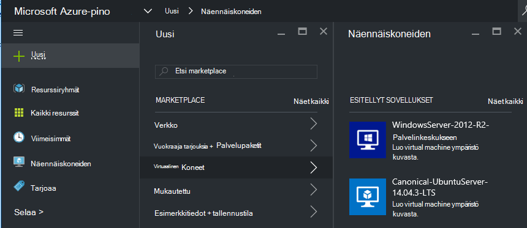
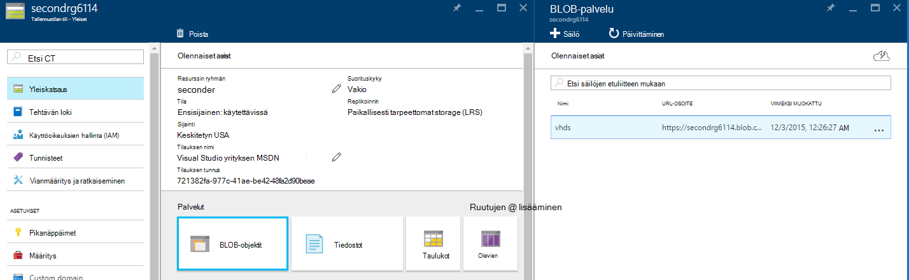
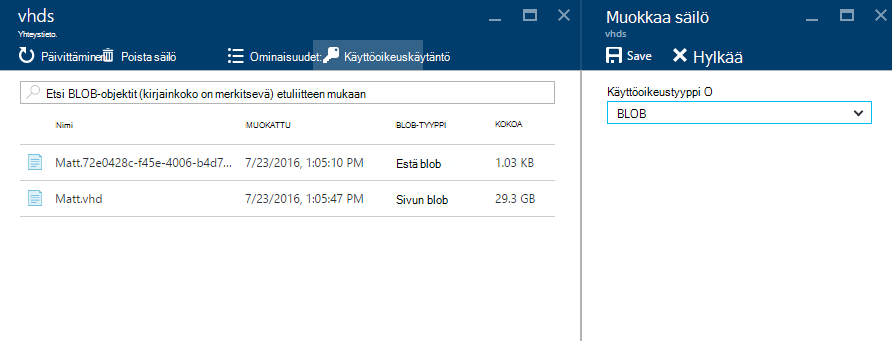
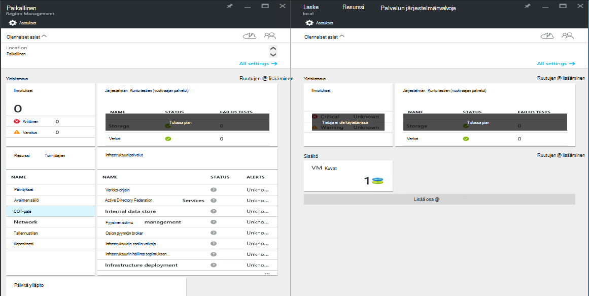
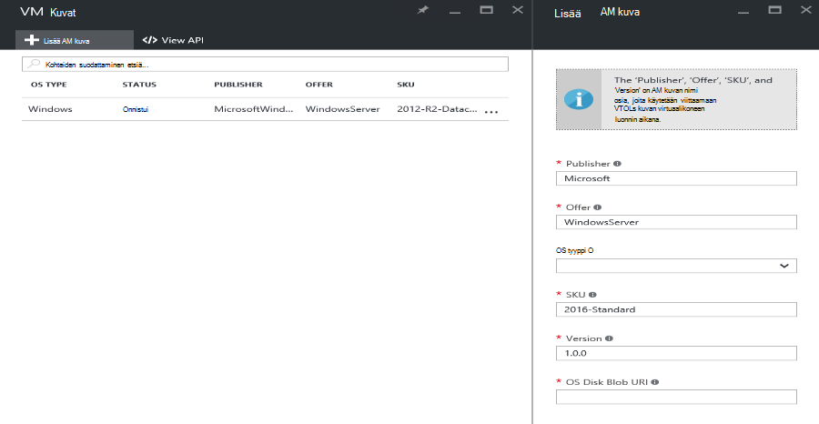

<properties
    pageTitle="AM kuvan lisääminen Azure pinon | Microsoft Azure"
    description="Lisää organisaation mukautetun Windows- tai Linux AM kuvan käyttämään omistajien"
    services="azure-stack"
    documentationCenter=""
    authors="mattmcg"
    manager="darmour"
    editor=""/>

<tags
    ms.service="azure-stack"
    ms.workload="na"
    ms.tgt_pltfrm="na"
    ms.devlang="na"
    ms.topic="get-started-article"
    ms.date="09/26/2016"
    ms.author="mattmcg"/>

# <a name="make-a-custom-virtual-machine-image-available-in-azure-stack"></a>Mukautetun virtuaalikoneen kuva käytettäväksi Azure Pinotut


Azure pinon avulla järjestelmänvalvojat voivat käytettäväksi AM kuvia, kuten organisaation mukautetun SITEN, niiden vuokraajiin. Kuvia voi käyttämät Azure Resurssienhallinta malleja tai lisätä Marketplace-kohteen luomisen Azure Marketplace-Käyttöliittymä. Windows Server 2012 R2-kuva lisätään oletusarvoisesti Azure pinon teknisen ennakkoversion.

> [AZURE.NOTE] AM kuvien Marketplace-kohteet voidaan ottaa käyttöön valitsemalla **Uusi** käyttöliittymä ja valitsemalla sitten **näennäiskoneiden** -luokka. AM kuva kohteet näkyvät.


## <a name="add-a-vm-image-to-marketplace-with-powershell"></a>Lisää kuva AM Marketplace PowerShellin avulla

Jos AM kuva Näennäiskiintolevyn ei käytettävissä paikallisesti konsolin AM (tai toiseen ulkoisesti yhdistetyn laite), käytä seuraavia ohjeita:

1. Valmistele Windows- tai Linux käyttöjärjestelmän virtual kiintolevyn kuva Näennäiskiintolevyn-muodossa (ei VHDX).
    -   Windows-kuvien [lataaminen Windows AM-kuva, kun haluat Azure Resurssienhallinta-versioiden](virtual-machines-windows-upload-image.md) artikkelissa on kuva valmistelu **valmisteleminen lataamisen Näennäiskiintolevyn** -osion ohjeita.
    -   Kuvien Linux noudattamalla valmisteleminen kuvan tai käyttää aiemmin Azure pinon Linux kuvan [käyttöönotto Linux näennäiskoneiden Azure pinossa](azure-stack-linux.md)-artikkelissa kuvatulla tavalla.

2. Kloonaa [Azure pinon Työkalut säilöön](https://aka.ms/azurestackaddvmimage)ja tuo **ComputeAdmin** -moduuli

    ```powershell
    Import-Module .\ComputeAdmin\AzureStack.ComputeAdmin.psm1
    ```

3. Lisää kuva AM kutsumalla Lisää VMImage cmdlet-komento.
    -  Ovat Publisherin, tarjous, tuote ja versio AM kuvan. Näiden parametrien avulla Azure Resurssienhallinta-mallit, jotka viittaavat AM kuva.
    -  Määritä osType Windows- tai Linux.
    -  Azure Active Directory-vuokraajan tunnus sisällyttää lomakkeeseen * &lt;myaadtenant&gt;*. onmicrosoft.com.
    - Seuraavassa on esimerkki kutsun komentosarja:

    ```powershell
       Add-VMImage -publisher "Canonical" -offer "UbuntuServer" -sku "14.04.3-LTS" -version "1.0.0" -osType Linux -osDiskLocalPath 'C:\Users\AzureStackAdmin\Desktop\UbuntuServer.vhd' -tenantID <myaadtenant>.onmicrosoft.com
    ```

    > [AZURE.NOTE] Cmdlet-pyyntöjen tunnistetietojen lisääminen AM kuva. Anna järjestelmänvalvojan Azure Active Directory-tunnistetiedot, kuten serviceadmin@ * &lt;myaadtenant&gt;*. onmicrosoft.com kehotteen.  

Komento tekee seuraavat toimet:
- Todentaa Azure pino-ympäristöön
- Lataa paikallisen Näennäiskiintolevyn juuri luomasi väliaikaisten tiliin
- Lisää kuva AM AM kuva säilöön
- Luo Marketplace kohteen

Voit varmistaa, että komento suoritettiin onnistuneesti, Siirry Marketplace-portaalissa ja varmista, että AM-kuva on käytettävissä **näennäiskoneiden** -luokka.

> 

Seuraavassa on esitetty komento parametrit.


| Parametri | Kuvaus |
|----------| ------------ |
|**tenantID** | Lomakkeen Azure Active Directory vuokraajan tunnuksen * &lt;AADTenantID*. onmicrosoft.com&gt;. |
|**Publisherin** | AM kuvan, joka alihallintoihin käyttäminen, kun otat kuvan julkaisijan nimi-osiossa. Esimerkki on "Microsoft". Älä sisällytä välilyöntejä tai muita erikoismerkkejä tähän kenttään.|
|**tarjouksen** | AM kuvan, joka alihallintoihin käyttäminen AM kuvan otettaessa tarjouksen nimi-osiossa. Esimerkki on "WindowsServer". Älä sisällytä välilyöntejä tai muita erikoismerkkejä tähän kenttään. |
| **tuote** | AM kuvan, joka alihallintoihin käyttäminen AM kuvan otettaessa SKU nimi-osiossa. Esimerkki on "Datacenter2016". Älä sisällytä välilyöntejä tai muita erikoismerkkejä tähän kenttään. |
|**versio** | AM kuvan, joka alihallintoihin käyttäminen AM kuvan otettaessa versio. Tässä versiossa on muodossa * \#.\#. \#*. Esimerkki on "1.0.0". Älä sisällytä välilyöntejä tai muita erikoismerkkejä tähän kenttään.|
| **osType** | Kuva osType on oltava joko "Windows" tai "Linux". |
|**osDiskLocalPath** | OS levy, johon lataat AM-kuvana Azure pinon Näennäiskiintolevyn paikallinen polku. |
|**dataDiskLocalPaths**| Tiedot-levyjä, jotka voi ladata AM kuvan osana paikallisen polut valinnainen matriisi.|
|**CreateGalleryItem**| Totuusarvo merkki, joka määrittää, haluatko luoda kohteen Marketplacesta. Oletusarvo on määritetty tosi.|
|**otsikko**| Marketplace kohteen näyttönimi. Oletusarvo on määritetty Publisher-tarjous-tuote ja AM kuvan.|
|**kuvaus**| Marketplace-kohteen kuvaus. |
|**osDiskBlobURI**| Voit myös tämän komentosarjan hyväksyy myös osDisk Blob-säiliö URI.|
|**dataDiskBlobURIs**| Voit myös tämän komentosarjan hyväksyy myös matriisin Blob-objektien tallennustilaan URI tietojen levyjen lisätä kuvan.|


## <a name="add-a-vm-image-through-the-portal"></a>AM kuvan portaalin kautta

> [AZURE.NOTE] Tämä menetelmä edellyttää Marketplace-kohteen luominen erikseen.

Yksi vaatimus kuvien on, että he voivat viitata Blob-säiliö URI. Valmistele Windows- tai Linux käyttöjärjestelmän virtual kiintolevyn kuva Näennäiskiintolevyn-muodossa (ei VHDX) ja Lataa kuva tallennustilan tilin Azure tai Azure Pinotut. Jos kuva on jo ladattu Azure tai pino Azure-Blob-säiliö, voit ohittaa tämän vaiheen.

[Lataa kuva AM Windows Azure Resurssienhallinta-käyttöönotoissa,](https://azure.microsoft.com/documentation/articles/virtual-machines-windows-upload-image/) artikkelista – **Lataa tallennustilan tilin AM kuvan**vaihe ohjeiden mukaisesti. Ota huomioon seuraavat asiat:

-   Kuvan valmisteleminen ohjeiden Linux-kuva tai käytä Azure pinon Linux-kuvaan [käyttöönotto Linux näennäiskoneiden Azure pinossa](azure-stack-linux.md)-artikkelissa kuvatulla tavalla.

- On tehokkaampaa kuvan lataaminen pinon Azure-Blob storage kuin Azure-Blob-säiliö, koska kuluu vähemmän aikaa, viemään AM kuvan Azure pinon kuva säilöön. Aikana noudattamalla Lataa, varmista, että korvattavat [Todennetaan PowerShellin Microsoft Azure pinon kanssa](azure-stack-deploy-template-powershell.md) vaihe 'kirjautuessasi Azure-vaiheessa.

- Pane merkille Blob-säiliö URI, johon voit ladata kuvan. Siinä on seuraavanlainen: * &lt;storageAccount&gt;/&lt;blobContainer&gt;/&lt;targetVHDName&gt;*.vhd

2.  Jotta blob nimettömänä olisi, siirry tallennustilan tilin blob-säilö, jossa AM kuva Näennäiskiintolevyn videoluettelointia **Blob,** ja valitse sitten **Käyttöoikeuskäytäntö**. Jos haluat, voit sen sijaan Luo jaettu käyttö allekirjoituksen säilö ja Sisällytä se Blob-objektien URI osana.





1.  Kirjaudu Azure pinon järjestelmänvalvojana. Siirry **alueen hallinta**. Valitse kohdasta **RPs** **Laske resurssin tarjoajaan** > **AM kuvia** > **Lisää**

    

2.  Kirjoita seuraava sivu, publisher, tarjous, tuote ja AM image-versio. Nimeä nämä osia viitata AM kuvan Azure Resurssienhallinta malleja. Varmista, että valitset **osType** oikein. Kirjoita **osDiskBlobURI**, johon kuva on ladattu URI vaiheessa 1. Valitse **Luo** Aloita luominen AM kuva.

    

3.  AM kuva tilaksi muuttuu "Onnistui", kun kuva on lisätty.

4.  Alihallinnat, jotka voit ottaa käyttöön AM kuva määrittämällä Publisherin, tarjous, tuote ja versio AM kuvan Azure Resurssienhallinta-malli. Jos haluat tehdä AM kuvan useammin vuokraajan käyttöön käyttöliittymä, on parasta Luo [Marketplace-kohta](azure-stack-create-and-publish-marketplace-item.md).
