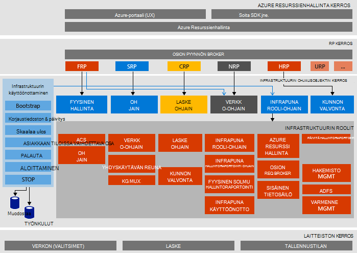

<properties
    pageTitle="Microsoft Azure pinon kuitti, joka kertoo (Käsitteiden) arkkitehtuuri | Microsoft Azure"
    description="Näytä Microsoft Azure pinon Käsitteiden arkkitehtuuri."
    services="azure-stack"
    documentationCenter=""
    authors="heathl17"
    manager="byronr"
    editor=""/>

<tags
    ms.service="azure-stack"
    ms.workload="na"
    ms.tgt_pltfrm="na"
    ms.devlang="na"
    ms.topic="article"
    ms.date="10/25/2016"
    ms.author="helaw"/>

# Microsoft Azure pinon Käsitteiden arkkitehtuuri

Azure-pino Käsitteiden on yksi solmu käyttöönoton Azure pinon tekninen esikatselu 2. Kaikki komponentit on asennettu tietokoneeseen, yhteen host näennäiskoneiden. 

## Looginen arkkitehtuurikaavio
Seuraavassa kaaviossa on kuvattu looginen arkkitehtuuri Azure pinon Käsitteiden ja sen osat.

## Virtuaalikoneen roolit
Azure-pino Käsitteiden tarjoaa-palveluita käyttämällä seuraavia VMs Käsitteiden isännän:

 - **MAS ACS01** Virtual machine pinon Azure-tallennustilan isännöintipalveluina.

 - **MAS ADFS01** Virtual machine isännöinnin Active Directory-liittoutumispalvelut.  Virtual tässä tietokoneessa ei ole käytössä tekninen esikatselu 2.  

 - **MAS ASQL01**  Sisäinen tietoja virtuaalikoneen tallentaa Azure pinon infrastruktuurin roolien.  

 - **MAS BGPNAT01** Virtuaalikoneen visuaalisessa muodossa reunan reitittimen sekä annetaan Azure pinon NAT ja VPN-ominaisuuksia.

 - **MAS CA01** Varmenteen myöntäjä palveluja Azure pinon roolin palveluiden Virtual machine.

 - **MAS CON01** Virtual machine käytettävissä kehittäjille PowerShell, Visual Studio ja muita työkaluja.

 - **MAS DC01** Active Directory-, DNS- ja DHCP isännöintipalveluja varten Microsoft Azure pinon Virtual machine.

 - **MAS GWY01** Virtual machine antamisen reunan VPN-sivusto sivusto yhteydet vuokraajan verkoissa yhdyskäytävän palveluihin.

 - **MAS NC01**  Virtual machine isännöinnin verkko-ohjain, joka hallitsee Azure pinon verkkopalveluita.  

 - **MAS SLB01**  Virtuaalikoneen on kuormituksen services Azure Pinotut omistajien ja Azure pinon infrastruktuuripalvelut.  

 - **MAS SUS01**  Virtual kuormitusryhmät Windows Server Update isännöintipalveluina ja vastuussa tarjoavat päivityksiä Azure pinon muiden näennäiskoneiden.

 - **MAS WAS01**  Virtual machine isännöinnin portal ja Azure Resurssienhallinta-palvelut.

 - **MAS XRP01** Microsoft Azure koko, mukaan lukien suorittaminen, verkon ja tallennustilaa resurssin tarjoajien core resurssi-palveluntarjoajat isännöivän tietokoneen Virtual.

## Tallennustilan palvelut
Tallennustilan services käyttöjärjestelmän fyysinen isännän ovat seuraavat:

 - **ACS Blob-palvelu** Azure yhdenmukaisia tallennustilan Blob-palvelun, joka sisältää Blob-objektien ja taulukon liittyviä palveluja.

 - **SoFS** Skaalaa-kohtaa tiedostopalvelimeen.

 - **ReFS CSV** Joustavat tiedoston järjestelmän klusterin jaettu äänenvoimakkuutta.

 - **Virtual Disk**, **Tallennustilaa**ja **Tallennustilaa välilyöntejä suoraan** ovat Microsoft Azure pinon core tallennustilan resurssin toimittajan ottaminen käyttöön Windows Server vastaaviin tallennustilan-tekniikkaan.

## Seuraavat vaiheet

[Azure pinon käyttöönotto](azure-stack-deploy.md)

[Kokeile ensimmäisen skenaariot](azure-stack-first-scenarios.md)

