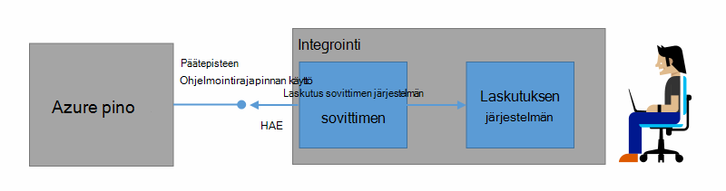
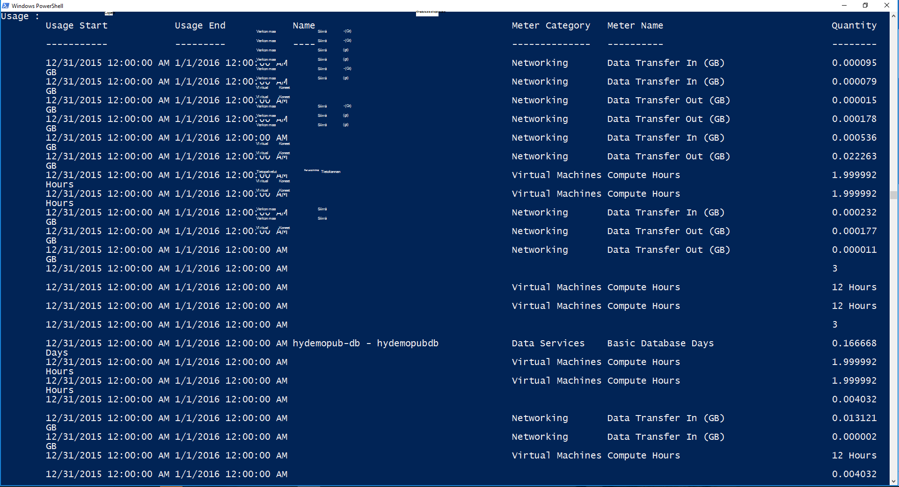

<properties
    pageTitle="Asiakkaan laskutus- ja Azure Pinotut palautus | Microsoft Azure"
    description="Opettele hakemaan resurssien käyttötietojen Azure pino."
    services="azure-stack"
    documentationCenter=""
    authors="AlfredoPizzirani"
    manager="byronr"
    editor=""/>

<tags
    ms.service="azure-stack"
    ms.workload="na"
    ms.tgt_pltfrm="na"
    ms.devlang="na"
    ms.topic="article"
    ms.date="10/18/2016"
    ms.author="alfredop"/>

# Asiakas, Laskutus- ja Azure Pinotut palautus

Nyt, kun käytät Azure pinon, se on hyvä mietittävä, kuinka voit seurata käyttöä. Palveluntarjoajien luottavat käyttötietojen laskutetaan asiakkaidensa ja ymmärtää kustannusten palveluja.
Yritysten, yleensä seurantaa osaston mukaan.

Azure-pino ei ole laskutuksen järjestelmän. Se ei lataudu oman alihallinnat, jotka käyttävät resurssien. Mutta Azure pino on kerätä ja koota käyttötietoja jokaisen koottuja palveluntarjoajasi infrastruktuurin. Voit käyttää näitä tietoja ja vieminen laskutuksen järjestelmän käyttämällä laskutuksen sovittimen tai vieminen business intelligence-työkalulla, kuten Microsoft Power BI.

## Mitä tietoja voit etsiä, ja miten?

Azure pinon resurssin tarjoajat Luo käyttö tietueiden tunnin välein. Tietueiden ylityön kullekin resurssille, joka on käytetty ja tilauksen kulutettu resurssi. Tämä tieto on tallennettu. Voit käyttää tietoja REST-Ohjelmointirajapinnalla kautta.

Palvelun järjestelmänvalvoja, voit hakea kaikki vuokraajan tilaukset käyttötiedot. Yksittäisten alihallinnat, jotka voit hakea vain omat tiedot.

Käyttö-tietueella on tietoja tallennustilan, verkon ja Laske käyttö. Metriä luettelo Katso [Tässä artikkelissa](azure-stack-usage-related-faq.md).

## Käyttötietojen hakeminen

Luo tietueet on tärkeää, että sinulla on käynnissä ja käytä aktiivisesti järjestelmän resursseja. Jos et ole varma, onko sinulla on käynnissä resursseja, Azure pinon Marketplacesta ottaminen käyttöön ja valitse Suorita virtual machine (AM). Varmista, että se seuranta sivu AM katsaus on käynnissä.

On suositeltavaa, että suoritat Windows PowerShellin cmdlet-komentojen käyttötietojen tarkasteleminen.
PowerShellin puhelujen resurssien käyttö-ohjelmointirajapinnan.

1.  [Asentaminen ja määrittäminen PowerShellin Azure](https://azure.microsoft.com/en-us/documentation/articles/powershell-install-configure/).

2.  Voit kirjautua sisään Azure resurssien hallinnan käyttäminen PowerShell-cmdlet-komennon **Kirjautuminen AzureRmAccount**.

3.  Valitse tilaus, jota käytit Luo resursseja, kirjoita **Get-AzureRmSubscription – SubscriptionName "että sub | Valitse AzureRmSubscription**.

4.  Tietojen hakemiseen käyttämällä PowerShell-cmdlet-komennon [**Get-UsageAggregates**](https://msdn.microsoft.com/en-us/library/mt619285.aspx).
    Jos käyttötiedot on käytettävissä, se palautetaan powershellissä, seuraavan esimerkin mukaisesti. PowerShellin palauttaa 1 000 riviä kohden puhelun käyttö.
    *Jatkaminen* -argumentin avulla voit hakea lisäksi ensimmäisen 1 000 rivien määrä. Lisätietoja käyttötiedot Hae [Resurssien käyttö-Ohjelmointirajapinnan viittaus](azure-stack-provider-resource-api.md).

    

## Seuraavat vaiheet

[Palvelun resurssien käyttö Ohjelmointirajapinta](azure-stack-provider-resource-api.md)

[Vuokraaja resurssien käyttö Ohjelmointirajapinta](azure-stack-tenant-resource-usage-api.md)

[Käyttö liittyvät usein kysytyt kysymykset](azure-stack-usage-related-faq.md)
