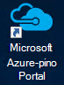
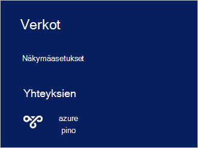

<properties
    pageTitle="Yhteyden muodostaminen Azure pinon | Microsoft Azure"
    description="Opettele muodostamaan Azure pino"
    services="azure-stack"
    documentationCenter=""
    authors="ErikjeMS"
    manager="byronr"
    editor=""/>

<tags
    ms.service="azure-stack"
    ms.workload="na"
    ms.tgt_pltfrm="na"
    ms.devlang="na"
    ms.topic="get-started-article"
    ms.date="10/18/2016"
    ms.author="erikje"/>

# <a name="connect-to-azure-stack"></a>Yhteyden muodostaminen Azure pino
Voit hallita resursseja, on muodostettava Azure pinon Käsitteiden tietokoneeseen. Voit käyttää joko yhteyden seuraavista vaihtoehdoista:

 - Etätyöpöytä: avulla yksittäisen samanaikainen käyttäjän pitää yhteyttä Käsitteiden tietokoneesta.
 - Virtual Private Network (VPN): sallii useiden samanaikainen käyttäjien yhteyden asiakkaiden ulkopuolella Azure pinon infrastruktuuri (edellyttää määritys).

## <a name="connect-with-remote-desktop"></a>Etätyöpöytä yhteydessä
Etätyöpöytäyhteys samanaikainen käyttäjä käyttää resurssien hallinta-portaalissa. Voit myös käyttää Työkalut MAS CON01 virtuaalikoneen.

1.  Kirjaudu sisään Azure pinon Käsitteiden fyysinen koneen.

2.  Avaa Etätyöpöytäyhteys ja muodosta yhteys MAS CON01. Anna **AzureStack\AzureStackAdmin** käyttäjänimi ja järjestelmänvalvojan salasanan antamasi Azure pinon asennuksen aikana.  

3.  MAS CON01 työpöydällä Kaksoisnapsauta Avaa [portal](azure-stack-key-features.md#portal)-kuvake **Microsoft Azure pinon Portal** (https://portal.azurestack.local/).

    

4.  Kirjaudu sisään asennuksen aikana määritetyn Azure Active Directory-tunnistetiedoilla.

## <a name="connect-with-vpn"></a>Yhteydessä VPN
Virtuaalinen yksityinen-verkkoyhteyksien salliminen useita samanaikainen yhteyden asiakkaiden Azure pinon infrastruktuuri ulkopuolella. Voit hallita haavoittuvien portaalin. Voit käyttää myös työkaluja, kuten Visual Studio ja PowerShell-paikallisen-asiakasohjelmassa.

1.  AzureRM-moduulin asentaminen käyttämällä seuraava komento:
   
    ```PowerShell
    Install-Module -Name AzureRm -RequiredVersion 1.2.6 -Scope CurrentUser
    ```   
   
2. Lataa Azure pinon Työkalut-komentosarjoja.  Nämä tiedostot voi ladata joko selaamalla [GitHub säilöön](https://github.com/Azure/AzureStack-Tools)tai käynnissä seuraavaa Windows PowerShell-komentosarjaa järjestelmänvalvojana tuki:
    
    >[AZURE.NOTE]  Seuraavat vaiheet edellyttävät PowerShell 5.0.  Tarkista versiotiedot, suorita $PSVersionTable.PSVersion ja "Pää" vertailu.  

    ```PowerShell
       
       #Download the tools archive
       invoke-webrequest https://github.com/Azure/AzureStack-Tools/archive/master.zip -OutFile master.zip

       #Expand the downloaded files. 
       expand-archive master.zip -DestinationPath . -Force

       #Change to the tools directory
       cd AzureStack-Tools-master
    ````

3.  Saman PowerShell-istunnossa Selaa kansioon, **Yhdistä** ja tuoda AzureStack.Connect.psm1 moduulia:

    ```PowerShell
    cd Connect
    import-module .\AzureStack.Connect.psm1
    ```

4.  Azure pinon VPN-yhteyden luominen suorittaa seuraavia Windows PowerShell. Ennen sen suorittamista, täytä järjestelmänvalvojan salasanan ja Azure pinon host osoitekentät. 
    
    ```PowerShell
    #Change the IP Address below to match your Azure Stack host
    $hostIP = "<HostIP>"

    # Change password below to reference the password provided for administrator during Azure Stack installation
    $Password = ConvertTo-SecureString "<Admin Password>" -AsPlainText -Force

    # Add Azure Stack One Node host & CA to the trusted hosts on your client computer
    Set-Item wsman:\localhost\Client\TrustedHosts -Value $hostIP -Concatenate
    Set-Item wsman:\localhost\Client\TrustedHosts -Value mas-ca01.azurestack.local -Concatenate  

    # Update Azure Stack host address to be the IP Address of the Azure Stack POC Host
    $natIp = Get-AzureStackNatServerAddress -HostComputer $hostIP -Password $Password

    # Create VPN connection entry for the current user
    Add-AzureStackVpnConnection -ServerAddress $natIp -Password $Password

    # Connect to the Azure Stack instance. This command (or the GUI steps in step 5) can be used to reconnect
    Connect-AzureStackVpn -Password $Password 
    ```

5. Kun sinulta kysytään, luota Azure pinon isäntä.

6. Kun sinulta kysytään, Asenna varmenne (kehote näkyy Powershell-istunnon ikkunan takana).

7. Voit esikatsella portaalin yhteys Internet-selaimen, siirry *https://portal.azurestack.local*.

8. Voit tarkastella ja hallita Azure pinon yhteyttä, **verkoissa** käyttäminen asiakkaan:

    

>[AZURE.NOTE] Tämä VPN-yhteyttä ei tarjoa connectivity VMs tai muita resursseja. Lisätietoja yhteyden resursseja on artikkelissa [Solmu-VPN-yhteyden](azure-stack-create-vpn-connection-one-node-tp2.md)


## <a name="next-steps"></a>Seuraavat vaiheet
[Ensimmäinen tehtävät](azure-stack-first-scenarios.md)

[Asenna ja liitä PowerShellin avulla](azure-stack-connect-powershell.md)

[Asenna ja CLI yhteydessä](azure-stack-connect-cli.md)


