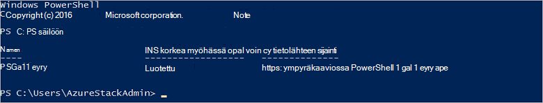

<properties
    pageTitle="Yhteyden muodostaminen PowerShellin Azure pinon | Microsoft Azure"
    description="Opi hallitsemaan Azure pinon PowerShellin avulla"
    services="azure-stack"
    documentationCenter=""
    authors="HeathL17"
    manager="byronr"
    editor=""/>

<tags
    ms.service="azure-stack"
    ms.workload="na"
    ms.tgt_pltfrm="na"
    ms.devlang="na"
    ms.topic="article"
    ms.date="10/19/2016"
    ms.author="helaw"/>

# PowerShellin asentaminen ja yhteyden muodostaminen Azure pino
Tämän oppaan selkeät ohjeet muodostamisesta Azure pinon PowerShellin avulla. Valmis, kun nämä vaiheet myös avulla voit hallita ja asentaa resurssit.

## Asenna Azure pinon PowerShellin cmdlet-komennot

1.  AzureRM cmdlet-komennot asennetaan PowerShell-valikoimasta. Aloita, Avaa PowerShell-konsolin MAS CON01- ja suorita seuraava komento PowerShell säilöjen tietoihin käytettävissä luettelo palauttaa:

        Get-PSRepository

      

2.  Suorita seuraava komento AzureRM-moduulin asentaminen:

        Install-Module -Name AzureRM -RequiredVersion 1.2.6 -Scope CurrentUser

    >[AZURE.NOTE] *-Alueen CurrentUser* on valinnainen. Jos haluat käyttää moduulit yli nykyisen käyttäjän, käyttää järjestelmänvalvojan oikeuksin suoritettava komentokehote ja jätä *laajuus* -parametrin käytöstä.

3.  Vahvista asennuksen AzureRM moduuleja, suorita seuraavat komennot:

        Get-Command -Module AzureRM.AzureStackAdmin

## Yhteyden muodostaminen Azure pino
Moduuli on ladattavissa, joka käsittelee määrittäminen PowerShell yhteys Azure pinon puolestasi.  Käy [Azure pinon Työkalut](http://aka.ms/ConnectToAzureStackPS) moduulin ja lisätoimia. 

## Hae tilaukset luettelo
Tässä osassa voit Tarkista PowerShellin cmdlet-komennot ovat käynnissä vastaan Azure pinon hakeminen ja valitsemalla tilauksen käyttöä varten.

Suorita seuraava komento ja Hae luettelo tilisi Azure pinon tilauksista:

    Get-AzureRmSubscription

## Seuraavat vaiheet
[Ottaa käyttöön mallien PowerShellin avulla](azure-stack-deploy-template-powershell.md)

[Azure CLI yhteydessä](azure-stack-connect-cli.md)

[Ottaa käyttöön Visual Studiossa mallit](azure-stack-deploy-template-visual-studio.md)

