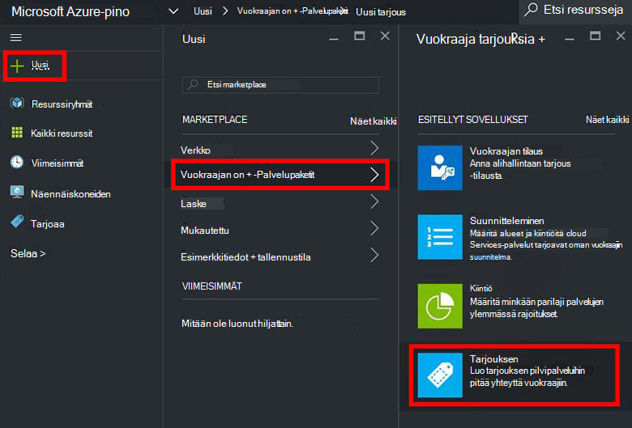
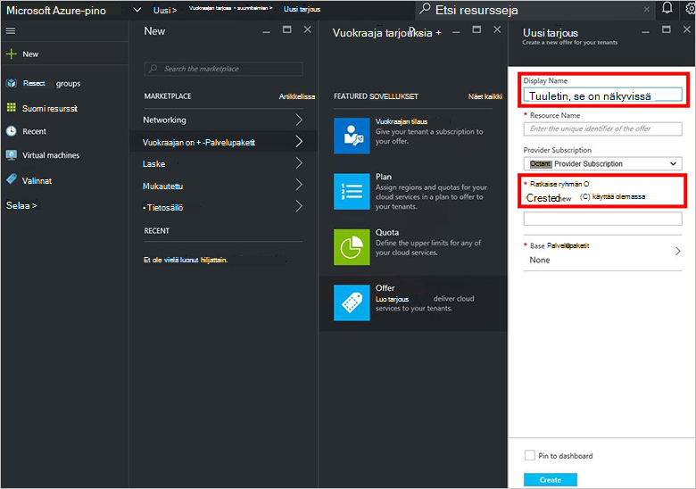
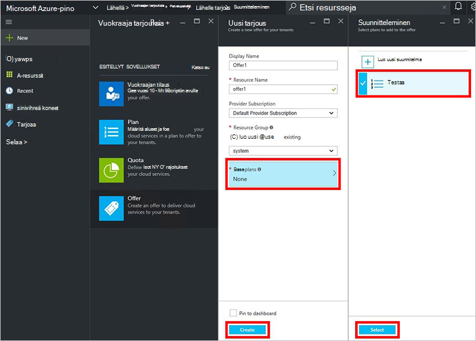
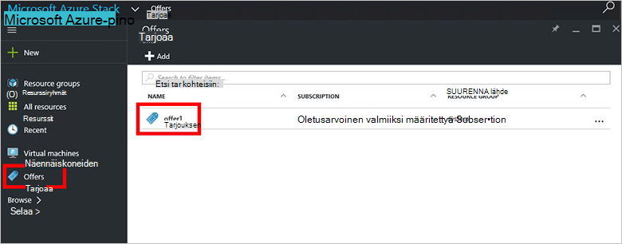
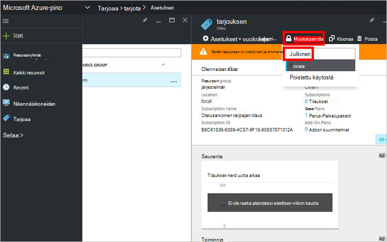

<properties
    pageTitle="Tarjouksen luominen Azure Pinotut | Microsoft Azure"
    description="Palvelun järjestelmänvalvoja Lue, miten voit luoda oman vuokraajiin Azure pinon tarjouksen."
    services="azure-stack"
    documentationCenter=""
    authors="ErikjeMS"
    manager="byronr"
    editor=""/>

<tags
    ms.service="azure-stack"
    ms.workload="na"
    ms.tgt_pltfrm="na"
    ms.devlang="na"
    ms.topic="get-started-article"
    ms.date="09/26/2016"
    ms.author="erikje"/>

# Tarjouksen luominen Azure pino

[Tarjoaa](azure-stack-key-features.md#services-plans-offers-and-subscriptions) ovat vähintään yksi suunnitelmat, tarjoajat esittää vuokraajiin ostamista ja tilaa. Tämän asiakirjan avulla voit luoda tarjouksen, joka sisältää [suunnitelma, jonka loit](azure-stack-create-plan.md) viimeisessä vaiheessa. Tämän tarjouksen ansiosta tilaajille valmistelu näennäiskoneiden.

1.  [Kirjaudu sisään](azure-stack-connect-azure-stack.md#log-in-as-a-service-administrator) palvelun järjestelmänvalvoja-portaaliin ja valitse sitten **Uusi** > **vuokraajan on + suunnitelmien** > **tarjota**.
    

2.  **Uuden tarjouksen** -sivu-Täytä **Näyttönimi** ja **Resurssinimi**ja valitse sitten uusi tai aiemmin luotu **Resurssiryhmä**. Näyttönimi on tarjouksen kutsumanimi. Vain järjestelmänvalvoja voi nähdä resurssinimi. Se on nimi, jotka järjestelmänvalvojia käyttäminen tarjous Azure Resurssienhallinta-resurssiksi.

    

3.  Valitse **Perus-Palvelupaketit** ja valitse **suunnittelu** -sivu tarjous sisällytettävien suunnitelmien ja valitse sitten **Valitse**. Valitse **Luo** tarjous luomiseen.

    
    
4. **Tarjoaa** ja valitse sitten juuri luomasi tarjous.

    

5.  Valitse **Muuta tila**ja valitse sitten **julkisen**.
  
    

Tarjoukset on tehtävä alihallinnat, jotta saat koko näkymään, kun tilaat julkiseksi. Tarjouksia voi olla:

- **Julkinen**: näkyvissä vuokraajiin.

- **Yksityinen**: näkyy vain palvelun järjestelmänvalvojat. Hyödyllisiä aikana kehottaa palvelupaketti tai tarjous, tai jos palvelun järjestelmänvalvoja haluaa hyväksyä jokaisen tilauksen.

- **Poistettu käytöstä**: suljettu uusi tilaajille. Palvelun järjestelmänvalvoja voi käyttää menetelmiä estää tulevien tilaukset, mutta jättää nykyisen tilaajille sellaisekseen.

Tarjous tehdyt muutokset eivät näy heti vuokraajan. Voit tarkastella muutoksia, voit joutua Kirjaudu ulos ja kirjaudu sisään Nähdäksesi uuteen tilaukseen "tilauksen valitsimella" luotaessa resurssien/resurssin ryhmät.

## Seuraavat vaiheet

[Tarjouksen tilata ja valmistella AM](azure-stack-subscribe-plan-provision-vm.md)
