<properties
    pageTitle="Suunnitelman luominen Azure Pinotut | Microsoft Azure"
    description="Palvelun järjestelmänvalvoja, jonka avulla tilaajille säännöstä näennäiskoneiden Suunnittele."
    services="azure-stack"
    documentationCenter=""
    authors="ErikjeMS"
    manager="byronr"
    editor=""/>

<tags
    ms.service="azure-stack"
    ms.workload="na"
    ms.tgt_pltfrm="na"
    ms.devlang="na"
    ms.topic="get-started-article"
    ms.date="09/26/2016"
    ms.author="erikje"/>

# Suunnitelman luominen Azure Pinotut

[Suunnitelmien](azure-stack-key-features.md#services-plans-offers-and-subscriptions) on ryhmiteltyjä palveluista vähintään. Palveluntarjoaja voit luoda oman vuokraajiin tarjota suunnitelmien. Oman alihallinnat tilaa puolestaan tarjousten käyttämään palvelupaketeista ja -palveluista, ne ovat. Tässä esimerkissä näytetään, miten voit luoda suunnitelma, joka sisältää suorittaminen, verkon ja tallennustilaa resurssin tarjoajat. Tätä palvelupakettia ansiosta tilaajille valmistelu näennäiskoneiden.

1.  Siirry internet-selaimen https://portal.azurestack.local.

2.  [Kirjaudu sisään](azure-stack-connect-azure-stack.md#log-in-as-a-service-administrator) palvelun järjestelmänvalvojana Azure pino-portaaliin ja anna palvelun järjestelmänvalvojan tunnistetiedot (tili, jonka loit vaiheessa 5 [Suorita PowerShell-komentosarja](azure-stack-run-powershell-script.md) -osa) ja valitse sitten **Kirjaudu sisään**.

    Palvelun järjestelmänvalvojat voivat luoda tarjouksia ja suunnitelmien ja käyttäjien hallinta.

3.  Luo suunnitelma ja tarjous, jonka alihallinnat, jotka voit tilata valitsemalla **Uusi** > **vuokraajan on + suunnitelmien** > **suunnitelma**.

    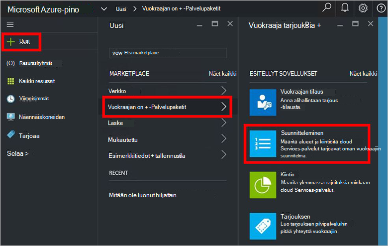

4.  Täytä **Uusi palvelupaketti** -sivu **Näyttönimi** ja **Resurssinimi**. Näyttönimi on suunnitelman kutsumanimi, alihallinnat, jotka on näkyvissä. Vain järjestelmänvalvoja voi nähdä resurssinimi. Se on nimi, jotka järjestelmänvalvojia käyttäminen palvelupaketti kuin Azure Resurssienhallinta resurssi.

    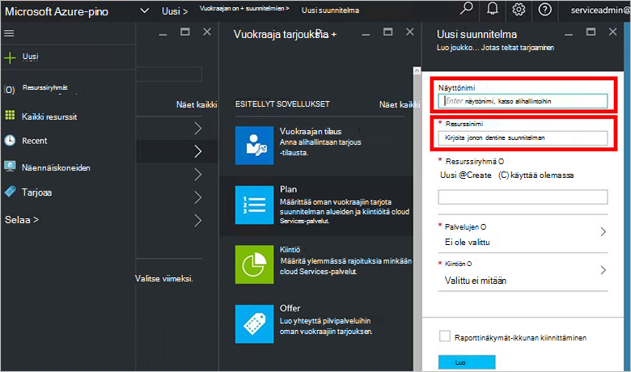

5.  Luo uusi **Resurssiryhmä**tai valitse aiemmin luodun säilöjä suunnitelman (esimerkiksi "OffersAndPlans")

    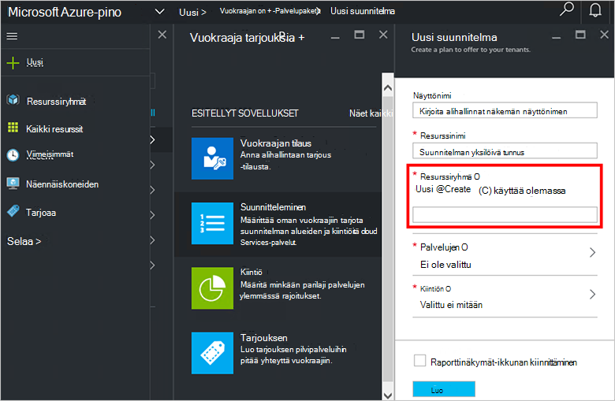

6.  Valitse **palvelut**, **Microsoft.Compute**, **Microsoft.Network**ja **Microsoft.Storage**ja valitse sitten **Valitse**.

    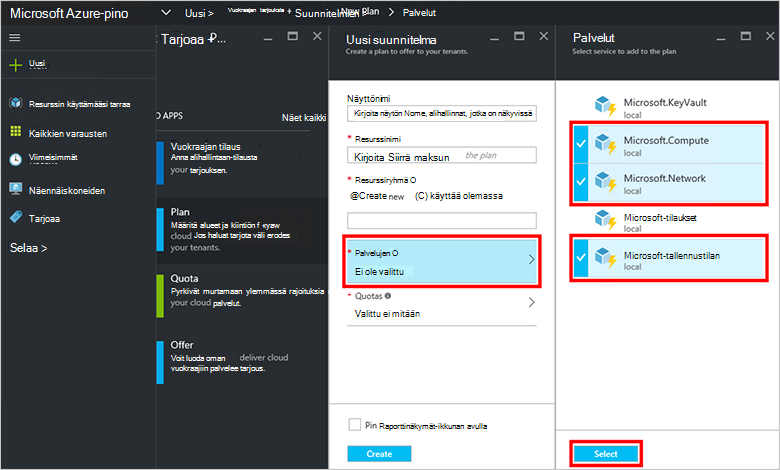

7.  Valitse **kiintiön**, **Microsoft.Storage (paikallinen)**, valitse ja sitten Valitse oletusarvo-kiintiön tai valitsemalla **Luo uusi kiintiön** kiintiön mukauttamiseen.

    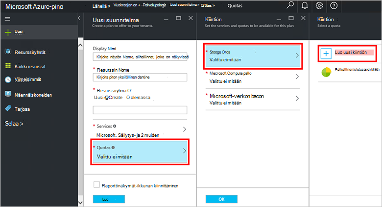

8.  Kiintiön nimi **Kiintiön**asetukset, kiintiöiden arvojen määrittäminen ja valitse **OK**ja valitse sitten **Luo**.

    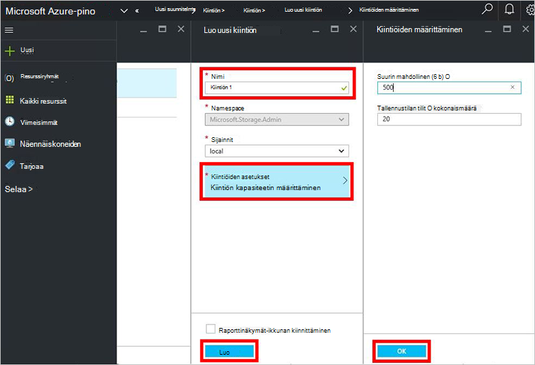

9. Valitse **Microsoft.Network (paikallinen)**ja sitten Valitse oletusarvo-kiintiön tai valitsemalla **Luo uusi kiintiön** kiintiön mukauttamiseen.

    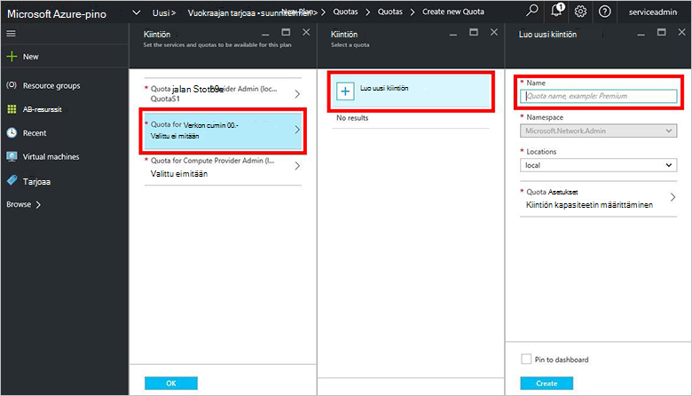

10. Kiintiön nimi **Kiintiön**asetukset, kiintiöiden arvojen määrittäminen ja valitse **OK**ja valitse sitten **Luo**.

    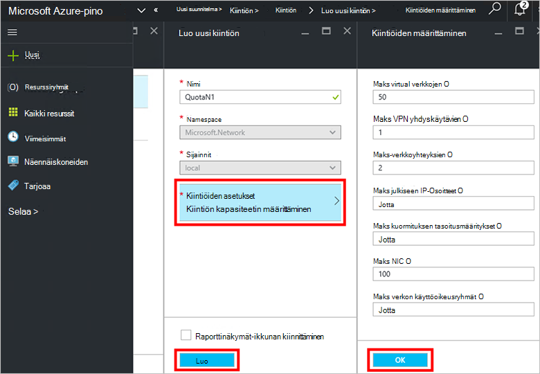

11. Valitse **Microsoft.Compute (paikallinen)**ja sitten Valitse oletusarvo-kiintiön tai valitsemalla **Luo uusi kiintiön** kiintiön mukauttamiseen.

    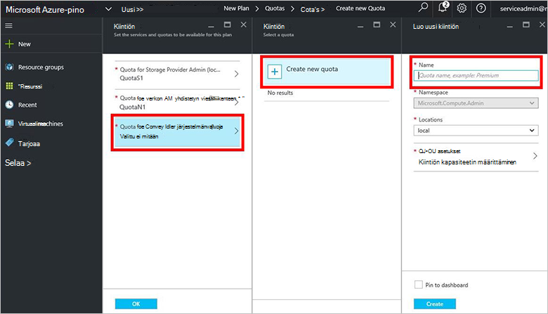

12.  Kiintiön nimi **Kiintiön**asetukset, kiintiöiden arvojen määrittäminen ja valitse **OK**ja valitse sitten **Luo**.

    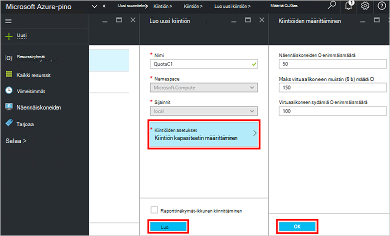

13. - **Kiintiön** -sivu valitsemalla **OK**ja valitse suunnitelman luominen **Luo** **Uusi palvelupaketti** -sivu.

    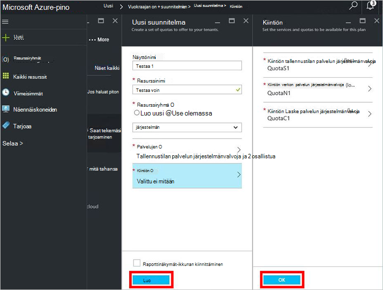

14. Saat uusi palvelupaketti- **kaikille resursseille**, ja valitse Etsi suunnitelman ja napsauttamalla sen nimeä.

    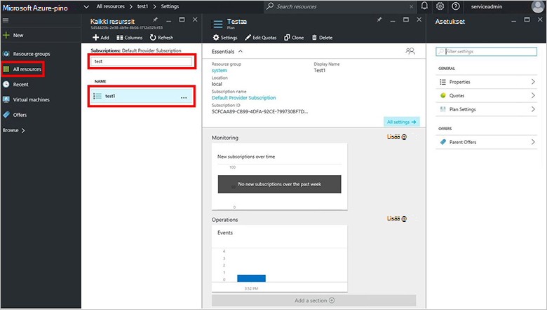

## Seuraavat vaiheet

[Tarjouksen luominen](azure-stack-create-offer.md)
