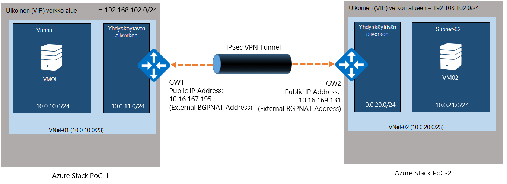
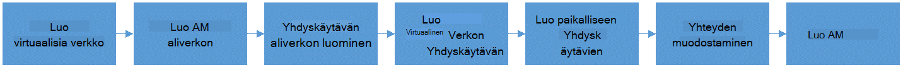

<properties
    pageTitle="Luo sivusto VPN-yhteyden kahden eri Azure pinon käsitteiden ympäristöissä Virtual verkon välillä | Microsoft Azure"
    description="Vaiheittaiset ohjeet, joiden ansiosta cloud-järjestelmänvalvojat voivat luoda sivusto sivusto VPN-yhteyden kaksi yksi solmu Käsitteiden ympäristöjen TP2 välillä."
    services="azure-stack"
    documentationCenter=""
    authors="ScottNapolitan"
    manager="darmour"
    editor=""/>

<tags
    ms.service="azure-stack"
    ms.workload="na"
    ms.tgt_pltfrm="na"
    ms.devlang="na"
    ms.topic="get-started-article"
    ms.date="09/26/2016"
    ms.author="scottnap"/>

# Kahden eri Azure pinon käsitteiden ympäristöissä Virtual verkon välillä sivusto sivusto VPN-yhteyden luominen

## Yleiskatsaus

Tässä artikkelissa käydään läpi vaiheet ja kaksi erillistä Azure pinon, käsitteiden (Käsitteiden) ympäristöissä virtual verkot välillä sivusto sivusto VPN-yhteyden luominen. Tässä on henkilöt, jotka ovat arvioimisen sivusto sivusto auttaa yhdyskäytävien ymmärtää määrittämisestä VPN-yhteydet virtual verkkojen kaksi eri Azure pinon käyttöönotoissa välillä.  Parhaillaan tällöin, saavat yhden VPN yhdyskäytävien toiminnasta Azure Pinotut ymmärtämistä.

>[AZURE.NOTE] Tämä asiakirja koskee erityisesti Azure pinon TP2 Käsitteiden.

### Yhteys-kaavio

Seuraavassa on kaavio, jossa näkyy, mitä meidän määritysten pitäisi näyttää kun Microsoft on tehty.

### Ennen aloittamista

Määritysten suorittamiseen tarvitset seuraavat, joten varmista, että sinulla on seuraavat asiat ennen kuin aloitat.

-   Kaksi palvelimissa, jotka täyttävät [Azure pinon käyttöönoton edellytykset](azure-stack-deploy.md)määrittämiä Azure pinon Käsitteiden-laitteistovaatimukset ja muiden asiakirjan määrittämiä edellytykset.

-   Azure pinon teknisen ennakkoversion 2 käyttöönottopaketti.

## Käyttöönotto Käsitteiden-Ympäristöt

Voit ottaa käyttöön Azure pinon Käsitteiden ympäristöissä, viimeistele tämä määritys.

-   Kunkin Käsitteiden, joka otetaan käyttöön, voit noudattaa yksinkertaisesti yksityiskohtaiset on artikkelissa [Käyttöönotto Azure pinon Käsitteiden](azure-stack-run-powershell-script.md)käyttöönotto-ohjeet.
    Olemme viittaavat kussakin Käsitteiden ympäristössä yhdistyvät toisten tietokantajärjestelmien POC1 ja POC2 kuin tässä asiakirjassa.

## Laske-, verkko- ja tallennustilaa kiintiöiden määrittäminen

Sinun täytyy määrittää kiintiön suorittaminen, verkon ja tallennustilaa niin, että palveluista voi liittää suunnitelma ja sitten tarjous, jonka alihallintoihin voit tilata.

>[AZURE.NOTE] Sinun on suoritettava seuraavat toimet kussakin Azure pinon Käsitteiden-ympäristössä.

Luo kiintiön palveluiden kokemus on muuttunut TP1. Ohjeita siitä, miten voit luoda kiintiön TP2 tukikäytännöistä <http://aka.ms/mas-create-quotas>. Voit hyväksyä kaikki tämän Harjoitus kiintiön asetusten oletusarvot.

## Suunnitelman ja tarjouksen luominen

[Suunnitelmien](azure-stack-key-features.md) on ryhmiteltyjä palveluista vähintään. Palveluntarjoaja voit luoda oman vuokraajiin tarjota suunnitelmien. Oman alihallinnat tilaa puolestaan tarjousten käyttämään palvelupaketeista ja -palveluista, ne ovat.

>[AZURE.NOTE] Sinun on suoritettava nämä vaiheet jokaiselle Azure pinon Käsitteiden-ympäristössä.

1.  Luo suunnitelma. Tällöin voit noudattaa [Luo suunnitelma](azure-stack-create-plan.md) online-artikkelin ohjeiden mukaisesti.

2.  Ohjeiden luominen [Azure Pinotut tarjouksen](azure-stack-create-offer.md)tarjouksen luominen

3.  Kirjaudu sisään vuokraajan järjestelmänvalvojana-portaaliin ja [luomasi tarjous tilaaminen] (azure-pino-tilaa-suunnitelma-säännöstä-vm.md.

## Luo verkkoresursseja Käsitteiden 1

Nyt tarkastellaan Luo todella annettava määrittämiseen Microsoftin kokoonpanon määrittäminen resursseja. Seuraavat vaiheet osoittavat, mitä on olla tekemässä. Nämä ohjeet näkyvissä luomisesta resurssien portaalin kautta, mutta samojen onnistuu PowerShellin kautta.

### Kirjaudu sisään vuokraajan

Palvelun järjestelmänvalvoja voi Kirjaudu sisään vuokraajan Testaa suunnitelmat, tarjoukset ja tilaukset, jotka niiden alihallinnat, jotka voivat käyttää. Jos sinulla ei ole vielä yksi, ennen kuin kirjaudut sisään [vuokraajan tilin luominen](azure-stack-add-new-user-aad.md) .

### Luo VPN & AM aliverkon

1.  Kirjaudu sisään vuokraajan tilin.

2.  Azure-portaalissa Napsauta **Uusi** -kuvaketta.

     
3.  Valitse **Verkko** Marketplace-valikosta.

4.  Valitse-valikosta **Virtual verkko** -osa.

5.  Valitse **Luo** -painike alaosassa on resurssin kuvaus-sivu. Voit kirjoittaa mukaan tämän taulukon kenttiin seuraavat arvot.

  	| **Kenttä**             | **Arvo** |
  	|----------------------- | ------ |
  	| Nimi                  |vnet 01 |
  	| Osoitetilaa varten         | 10.0.10.0/23 |
  	| Aliverkon nimi           | aliverkon 01 |
  	| Aliverkon osoitealueita  | 10.0.10.0/24 |

6.  Raportissa pitäisi näkyä tilauksen loit aiemmin kaikille **tilauksen** -kenttään.

7.  Resurssiryhmän voit luoda uusi resurssiryhmä tai jos sinulla on jo, valitse Käytä aiemmin luotu.

8.  Tarkista oletussijainti.

9.  Napsauta **Luo** -painiketta.

### Yhdyskäytävän aliverkon luominen

1.  Avaa Virtual verkkoresurssin luomaasi (Vnet 01)-koontinäytössä.

2.  Valitse asetukset-sivu aliverkosta

3.  Napsauta yhdyskäytävän aliverkon lisääminen Virtual verkon **Yhdyskäytävän aliverkon** -painiketta.

     
4.  Aliverkon nimi on määritetty **GatewaySubnet** oletusarvoisesti.
    Yhdyskäytävän aliverkosta ovat erityisiä ja tämän tietyn nimen on oltava toimi.

5.  Kirjoita **osoite** -kenttään **10.0.11.0/24**.

6.  Valitse **Luo** -painiketta voit luoda yhdyskäytävän aliverkon.

### VPN-Gatewayn luominen

1.  Azure-portaalissa Valitse **Uusi** -kuvaketta.

    

2.  Valitse **Verkko** Marketplace-valikosta.

3.  Valitse **Virtual yhdyskäytävien** verkkoresursseja luettelo.

4.  Lue kuvaus ja valitse **Luo**.

5.  Kirjoita **nimi** -kenttään **GW1**.

6.  Valitse Valitse virtual verkon **Virtual verkko** -kohtaa.
    Valitse **Vnet 01** luettelosta.

7.  Valitse **julkisen IP-osoite** -valikkovaihtoehto. Kun valitse julkiseen IP address-sivu avautuu, valitse Luo uusi-painikkeen.

8.  Kirjoita **nimi** -kenttään **GW1 PiP** ja sitten **Ok.**

9.  **Yhdyskäytävän tyyppi** on valittuna oletusarvoisesti **VPN-yhteyttä** . Säilytä asetus.

10. **VPN-tyyppi** on **reitin perustuvan** , valittuna oletusarvoisesti.
    Säilytä asetus.

11. Tarkista **tilaus** ja **sijainti** ovat oikein. Voit halutessasi kiinnittää resurssin koontinäyttö. Valitse **Luo**.

### Paikalliseen verkkoon kirjauduttaessa Gatewayn luominen

Paikallinen yhdyskäytävien resurssi on hieman Oudot tässä skenaariossa.
Löydät Azure-samalle resurssille on kuitenkin Azure-tietokannassa, se on yleensä tarkoitus esittää laitteen fyysinen, paikallinen vakiomittoja muodostaa VPN-yhdyskäytävän Azure-tietokannassa. Tässä esimerkissä yhteyden molemmat päät ovat todella VPN yhdyskäytävät.

Tapa, jolla huomioon otettavia asioita tämä kaukosäädinkohtainen tarkoitus on paikallinen yhdyskäytävien resurssi on aina osoittamaan remote yhdyskäytävän yhteys toisessa päässä. Käsitteiden on suunniteltu tavasta todella annettava antaa muiden Käsitteiden NAT-AM ulkoisen verkkosovittimen osoite kuin paikalliseen verkkoon yhdyskäytävän julkiseen IP-osoite. Olemme Luo NAT yhdistämismääritykset-NAT AM varmistaaksesi, että molemmat päät on yhdistetty oikein.

### Hae NAT-AM ulkoisen sovittimen IP-osoite

1.  Kirjaudu sisään Azure pinon fyysinen koneen POC2 varten.

2.  [Windows-näppäin] + R ja Avaa **Suorita** -valikko, kirjoita **mstsc** ja painamalla enter.

3.  Lisää **tietokoneen** -kenttään nimi **MAS BGPNAT01** ja napsauta **Muodosta** -painiketta.

4.  Napsauta Käynnistä-painiketta ja napsauta PowerShell ja valitse **Suorita järjestelmänvalvojana**.

5.  Kirjoita **IPConfig/kaikki**.

6.  Etsi Ethernet-sovittimen, joka on yhteydessä verkkoon paikallinen ja Huomaa, että sovittimen sitoa IPv4-osoite. Oma ympäristössä se on **10.16.167.195** , mutta omasi on jotakin muuta.

7.  Tallentaa tätä osoitetta. Tämä on mitä Käytämme kuin julkiseen IP-osoite on luominen POC1 paikallisen yhdyskäytävien resurssin.

### Luo paikalliseen verkkoon kirjauduttaessa yhdyskäytävän resurssi

1.  Kirjaudu sisään Azure pinon fyysinen koneen POC1 varten.

2.  **Tietokone** -kenttään nimi **MAS CON01** ja napsauta **Muodosta** -painiketta.

3.  Azure-portaalissa Napsauta **Uusi** -kuvaketta.

    

4.  Valitse **Verkko** Marketplace-valikosta.

5.  Valitse **Paikallinen yhdyskäytävien** resurssien luetteloa.

6.  Kirjoita **nimi** -kenttään **POC2 GW**.

7.  Olemme tiedä Microsoftin yhdyskäytävän IP-osoitteen vielä, mutta se ei ok, koska kopiointia toinen käyttäjä palaa lomaltaan ja muuta sovellusta myöhemmin. Nyt kirjoittaa **10.16.167.195** **IP-osoite-kenttään**.

8.  Kirjoita **Osoitetilaa** -kenttään, joka on luovatko-POC2 Vnet osoitetilaa. Tämä käyttäjästä tulee **10.0.20.0/23** Anna niin, että arvo.

9.  Varmista, että **tilauksen**, **Resurssiryhmä** ja **sijainti** ovat kaikki oikein, ja valitse **Luo**.

### Yhteyden muodostaminen

1.  Azure-portaalissa Napsauta **Uusi** -kuvaketta.

     

2.  Valitse **Verkko** Marketplace-valikosta.

3.  Valitse **yhteyden** resurssien luetteloa.

4.  Valitse **Perustiedot** asetukset-sivu, **sivusto (IP)** **yhteyden tyyppi**.

5.  Valitse **tilaus**, **Resurssiryhmä** ja **sijainti** ja valitse **Ok**.

6.  Valitse **asetukset** -sivu **Virtual yhdyskäytävien** (**GW1**) aiemmin luomasi.

7.  Valitse **paikallisen** **Yhdyskäytävien** (**POC2 GW**) aiemmin luomasi.

8.  Lisää **POC1 POC2** **Yhteyden nimi** -kenttään.

9.  Lisää **12345** **Jaetut Key (PSK)** -kenttään. Valitse **Ok**.

### Luo AM

Jotta matkustaminen VPN-yhteyden kautta tietojen kelpoisuuden tarkistaminen, sinun on VMs lähettää ja vastaanottaa tietoja kunkin Käsitteiden. Sähköpostiviestin luominen AM nyt POC1 ja aseta se sekä AM aliverkon Microsoftin virtual verkossa.

1. Azure-portaalissa Valitse  **Uusi** -kuvaketta.

     

2.  Valitse **näennäiskoneiden** Marketplace-valikosta.

3.  Valitse virtuaalikoneen kuvia luettelo **Windows Server 2012 R2 palvelinkeskuksen** kuva.

4.  Lisää arvo **VM01** **perusteet** -sivu **nimi** -kenttään.

5.  Anna kelvollinen käyttäjänimi ja salasana. Käytät tätä tiliä kirjautuneena AM, kun se on luotu.

6.  Anna **tilauksen**, **Resurssiryhmä** ja **sijainti** ja valitse sitten **Ok**.

7.  Valitse **kokoa** -sivu AM koon tämän esiintymän valitseminen ja valitse sitten **Valitse**.

8.  Valitse asetukset-sivu hyväksy oletusarvot, varmista juuri, että valittu Virtual verkko on **VNET 01** aliverkon on määritetty **10.0.10.0/24**. Valitse **Ok**.

9.  Tarkista **Yhteenveto** -sivu ja valitse **Ok**.

## Luo verkkoresursseja Käsitteiden 2

### Kirjaudu sisään vuokraajan

Palvelun järjestelmänvalvoja voi Kirjaudu sisään vuokraajan Testaa suunnitelmat, tarjoukset ja tilaukset, jotka niiden alihallinnat, jotka voivat käyttää. Jos sinulla ei ole vielä yksi, ennen kuin kirjaudut sisään [vuokraajan tilin luominen](azure-stack-add-new-user-aad.md) .

### Luo VPN & AM aliverkon

1. Kirjaudu sisään vuokraajan tilin.

2. Azure-portaalissa Valitse  **Uusi** -kuvaketta.

     

3.  Valitse **Verkko** Marketplace-valikosta.

4.  Valitse-valikosta **Virtual verkko** -kohtaa.

5.  Valitse **Luo** -painike alaosassa on resurssin kuvaus-sivu. Kirjoita haluamasi kenttiä, jotka on lueteltu alla olevassa taulukossa seuraavat arvot.

  	|**Kenttä**              |**Arvo** |
  	| ----------------------|----------|
  	| Nimi                  | vnet 02 |
  	| Osoitetilaa varten         | 10.0.20.0/23 |
  	| Aliverkon nimi           | aliverkon 02 |
  	| Aliverkon osoitealueita  | 10.0.20.0/24 |

6.  Raportissa pitäisi näkyä tilauksen loit aiemmin kaikille **tilauksen** -kenttään.

7.  Resurssiryhmän voit luoda uusi resurssiryhmä tai jos sinulla on jo, valitse Käytä aiemmin luotu.

8.  Tarkista oletusarvoinen **sijainti**. Jos haluat, voit kiinnittää virtual verkon Raporttinäkymät-ikkunan käytön helpottamiseksi.

9.  Napsauta **Luo** -painiketta.

### Yhdyskäytävän aliverkon luominen

1.  Avaa (**Vnet 02**) on luotu raporttinäkymät Virtual verkkoresurssin.

2.  Valitse **asetukset** -sivu **aliverkosta.**

3.  Napsauta yhdyskäytävän aliverkon lisääminen Virtual verkon **Yhdyskäytävän aliverkon** -painiketta.

     

4.  Aliverkon nimi on määritetty **GatewaySubnet** oletusarvoisesti.
    Yhdyskäytävän aliverkosta ovat erityisiä ja tämän tietyn nimen on oltava toimi.

5.  Kirjoita **osoite** -kenttään **10.0.20.0/24**.

6.  Voit luoda yhdyskäytävän aliverkon valitsemalla **Luo** .

### VPN-Gatewayn luominen

1. Azure-portaalissa Napsauta  **Uusi** -kuvaketta.

     

2.  Valitse **Verkko** Marketplace-valikosta.

3.  Valitse **Virtual yhdyskäytävien** verkkoresursseja luettelo.

4.  Lue kuvaus ja valitse **Luo**.

5.  Kirjoita **nimi** -kenttään **GW2**.

6.  Valitse Valitse virtual verkon **Virtual verkko** -kohtaa.
    Valitse **Vnet 02** luettelosta.

7.  Valitse **julkisen IP-osoite** -valikkovaihtoehto. Kun valitse julkiseen IP address-sivu avautuu, valitse Luo uusi-painikkeen.

8.  Kirjoita **nimi** -kenttään **GW2 PiP** ja sitten **Ok.**

9.  **Yhdyskäytävän tyyppi** on valittuna oletusarvoisesti **VPN-yhteyttä** . Säilytä asetus.

10. **VPN-tyyppi** on **reitin perustuvan** , valittuna oletusarvoisesti.
    Säilytä asetus.

11. Tarkista **tilaus** ja **sijainti** ovat oikein. Voit halutessasi kiinnittää resurssin koontinäyttö. Valitse **Luo**.

### Paikalliseen verkkoon kirjauduttaessa Gatewayn luominen

#### Hae NAT-AM ulkoisen sovittimen IP-osoite

1.  Kirjaudu sisään Azure pinon fyysinen koneen POC1 varten.

2.  Paina ja pitoon [Windows-näppäin] + r. Avaa **Suorita** -valikko ja kirjoita **mstsc** viesti ja kirjoita.

3.  Lisää **tietokoneen** -kenttään nimi **MAS BGPNAT01** ja napsauta **Muodosta** -painiketta.

4.  Käynnistä-valikosta PowerShell Napsauta hiiren kakkospainikkeella ja valitse **Suorita järjestelmänvalvojana**.

5.  Kirjoita **IPConfig/kaikki**.

6.  Etsi Ethernet-sovittimen, joka on yhteydessä verkkoon paikallinen ja Huomaa, että sovittimen sidottu IPv4-osoite. Oma ympäristössä, on **10.16.169.131** mutta omasi on jotakin muuta.

7.  Tallentaa tätä osoitetta. Tämä on mitä myöhemmin Käytämme kuin julkiseen IP-osoite on luominen POC1 paikallisen yhdyskäytävien resurssin.

#### Luo paikalliseen verkkoon kirjauduttaessa yhdyskäytävän resurssi

1.  Kirjaudu sisään Azure pinon fyysinen koneen POC2 varten.

2.  Lisää **tietokoneen** -kenttään nimi **MAS CON01** ja napsauta **Muodosta** -painiketta.

3. Azure-portaalissa Napsauta **Uusi** -kuvaketta.

     

4.  Valitse **Verkko** Marketplace-valikosta.

5.  Valitse **Paikallinen yhdyskäytävien** resurssien luetteloa.

6.  Kirjoita **nimi** -kenttään **POC1 GW**.

7.  Nyt julkinen IP-osoite on tallennettu annettava POC1 Virtual verkko-yhdyskäytävän. Kirjoita **10.16.169.131** **IP-osoite-kenttään**.

8.  Syötä **Osoitetilaa** kentän POC1 - **10.0.0.0/16** **Vnet** 01 osoitetilaa.

9.  Varmista, että **tilauksen**, **Resurssiryhmä** ja **sijainti** ovat kaikki oikein, ja valitse **Luo**.

## Yhteyden muodostaminen

1. Azure-portaalissa Napsauta  **Uusi** -kuvaketta.

     

2.  Valitse **Verkko** Marketplace-valikosta.

3.  Valitse **yhteyden** resurssien luetteloa.

4.  Valitse **Perustiedot** asetukset-sivu, **sivusto (IP)** **yhteyden tyyppi**.

5.  Valitse **tilaus**, **Resurssiryhmä** ja **sijainti** ja valitse **Ok**.

6.  Valitse **asetukset** -sivu **Virtual yhdyskäytävien** (**GW1**) aiemmin luomasi.

7.  Valitse **paikallisen** **Yhdyskäytävien** (**POC1 GW**) aiemmin luomasi.

8.  Lisää **POC2 POC1** **Yhteyden nimi** -kenttään.

9.  Lisää **12345** **Jaetut Key (PSK)** -kenttään. Jos valitset jonkin toisen arvon, muista, että se on oltava samat jaetut avainta määritit POC1 arvo. Valitse **Ok**.

## Luo AM

Luo AM nyt POC1 ja aseta se sekä AM aliverkon Microsoftin virtual verkossa.

1.  Azure-portaalissa Valitse **Uusi** -kuvaketta.

     

2.  Valitse **näennäiskoneiden** Marketplace-valikosta.

3.  Valitse virtuaalikoneen kuvia luettelo **Windows Server 2012 R2 palvelinkeskuksen** kuva.

4.  Lisää arvo **VM02** **perusteet** -sivu **nimi** -kenttään.

5.  Anna kelvollinen käyttäjänimi ja salasana. Käytät tätä tiliä kirjautuneena AM, kun se on luotu.

6.  Anna **tilauksen**, **Resurssiryhmä** ja **sijainti** ja valitse sitten **Ok**.

7.  Valitse **kokoa** -sivu AM koon tämän esiintymän valitseminen ja valitse sitten **Valitse**.

8.  Valitse asetukset-sivu hyväksy oletusarvot, varmista juuri, että valittu Virtual verkko on **VNET 02** aliverkon on määritetty **20.0.0.0/24**. Valitse **Ok**.

9.  Tarkista **Yhteenveto** -sivu ja valitse **Ok**.

## Määritä NAT-AM kunkin Käsitteiden yhdyskäytävän ohitus varten

Koska Käsitteiden on suunniteltu itsenäistä ja eristetty verkosta, joina fyysinen host on otettu käyttöön, "Ulkoinen" VIP-verkkoon, yhdyskäytävät ovat yhteydessä ei varsinaisesti ulkoisen, mutta sen sijaan piilotetaan tekevät verkko-osoitteen käännöksen (NAT) reitittimen takana. Reitittimen on todella Windows Server AM (**MAS BGPNAT01**) käynnissä RRAS Routing and Remote Access Services ()-roolin Käsitteiden-infrastruktuuria. Tarvitsemme NAT määrittämiseksi MAS BGPNAT01 AM, jotta yhteyden molemmissa päissä sivusto sivusto VPN-yhteyden.

>[AZURE.NOTE] Tämä on tarpeen vain Käsitteiden-ympäristössä.

### Määritä NAT

Sinun täytyy sekä Käsitteiden ympäristöissä seuraavasti.

1.  Kirjaudu sisään Azure pinon fyysinen koneen POC1 varten.

2.  Paina ja pitoon [Windows-näppäin] + r. Avaa **Suorita** -valikko ja kirjoita **mstsc** viesti ja kirjoita.

3.  Lisää **tietokoneen** -kenttään nimi **MAS BGPNAT01** ja napsauta **Muodosta** -painiketta.

4.  Käynnistä-valikosta PowerShell Napsauta hiiren kakkospainikkeella ja valitse **Suorita järjestelmänvalvojana**.

5.  Kirjoita **IPConfig/kaikki**.

6.  Etsi Ethernet-sovittimen, joka on yhteydessä verkkoon paikallinen ja Huomaa, että sovittimen sidottu IPv4-osoite. Oma ympäristössä on **10.16.169.131** (ympyröity punaisella alla), mutta omasi on jotakin muuta.

     

7.  Kirjoita seuraavalla PowerShell-komennolla portit ulkoisen NAT-osoite, joka määrittää IKE-todentaminen. Muista vaihtaa IP-osoitetta, joka vastaa ympäristön yksi.

        Add-NetNatExternalAddress -NatName BGPNAT -IPAddress 10.16.169.131 PortStart 499 -PortEnd 501

8. Seuraavaksi luodaan staattinen NAT-yhdistäminen, voit yhdistää ulkoinen osoite yhdyskäytävän julkiseen IP-osoite yhdistää ISAKMP portin 500 suojaustunnelin vaiheen 1.

        Add-NetNatStaticMapping -NatName BGPNAT -Protocol UDP -ExternalIPAddress 10.16.169.131 -InternalIPAddress 192.168.102.1 -ExternalPort 500 -InternalPort 500

9.  Lopuksi annettava Tee NAT-ohitus, joka käyttää portin 4500 muodostaa onnistuneesti valmis IPEC tunnelin NAT-laitteiden välityksellä.

         Add-NetNatStaticMapping -NatName BGPNAT -Protocol UDP -ExternalIPAddress 10.16.169.131 -InternalIPAddress 192.168.102.1 -ExternalPort 4500 -InternalPort 4500

10.  Toista vaiheet 1 – 9 POC2.

## Testaa yhteys

Nyt, kun sivusto sivusto-yhteys on muodostettu olemme olisi Tarkista, että olemme pääsevät liikenne kulkee etenee. Tehtävä on helppoa, kun se liittyy vain johonkin Käsitteiden kummassakin ympäristössä luomaasi VMs kirjautumisesta ja ping toisen ympäristön luomaamme AM. Jos haluat varmistaa, että olemme ovat laajennettujen liikenne sivusto sivusto-yhteyden kautta, haluamme Varmista, että olemme ping remote aliverkon ei VIP AM suoraan IP (DIP)-osoite. Voit tehdä tämän annettava selville osoite on Microsoftin yhteys toisessa päässä.

### Kirjaudu sisään vuokraajan POC1 AM

1.  Azure-pino fyysinen koneen kirjautuminen POC1 ja kirjaudu sisään vuokraajan tilillä-portaaliin.

3.  Valitse vasemman reunan siirtymispalkissa **näennäiskoneiden** -kuvake.

4.  Etsi **VM01** , jonka loit aiemmin VMs luettelo ja valitse se.

5. Valitse **Yhdistä**sivu virtuaalikoneen varten.

     

6.  Avaa komentorivi-sisällä AM ja kirjoita **IPConfig/kaikki**.

7.  Etsi tulosteesta **IPv4-osoite** ja Huomaa sitä. Tämä on osoite ping-POC2. Tässä ympäristössä osoite on **10.0.10.4**, mutta ympäristössäsi voivat olla erilaisia. Se olisi kuitenkin kuuluvat **10.0.10.0/24** aliverkon, joka on luotu aiemmassa versiossa.

### Kirjaudu sisään vuokraajan POC2 AM

1.  Kirjaudu sisään Azure pinon fyysinen koneen POC2 ja kirjaudu sisään vuokraajan tilillä portaaliin.

3.  Valitse vasemman reunan siirtymispalkissa **näennäiskoneiden** -kuvake.

4.  Etsi **VM02** , jonka loit aiemmin VMs luettelo ja valitse se.

5.  Valitse **Yhdistä**sivu virtuaalikoneen varten.

     

6.  Avaa komentorivi-sisällä AM ja kirjoita **IPConfig/kaikki**.

7.  Raportissa pitäisi näkyä 10.0.20.0/24 sisäpuolella olevat IPv4-osoite. Testaa Omat testiympäristössä osoite on 10.0.20.4, mutta omasi voivat olla erilaisia.

8.  Nyt-kohdassa POC2 AM haluamme ping-POC1, AM tunnelissa Toiminto on kutsu DIP, jotka on tallennettu VM01 kohteesta.
    Oma testiympäristössä tämä on 10.0.10.4, mutta muista ping löytämäsi oman testiympäristössä osoite. Raportissa pitäisi näkyä tulos, joka näyttää tältä.

     

9.  Vastauksessa remote AM ilmaisee onnistuneen testi! Voit sulkea ikkunan AM yhteyden tai jos haluat tehdä joitakin muita tiedonsiirron Testaa yhteys (kuten tiedoston kopio).

### Tarkasteleminen tiedonsiirron tilastotiedot yhdyskäytävä-yhteyden kautta

Jos haluat tietää, kuinka paljon tietoja on kulkeva sivusto yhteyden kautta, nämä tiedot ovat käytettävissä yhteys-sivu. Tämän testin kätevästi myös voit varmistaa, että vain lähetit ping tapahtui todella VPN-yhteyden kautta.

1.  Edelleen kirjautuneena POC2, kirjaudu sisään käyttämällä tiliä vuokraajan **Microsoft Azure pinon Käsitteiden Portal** - **ClientVM** .

2.  **Selaa** -valikkovaihtoehto ja valitse **yhteydet**.

3.  Valitse luettelosta **POC2 POC1** -yhteys.

4.  Valitse yhteys, sivu näet tilastotiedot tietojen ja tietojen. Alla olevassa kuvassa näet lukuja suurempi kuin vain ping tili. Tämä johtuu on ollut sekä joitakin tiedostonsiirron. Raportissa pitäisi näkyä joitakin nolla arvoja.

     
