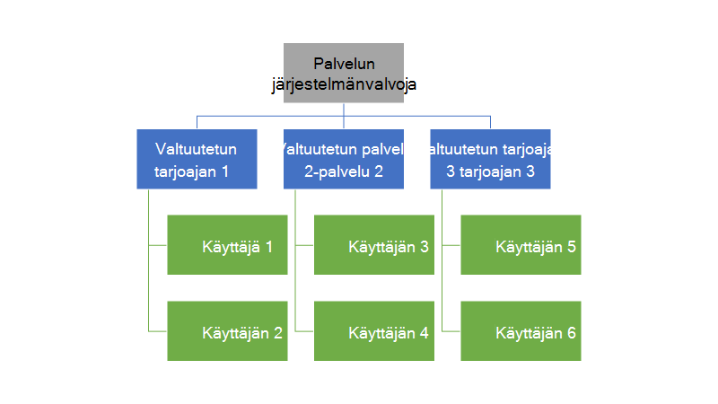
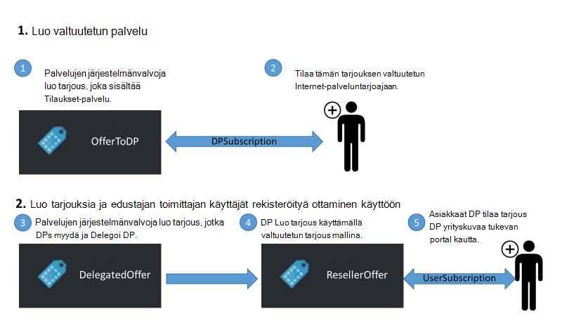
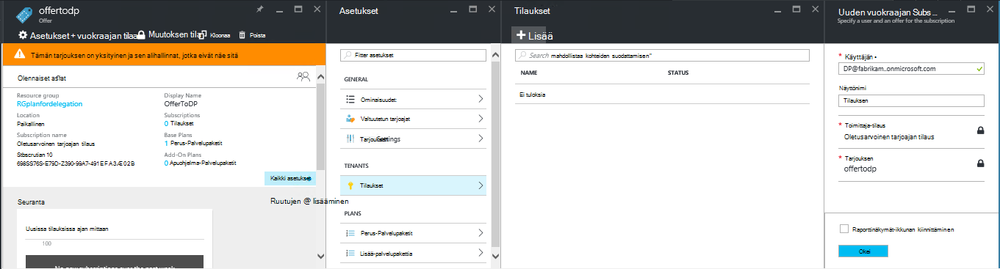
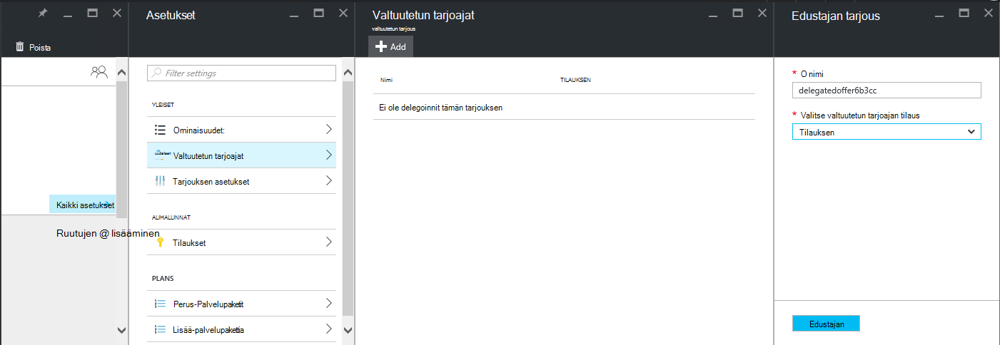
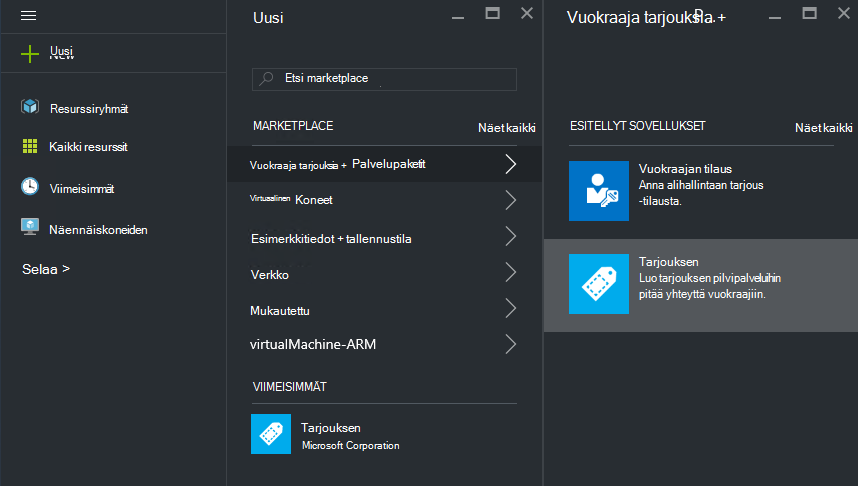
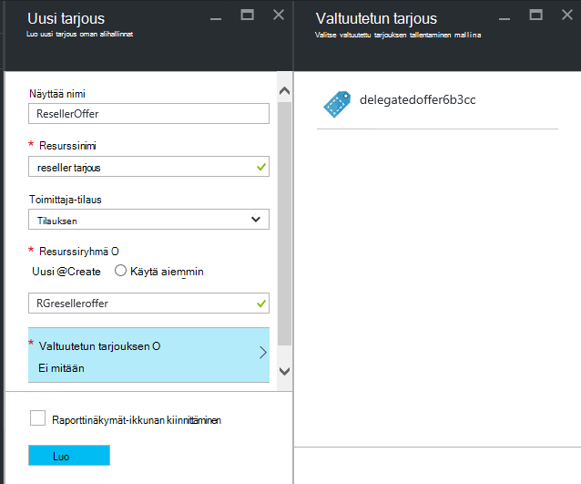
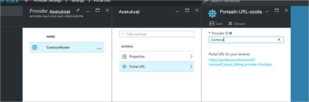
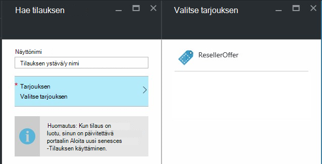

<properties
    pageTitle="Delegoiminen tarjouksia Azure Pinotut | Microsoft Azure"
    description="Opettele valitseminen muut vastaava luominen tarjouksia ja rekisteröimässä käyttäjien puolestasi."
    services="azure-stack"
    documentationCenter=""
    authors="AlfredoPizzirani"
    manager="byronr"
    editor=""/>

<tags
    ms.service="azure-stack"
    ms.workload="na"
    ms.tgt_pltfrm="na"
    ms.devlang="na"
    ms.topic="article"
    ms.date="10/07/2016"
    ms.author="alfredop"/>

#Azure Pinotut tarjouksia delegoiminen

Palvelun järjestelmänvalvoja usein haluat sijoittaa muut vastaava luominen tarjouksia ja rekisteröimässä käyttäjien puolestasi. Esimerkiksi näin voi käydä, jos olet palveluntarjoajan etkä halua jälleenmyyjät rekisteröityä asiakkaille ja hallita niitä puolestasi. Voit myös ongelmassa yrityksen Jos keskitetyn IT-ryhmään ja haluat osastoja tai tytäryhtiöt rekisteröintiä ei ole yhteyttä toimia.

Delegointi auttaa näiden tehtävien tekemiseen auttavat saavuttaa ja hallita useita käyttäjiä kuin voi tehdä suoraan. Seuraavassa kuvassa on yhden tason verran delegointi, mutta Azure-pino tukee useita tasoja. Valtuutetun tarjoajat puolestaan voi delegoida muista sähköpostipalveluista, enintään viisi tasoa.

Järjestelmänvalvojat voivat delegoida tarjouksia luomista ja alihallinnat muiden käyttäjien delegointi-toiminnon avulla.

##Roolien ja ohjeita delegointi

Selvittääksesi, delegointi, ota huomioon, joka sisältää kolme yhdistävää roolia:

-   **Palvelun järjestelmänvalvoja** hallitsee Azure pinon infrastruktuuri, Luo tarjous-mallin ja Delegoi muiden tarjota käyttäjilleen.

-   Valtuutetun käyttäjien kutsutaan **valtuutetun tarjoajan palveluun**. Ne voivat kuulua muiden organisaatioiden (kuten muut Azure Active Directory-alihallinnat).

-   **Käyttäjien** tarjoukset rekisteröityminen ja käyttää niitä hallinta niiden työmääriä, VMs luominen, tallentaminen tietojen jne.

Seuraavassa kuvassa esitetyllä sisältää kaksi vaihetta delegointi määrittäminen.

1.  Määritä valtuutetun tarjoajat. Toimi samoin tilaamalla perusteella, joka sisältää vain tilaukset-palvelun tarjoamista.
    Käyttäjät, jotka ovat tilaamasi tämän tarjouksen hankkia joitakin palvelun järjestelmänvalvoja-ominaisuuksia, kuten mahdollisuus laajentaa tarjouksia ja kirjaudu yksilöityjä ne käyttäjät.

2.  Delegoida tarjouksen valtuutetun palvelulle. Tämän tarjouksen toimii mallina valtuutetun tarjoaja voi tarjota. Valtuutetun tarjoaja voi kestää tarjous, valitse asiakirjan nimi (mutta eivät muutu palvelujen ja kiintiön) ja tarjoaminen asiakkaille.

Edustajana valtuutetun tarjoajien, käyttäjien tarvitsee muodostaa yhteyden tärkeimmät palvelussa; Toisin sanoen ne täytyy luoda tilauksen. Tässä skenaariossa tähän tilaukseen tunnistaa valtuutetun tarjoajat hallitsevansa esitä tarjouksia puolesta tärkeimmät tarjoajan oikealle.

Kun tämä yhteys on muodostettu, järjestelmänvalvoja voi delegoida tarjouksen valtuutetun palvelulle. Valtuutetun tarjoaja voi kestää tarjous, nimetä sen uudelleen (mutta ei muuta sen sisältämän) ja tarjoaminen asiakkaille.

Muodostaa valtuutetun palveluntarjoaja edustajien tarjouksen ja varmista, että käyttäjät sen rekisteröityä, seuraavien osien ohjeita.

##Roolien määrittäminen

Saat valtuutetun palveluntarjoaja töissä, tarvitset lisäksi järjestelmänvalvojan palvelutilin Azure Active Directory-tilejä. Jos sinulla ei ole niitä, luo kaksi tiliä. Mikä tahansa AAD vuokraajan voivat kuulua tilit. Olemme viittaavat niihin valtuutetun palvelu (DP) ja käyttäjä.

| **Rooli** | **Organisaation oikeudet** |
| -------------------- | ----------------------- |
|  Valtuutetun toimittaja | Käyttäjän |
| Käyttäjän | Käyttäjän |

##Määritä valtuutetun palvelut

1.  Kirjaudu palveluun järjestelmänvalvojana.

2.  Luo tarjous, jotka mahdollistavat alihallinnat, jotka muuttuvat valtuutetun tarjoajan palveluun. Tämä edellyttää, että luot suunnitelman ja sen pohjalta tarjouksen:

    a.  [Luo suunnitelma](azure-stack-create-plan.md).
        Suunnitelman tulisi sisältää vain tilaukset-palvelun. Tässä artikkelissa Käytämme kutsutaan PlanForDelegation suunnitelma.

    b.  [Luo tarjouksen](azure-stack-create-offer.md) 
     suunnitelman perusteella. Tässä artikkelissa Käytämme kutsutaan OfferToDP tarjouksen.

    c-näppäinyhdistelmää.  Kun tarjouksen luominen on valmis, Lisää Käyttäjätunnus valtuutetun tarjoajan Alihallinta tämän tarjouksen napsauttamalla     **tilaukset** &gt; **Lisää** &gt; **Vuokraajan uuteen tilaukseen**.

  

> [AZURE.NOTE]Kaikki Azure pinon tarjoukset, jossa on tehdä tarjous julkinen ja auttaa muita käyttäjiä tilaa, tai pitää yksityisinä ja ottaa palvelun järjestelmänvalvoja hallinta kirjautuminen. Valtuutetun tuomiseen ovat yleensä vain tiettyjen ja haluat hallita sitä, kuka sitä päästetään siten pitää tämän tarjouksen yksityisinä tulkita useimmissa tapauksissa.

##Palvelujen järjestelmänvalvoja luo valtuutetun tarjous

Olet nyt muodostanut valtuutetun palveluntarjoajan. Seuraavaksi suunnitelma ja tarjous, jotka aiot delegoida ja asiakkaillesi käyttävien luomiseen. Sinun täytyy määritellä tämän tarjouksen, juuri sellaisena kuin haluat niiden asiakkaiden nähdäksesi, koska valtuutetun tarjoaja voi suunnitelmien ja se sisältää kiintiön muuttaminen.

1.  Palvelun järjestelmänvalvoja [Luo suunnitelma](azure-stack-create-plan.md) ja [tarjouksen](azure-stack-create-offer.md) sen pohjalta. Tämän artikkelin Käytämme kutsutaan DelegatedOffer tarjouksen.
> [AZURE.NOTE]Tarjous ei tarvitse tehdään julkinen. Sitä voi tehdä julkisen Jos valitset, mutta useimmissa tapauksissa haluat vain valtuutettua tarjoajien palvelua pääsevät käyttämään sitä. Kun yksityinen tarjouksen delegoida kuvatulla tavalla seuraamalla näitä ohjeita, valtuutetun tarjoaja pysty käyttämään sitä.

2.  Delegoida tarjous. Siirry DelegatedOffer ja valitse Asetukset-ruudun, valitse **Valtuutetut tarjoajat** &gt; **Lisää**.

3.  Valitse valtuutetun kehittäjän tilauksen avattavasta luettelosta-ruutuun ja valitse **edustajan**.

> 

##Valtuutetun tarjoajan mukauttaa tarjous

Kirjaudu sisään valtuutetun palveluna ja luo uusi tarjous käyttämällä valtuutetun tarjous mallina.

1.  Valitse **Uusi** &gt; **vuokraajan on + suunnitelmien** &gt; **tarjota**.

    

2.  Määrittää nimen tarjous. Tässä on valita ResellerOffer. Valitse valtuutettu tarjous perustua ja valitse sitten **Luo**.
    
    

    >[AZURE.NOTE] Huomautus verrattuna luominen kuin kokeneilta palvelun järjestelmänvalvoja tarjota erotus. Valtuutetun tarjoaja ei rakentaa tarjous perus suunnitelmien ja lisäosa suunnitelmien; hän voi valita vain tarjoukset, jotka on siirretty hänelle ja ei tehdä muutoksia niihin.

3. Tarjous julkistaminen valitsemalla **Selaa** &gt; **tarjoaa**, valitsemalla Tarjous ja valitsemalla **Muuta tila**.

4. Valtuutetun provider hyödyntää näitä tarjouksia palvelun omia käyttäjätietojaan portaalissa URL-osoite. Huomaa, että nämä tarjoukset näkyvät vain valtuutettua portaalin kautta. Voit etsiä ja muuttaa tätä URL-Osoitetta:

    a.  Valitse **Selaa** &gt; **palveluntarjoajan asetukset** &gt; **portaalin URL-osoite**.

    b.  Muuta halutessasi palvelun tunnus.

    c-näppäinyhdistelmää.  Kopioi portaalin URL-Osoitteen eri sijaintiin, kuten esimerkiksi Notepadilla.

    
<!-- -->
Valtuutetun tarjouksen luominen kuin valtuutetun palveluntarjoaja on nyt valmis. Kirjaudu valtuutetun palveluna. Sulje selaimen välilehti, olet käyttänyt.

##Tarjous rekisteröityminen

1.  Siirry uudessa selainikkunassa valtuutetun portaalin URL-Osoitteen edellisessä vaiheessa. Kirjaudu portaalin käyttäjäksi. Huomautus: on käytettävä valtuutetun portaalin tämän vaiheen. Valtuutetun tarjous ei näy muuten.

2.  Raporttinäkymät-ikkunassa Valitse **Hae tilauksen**. Näet, että vain luonut valtuutetun palvelu valtuutetun tarjouksia esitetään käyttäjälle:

> 

Tarjouksen delegointi prosessi on päättynyt. Käyttäjä voi nyt tilaa tämän tarjouksen hakemalla se tilaus.

##Usean tason delegointi

Usean tason delegoinnin avulla valtuutetun Internet-palveluntarjoajaan delegoida tarjous muihin kohteisiin. Tämä sallii esimerkiksi tarkempaa reseller-kanavat, jossa hallinta Azure pinon tarjoajan Delegoi jakelija, joka puolestaan Delegoi reseller tarjouksen luominen.
Azure-pino tukee delegointi enintään viisi käyttöoikeustasoa.

Voit luoda useita tasoa tarjouksen delegoinnin valtuutetun tarjoajan Delegoi puolestaan tarjous seuraava palvelulle. Prosessi on sama valtuutetun palveluntarjoajasi sellaisena kuin se oli, palvelun järjestelmänvalvoja (katso [palvelujen järjestelmänvalvoja luo valtuutetun tarjous](#service-admin-creates-the-delegated-offer)).

##Seuraavat vaiheet
[Valmistele AM](azure-stack-provision-vm.md)
