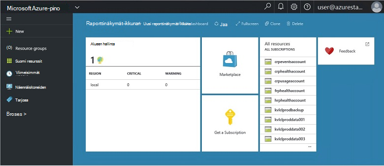
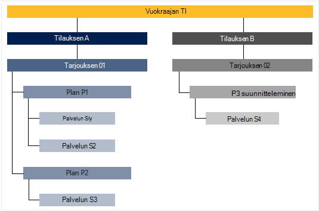

<properties
    pageTitle="Tärkeimmät ominaisuudet ja -käsitteistä Azure Pinotut | Microsoft Azure"
    description="Lue lisää ominaisuuksia ja -käsitteistä Azure Pinotut."
    services="azure-stack"
    documentationCenter=""
    authors="Heathl17"
    manager="byronr"
    editor=""/>

<tags
    ms.service="azure-stack"
    ms.workload="na"
    ms.tgt_pltfrm="na"
    ms.devlang="na"
    ms.topic="article"
    ms.date="10/25/2016"
    ms.author="helaw"/>

# Tärkeimmät ominaisuudet ja -käsitteistä Azure Pinotut

Jos ole ennen käyttänyt Microsoft Azure pino-ominaisuuksien kuvauksia näitä ehtoja voi olla hyötyä.

## Mukana seuraavat henkilöt

On kaksi lajikkeiden käyttäjien Microsoft Azure pinon, palvelun järjestelmänvalvoja ja vuokraajan (asiakas).

-  **Palvelun järjestelmänvalvoja** voi määrittäminen ja hallinta resurssin tarjoajien, vuokraajan tarjoukset, suunnitelmat, palvelujen, kiintiön ja hinnat.
-  **Vuokraajan** hankkii (tai ostaa) palvelut, jossa voit valita, palvelun järjestelmänvalvoja. Alihallinnat, jotka voit valmistella, seurata ja hallita palveluita, ne on määritetty vastaanottamaan, kuten Web Apps-sovellusten ja tallennustilaa näennäiskoneiden.

## Portal

Ensisijainen menetelmiä Microsoft Azure pinon käyttäminen on portaalin ja PowerShell.

Microsoft Azure pino-portaali on käynnissä palvelimiin Azure portaalin esiintymä. Web-sivusto, joka tarjoaa Omatoiminen kokemus palvelun Järjestelmänvalvojat ja omistajien ja Roolipohjainen käyttöoikeuksien valvonta (RBAC) resursseja ja cloud kapasiteetin käyttöönotto pika-sovelluksen ja palvelun kehitystä käyttöönoton on.

## Alueiden, palvelujen, suunnitelmat, tarjoukset ja tilaukset

Azure Pinotut palvelut toimitetaan alueet, tilaukset, tarjoukset ja suunnitelmien vuokraajiin. Alihallinnat, jotka voit tilata useita tarjouksia. Tarjouksia voi olla vähintään yksi suunnitelmien ja suunnitelmien voi olla vähintään yksi palvelut.

Esimerkki hierarkian vuokraajan tilauksista tarjouksia, joissa vaihteleva Palvelupaketit ja -palveluihin.

### Alueiden
Azure pinon alueilla on basic elementti, asteikko ja hallinta.  Organisaatiossa voi olla useita alueet, joiden resursseista kunkin alueen.  Alueiden voi olla myös eri palveluja käytettävissä.

### Palvelut

Microsoft Azure pinon mahdollistaa palvelut ja sovellukset, kuten näennäiskoneiden SQL Server tietokantoja, SharePoint, Exchange- tai erilaisia tarjoajia.

### Palvelupaketit

Saatavana olevat kiintiöt ovat palveluista vähintään ryhmittelyjä. Palveluntarjoaja voit luoda suunnitelmien tarjota oman vuokraajiin. Oman alihallinnat tilaa puolestaan tarjousten käyttämään palvelupaketeista ja -palveluista, ne ovat.

Jokaisen palvelun lisätään suunnitelma voi määrittää kiintiön asetusten avulla voit hallita cloud kapasiteetti. Kiintiön voi olla rajoituksia, kuten AM ja RAM suorittimen rajoitukset, ja niitä käytetään käyttäjän tilauskohtaisten. Kiintiön voidaan eritellä sijainnin mukaan. Esimerkiksi sisältävä alue A palvelut Laske suunnitelma voi olla kaksi näennäiskoneiden 4 gt RAM-Muistia ja 10 suorittimen sydämiä kiintiön.

Tarjouksen luodessasi palvelun järjestelmänvalvoja voi sisältää **Perus palvelupaketin**. Perus näistä palvelupaketeista kuuluvat oletusarvoisesti, kun alihallinnan tilaa tarjoukseen. Heti, kun käyttäjä tilaa (ja tilaus on luotu), käyttäjä käyttää kaikkien näiden perus suunnitelmien (ja vastaavan kiintiön) määritetyn resurssin palveluntarjoajien.

Palvelun järjestelmänvalvoja voi myös lisätä **lisäosa suunnitelmien** tarjouksen. Lisäosien suunnitelmien eivät näy oletusarvoisesti tilaus. Apuohjelma-tilauksia muita palvelupaketteja (kiintiön) käytettävissä tarjouksen, tilauksen omistaja voi lisätä niiden tilaukset.

### Tarjoaa

Tarjoukset ovat vähintään yksi suunnitelmat, vuokraajiin ostamaan esittää tarjoajat (tilaa). Tarjouksen Alpha voi olla esimerkiksi suunnitelman A (joukko Laske palveluita sisältävä alue-1) ja suunnitella B (lähettäjä ja tallennustilaa verkkopalvelujen joukon sisältävä alue-2).

Tarjouksen mukana joukko perus suunnitelmien ja palvelun järjestelmänvalvojat voivat luoda lisäosa suunnitelmat, alihallinnat, jotka voit lisätä tilauksen.

### Tilaukset

Tilaus on, miten alihallinnat ostaa tarjousten. Tilaus on yhdistelmä vuokraajan tarjouksen. Palvelutili voi olla useita tarjouksia tilaukset. Jokaisen tilauksen koskee vain yhden tarjouksen. Vuokraajan tilaukset määrittävät he pääsevät suunnitelmien/palvelut.

Tilausten avulla tarjoajat järjestää cloud resurssit ja palvelujen käyttöä.

## Azure Resurssienhallinta

Azure resurssien hallinnan avulla voit käsitellä infrastruktuurin resurssien malliin perustuvan, declaritive-mallissa.   Se on käyttöliittymä, joiden avulla voit ottaa käyttöön, hallita ja seurata ratkaisun-osia, kuten näennäiskoneiden, tallennustilan tilit, web Apps-sovellusten ja tietokannat. Koko lisätietoja ja ohjeita on artikkelissa [Azure resurssin hallinnassa: yleiskatsaus](../azure-resource-manager/resource-group-overview.md).

### Resurssiryhmät

Resurssiryhmät ovat muotokokoelmia, joiden resurssit, palvelut ja sovellukset, ja kullekin resurssille on tyyppi, esimerkiksi näennäiskoneiden, virtual verkkojen julkiseen IP-osoitteet, tallennustilan tilit tai sivustot. Kullekin resurssille on oltava resurssiryhmä ja niin resurssiryhmät Ohje loogisesti järjestää resurssit, kuten työmäärää tai sijainnin mukaan.

Seuraavat tärkeät seikat ottaa huomioon, kun määrität resurssiryhmä:

-   Kullekin resurssille voi olla vain yksi resurssiryhmä.

-   Otetaan käyttöön, päivittää ja poistaa resurssiryhmä yhdessä. Jos yksi resurssi, kuten tietokantapalvelimeen on olemassa eri käyttöönoton jakson, sen on oltava toisen resurssiryhmä.

-   Voit lisätä tai poistaa resurssiryhmä resurssille milloin tahansa.

-   Voit siirtää resurssin resurssi-ryhmästä toiseen ryhmään.

-   Resurssiryhmä voi olla resurssit, jotka sijaitsevat eri alueilla.

-   Resurssiryhmä voidaan alueen hallintatehtäviin käyttöoikeuksien hallinta.

-   Resurssi voidaan linkittää toiseen resurssiryhmä resurssin kahden resurssin on vuorovaikutuksessa keskenään, mutta niitä ei jaeta saman elinkaari. Esimerkiksi useita sovelluksia on muodostettava yhteys tietokantaan, mutta tietokannan ei on päivitetty tai poistettu samassa tahdissa kuin sovellukset.

-   Microsoft Azure Pinotut resurssit, kuten suunnitelmien ja tarjouksia hallitaan myös resurssin ryhmissä.

-   Voit ottaa resurssiryhmä uudelleen.  Tästä on hyötyä kokeilua tai kehittämistä tarkoituksiin.  

### Azure Resurssienhallinta-mallit

Azure resurssien hallinnan avulla voit luoda yksinkertaisen mallin (JSON muodossa), joka määrittää käyttöönotto ja määritys-sovelluksen. Tätä mallia käytetään nimitystä Azure Resurssienhallinta-malli ja tarjoaa sääntöpohjaisesti määrittämään käyttöönotto. Mallin avulla voit toistuvasti kaikkialla app lifecycle sovelluksen käyttöönotto ja resurssien otetaan käyttöön yhtenäinen tilaan luottaa.

## Resurssin tarjoajat (RPs) – verkon RP Laske RP tallennustilan RP

Resurssin tarjoajat ovat lomakkeen perusta kaikki Azure-pohjaiset IaaS web-palveluja ja PaaS palvelut. Azure Resurssienhallinta on riippuvainen eri RPs pääsy isäntä-palvelut.

On kolme tärkeimmät RPs: verkon, varasto ja suorittaminen. Kaikkien näiden RPs avulla voit määrittää ja hallita sen vastaaviin resursseja. Palvelun järjestelmänvalvojat voit myös lisätä uuden mukautetun resurssin tarjoajan palveluun.

### Laske RP

Laske resurssin palvelu (kap.) avulla voit luoda oman näennäiskoneiden Azure pinon alihallinnat. Toimintojen palvelun järjestelmänvalvojalle Asenna ja määritä alihallinnat resurssi-palvelu sisältää myös. Kap. on nyt mahdollista muodostamiseen näennäiskoneiden virtuaalikoneen tunnisteet. Virtuaalikoneen tunniste-palvelun tarjoaa IaaS ominaisuuksia Windows ja Linux näennäiskoneiden.

### Verkon RP

Verkon resurssin palvelu (NRP) toimittaa ohjelmiston määritetty verkko (SDN) ja verkon funktion Virtualization (NFV) ominaisuuksia yksityinen pilveen sarjaa. Nämä ominaisuudet ovat johdonmukaisia verrattuna Azure julkisen pilveen, niin, että sovellusmallit voidaan kirjoittaa kerran ja ottaa käyttöön sekä Azure julkisen cloud tai paikallisen Microsoft Azure pino. Verkon RP tutustutaan eritellympiä verkko-ohjausobjektin, metatietojen tunnisteita, nopeammin määritykset, nopea ja toistettavien mukauttaminen ja useita ohjausobjektin liittymät (mukaan lukien PowerShell, .NET SDK, Node.JS SDK REST-pohjainen API). Voit luoda ohjelmiston kuormituksen tasoitusmääritykset, julkiseen IP-osoitteet, verkon käyttöoikeusryhmät, virtual verkot, muun muassa NRP.

### Tallennustilan RP

Tallennustilan RP toimittaa neljä Azure yhdenmukaisia liittyviä palveluja: blob, taulukko tai jonon tilinhallinta. Se on myös tallennustilan hallinta pilvipalveluun palveluntarjoajan hallinta Azure yhdenmukaisia tallennustilan palvelujen helpottamiseksi. Azure-tallennustilan tarjoaa joustavuutta voivat tallentaa ja hakea paljon erimuotoisia tietoja, kuten asiakirjat ja media-tiedostot ja Azure BLOB-objektit ja rakenteellisia NoSQL Azure-taulukoiden tietojen perusteella. Lisätietoja Azure-tallennustilan on artikkelissa [Johdanto Microsoft Azuren tallennustilaan](../storage/storage-introduction.md).

#### Blob-objektien tallennustilaan

Blob-objektien tallennustilaan tallentaa mitä tahansa tietojoukon. Blob voi olla mikä tahansa tekstin tai binaarinen tietoja, kuten asiakirjan, mediatiedosto tai sovelluksen asennusohjelma. Taulukkotallennus tallentaa rakenteellisia tietojoukkoja. Taulukkotallennus on NoSQL avain-määritteen tietosäilö, joka mahdollistaa nopeasti ja suuria määriä tietoja nopeasti käyttöönsä. Jonon tallennustila on luotettava messaging, työnkulkua käsitellään ja välisen cloud services-osia.

Jokaisen blob on järjestetty säilön-kohdassa. Säilöt ovat myös käteviä suojauskäytäntöjen liittäminen ryhmiä. Tallennustilan tilin voi olla jokin muu luku säilöjä ja säilön voi olla enintään 500 TT kapasiteetin raja-tallennustilan tilin BLOB-objektit, minkä tahansa määrän. BLOB storage tarjouksia kolmenlaisia BLOB-objektit, estä BLOB-objektit, liittää BLOB-objektit ja sivun BLOB-objektit (levyjä). Estä BLOB-objektit on tarkoitettu streaming ja tallentamisesta pilveen objektit ja on hyvä projektiin asiakirjoja, mediatiedostoja, varmuuskopioiden jne. Liitä BLOB muistuttavat estä BLOB-objektit, mutta se on optimoitu Lisää toimintoja. Liitä-blob voidaan päivittää vain, jos lisäät uuden kohteen loppuun. Liitä BLOB on hyvä vaihtoehto, kuten kirjaaminen, jossa uudet tiedot tarvitsee kirjoittaa vain blob loppuun käyttötilanteita. Sivun BLOB-objektit on optimoitu edustava IaaS levyille ja tukeminen satunnaisia kirjoittaa ja voi olla enintään 1 TT: n kokoisia. Azure virtuaalikoneen verkon liittyvien levy on tallennettu sivun Blob-objektien Näennäiskiintolevyn IaaS.

#### Taulukkotallennus

Taulukkotallennus on Microsoftin NoSQL avain/määrite säilö – se on rakenne ilman rakenteita, jolloin eri perinteinen relaatiotietokannoista. Tiedot tallennetaan puuttuminen rakenteita, se on helppo mukauttaa tietojen sovelluksen evolve tarpeisiin. Taulukkotallennus on helppo käyttää, jotta sovelluskehittäjät voivat luoda sovelluksia nopeasti. Taulukkotallennus on avain määrite säilö, mikä tarkoittaa, että jokaisen arvon taulukosta tallennetaan kirjoitetun ominaisuuden nimi. Ominaisuuden nimi voidaan suodattaa ja määrittämällä valintaehtojen. Sivustokokoelman ominaisuuksien ja niiden arvojen sisältää kohteen. Taulukon tallennustilan puuttuminen rakenteita, koska kaksi saman taulukon kohteita voi olla eri hallintatyökalua ominaisuudet ja nämä ominaisuudet voivat olla erilaisia. Taulukkotallennus avulla voit tallentaa joustavia tietojoukkoja, kuten verkkosovellusten, osoitteistoja tai laitteen tietojen muuntyyppisen metatiedot, joilla palvelu vaatii käyttäjätiedot. Voit tallentaa minkä tahansa kohteiden määrän taulukon ja tallennustilan tilin voi olla jokin muu luku taulukoiden kapasiteetin raja-tallennustilan tilin ylöspäin.

#### Jonon tallennustila
Azure jonon tallennustila on cloud messaging application osien välillä. -Sovellusten akselille suunnitteleminen sovelluksen osat ovat usein erillisen, niin, että ne voi skaalata erikseen. Jonon tallennustilan toimittaa asynkronisen viestinvälityksen välisen sovelluksen osia, onko ne ovat käytössä pilvipalvelussa, työpöydällä, paikallisen palvelimessa tai mobiililaitteessa. Jonon tallennustilan tukee myös prosessin työnkulussa kehittämistä sekä asynkroninen tehtävien hallinnasta.

## Roolipohjainen käyttöoikeuksien valvonta (RBAC)

Voit myöntää pääsyn valtuutettujen käyttäjien ja ryhmien palveluiden roolit tilauksen, resurssiryhmä tai yksittäinen resurssi tasolla määrittämällä RBAC. Rooleille määrittää käyttäjän, ryhmän tai palvelun on Microsoft Azure pinon resurssien käyttöoikeustaso.

Azure RBAC on kolme perus rooleihin, jotka koskevat kaikkia resurssityypit: omistaja, avustaja ja Reader. Omistaja on täydet oikeudet, mukaan lukien edustajakäyttöoikeudet muille resursseille. Osallistuja voi luoda ja hallita kaikki Azure resurssityyppiä, mutta ei voi myöntää käyttöoikeuksia muille. Lukija voi tarkastella vain aiemmin Azure resurssit. Azure RBAC roolien muiden Salli tietyn Azure resurssien hallintaa. Esimerkiksi virtuaalikoneen osallistujan rooli luomisen ja hallinnan näennäiskoneiden avulla, mutta ei salli virtual verkon tai aliverkon, joka yhdistää virtuaalikoneen hallinta.

## Käyttötietojen

Microsoft Azure pinon kerää ja kokoaa käyttötiedot yli kaikkien resurssien palveluntarjoajien antamaan yksinkertainen raportin käyttäjää kohden. Tietoja voi olla pelkästään resurssien Kulutettu määrä tai monitasoinen suorituskyky ja skaalattavuus laskureita. Tiedot ovat käytettävissä REST API kautta. Ei Azure yhdenmukaisia vuokraajan API sekä tarjoaja ja valtuutetun tarjoajan ohjelmointirajapinnan käyttötietojen noutaminen kaikki vuokraajan-tilauksissa. Integroi ulkoisia työkalua tai laskutukseen tai palautus-palvelun avulla voidaan tiedoista.

## Seuraavat vaiheet

[Ottaa käyttöön Azure pinon teknisen ennakkoversion 2 (Käsitteiden)](azure-stack-deploy.md)
