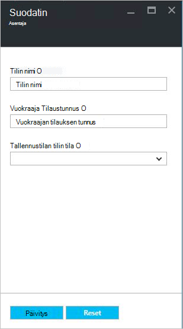

<properties
    pageTitle="Azure-pino tallennustilan tilien hallinta | Microsoft Azure"
    description="Opettele Etsi hallitsemaan, palauttaminen ja vapauttaa Azure pinon tallennustilan tilit"
    services="azure-stack"
    documentationCenter=""
    authors="AniAnirudh"
    manager="darmour"
    editor=""/>

<tags
    ms.service="azure-stack"
    ms.workload="na"
    ms.tgt_pltfrm="na"
    ms.devlang="na"
    ms.topic="get-started-article"
    ms.date="09/26/2016"
    ms.author="anirudha"/>

# <a name="manage-storage-accounts-in-azure-stack"></a>Azure Pinotut tilien tallennustilan hallinta

Opi hallitsemaan tallennustilan tilit Azure Pinotut etsiä, palauttaminen ja vapauttaa tallennustilaa yrityksesi tarpeiden perusteella.

## <a name="find-a-storage-account"></a>Etsi tallennustilan-tili

Alueen tallennustilan tililuettelon voi tarkastella Azure Pinotut mukaan:

1.  Siirry internet-selaimen [https://portal.azurestack.local](https://portal.azurestack.local/).

2.  Kirjautuminen Azure pino-portaaliin järjestelmänvalvojana (joko tunnistetietoja voit käyttöönoton aikana)

3.  Etsi oletusarvoisen – koontinäytön **alueen hallinta** luettelossa ja valitse sitten haluat tarkastella – esimerkiksi alueen **(paikallinen**).

    

4.  Valitse **tallennustilan** **Resurssin palvelut** -luettelosta.

    

5.  Nyt tallennustilan resurssin palvelun järjestelmänvalvoja – sivu Siirry kohtaan "tallennustilan asiakkaat-välilehdessä ja napsauttamalla sitä.

    
    
    Tuloksena oleva sivu on alueella olevat tallennustilan tililuettelon.

    

Ensimmäiset 10 tilit näkyvät oletusarvon mukaan. Voit noutaa Lisää valitsemalla "Lisää ladata" linkki luettelon alareunassa <br>
TAI <br>
Jos olet kiinnostunut tietyn tallennustilan tili – voit **suodattaa ja noutaa asianmukaiset tilit** vain.<br>

Jos haluat suodattaa tilejä:

1. Valitse sivu yläreunassa suodatin-painike.

2. Valitse suodatin-sivu sen avulla voit määrittää **tilin nimi**,  **Tilaustunnus** tai **tila** voit hienosäätää tallennustilan tilien luettelo näytetään. Käyttää niitä tarvittaessa.

3. Valitse Päivitä. Luettelon Päivitä vastaavasti.

    

4. Voit palauttaa suodattimen – napsauttamalla suodatinpainiketta, Tyhjennä valinnat ja Päivitä.

Etsi-tekstiruudussa ylälaidassa tallennustilan tilien luettelo-sivu, voit korostaa valitun tekstin tilit-luettelossa. Tämä on todella käteviä kirjoitusmuotoon, kun koko nimi tai tunnus ei ole helposti käytettävissä.<br>
Voit tähän tekstimuotoinen auttavat sinua löytämään kiinnostavan tili.


## <a name="look-at-account-details"></a>Tarkista tilitiedot

Kun olet löytänyt tarkasteleminen kiinnostavan tilit, voit valita tietyn tili, jota haluat tarkastella tiettyjä tietoja. Uusi sivu avautuu tilitiedot kuten tyypin asiakas-, luontiaikaa, sijainnin jne.


## <a name="recover-a-deleted-account"></a>Palauta poistettu tili

Voit tarkastella tilanteessa, jossa haluat palauttaa poistetun tili.<br>
AzureStack on kuvattu yksinkertainen voi tehdä.

1.  Siirry selaamalla tallennustilan asiakkaat-luettelossa. [Katso tallennustilan tilin etsiminen](#find-a-storage-account)

2.  Etsi tietty tilin luettelosta. Voit joutua suodattamiseen.

3.  Tarkista 'osavaltio-tilin. Pitäisi näkyä versionumeron "poistettu".

4.  Valitse tili, jota tilin tiedot-sivu avautuu.

5.  Tämä sivu – päälle Etsi "Palauta"-painiketta ja napsauta sitä.

6.  Vahvista painamalla "Kyllä"

    

7.  Palautus on nyt prosessin... Odota tieto siitä, että se onnistui.
    Voit myös napsauttaa edistymisen merkintöjen tarkasteleminen portaalin ylälaidassa "sanan kukka"-kuvaketta.

    

  Palautetun tili on synkronoitu, kun jokin palata käyttämään sitä.

### <a name="some-gotchas"></a>Jotkin kompastuskiviä

- Poistettu tili näkyy tilan "ulos säilytys".

  Tämä tarkoittaa, että poistettu tili on ylittänyt säilytysaika ja ei välttämättä voi palauttaa enää.

- Poistetun tilisi ei näy tilit-luettelossa.

  Tämä saattaa tarkoittaa, että poistettu tili on jo muistista. Tässä tapauksessa ei voi palauttaa sitä enää. Noudata seuraavia ohjeita "vapauttaa kapasiteetin".

## <a name="set-retention-period"></a>Määritä säilytysaika

Säilytysaika-asetuksesta avulla voit määrittää ajan (0 – 9999 päivää) päivän aikana poistettujen tilien mahdollisesti voidaan palauttaa järjestelmänvalvoja. Oletus-säilytysaika on määritetty 15 päivää. Jos arvoksi asetetaan "0" tarkoittaa, että poistetut tilien päivitetään välittömästi säilytys ulos, ja merkitä säännöllisiä muistista.

Jos haluat muuttaa säilytysaika –

1.  Siirry internet-selaimen [https://portal.azurestack.local](https://portal.azurestack.local/).

2.  Kirjautuminen Azure pino-portaaliin järjestelmänvalvojana (joko tunnistetietoja voit käyttöönoton aikana)

3.  Etsi oletusarvoisen – koontinäytön **alueen hallinta** luettelossa ja valitse sitten haluat tarkastella – esimerkiksi alueen **(paikallinen**).

4.  Valitse **tallennustilan** **Resurssin palvelut** -luettelosta.

5.  Valitse asetukset-kuvake päällimmäisenä Avaa asetukset-sivu.

6.  Valitse määritys - säilytysaika.

7.  Voit muokata arvo ja tallenna se.

 Tämä arvo voimassa heti ja vastaavat koko alueen yli.


## <a name="reclaim-capacity"></a>Vapauta kapasiteetti

Yksi puoli tehosteita ottaa säilytysaika on poistettu tili säilyvät tarjoaman kapasiteettia, kunnes on säilytysaika ulos. Nyt järjestelmänvalvojana voit joutua vapauttaa tämä tapa poistaa tilejä tilaa vaikka säilytysaika ei ole vielä päättynyt. Tällä hetkellä voit ohittaa erikseen säilytysaika ja vapauttaa heti kapasiteetti cmdline. Voit tehdä –

1.  Jos olet PowerShellin Azure asentanut ja määrittänyt. Jos et noudata sitten ohjeita: Asenna uusin versio PowerShellin Azure ja liittää sen Azure-tilaus on ohjeaiheessa [asentaminen ja määrittäminen PowerShellin Azure](http://azure.microsoft.com/documentation/articles/powershell-install-configure/).
    Lisätietoja Azure resurssien hallinnan cmdlet-komennot artikkelissa [Azure PowerShellin Azure resurssien hallinta](http://go.microsoft.com/fwlink/?LinkId=394767)

2.  Suorita tämä cmdlet-komento:

    ```
    PS C:\\>; Clear-ACSStorageAccount -ResourceGroupName system
    -FarmName <your farmname>
    ```

> Lisätietoja Lue [AzureStack powershell-asiakirjat](https://msdn.microsoft.com/library/mt637964.aspx)

> [AZURE.NOTE] Käynnissä cmdlet poistaa tilin ja sen sisällön pysyvästi. Se voi palauttaa. Käytä varoen.

