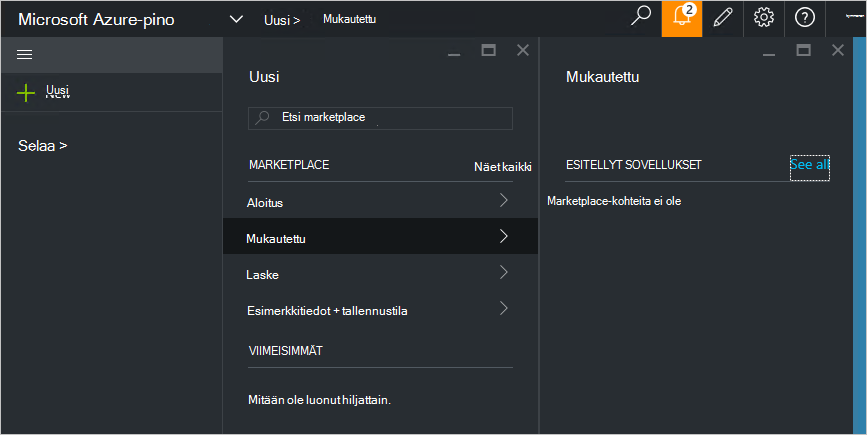

<properties
    pageTitle="Julkaista mukautetun marketplace-osan Azure Pinotut (palvelun järjestelmänvalvoja) | Microsoft Azure"
    description="Palvelun järjestelmänvalvoja opit julkaisemaan mukautetun marketplace-kohteen Azure Pinotut."
    services="azure-stack"
    documentationCenter=""
    authors="rupisure"
    manager="byronr"
    editor=""/>

<tags
    ms.service="azure-stack"
    ms.workload="na"
    ms.tgt_pltfrm="na"
    ms.devlang="na"
    ms.topic="article"
    ms.date="09/26/2016"
    ms.author="rupisure"/>

# Pinotut Azure Marketplacesta

On Marketplace on kokoelma kohteiden mukautetut Azure pinon, kuten services, sovellusten ja resursseja. Mistä alihallinnat, jotka tulee Luo uudet resurssit ja otetaan käyttöön uusi sovellusten sijainti on. Palvelun järjestelmänvalvojat voivat lisätä mukautetun kohteet Marketplace ja alihallinnat tarkastella niitä saman tien.

Voit avata Marketplace valitsemalla **Uusi**.

On Marketplace päivitetään viiden minuutin välein.

## Marketplace-kohteet

Marketplace jokaisella kohteella:

-   Azure Resurssienhallinta-mallin resurssin valmisteluun

-   Metatietoja, kuten merkkijonojen ja muut markkinoinnin oheismateriaali kuvakkeet

-   Muotoilu näyttää kohteen portaalissa tiedot

Jokaisen kohteen julkaistu on Marketplace käyttää Azure-valikoimassa (azpkg)-paketti-muotoon. Käyttöönoton tai runtime resurssit (esimerkiksi koodi-ohjelmistoa tai virtuaalikoneen kuvia zip-tiedostot) lisätään Azure pinon erikseen Marketplace-kohteen osana. 

## Seuraavat vaiheet

[Luoda ja julkaista marketplace-kohde](azure-stack-create-and-publish-marketplace-item.md)
