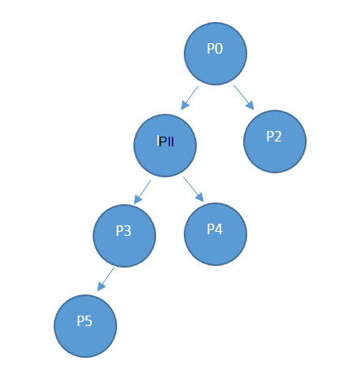

<properties
    pageTitle="Palvelun resurssien käyttö API | Microsoft Azure"
    description="Viittauksen resurssien käyttö API, joka noutaa Azure pinon käyttötiedot."
    services="azure-stack"
    documentationCenter=""
    authors="AlfredoPizzirani"
    manager="byronr"
    editor=""/>

<tags
    ms.service="azure-stack"
    ms.workload="na"
    ms.tgt_pltfrm="na"
    ms.devlang="na"
    ms.topic="article"
    ms.date="10/18/2016"
    ms.author="alfredop"/>

# Palvelun resurssien käyttö Ohjelmointirajapinta

Termin palveluntarjoajan koskee palvelun järjestelmänvalvoja ja minkä tahansa valtuutetun tarjoajat. Palvelun Järjestelmänvalvojat ja valtuutetun tarjoajat voivat käyttää palvelun käyttö Ohjelmointirajapinnan Tarkastele hänen suoraan alihallinnat käyttö. Esimerkiksi P0 soittaa tarjoajan Ohjelmointirajapinnan käyttö on artikkelissa käyttäjän P1 ja P2 on suora käyttö ja P1 soittaa käyttö tietojen P3 ja P4.

## API puhelun viittaus

### Pyyntö

Pyynnön saa kulutus tiedot pyydetty tilaukset ja pyydetty aikaväli. Ei pyynnön tekstiosaa.

Tämä käyttö Ohjelmointirajapinnan on toimittaja-Ohjelmointirajapinta, joten soittajan täytyy olla vastaanotto palveluntarjoajan tilauksen omistaja, osallistujan tai lukijan rooli.

| **Menetelmä**  | **Pyynnön URI** |
| ------------ | ------------------------------------------------------------------------------------------------------------------------------------------------------------------------------------------------------------------------------------------------------------------------------------------------------ |
|  HAE        | https://{armendpoint}/subscriptions/{subId}/providers/Microsoft.Commerce/subscriberUsageAggregates?reportedStartTime={reportedStartTime}&reportedEndTime={reportedEndTime}&aggregationGranularity={granularity}&subscriberId={sub1.1}&api-version=2015-06-01-preview&continuationToken={token-value} |

### Argumentit

| **Argumentti**              | **Kuvaus** |
| -------------------------- | --------------------------------------------------------------------------------------------------------------------------------------------------------------------------------------------------------------------------------------------------------------------------------------------------------------------------------------------------------- |
| *armendpoint*             | Azure-pino ympäristön Azure Resurssienhallinta päätepiste. Azure pinon-konferenssi on, että KÄDESSÄ päätepisteen nimi on muodossa https://api. {toimialuenimen} ". Esimerkiksi jos toimialuenimi on azurestack.local, valitse ARM-päätepiste on https://api.azurestack.local. |
| *subId*                   | Tilauksen tunnus käyttäjälle, joka on soittaa. |
| *reportedStartTime*       | Kyselyn aloitusaika. *DateTime* -arvo on oltava UTC- ja tunti, esimerkiksi 13:00 alussa. Aseta arvoksi päivittäinen kooste keskiyöhön UTC-aika. Muoto on *ohitettuja* ISO 8601, esimerkiksi 2015-06-16T18 % 3a53 % 3a11 % 2b00 % 3a00Z, jossa kaksoispiste on ohitettuja 3 % a ja plus on ohitettuja % 2 b siten, että se on URI helpossa muodossa. |
| *reportedEndTime*         | Kyselyn päättymisaika. Rajoitukset, jotka koskevat *reportedStartTime* koskevat myös tätä argumenttia. *ReportedEndTime* arvo ei voi olla tulevaisuudessa. |
| *aggregationGranularity*  | Valinnainen parametri, joka on erillinen mahdolliset arvoista: päivittäin ja kerran tunnissa. Arvot Ehdota jokin palauttaa tiedot päivittäinen rakeisuuden ja toinen on tunnin välein tarkkuus. Päivittäinen-vaihtoehto on oletusarvo. |
| *subscriberId*            | Tilauksen tunnus. Saat suodatetut tiedot suoraan vuokraajan tarjoajan Tilaustunnus tarvitaan. Jos ei tilauksen tunnus-parametria ei määritetä, puhelun palauttaa kaikki toimittajat suoraan alihallinnat käyttötiedot. |
| *API-versio*             | Protokolla, jota käytetään liittoutumispalvelimien pyyntö versio. Sinun on käytettävä 2015-06-01 – esikatselu. |
| *continuationToken*       | Tunnuksen haetaan viimeksi puhelun käyttö API-palvelulle. Tämä on tarpeen, kun vastauksen on suurempi kuin 1 000 rivit. Tämä on käynnissä kirjanmerkin. Jos niitä ei ole tietoja haetaan päivän alusta tai välitetty tunti, rakeisuuden perusteella. |

### Vastaus

HAE /subscriptions/sub1/providers/Microsoft.Commerce/subscriberUsageAggregates?reportedStartTime=reportedStartTime=2014-05-01T00%3a00%3a00%2b00%3a00 & reportedEndTime = 2015-06-01T00 % 3a00 % 3a00 % 2b00 % 3a00 & aggregationGranularity = päivittäin & subscriberId = sub1.1 & api-version = 1.0

{

"arvo":\[

{

"tunnus": "/subscriptions/sub1.1/providers/Microsoft.Commerce/UsageAggregate/sub1.1-

meterID1 ",

"nimi": "sub1.1-meterID1"

"tyyppi": "Microsoft.Commerce/UsageAggregate"

"ominaisuudet": {}

"subscriptionId": "sub1.1"

"usageStartTime": "2015-03-03T00:00:00 + 00:00",

"usageEndTime": "2015-03-04T00:00:00 + 00:00",

"instanceData": "{\\" Microsoft.Resources\\": {\\" resourceUri\\":\\" resourceUri1\\",\\"sijainti\\

":\\" Alaskan\\",\\" tunnisteet\\": null-\\" additionalInfo\\": null}}",

"määrä":2.4000000000

"meterId": "meterID1"

}

},

…

### Vastauksen tiedot

| **Argumentti**       | **Kuvaus**
| ------------------ | ------------------------------------------------------------------------------------------------------------- |
| *tunnus*               | Käyttö koosteen yksilöivä tunnus
| *Nimi*             | Käyttö koosteen nimi
| *tyyppi*             | Resurssin määritys
| *subscriptionId*   | Azure-pino käyttäjän tilauksen tunnus
| *usageStartTime*   | UTC-aika aloitusaika, johon tämä käyttö kooste kuuluu käyttö aikajakson
| *usageEndTime*     | Käyttö aikajakson, johon tämä käyttö kooste kuuluu päättymisaika UTC-aika
| *instanceData*     | Avain-arvo-pareina esiintymän tiedot (toisessa muodossa):  *resourceUri*: täydellinen Resurssitunnus, joka sisältää resurssiryhmät ja esiintymänimi   *sijainti*: alue, johon tämä palvelu on suoritettu   *tunnisteet*: resurssien tunnisteita, jotka käyttäjän määrittämän   *additionalInfo*: Lisää tiedot resurssista kulutettu, esimerkiksi käyttöjärjestelmän versio tai kuvan tyyppi |
| *määrä*         | Resurssin kulutus tähän aikaväli on tapahtunut määrä |
| *meterId*          | Yksilöllinen tunnus, joka on resurssin kulutettu (myös nimellä, *ResourceID*) |

## Seuraavat vaiheet

[Vuokraajan resurssien käyttö API-viittaus](azure-stack-tenant-resource-usage-api.md)

[Käyttö liittyvät usein kysytyt kysymykset](azure-stack-usage-related-faq.md)
