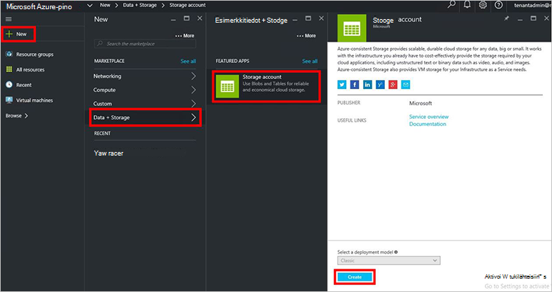
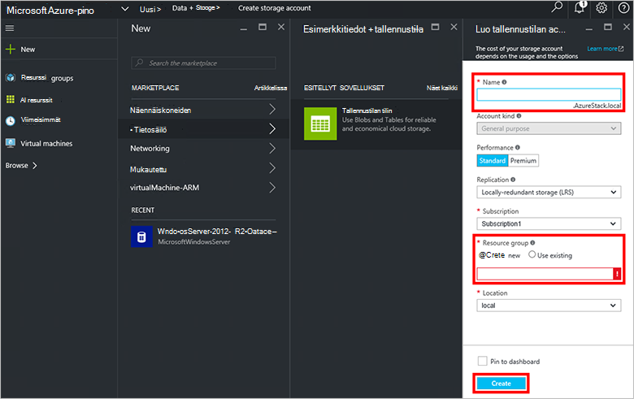
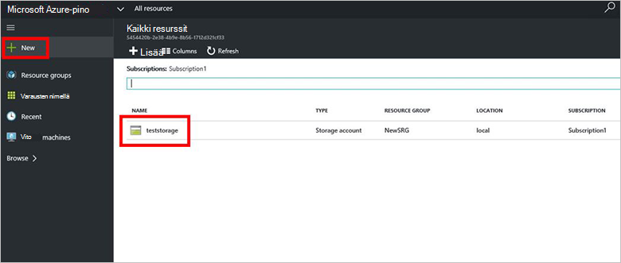

<properties
    pageTitle="Tallennustilan tilit Azure Pinotut | Microsoft Azure"
    description="Lue, miten voit luoda Azure pinon tallennustilan tilin."
    services="azure-stack"
    documentationCenter=""
    authors="ErikjeMS"
    manager="byronr"
    editor=""/>

<tags
    ms.service="azure-stack"
    ms.workload="na"
    ms.tgt_pltfrm="na"
    ms.devlang="na"
    ms.topic="get-started-article"
    ms.date="09/26/2016"
    ms.author="erikje"/>

# Tallennustilan tilit Azure Pinotut

Tallennustilan tilit ovat Blob-ja taulukon ja tallennustilaa tieto-objektit yksilöllinen nimitilaa. Oletusarvon mukaan-tilisi tiedot ovat voi käyttää tallennustilan tilin omistajan.

1.  Azure pinon Käsitteiden tietokoneessa ja kirjaudu sisään `https://portal.azurestack.local` - [järjestelmänvalvoja](azure-stack-connect-azure-stack.md#log-in-as-a-service-administrator)ja valitse sitten **Uusi** > **tietojen + tallennustilan** > **tallennustilan tilin**.

    

2.  Kirjoita **Luo tallennustilan tili** -sivu-tallennustilan tilin. Luo uusi **Resurssiryhmä**, tai valitse aiemmin luotu ja valitse sitten **Luo** tallennustilan-tilin luominen.

    

3. Tilin tallennustilan näkyviin **kaikki resurssit**, ja valitse Etsi tallennustilan tilin ja napsauttamalla sen nimeä.

    
    
## Seuraavat vaiheet

[Azure Resurssienhallinta mallien käyttäminen](azure-stack-arm-templates.md)

[Lisätietoja Azure tallennustilan tilit](../storage/storage-create-storage-account.md)

[Lataa opas Azure pinon Azure yhdenmukaisia tallennustilan vahvistus](http://aka.ms/azurestacktp1doc)
