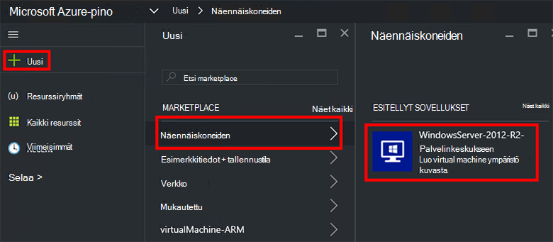
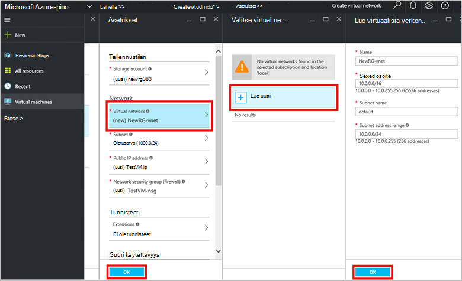
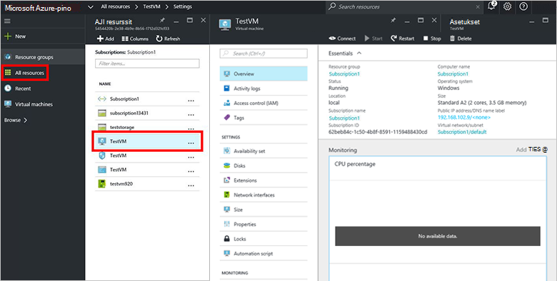

<properties
    pageTitle="Valmistele AM Azure Pinotut (Alihallinta) | Microsoft Azure"
    description="Kuin alihallinnan Katso lisätietoja valmistella AM Azure Pinotut."
    services="azure-stack"
    documentationCenter=""
    authors="ErikjeMS"
    manager="byronr"
    editor=""/>

<tags
    ms.service="azure-stack"
    ms.workload="na"
    ms.tgt_pltfrm="na"
    ms.devlang="na"
    ms.topic="get-started-article"
    ms.date="10/12/2016"
    ms.author="erikje"/>

# Valmistele virtual machine

Järjestelmänvalvojana voit luoda näennäiskoneiden arvioida ennen niiden tarjoaminen palvelupakettien resurssit.

## Valmistele virtual machine

1.  Azure pinon Käsitteiden tietokoneessa ja kirjaudu sisään `https://portal.azurestack.local` - [järjestelmänvalvoja](azure-stack-connect-azure-stack.md#log-in-as-a-service-administrator)ja valitse sitten **Uusi** > **näennäiskoneiden** > **WindowsServer-2012-R2-Palvelinkeskukseen**.  

    

2.  Kirjoita **nimi**, **käyttäjänimi**ja **salasana** **Perustiedot** -sivu. **AM levyn tyyppi:**Valitse **Kiintolevylle**. Valitse **tilaus**. Luoda **resurssiryhmä**, tai valitse aiemmin luotu ja valitse sitten **OK**.  

3.  Valitse **Valitse koko** -sivu **A1 Basic**ja valitse sitten **Valitse**.  

4.  Valitse **asetukset** -sivu **Virtual verkkoon**. Valitse **Luo uusi** **Valitse virtual verkko** -sivu. **Luo virtuaalisia verkko** -sivu, valitse Hyväksy kaikki oletusarvot ja valitse **OK**. Valitse **asetukset** -sivu valitsemalla **OK**.

    

5.  Valitse **OK** , jos haluat luoda virtuaalikoneen **Yhteenveto** -sivu.  

6. Uusi virtuaalikoneen näkyviin **kaikki resurssit**, ja valitse Etsi virtuaalikoneen ja napsauttamalla sen nimeä.

    

## Seuraavat vaiheet

[Tallennustilan tilit](azure-stack-provision-storage-account.md)
