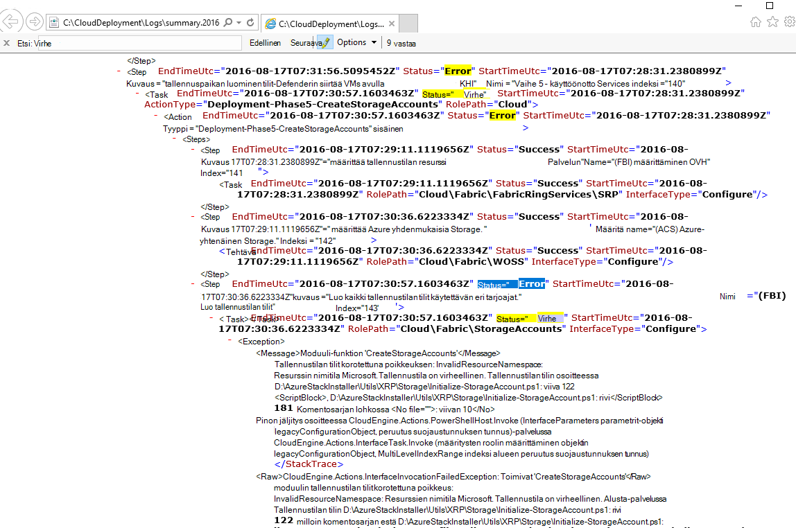
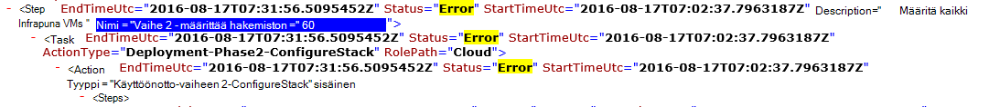

<properties
    pageTitle="Suorita käyttöönoton epäonnistui vaiheesta | Microsoft Azure"
    description="Jos virhe toistuu käyttöönoton aikana, voit yrittää uudelleen-kohtaa, johon se ei onnistunut käyttöönotto seuraavasti."
    services="azure-stack"
    documentationCenter=""
    authors="ErikjeMS"
    manager="byronr"
    editor=""/>

<tags
    ms.service="azure-stack"
    ms.workload="na"
    ms.tgt_pltfrm="na"
    ms.devlang="na"
    ms.topic="get-started-article"
    ms.date="09/26/2016"
    ms.author="erikje"/>
    
# Suorita epäonnistui vaiheesta käyttöönotto
  
Jos virhe toistuu käyttöönoton aikana, voit yrittää uudelleen-kohtaa, johon se ei onnistunut käyttöönotto seuraavasti.

## Etsi virheen

Ota Huomautus virheen, erityisesti osa, joka soittaa mihin vaiheessa kutsu epäonnistui. Esimerkiksi

**2016-08-17 00:30:57 virhe 1 > 1 > toiminto: kutsu vaiheen 60.140.143 epäonnistui. Pysäytetään toimintasuunnitelma kutsu.**

Tämä on käyttöönoton vaihe, jossa käynnistät käyttöönoton Suorita.

## Etsi tarkemmin virheestä

Jos haluat lisätietoja virheestä, Etsi liittyvän **Yhteenveto. YYYY-MM-DD.tt.N.log.xml** -**C:\CloudDeployment\Logs\* * kansio.
Etsi merkkijonon "Virhe", ja sen perään alaspäin – tulos kunnes näet on muu kuin XML muotoiltu teksti (Tässä osassa usein merkittävintä merkkijonon "Virhe" viimeisen esiintymän) virhesanoma paljon. Esimerkki:

Näiden tietojen avulla voit seurata Suorita vaihe, seuranta-hakemisto"numerot, että viimeksi virheestä. Yllä olevassa kuvassa, näet (alkaen alhaalta): 143, 140 ja sitten Jos vierittäminen, näet 60:

Laajennettujen kaikki yhdessä (nyt ylhäältä alas), saat 60.140.143, aivan kuten PS konsolin tulosteen virheen (joka näkyy "Virhe Etsi"-kohta).

## Suorita tietyn vaiheessa käyttöönotto

Nyt kun olet luonut vaihetta, jonka käyttöönotto epäonnistui, voit yrittää-vaiheessa käyttöönoton Suorita.

> [AZURE.IMPORTANT] Oikea käyttäjän kontekstissa kanssa on tapahtunut virhe on suoritettava seuraavat komennot. Jos virhe ennen isäntä on liitetty toimialueeseen, suorita seuraavat toimet paikallisen järjestelmänvalvojatili. Jos virhe, kun isäntä on liitetty toimialueeseen, suorita seuraavat toimet toimialueen järjestelmänvalvojana (azurestack\azurestackadmin).

### Käynnistä EceAction-komennon suorittaminen

1. Laajennettuja PS-konsolin tuo seuraavat moduulit:

        Import-Module C:\CloudDeployment\CloudDeployment.psd1 -Force
        Import-Module C:\CloudDeployment\ECEngine\EnterpriseCloudEngine.psd1 -Force 

2. Suorita seuraava komento (Esimerkki yläpuolelta käytetty tähän):

        Invoke-EceAction -RolePath Cloud -ActionType Deployment -Start 60.140.143 -Verbose

3.  Tämä aloittaa tunnistaa vaiheesta käyttöönotto-käynnistysparametri Käynnistä EceAction-komennon avulla

### Tulokset-Suorita/alkuun.

Riippumatta siitä, kuinka voit valita, käyttöönotto alkaa uudelleen Aloita määritetystä - parametrin.

1.  Jos virheen on palautettavissa, käyttöönoton säilyvät valmistumiseen.

2.  Jos asennus epäonnistuu uudelleen...
    
    - samassa paikassa: virheen ei todennäköisesti ole palautettavissa ja edelleen tutkimuksen tarvitaan.

    - sen jälkeen, jos se ei tällä hetkellä uusi sijainti: Voit yrittää hankkiminen siirtyä uudelleen samaan seuraavasti.

    - ennen kuin jos se ei tällä hetkellä uusi sijainti: muita järjestelmässä tapahtui virhe idempotent-puheluun, jossa pyydetään edelleen tutkimuksen.

## Seuraavat vaiheet

[Yhteyden muodostaminen Azure pino](azure-stack-connect-azure-stack.md)

