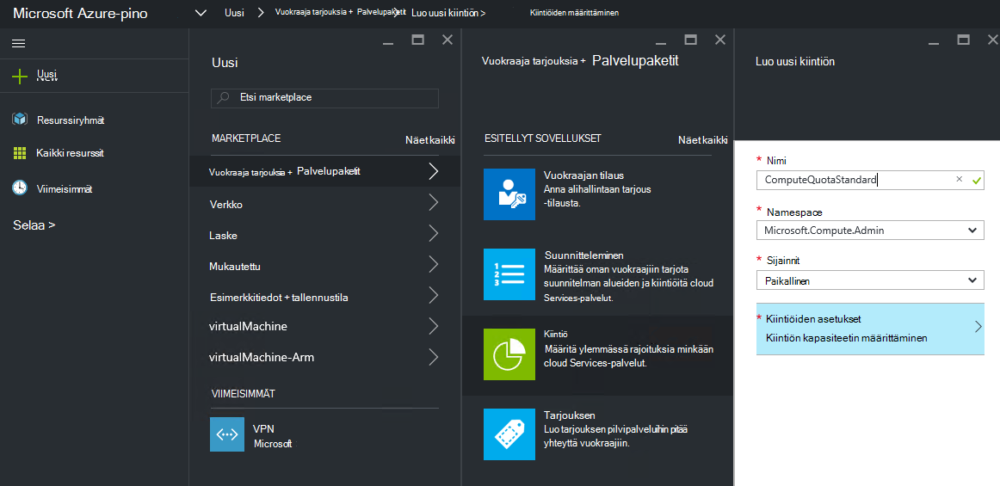
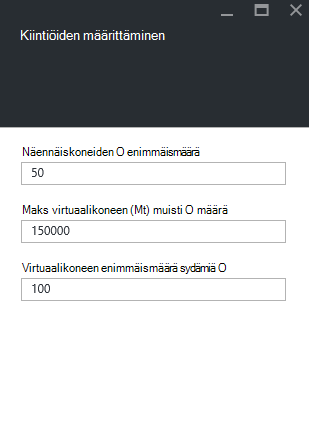

<properties
    pageTitle="Kiintiön Azure Pinotut | Microsoft Azure"
    description="Järjestelmänvalvojien määrittää kiintiön rajoittaa resurssien avulla alihallinnat, jotka on pääsy enimmäismäärän."
    services="azure-stack"
    documentationCenter=""
    authors="mattmcg"
    manager="byronr"
    editor=""/>

<tags
    ms.service="azure-stack"
    ms.workload="na"
    ms.tgt_pltfrm="na"
    ms.devlang="na"
    ms.topic="get-started-article"
    ms.date="09/26/2016"
    ms.author="mattmcg"/>

# Azure Pinotut kiintiöiden määrittäminen

Kiintiöiden määrittäminen resursseja, vuokraajan tilauksen voit valmistella tai tarjoaman rajoissa. Esimerkiksi kiintiön jotta vuokraajan viisi VMs luomiseen. Voit lisätä palvelun suunnitelma, järjestelmänvalvojan on määritettävä palvelun kiintiön asetusten.

Kiintiöt ovat määritettävissä sijainti-järjestelmänvalvojat voivat antaa resurssin kulutus hajautetun hallintaoikeutta ottaminen käyttöön ja palvelua kohden. Järjestelmänvalvojat voivat luoda vähintään yhden kiintiötä resurssit ja toisiinsa suunnitelmat, mikä tarkoittaa, he voivat kirjoittaa eriteltyjen tarjouksia niiden palveluiden. Tietyn palvelun kiintiön voidaan luoda palvelun **Resurssin tarjoajaan** hallinta-sivu.

Alihallintaa, johon tilaa, joka sisältää useita suunnitelmien tarjouksen käyttää kaikille resursseille, jotka ovat käytettävissä kunkin suunnitelma.

## Voit luoda IaaS-kiintiön

1.  Siirry selaimella, [https://portal.azurestack.local](https://portal.azurestack.local/).

    Kirjaudu Azure pino-portaaliin järjestelmänvalvojana (käyttämällä tunnistetiedot, jonka ilmoitit käyttöönoton aikana).

2.  Valitse **Uusi**ja valitse sitten **Kiintiö**.

3.  Valitse ensimmäinen palvelu, johon haluat luoda kiintiön. IaaS-kiintiö suorittaminen, verkon ja tallennustilaa tukipalvelujen seuraavasti:
Tässä esimerkissä on luotava kiintiön Laske-palvelun. Valitse **Microsoft.Compute.Admin** nimitilan **Namespace** -luettelosta.

    > 

4.  Valitse sijainti, jossa kiintiö on määritetty (esimerkiksi paikalliset").

5.  **Kiintiöiden asetukset** -kohdan lukee **kiintiön kapasiteetin määrittäminen**. Valitse tämä vaihtoehto, jos kiintiö-asetusten määrittämiseen.

6.  Näet kaikkien, jossa voit määrittää rajoitukset Laske resurssien **Määrittäminen kiintiön** -sivu. Kullakin virhelajilla on oletusarvo, joka on liitetty. Voit muuttaa näitä arvoja tai voit valita hyväksy oletusarvot sivu alaosassa **Ok** -painiketta.

    > 

7.  Kun olet määrittänyt arvot ja valinnut **Ok**, **Kiintiöiden asetukset** kohteen näkyy **määritetty**. Valitse **Ok** **kiintiön** resurssin luomiseen.

    Näkyy ilmoitus, joka osoittaa, että kiintiön resurssi on luotu.

8.   Kun kiintiön määrittäminen on luotu, näyttöön tulee toisen ilmoituksen. Laske-palvelun kiintiö on nyt valmis yhdistetä suunnitelma. Toista nämä vaiheet verkko- ja -palveluihin ja olet valmis luomaan IaaS suunnitelman!

    >   

## Laske kiintiön tyypit

|**Tyyppi**                    |**Oletusarvo**| **Kuvaus**|
|--------------------------- | ------------------------------------|------------------------------------------------------------------|
|Näennäiskoneiden enimmäismäärä   |50|Tilauksen voi luoda tähän sijaintiin näennäiskoneiden enimmäismäärä. |
|Virtuaalikoneen sydämiä enimmäismäärä              |100|Tilauksen voi luoda tähän sijaintiin sydämiä enimmäismäärä (A3 AM on esimerkiksi neljä sydämiä).|
|Maks virtuaalikoneen muistin (gt) määrä         |150|Enimmäismäärä on valmisteltu megatavua RAM-Muistia (esimerkiksi A1 AM käyttämän 1,75 Gigatavua RAM-Muistia).|

> [AZURE.NOTE] Laske kiintiön ei säilytetä tekninen esikatselu.

## Kiintiön sijainteihin

|**Kohteen**                           |**Oletusarvo**   |**Kuvaus**|
|---------------------------------- |------------------- |-----------------------------------------------------------|
|Suurin mahdollinen (gt)              |500                 |Yhteensä tallennustilaa, joka on käytetty tähän sijaintiin tilauksen mukaan.|
|Tilien tallennustilan kokonaismäärä   |20                  |Tallennustilan tilit tilauksen voi luoda tähän sijaintiin enimmäismäärä.|

## Kiintiön verkkotyypit

|**Kohteen**                                                   |**Oletusarvo**   |**Kuvaus**|
|----------------------------------------------------------| ------------------- |--------------------------------------------------------------------------------------------------------------------------------------------------------------------|
| Maks julkiseen IP-osoitteet                         |50                  |Julkiseen IP-osoitteet, tilauksen voi luoda tähän sijaintiin enimmäismäärä. |
| Maks virtual verkot                   |50                  |Virtuaalinen verkkojen tilauksen voi luoda tähän sijaintiin enimmäismäärä. |
| Maks VPN yhdyskäytävät           |1                   |VPN-yhdyskäytävien (VPN yhdyskäytävät) tilauksen voi luoda tähän sijaintiin enimmäismäärä. |
| Maks-verkkoyhteyksien                |2                   |Verkkoyhteyksien (pisteestä pisteeseen tai sivuston sivuston), joka tilauksen voi luoda eri kaikki VPN-yhdyskäytävät tähän sijaintiin enimmäismäärä. |
| Maks kuormituksen tasoitusmääritykset                     |50                  |Kuormituksen tasoitusmääritykset tilauksen voi luoda tähän sijaintiin enimmäismäärä. |
| Maks NIC                               |100                 |Tilauksen voi luoda tähän sijaintiin verkkoliittymät enimmäismäärä. |
| Maks-verkon käyttöoikeusryhmät            |50                  |Verkon käyttöoikeusryhmät tilauksen voi luoda tähän sijaintiin enimmäismäärä. |
