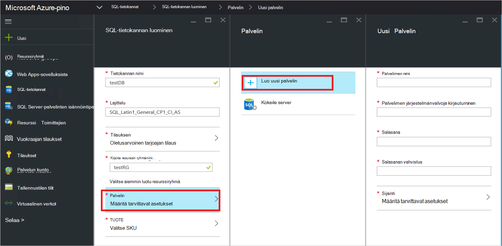

<properties
    pageTitle="Azure pinossa SQL Serverin resurssi-palvelun käyttöön | Microsoft Azure"
    description="Voit ottaa käyttöön SQL Server resurssin tarjoajan sovittimen Azure pinossa toimimalla seuraavasti."
    services="azure-stack"
    documentationCenter=""
    authors="Dumagar"
    manager="byronr"
    editor=""/>

<tags
    ms.service="multiple"
    ms.workload="na"
    ms.tgt_pltfrm="na"
    ms.devlang="na"
    ms.topic="article"
    ms.date="09/26/2016"
    ms.author="dumagar"/>

# SQL Server resurssin tarjoajan sovittimen Azure pinossa käyttöönotto

> [AZURE.NOTE] Seuraavat tiedot koskevat vain Azure pinon TP1 ominaisuuksissa.

Tämän artikkelin avulla voit noudattaa yksityiskohtaiset todiste käsitteiden vahvistamisen Azure pinossa SQL Server resurssin tarjoajan sovittimen määrittäminen. Tutustu Saat lisätietoja resurssin palvelun ominaisuuksia sekä arkkitehtuuri [Käytä SQL-tietokantoja Azure pinossa](azure-stack-sql-rp-deploy-short.md) .

## Määritä vaiheet ennen niiden käyttöönottoa

Ennen kuin otat resurssin tarjoajaan, sinun on:

- On Windows Server oletuskuvan .NET 3.5 kanssa
- Internet Explorer (IE) parannettu suojaus poistaminen käytöstä
- PowerShellin Azure uusimman version asentaminen

### Luo Windows Server, mukaan lukien .NET 3.5 kuva

Jos latasit Azure pinon bittien jälkeen 2/23/2016 koska perus Windows Server 2012 R2 oletuskuva sisältää .NET 3.5 framework tämän ladattavan ja uudempi versio, voit ohittaa tämän vaiheen.

Jos latasit ennen 2/23/2016, sinun on luotava Windows Server 2012 R2 palvelinkeskuksen Näennäiskiintolevyn .NET 3.5 kuvallinen ja määrittäminen on Platform kuva säilössä oletuskuva.

### Internet Explorerin käytöstä parannettu suojaus ja ota käyttöön evästeet

Resurssin palveluntarjoaja ottamaan suoritat PowerShell integroitu komentosarjat ympäristössä (ise:) järjestelmänvalvojana, niin haluat sallia evästeet ja JavaScript Internet Explorer-profiili, jota käytät järjestelmänvalvoja ja käyttäjä Kirjaudu apuohjelmien Azure Active Directory kirjautuminen.

**Jos haluat poistaa käytöstä Internet Explorerin parannettu suojaus:**

1. Azure-pino käsitteiden, (käsitteiden) tietokoneeseen järjestelmänvalvojana AzureStack/sisäänkirjautuminen ja avaa sitten palvelimen hallinta.

2. Poista käytöstä **Internet Explorerin suojaus-parannetun** järjestelmänvalvojia ja käyttäjiä.

3. Kirjaudu sisään järjestelmänvalvojana **ClientVM.AzureStack.local** virtuaalikoneen ja avaa sitten palvelimen hallinta.

4. Poista käytöstä **Internet Explorerin suojaus-parannetun** järjestelmänvalvojia ja käyttäjiä.

**Evästeiden ottaminen käyttöön:**

1. Windowsin aloitusnäyttöön **kaikki sovellukset**, **Windows**-apuohjelmat, **Internet Explorerin**hiiren kakkospainikkeella, valitse **Lisää**ja valitse **Suorita järjestelmänvalvojana**.

2. Jos näyttöön tulee kehote, tarkista **suositeltavaa käyttää suojaus**ja valitse sitten **OK**.

3. Valitse Internet Explorerissa **Työkalut (hammaspyöräkuvake)** &gt; **Internet-asetukset** &gt; **Tietosuoja** -välilehti.

4. **Lisäasetukset**, varmista, että molemmat **Hyväksy** -painikkeet ovat valittuina, valitse **OK**ja valitse sitten **OK** .

5. Sulje Internet Explorer ja Käynnistä PowerShell ise: järjestelmänvalvojana.

### Asenna Azure pinon PowerShellin Azure yhteensopiva julkaisua

1. Poista kaikki olemassa olevat PowerShellin Azure asiakkaan AM.

2. Kirjaudu Azure pinon Käsitteiden koneen AzureStack/järjestelmänvalvojan oikeuksilla.

3. Käytä etätyöpöydän kautta, kirjaudu **ClientVM.AzureStack.local** virtuaalikoneen järjestelmänvalvojana.

4. Avaa Ohjauspaneeli ja valitse **Poista ohjelman asennus** &gt; valitsemalla **PowerShellin Azure** &gt; **Poista asennus**.

5. [Lataa uusimmat PowerShellin Azure-, joka tukee Azure pinoa](http://aka.ms/azstackpsh) ja asenna se.

    Kun olet asentanut PowerShell, voit suorittaa tämän tarkastuksen PowerShell-komentosarjaa varmistaaksesi, että voit muodostaa yhteyden oman Azure pinon esiintymän (Kirjaudu sisään verkkosivulle näkyy).

## Automaattinen resurssin palvelun käyttöönoton PowerShell

1. Azure pinon Käsitteiden etätyöpöydän yhteyden clientVm.AzureStack.Local ja kirjaudu azurestack\\azurestackuser.

2. [Lataa SQLRP binaaritiedostoja](http://aka.ms/massqlrprfrsh) tiedosto. Joudut ehkä poistaa Internet Lataa suojaus estä napsauttamalla Tiedosto- **Ominaisuudet** ja **Yleiset** -välilehden **Salli**jakoviivojen **OK**. Tämä on estää 'Ei voitu ladata tiedoston tai kokoonpanon' poikkeukset DeploymentTelemetry.dll ja myöhempiä jäljitys käyttöönoton poikkeukset liittyvät.

3. Pura D: tiedostot\\SQLRP.

4. Suorita D:\\SQLRP\\Bootstrap.cmd tiedosto järjestelmänvalvojan oikeuksilla (azurestack\\järjestelmänvalvoja).

    Bootstrap.ps1-tiedosto avautuu PowerShell ise:.

5. Kun PowerShell ise:-ikkuna on valmis ladataan, napsauttamalla toista-painiketta tai paina F5-näppäintä.

    

    Kaksi tärkeintä välilehteä ladataan sisältävät komentosarjojen ja tiedostoja, sinun täytyy ottaa käyttöön resurssin toimittaja.

## Valmistele edellytykset

Valitse **Valmistele edellytykset** välilehteä:

- Luo tarvittavat varmenteet
- Lataa palvelutiedot tallennustilan tilin Azure pinossa
- Julkaise valikoima kohteet

### Luo tarvittavat varmenteet
Lisää **Uusi SslCert.ps1** -komentosarja \_. AzureStack.local.pfx SSL-varmenne, D:\\SQLRP\\edellytykset\\BlobStorage\\säilö-kansio. Varmenteen suojaa välisen resurssin tarjoajaan ja paikallisen esiintymä Azure Resurssienhallinta.

1. Valitse **Valmistele edellytykset** pää-välilehden **Uusi SslCert.ps1** -välilehti ja se toimii puhelimessasi.

2. Kirjoita kehote, joka tulee näkyviin, PFX salasanaa, jolla suojaa yksityinen avain ja **Merkitse muistiin tätä salasanaa**. Tarvitset niitä myöhemmin.

### Lataa kaikki palvelutiedot tallennustilan tilin Azure pinossa

1. Valitse **Lataa Microsoft.Sql-RP.ps1** -välilehti ja se toimii puhelimessasi.

2. Kirjoita Windows PowerShellin tunnistetiedon pyynnön-valintaikkunaan Azure pinon palvelun järjestelmänvalvojan tunnistetietoja.

3. Azure Active Directory vuokraajan tunnuksen pyydettäessä Kirjoita Azure Active Directory vuokraajan täydellinen toimialuenimi: esimerkiksi microsoftazurestack.onmicrosoft.com.

    Ponnahdusikkunan pyytää tunnistetietoja.

    

    > [AZURE.TIP] Jos Ponnahdusvalikossa ei näy, voit joko eivät ole poistettu käytöstä Internet Explorerin parannettu suojaus JavaScriptin ottaminen käyttöön tämän tietokoneen ja käyttäjän tai IE evästeitä ole vielä hyväksynyt. Katso [vaiheet ennen niiden käyttöönottoa määrittäminen](#set-up-steps-before-you-deploy).

4. Kirjoita Azure pinon palvelun järjestelmänvalvojan tunnistetietoja ja valitse sitten **Kirjaudu sisään**.

### Julkaise valikoima kohteet myöhemmin resurssin luontia varten

Valitse **Julkaise GalleryPackages.ps1** -välilehti ja se toimii puhelimessasi. Tämä komentosarja lisää kaksi marketplace-kohdetta Azure pinon Käsitteiden portal marketplace, joiden avulla voit ottaa käyttöön tietokannan resurssit marketplace kohteet.

## Resurssin SQL Server-palvelun AM käyttöönotto

Nyt kun olet valmistellut Azure pinon käsitteiden tarvittavat varmenteet ja marketplace kohteita, voit ottaa käyttöön SQL Server-resurssi-palvelu. -Välilehdessä **käyttöön SQL-palvelu** :

   - Anna arvot JSON-tiedostossa, joka viittaa käyttöönottoprosessin
   - Ottaa käyttöön resurssin tarjoajaan
   - Päivitä paikalliset DNS
   - SQL Server resurssin tarjoajan sovittimen rekisteröimistä

### Anna arvot JSON-tiedostossa

Valitse **Microsoft.Sqlprovider.Parameters.JSON**. Tämä tiedosto on Azure Resurssienhallinta-mallin käyttöön oikein Azure pinon korjattava parametreja.

1. Täytä **tyhjään** parametrit JSON-tiedostossa:

    - Varmista, että annat **adminusername** ja **adminpassword** SQL resurssin tarjoajan AM:

        

    - Varmista, että annat salasanan **SetupPfxPassword** parametrille, jonka teit merkille [valmisteleminen prequisites](#prepare-prerequisites) vaihe:

    

2. Valitse **Tallenna** parametri-tiedosto tallennetaan.

### Ottaa käyttöön resurssin tarjoajaan

1. Valitse **Ota käyttöön-Microsoft.sql-provider.PS1** -välilehti ja Suorita komentosarja.
2. Kirjoita nimesi vuokraajan Azure Active Directory pyydettäessä.
3. Ponnahdusikkuna, valitse Lähetä Azure pinon palvelun järjestelmänvalvojan tunnistetietoja.

Koko käyttöönotto voi kestää joitakin erittäin käytetään Azure pinon POCs 25 ja 55 minuutin ajan välillä. Pisimmän vaiheet on haluamasi tilan määrittäminen (DSC)-tunniste ja PowerShell suorittamisen, joka on viimeisessä vaiheessa. Kunkin saattaa kestää 10 – 25 minuuttia.

### Päivitä paikalliset DNS

1. Valitse **Rekisteröi-Microsoft.SQL-fqdn.ps1** -välilehti ja Suorita komentosarja.
2. Azure Active Directory vuokraajan tunnuksen pyydettäessä syötteen Azure Active Directory vuokraajan täydellinen toimialuenimi: esimerkiksi **microsoftazurestack.onmicrosoft.com**.

### Rekisteröi SQL RP resurssin tarjoajaan##

1. Valitse **Rekisteröi-Microsoft.SQL-provider.ps1** -välilehti ja Suorita komentosarja.

2. Kun ohjelma pyytää tunnistetietoja, käytä seuraavia arvoja käyttäjätunnusta ja salasanaa:

   - **sqlRpUsername**
   - **sqlRpPassw0rd**

   > [AZURE.IMPORTANT] Nämä ovat *literaaliarvot, sinun on kirjoitettava tunnistetiedot pyydettäessä* . Ne eivät ole paikkamerkkejä. * *Tee *ei* tyyppi ** username\password, ennen kuin otat AM tallennetaan parametri-tiedosto.

## Tarkista Azure pinon portaalissa käyttöönotto

1. Kirjaudu ulos ClientVM ja kirjaudu sisään uudelleen nimellä **AzureStack\AzureStackUser**.

2. Työpöydällä Valitse **Azure pinon Käsitteiden Portal** ja kirjaudu sisään-portaaliin järjestelmänvalvojana palvelu

3. Varmista, että käyttöönotto onnistui. **Selaa** &gt; **Resurssiryhmien** &gt; valitsemalla käyttämäsi resurssiryhmä (oletusarvo on **SQLRP**), ja varmista, että sivu (yläosassa) essentials-osa lukee **käyttöönoton onnistui**.

      

4. Varmista, että rekisteröinti onnistui. Valitse **Selaa** &gt; **resurssin tarjoajat**ja Etsi **Paikallinen SQL**:

      

## Kapasiteetin tarjota SQL resurssin palveluntarjoajan yhdistämällä isännöintipalvelu SQL Server-palvelimeen

1. Kirjautuminen Azure pinon Käsitteiden-portaaliin palvelun järjestelmänvalvojaksi

2. Valitse **resurssi-palveluntarjoajat** &gt; **SQL paikallisen** &gt; **tarjoajan Resurssienhallinta Siirry** &gt; **palvelinten** &gt; **Lisää**.

    **SQL-isännöinnin palvelimet** -sivu on kohtaa, johon voit muodostaa yhteyden todellinen SQL Server esiintymät, jotka yhteyshenkilönä resurssin kehittäjän Taustajärjestelmä SQL Server resurssi-palvelu.

    

3. Lomakkeen täyttäminen SQL Server-esiintymän yhteystiedot. Oletusarvon mukaan esimääritettyjä SQL Serverin kutsutaan "SQLRP" järjestelmänvalvojan käyttäjänimen "sa- ja salasana, JSON on käynnissä AM parametrit"adminpassword"-parametrin korostettuina.

## Voit testata käyttöönoton ensimmäisen SQL-tietokannan luominen

1. Kirjaudu Azure pinon Käsitteiden portaaliin palvelu.

2. Valitse **Selaa** &gt; **SQL-tietokantoja** &gt; **lisääminen**
  

3. Täytä lomake, jonka tiedot, kuten uusi *virtuaalipalvelin* **Uusi palvelin** -sivu- **Palvelimen nimen**, **Palvelimen järjestelmänvalvojan kirjautuminen**ja **salasana** .

    

    Palvelin on muunto rakennetta. Se ei voi yhdistää itse SQL Server, mutta sen sijaan luettelot kautta käyttäjänimi sisällä yhteysmerkkijonon, joka resurssin tarjoajaan Luo prosessia lopussa. **Huomautus erikseen virtuaalipalvelimen, kirjoita salasana**. Portaalin koskaan näkyy salasana.

4. Ohjelma kysyy, valitse tietokannan hinnoittelu taso.

    

    Tasoa ei ole otettu käyttöön tässä versiossa, mutta niiden kulutus seurataan mukaan Azure Resurssienhallinta voi korostaa eriyttäminen, voit luoda kiintiön käyttäminen jne.

5. Lähettääksesi lomakkeen ja odota, kunnes suorittamiseen käyttöönottoa varten.

6. Huomaa "yhteysmerkkijono-kentän tuloksena oleva sivu. Voit käyttää access SQL Server (esimerkiksi verkkosovellukseen) edellyttävän sovelluksen kyseisen merkkijonon Azure Pinotut.

    

## Seuraavat vaiheet

Kokeile muita [PaaS palvelut](azure-stack-tools-paas-services.md) kuten [MySQL-palvelin resurssin tarjoajaan](azure-stack-mysql-rp-deploy-short.md) ja [verkkosovelluksissa resurssin toimittaja](azure-stack-webapps-deploy.md).
