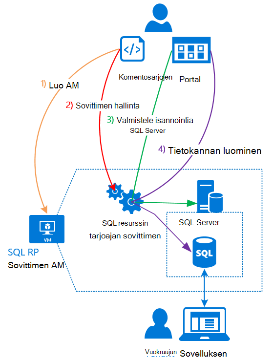

<properties
    pageTitle="SQL-tietokantoja käyttäminen Azure pinon | Microsoft Azure"
    description="Katso, miten voit ottaa SQL-tietokantoja palveluna Azure pinoa ja vaiheittaiset ohjeet käyttöön SQL Server resurssin tarjoajan sovittimen."
    services="azure-stack"
    documentationCenter=""
    authors="Dumagar"
    manager="byronr"
    editor=""/>

<tags
    ms.service="multiple"
    ms.workload="na"
    ms.tgt_pltfrm="na"
    ms.devlang="na"
    ms.topic="article"
    ms.date="09/26/2016"
    ms.author="dumagar"/>

# Käytä SQL-tietokantoja Azure pinossa

> [AZURE.NOTE] Seuraavat tiedot koskevat vain Azure pinon TP1 ominaisuuksissa.

SQL Server resurssin tarjoajan sovittimen avulla voit näyttää SQL-tietokantoja palveluna Azure koko. Kun olet asentanut resurssin tarjoajaan, ja voit luoda tietokantoja cloud alkuperäisessä-sovelluksia, sivustossa, jotka perustuvat SQL ja toiminnoista, jotka perustuvat SQL eikä sinun tarvitse valmistella virtual machine (AM) isännöi SQL Server aina, kun.

Koska resurssi-palvelu ei ole Azure SQL-tietokannan ominaisuuksien käsitteiden vahvistamisen kuitti aikana, tämän artikkelin alussa on yleiskatsaus resurssin tarjoajan arkkitehtuuri. Valitse Saat nopean yleiskuvan resurssin-palvelu [SQL-tietokantaan resurssin toimittaja-sovittimen Azure pinon Käsitteiden käyttöönotto](azure-stack-sql-rp-deploy-long.md)tarkempia ohjeita linkit määrittämisen vaiheita.

## SQL Server resurssin tarjoajan sovittimen arkkitehtuuri
Resurssin tarjoajaan ei voi käyttää kaikkia tietokannan hallintaominaisuuksien Azure SQL-tietokantaan. Esimerkiksi joustavasti tietokannan jakavat ja mahdollisuus valita tietokannan suorituskykyä ylös ja alas suoraan selaimessa eivät ole käytettävissä. Resurssin tarjoajaan kuitenkaan tue saman luominen, luku, päivitys ja poistotoimintoja (CRUD) toimintoja, että käytettävissä Azure SQL-tietokantaan.

Resurssin tarjoajaan koostuu kolmesta osasta:

- **SQL resurssin tarjoajan sovittimen AM**, joka kattaa resurssin tarjoajan prosessi ja SQL Server isännöivät palvelimet.
- **Resurssin palveluntarjoajan itse**, joka käsittelee valmistelu ja määrittää tietokannan resurssit.
- **Palvelimissa, joka isännöi SQL Server**, jotka tarjoavat kapasiteetin tietokantoja.

Seuraavat Käsitekaavio näyttää nämä osat ja ohjeita, kun siirryt kautta, kun resurssi-palvelun käyttöön, joka isännöi SQL Server palvelimen määrittäminen ja luot sitten tietokannan.

## Vaiheittaiset ohjeet ottamaan resurssin tarjoajaan
Jos olet jo aiemmin Azure pinon näiden ohjeiden avulla. Jos haluat lisätietoja, jokaisen osan linkeistä tai siirtyä suoraan [SQL-tietokantaan resurssin toimittaja-sovittimen Azure pinon Käsitteiden käyttöönotto](azure-stack-sql-rp-deploy-long.md).

1.  Varmista, että olet suorittanut kaikki [vaiheet ennen niiden käyttöönottoa määrittäminen](azure-stack-sql-rp-deploy-long.md#set-up-steps-before-you-deploy) resurssien tarjoaja:

  - 3,5 .NET framework on jo määritetty Windows Server kuvaa. (Jos latasit Azure pinon bittien jälkeen 23 helmikuussa 2016, voit ohittaa tämän vaiheen.)
  - [PowerShellin Azure, joka on yhteensopiva Azure pinon versio on asennettu](http://aka.ms/azStackPsh).
  - Valitse Internet Explorerin suojausasetukset ClientVM [Internet Explorerin parannettu suojaus on poistettu käytöstä ja evästeet on otettu](azure-stack-sql-rp-deploy-long.md#Turn-off-IE-enhanced-security-and-enable-cookies)käyttöön.

2. [Lataa SQL Server RP binaaritiedostot tiedosto](http://aka.ms/massqlrprfrsh) ja Pura se Azure-pino Käsitteiden-ClientVM.

3. [Suorita bootstrap.cmd ja komentosarjoja](azure-stack-sql-rp-deploy-long.md#Bootstrap-the-resource-provider-deployment-PowerShell-and-Prepare-for-deployment).

    Komentosarjojen joukko on ryhmitelty kaksi tärkeintä välilehteä Avaa-PowerShell integroitu komentosarjat ympäristössä (ise:). Suorita ladata komentosarjoja järjestyksessä vasemmalta oikealle välilehtien.

    1. Voit suorittaa **Valmistele** -välilehdessä komentosarjoja vasemmalta oikealle:

        - Yleismerkkien varmenteen suojaamiseen resurssin tarjoajaan ja Azure Resurssienhallinta välisen luominen.
        - Lataa varmenteet ja kaikki muut palvelutiedot Azure pinon tallennustilan-tilille.
        - Valikoima-pakettien julkaiseminen niin, että voit ottaa käyttöön SQL- ja resurssien käyttää valikoimaa.

        > [AZURE.IMPORTANT] Jos jokin komentosarjat jumittuu ei jostakin syystä, kun olet lähettänyt Azure Active Directory-vuokraajan, tietoturva-asetukset voivat estää DLL, joka on pakollinen suorittaa käyttöönottoa varten. Voit ratkaista ongelman, Etsi Microsoft.AzureStack.Deployment.Telemetry.Dll resurssin tarjoajan kansiossa, napsauttamalla sitä hiiren kakkospainikkeella, valitse **Ominaisuudet**ja valitse **Yleiset** -välilehdessä **Salli** .

    1. Voit suorittaa **käyttöönotto** -välilehdessä komentosarjoja vasemmalta oikealle:

        - [Ota käyttöön AM](azure-stack-sql-rp-deploy-long.md#Deploy-the-SQL-Server-Resource-Provider-VM) , joka isännöi resurssin tarjoajaan ja SQL Server. Tämä komentosarja viittaa JSON parametrin tiedosto, joka on päivitettävä joitakin arvoilla, ennen kuin suoritat komentosarjan.
        - [Rekisteröi paikallinen DNS-tietue](azure-stack-sql-rp-deploy-long.md#Update-the-local-DNS) , joka yhdistää resurssin palveluntarjoajan AM.
        - [Rekisteröi resurssi-palveluntarjoajan](azure-stack-sql-rp-deploy-long.md#Register-the-SQL-RP-Resource-Provider) kanssa paikallisen Azure Resurssienhallinta.

        > [AZURE.IMPORTANT] Kaikki komentosarjat oletetaan, että käyttöjärjestelmän kuva täyttää edellytykset (.NET 3.5 asennettu, JavaScript ja evästeet käytössä ClientVM ja PowerShellin Azure asennettuna yhteensopiva versio). Jos saat virheitä, kun suoritat komentosarjat, varmista täyty edellytykset.

6. [Yhdistä resurssi-palvelu, joka isännöi SQL Server-palvelimeen](#Provide-capacity-to-your-SQL-Resource-Provider-by-connecting-it-to-a-hosting-SQL-server) Azure pino-portaalissa. Valitsemalla **Selaa** &gt; **resurssin tarjoajat** &gt; **SQLRP** &gt; **tarjoajan Resurssienhallinta Siirry** &gt; **palvelinten** &gt; **Lisää**.

    Käytä "sa-käyttäjänimi ja salasana, joita käytit, kun resurssin tarjoajaan AM on otettu käyttöön.

7. [Testaa palveluntarjoajan uusi SQL Server-resurssin](/azure-stack-sql-rp-deploy-long.md#create-your-first-sql-database-to-test-your-deployment)käyttöön Azure pinon portaalissa SQL-tietokantaan. Valitse **Luo** &gt; **Mukautettu** &gt; **SQL Server-tietokantaan**.

Hanki SQL Server resurssi-palvelun määrittäminen ja suorittamalla: noin 45 minuuttia (mukaan laitteen).
