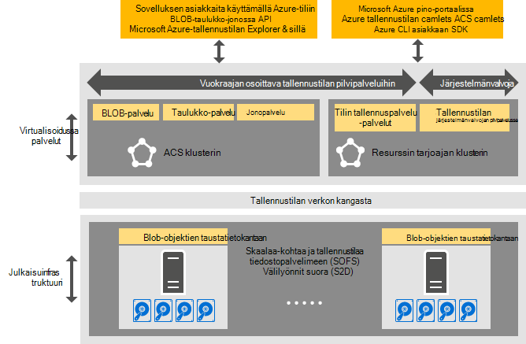

<properties
    pageTitle="Johdanto Azure yhdenmukaisia tallennustilan | Microsoft Azure"
    description="Lisätietoja Azure yhdenmukaisia tallennustila"
    services="azure-stack"
    documentationCenter=""
    authors="AniAnirudh"
    manager="darmour"
    editor=""/>

<tags
    ms.service="azure-stack"
    ms.workload="na"
    ms.tgt_pltfrm="na"
    ms.devlang="na"
    ms.topic="get-started-article"
    ms.date="09/26/2016"
    ms.author="anirudha"/>

# Azure yhdenmukaisia tallennustilan esittely
Azure yhdenmukaisia tallennustila on tallennustilan pilvipalveluihin Microsoft Azure Pinotut joukko. Azure yhdenmukaisia tallennustilan on blob, taulukko tai jonon tilin hallinta-toiminnon kanssa Azure yhdenmukaisia semantiikkaan liittyvien. Toiminnot, jotka tallennustilan palveluiden hallinta cloud-järjestelmänvalvojan Ohje sisältää myös. Tässä artikkelissa esitellään Azure yhdenmukaisia tallennustilan ja tässä artikkelissa kerrotaan, miten tallennustilan pilvipalveluihin Azure-pinon hyvin täydentää monipuolisia [ohjelmisto määrittämät tallennustilan ominaisuuksia Windows Server 2016](https://blogs.technet.microsoft.com/windowsserver/2016/04/14/ten-reasons-youll-love-windows-server-2016-5-software-defined-storage/).

Azure yhdenmukaisia tallennustilan toimittaa toimintoja laaja seuraaviin:

- **BLOB**: BLOB-sivulla estää BLOB-objektit ja BLOB kanssa   [yhdenmukaisen Azure Blob-objektien](https://msdn.microsoft.com/library/azure/dd179355.aspx#Anchor_1) liittäminen
   toiminta

- **Taulukot**: kohteiden, osiot ja muut taulukon ominaisuudet   [Azure yhdenmukaisia](https://msdn.microsoft.com/library/azure/dd179355.aspx#Anchor_3) taulukon
   toiminta

- **Olevien**: luotettava ja pysyvän viestit ja kanssa   [Azure yhdenmukaisia jonossa](https://msdn.microsoft.com/library/azure/dd179355.aspx#Anchor_2) olevien
   toiminta

- **Tilien**: tallennustilan tilin Resurssienhallinta   [Azure yhdenmukaisia](https://azure.microsoft.com/documentation/articles/storage-create-storage-account/) tilillä
   toiminta yleinen tallennustilan tilien valmisteltu kautta [Azure resurssien hallinnan käyttöönottomalli](https://azure.microsoft.com/documentation/articles/resource-manager-deployment-model/)

- **Hallinta**: vuokraajan osoittava ja Azure yhdenmukaisia tallennustilan Sisäinen tallennusväline services (toisiin ohjeaiheisiin kuvatut) hallinnointi

## Azure yhdenmukaisia tallennustilan arkkitehtuuri

Kuva 1. Azure yhdenmukaisia tallennustilan: ratkaisu-näkymä

## Azure yhdenmukaisia tallennustilan virtualisoidussa palvelut ja klustereiden

Azure yhdenmukaisia tallennustilan arkkitehtuurista, valitse kaikki vuokraajan tai järjestelmänvalvoja voi käyttää tallennustilan services ovat virtualisoidussa. Toisin sanoen ne toimivat palvelun tarjoajan hallitut, erittäin käytettävissä VMs perusteella [Hyper-V](https://technet.microsoft.com/library/dn765471.aspx) toimintoja [Windows Server](http://www.microsoft.com/server-cloud/products/windows-server-2016/)2016.
Vaikka VMs ovat käytettävissä [Windows Server-vikasietoklustereihin](https://technet.microsoft.com/library/dn765474.aspx) tekniikkaan perustuva, itse Azure yhdenmukaisia tallennustilan virtualisoidussa-palvelut ovat [Azure palvelun kangasta tekniikkaan](http://azure.microsoft.com/campaigns/service-fabric/)perustuva Vieras liitetty, erittäin käytettävissä services.

Azure yhdenmukaisia tallennustilan käytetään kaksi palvelun kangasta klustereiden Azure pino-yhdistelmäympäristössä.
Tallennustilan resurssin toimittaja-palvelu on otettu käyttöön palvelun kangasta klusteriin ("RP klusterin"), joka jaetaan myös muita foundational resurssi-palveluja. Loput tallennustilaan virtualisoidussa polku tietopalvelujen – kuten Blob, taulukon ja jonon services--isännöidään toisen palvelun kangasta-klusterin ("Azure yhdenmukaisia tallennustilan klusterin").

## BLOB-palveluun ja ohjelmiston määrittämät tallennustila

Palvelun takaisin lopettaa toisaalta-Blob-objektien suoritetaan suoraan [Asteikko-kohtaa tiedostopalvelimeen](https://technet.microsoft.com/library/hh831349.aspx) klusterisolmut. Azure-pino ratkaisu-arkkitehtuuri asteikko-kohtaa tiedostopalvelimeen perustuu [Tallennustilan välilyöntejä suoraan](https://technet.microsoft.com/library/mt126109.aspx)-klusterin perusteella, Jaetut tue. Kuva 1 esittää pää Azure yhdenmukaisia tallennustilan Komponenttipalvelut ja niiden hajautettu käyttöönottomalli. Kaavion huomaamaan, Azure yhdenmukaisia tallennustilan dovetails käsittelevät aiemmin ohjelmiston määrittämät tallennustilan Windows Server 2016. Ilman erityistä laitetta vaaditaan Azure yhdenmukaisia tallennustilan lisäksi Windows Server-ympäristössä näitä vaatimuksia.

## Tallennustilan palvelinfarmin

Tallennustilan palvelinfarmin on kokoelma storage-infrastruktuurin, resursseja ja taustatietokantaan palvelut, joita yhdessä tarjoamiseen vuokraajan osoittava ja järjestelmänvalvojan osoittava Azure yhdenmukaisia tallennustilan Azure pino-yhdistelmäympäristössä. Tarkemmin sanottuna tallennustilan palvelinfarmin sisältää seuraavat:

- Tallennuslaitteet (esimerkiksi asteikko-kohtaa tiedostopalvelimeen solmujen, levyä)

- Tallennustilan kangasta resurssit (esimerkiksi SMB osakkeet)

- Tallennustilan liittyvät palvelun kangasta palveluita (esimerkiksi Blob päätepisteen Azure yhdenmukaisia tallennustilan klusterin käytöstä)

- Tallennustilan liittyvät palvelut, jotka toimivat asteikko-kohtaa tiedostopalvelimeen solmujen (esimerkiksi Blob-palvelu)

## IaaS ja PaaS tallennustilan käyttötapoja

Azure yhdenmukaisia tallennustilan sivun BLOB Azure, kuten määrittää kaikki infrastruktuurin virtual levyjä service (IaaS) käyttö skenaariot:

- Luominen AM mukautetun OS-levyn avulla sivun Blob-objektien

- Luominen AM avulla sivun Blob-objektien mukautetun OS-kuva

- AM luominen Azure Marketplace-kuvan avulla uusi sivu-blob

- Luo AM käyttämällä uusi sivu-blob tyhjä DVD-levyllä

Vastaavasti kuin service (PaaS) skenaarioita ympäristössä, Azure yhdenmukaisia tallennustilan lohko-BLOB-objektit, liittää BLOB-olevien, ja taulukot toimii tavalla kuin Azure-tietokannassa.

## Liiketoiminta-roolien

Azure yhdenmukaisia tallennustila on kaksi liiketoiminta-roolien arvokkaita:

- Sovelluksen omistajat, mukaan lukien kehittäjille ja yrityksen IT. Heillä on enää säilyttää tai ottaa käyttöön sovelluksen ja komentosarjoja, jotka tehdä saman työn julkisen pilvestä ja pitäminen/yksityinen pilvestä joten kaksi versiota. Azure yhdenmukaisia tallennustilan tarjoaa tallennustilan REST API, SDK, cmdlet-komento ja Azure pinon portal kautta.

- Palveluntarjoajien, mukaan lukien yrityksen IT, joka otetaan käyttöön ja hallita Microsoft Azure pinon perusteella, multitenant tallennustilan pilvipalveluihin.

## Seuraavat vaiheet

- [Azure yhdenmukaisia tallennustilan: erot ja huomioon otettavia seikkoja] (azure-pino-acs-erot-tp2.md)
