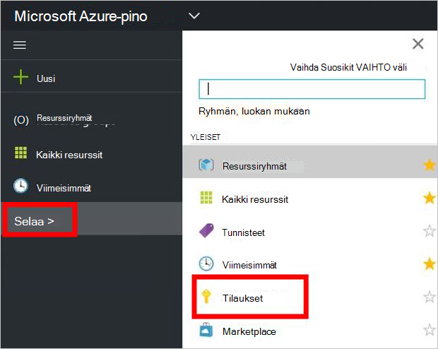

<properties
    pageTitle="Tarjouksen tilata ja valmistella AM Azure Pinotut (Alihallinta) | Microsoft Azure"
    description="Kuin vuokraajan Lue, miten voit tilata tarjouksen ja valmistella Azure Pinotut AM."
    services="azure-stack"
    documentationCenter=""
    authors="ErikjeMS"
    manager="byronr"
    editor=""/>

<tags
    ms.service="azure-stack"
    ms.workload="na"
    ms.tgt_pltfrm="na"
    ms.devlang="na"
    ms.topic="get-started-article"
    ms.date="09/26/2016"
    ms.author="erikje"/>

# Tarjouksen tilaaminen

Nyt kun olet [luonut tarjouksen](azure-stack-create-offer.md), Testaa yhteyttä alihallinnat, jotka voit luoda tilauksen.

1.  Azure pinon Käsitteiden tietokoneessa ja kirjaudu sisään `https://portal.azurestack.local` [Palvelutili](azure-stack-connect-azure-stack.md#log-in-as-a-tenant) nimellä ja valitse **Hae tilauksen**.

    

2.  **Näyttönimi** -kenttään tilauksen nimi, valitse **tarjota**, valitse jokin **Valitse tarjouksen** sivu tarjoukset ja valitse sitten **Luo**.

    

4.  Luomasi tilauksen katselemista valitsemalla **Selaa**, valitse **tilaukset**ja valitse sitten uusi tilaus.  

    

Kun tilaat tarjouksen, Päivitä portaalin nähdäksesi, mitkä palvelut kuuluvat uuteen tilaukseen.

## Seuraavat vaiheet

[Valmistele virtual machine](azure-stack-provision-vm.md)
