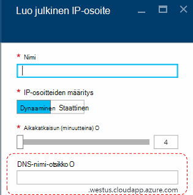
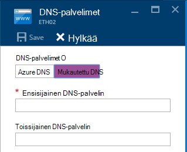
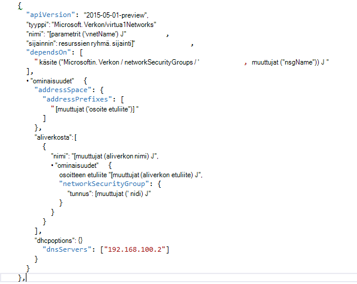

<properties
    pageTitle="Perustietoja DNS-Azure pinon TP2 | Microsoft Azure"
    description="Uusi DNS-ominaisuuksia ja toimintoja Azure pinon TP2-tietoja"
    services="azure-stack"
    documentationCenter=""
    authors="ScottNapolitan"
    manager="darmour"
    editor=""/>

<tags
    ms.service="azure-stack"
    ms.workload="na"
    ms.tgt_pltfrm="na"
    ms.devlang="na"
    ms.topic="get-started-article"
    ms.date="09/26/2016"
    ms.author="scottnap"/>

# Azure-pino for IDN esittely
================================

IDN on uusi ominaisuus, jonka avulla voit selvittää ulkoiseen DNS-nimeä (esimerkiksi http://www.bing.com) Azure-pino tekniikka esikatselu 2.
Voit myös rekisteröidä virtual sisäisen Verkkonimet. Näin voit ratkaista VMs virtual samassa verkossa IP-osoite, etkä kirjoittamatta mukautettu DNS server tapahtumat.

Se on jotakin, mitä aina on jo olemassa Azure, mutta se on nyt käytettävissä Windows Server 2016 ja Azure pinon liian.

Mitä IDN tarkoittaa?
------------------

Azure Pinotut IDN saat seuraavia ominaisuuksia, eikä sinun tarvitse määrittää mukautettuja DNS-palvelinten määritteet.

-   Jaetut DNS nimi tarkkuus palvelut vuokraajan toiminnoista.

-   Tärkeimpien DNS-palvelun nimenselvitys ja DNS rekisteröintijärjestelmän palveltavan virtual verkoston.

-   Internet-nimet vuokraajasta VMs tarkkuuden rekursiivinen DNS-palvelu. Alihallinnat, jotka eivät enää määritettävä mukautettu DNS-tapahtumien Internet nimien (esimerkiksi www.bing.com).

Voit silti tuoda oman DNS ja käyttää mukautettuja DNS-palvelimet, jos haluat. Mutta nyt, jos haluat sallia Internet DNS nimet ja voi yhdistää muiden näennäiskoneiden virtual samassa verkostossa, sinun ei tarvitse määrittää mitään, ja se toimii vain.

Mitä IDN ei tarkoittaa?
---------------------

Mitä IDN avulla voit tehdä on nimi, joka voidaan ratkaista virtual verkon ulkopuolella DNS-tietueen luominen.

Azure-täytyy määrittää DNS-nimi-otsikko, jotka voivat liittyä julkiseen IP-osoite. Voit valita otsikko (etuliite), mutta Azure valitsee jälkiliite, joka perustuu alue, jossa voit luoda julkisen IP-osoite.

Yllä olevan kuvan Azure luodaan "A" DNS nimi otsikko-kohdassa vyöhykkeen **westus.cloudapp.azure.com**on määritetty DNS-tietue. Etuliitteen ja yhdessä jälkiliite kirjoittaa täysin täydellinen toimialuenimi (FQDN), jotka ovat peräisin missä tahansa julkisen Internetissä.

TP2, valitse Azure-pino tukee vain IDN nimenä rekisteröinti niin ei toimi seuraavasti.

-   Aiemmin luodun isännöityä DNS-vyöhyke (esimerkiksi azurestack.local)-kohdassa DNS-tietueen luominen.

-   Luo DNS-vyöhyke (esimerkiksi Contoso.com).

-   Luo tietue omia mukautettuja DNS-vyöhyke-kohdassa.

-   Tuen hankkiminen toimialuenimien.

DNS-Azure pinon TP1 muutokset
-----------------------------------

Azure-pino tekniikka Preview 1 (TP1)-version oli antaa mukautettujen DNS-palvelimet, jos haluat määrittää, että voit ratkaista isäntien nimelläsi sijaan IP-osoite. Tämä tarkoittaa, että luotaessa virtual verkossa tai AM, on annettava vähintään yksi DNS-palvelimen nimi. TP1 Käsitteiden-ympäristön tämä tarkoitus kirjoittaa Käsitteiden kangasta DNS-palvelimeen, eli 192.168.200.2 IP.

Jos olet luonut AM portaalin kautta, oli Valitse **Mukautettu DNS** VPN-tai ethernet-sovittimen asetukset.

TP2 voit valita Azure DNS ja ei tarvitse määrittää mukautettuja DNS-palvelinten määritteet.

Jos olet luonut AM kautta mallin oman kuvan kanssa, voit lisätä **DHCPOptions** -ominaisuus on ja DNS-palvelimeen, jotta saat DNS nimeksi tarkkuus toimimaan. Seuraavassa kuvassa näkyy, mitä tämä näytti.

TP2 sinun ei enää on tehnyt nämä muutokset AM malleihin sallimaan oman VMs Internet-nimet. Ne olisi vain toimivat.