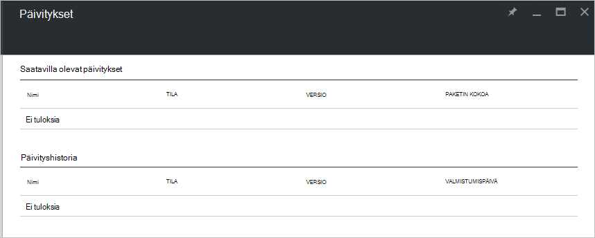

<properties
    pageTitle="Päivitykset Azure Pinotut | Microsoft Azure"
    description="Lisätietoja Azure Pinotut päivitykset"
    services="azure-stack"
    documentationCenter=""
    authors="HeathL17"
    manager="byronr"
    editor=""/>

<tags
    ms.service="azure-stack"
    ms.workload="na"
    ms.tgt_pltfrm="na"
    ms.devlang="na"
    ms.topic="article"
    ms.date="09/26/2016"
    ms.author="Helaw"/>

# Azure Pinotut päivitysten hallinta
Tekninen esikatselu 2 esitellään käyttökokemusta Azure pinon päivitysten hallintaan esikatselu.  Tässä aiheessa Siirry päivitykset-solmu.  

## Päivitykset-sivu
1.  Jos haluat käyttää päivitykset-sivu, valitse **Selaa** ja valitse sitten **päivitykset**.

2.  Valitse **Paikallinen** sijainti.

3.  Voit näet luettelon saatavilla olevat päivitykset ja päivityshistoria.  Tekninen esikatselu 2-päivityksiä ei ovat käytettävissä asennusta varten.  

    

## Seuraavat vaiheet
- [Tietoja Azure pinon Käsitteiden arkkitehtuuri](azure-stack-architecture.md)      
- [Tietoja käyttöönoton edellytykset](azure-stack-deploy.md)
- [Azure pinon käyttöönotto](azure-stack-run-powershell-script.md)
 
    
  

  

