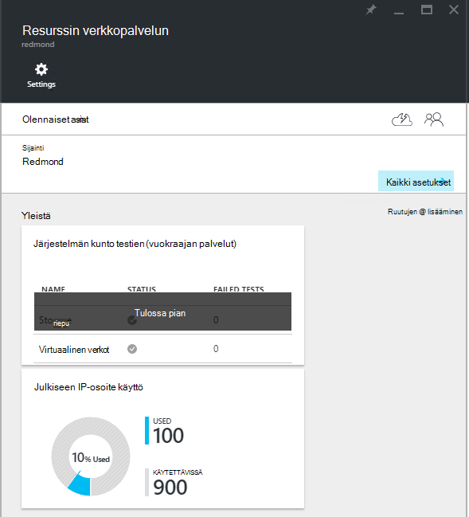
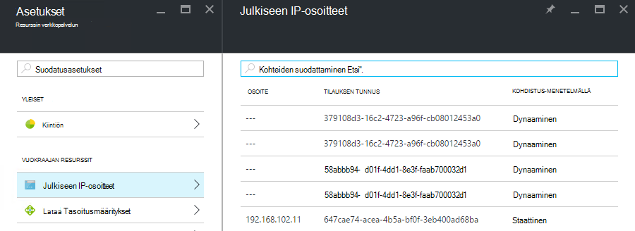

<properties
    pageTitle="Julkiseen IP-osoite kulutus tarkasteleminen TP2 | Microsoft Azure"
    description="Järjestelmänvalvojat voivat tarkastella kulutus julkiseen IP-osoitteiden alueen"
    services="azure-stack"
    documentationCenter=""
    authors="ScottNapolitan"
    manager="darmour"
    editor=""/>

<tags
    ms.service="azure-stack"
    ms.workload="na"
    ms.tgt_pltfrm="na"
    ms.devlang="na"
    ms.topic="get-started-article"
    ms.date="09/26/2016"
    ms.author="scottnap"/>

# Azure pinon TP2 julkiseen IP-osoite kulutus tarkasteleminen

Service-järjestelmänvalvojana voit tarkastella julkiseen IP-osoitteet, jotka on osoitettu vuokraajiin julkiseen IP-osoitteet, jotka ovat edelleen käytettävissä kohdistus määrä ja prosentti julkiseen IP-osoitteet, jotka on osoitettu kyseisessä sijainnissa määrä.

**Julkisen IP-osoite käyttö** -ruutu näyttää pitänyt käyttää kaikissa kaikki julkisen IP address jakavat kangasta Valitse, onko ne on käytetty vuokraaja IaaS AM esiintymät, kangasta infrastruktuuripalvelut tai julkisen IP-osoite resurssit, jotka on nimenomaisesti luotu alihallinnat julkiseen IP-osoitteiden kokonaismäärän.

Tämä ruutu tarkoituksena on antaa Azure pinon järjestelmänvalvojat mielessä kokonaismäärän julkiseen IP-osoitteet, jotka on jo käytetty tähän sijaintiin. Tämä auttaa järjestelmänvalvojia selvittämisestä, onko ne ovat pienen tämän resurssin.

**Asetukset** -sivu on **Julkiseen IP-osoitteet** -valikkokohde **vuokraajan resurssien** luettelo vain ne julkiseen IP-osoitteet, jotka on *nimenomaisesti luoma alihallinnat*. Näin ollen julkisten IP-osoitteiden **Käyttö julkiseen IP-osoite** -ruutu on korostettuna **käytetty** määrä on aina eroaa (suurempi kuin) numero **vuokraajan resurssit**-kohdassa **Julkiseen IP-osoitteet** -ruutu.

## Julkiseen IP-osoite käyttötietojen tarkasteleminen

Voit tarkastella pitänyt käyttää alueen julkiseen IP-osoitteiden kokonaismäärän seuraavasti:

1.  Azure-pino-portaalissa valitsemalla **Selaa**ja valitse sitten **Resurssi tarjoajat**.

2.  **Resurssin tarjoajien**luettelosta **Verkon resurssin palvelun järjestelmänvalvoja**.

3.  Vaihtoehtoisesti voit napsauttaa **Selaa | Sijainnit** ja valitse sitten sijainti, johon haluat tarkastella luettelosta. Valitse sitten **Resurssin tarjoajat** -ruutu **Verkon resurssin palvelun järjestelmänvalvoja**.

4.  **Resurssin verkkopalvelun** purkamisen-sivu näyttää **Yleistä** -osan **Käyttö julkiseen IP-osoite** -ruutua.

Ota huomioon, **käytetään** numero ilmaisee määrän julkiseen IP-osoitteet kaikki julkiseen IP-osoite jakavat kyseisessä sijainnissa, jotka on määritetty. **Käytettävissä oleva** numero ilmaisee määrän julkiseen IP-osoitteet kaikki julkiseen IP-osoitteen jakavat, joka ei ole määritetty ja ovat edelleen käytettävissä. **% Käytetty** numero ilmaisee käytetyn tai varattujen osoitteiden määrän julkiseen IP määrä prosentteina käsittelee kaikki julkiseen IP-osoitteen jakavat kyseisessä sijainnissa.

## Tarkastele julkiseen IP-osoitteet, jotka on luotu vuokraajan-tilauksissa

Löydät luettelon julkiseen IP-osoitteet, jotka on nimenomaisesti luotu vuokraajan tilaukset tietyllä alueella, siirry **Verkon resurssin tarjoajan järjestelmänvalvojan** **asetukset** -sivu ja valitse sitten **Julkiseen IP-osoitteet**.

Saatat huomata, että jotkin julkiseen IP-osoitteet, jotka on osoitettu dynaamisesti näkyvän luettelossa, mutta ei ole liitetty vielä osoite. Tämä johtuu siitä osoite resurssi on luotu resurssin verkkopalvelun, mutta ei verkko-ohjain vielä.

Verkko-ohjain ei liitä osoite resurssi, kunnes se on todella sidottu käyttöliittymään, verkkokortti (NIC), kuormituksen tai VPN-yhdyskäytävä. Kun julkinen IP-osoite on sidottu käyttöliittymään, verkko-ohjain varaa sille IP-osoite ja se näkyy **osoite** -kenttään.

## Tarkastele julkisen IP address tietojen yhteenveto taulukkoa

Useilla eri joka julkisten IP-osoitteiden on määritetty tapaukset, jotka määrittävät, onko osoite näkyy yhdessä luettelossa tai toiseen.

| **Julkisen IP-osoite varauksen palvelupyynnön** | **Käyttötietojen yhteenveto näkyy** | **Vuokraajan julkisen IP-osoitteiden luettelo tulee näkyviin** |
| ------------------------------------- | ----------------------------| ---------------------------------------------- |
| Dynaaminen julkiseen IP-osoite (väliaikainen) NIC tai lataamiseen-tasaustoiminto ei ole vielä määritetty | Ei | Kyllä |
| Dynaaminen julkiseen IP-osoite myönnetyt NIC tai kuormituksen tasauspalvelun. | Kyllä | Kyllä |
| Staattinen julkiseen IP-osoite vuokraajan NIC tai kuormituksen tasauspalvelun liitetään. | Kyllä | Kyllä |
| Staattinen julkiseen IP-osoite myönnetyt kangasta infrastruktuurin palvelun-päätepiste. | Kyllä | Ei |
| Julkinen IP-osoite luodaan IaaS AM esiintymien implisiittisesti ja käyttää lähtevän NAT virtual verkossa. Nämä luodaan taustalla, aina, kun alihallinnan Luo AM esiintymän niin, että VMs voit lähettää tiedot Internetiin. | Kyllä | Ei |
