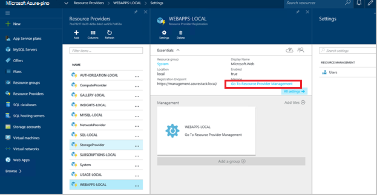
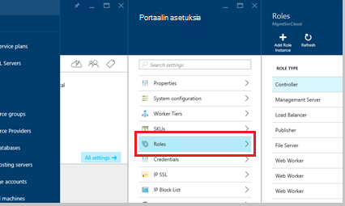
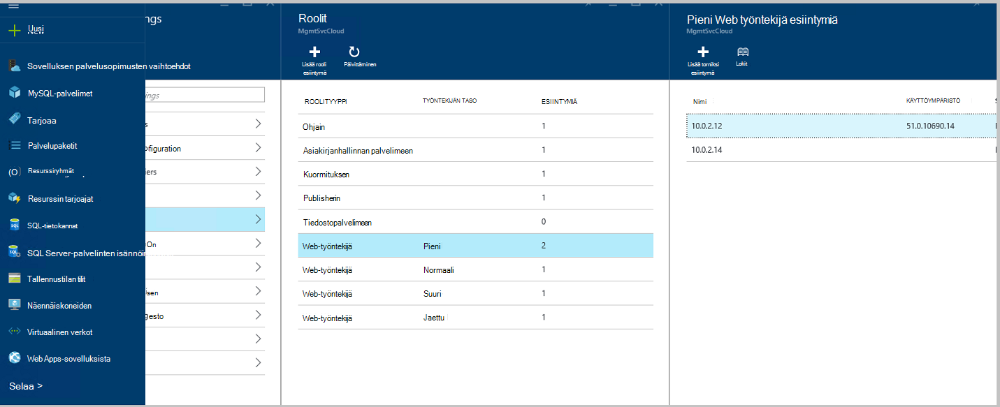
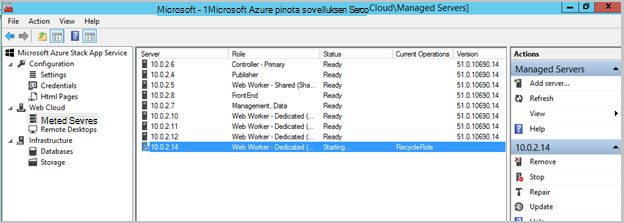
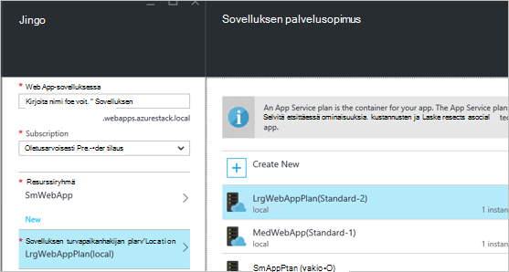
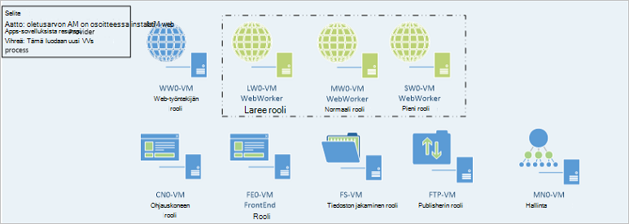

<properties
    pageTitle="Web Apps-sovellusten lisääminen Lisää verkko-työntekijä roolit | Microsoft Azure"
    description="Yksityiskohtaiset ohjeet skaalauksen Azure pinon Web Appissa"
    services="azure-stack"
    documentationCenter=""
    authors="kathm"
    manager="slinehan"
    editor=""/>

<tags
    ms.service="azure-stack"
    ms.workload="app-service"
    ms.tgt_pltfrm="na"
    ms.devlang="na"
    ms.topic="article"
    ms.date="09/26/2016"
    ms.author="kathm"/>

#   <a name="web-apps-adding-more-web-worker-roles"></a>Web Apps: Lisääminen Lisää verkko-työntekijä roolit

> [AZURE.NOTE] Seuraavat tiedot koskevat vain Azure pinon TP1 ominaisuuksissa.

Tässä tiedostossa on ohjeet skaalata verkkosovelluksissa web työntekijä roolit. Se sisältää muut verkko työntekijä roolit web apps-tuotteiden koosta tukipalvelut luomisen vaiheet.

Azure-pino tukee maksuttomia ja jaettuja web-sovellusten käyttöönoton. Jos haluat lisätä muita, tarvitset lisää Lisää verkko-työntekijä roolit.

Jos et ole varma, mikä on otettu käyttöön verkkosovelluksissa perusasennus, voit tarkastella lisätietoja [tähän](azure-stack-webapps-overview.md).

Skaalaa web työntekijä rooleille tarvitaan seuraavasti:

1.  [Luo uuden virtual koneen](#step-1-create-a-new-vm-to-support-the-new-instance-size)

2.  [Määritä virtuaalikoneen](#step-2-configure-the-virtual-machine)

3.  [Web-Työntekijä-roolin määrittäminen Azure pino-portaalissa](#step-3-configure-the-web-worker-role-in-the-azure-stack-portal)

4.  [Määritä sovellus palvelusopimusten vaihtoehdot](#step-4-configure-app-service-plans)

##<a name="step-1-create-a-new-vm-to-support-the-new-instance-size"></a>Vaihe 1: Luo uusi AM tukemaan uuden esiintymän kokoa

Luo virtual machine kuvatulla tavalla- [artikkelissa](azure-stack-provision-vm.md)tehtävästä seuraavat valinnat:

 - Käyttäjänimi ja salasana: samaa käyttäjänimeä ja salasanaa antamasi Web Apps-sovellusten asentamisen.

 - Tilaus: Käytä oletusarvon tarjoajan tilaus.

 - Resurssiryhmä: Valitse **AppService paikallinen**.

> [AZURE.NOTE]Tallentaa työntekijä roolien näennäiskoneiden samaan resurssiryhmään sovellus otetaan käyttöön verkkosovelluksissa. (Suositellaan tässä versiossa.)

##<a name="step-2-configure-the-virtual-machine"></a>Vaihe 2: Määritä virtuaalikoneen

Kun asennus on valmis, tukemaan web työntekijän rooli tarvitaan asetukset ovat seuraavat:

1.  Avaa palvelimen hallinnan Host (isäntä)-laitteeseen, valitse **Työkalut** &gt; **HyperV hallinta**.

2.  Muodosta käyttämällä Remote Desktop Protocol (RDP) vaiheessa 1 luomasi uudet virtuaalikoneen. Palvelimen nimi sijaitsee yhteenvetosivulla kunkin AM on valittuna.

3.  Avaa PowerShell-napsauttamalla **Käynnistä** -painiketta ja kirjoittamalla PowerShell. Napsauta **PowerShell.exe**hiiren kakkospainikkeella ja valitse **Suorita järjestelmänvalvojana** , Avaa PowerShell järjestelmänvalvojan oikeuksia.

4.  Kopioi ja liitä kunkin seuraavista komennoista (yksi kerrallaan) PowerShell-ikkuna ja painamalla enter-näppäintä:

    ```netsh advfirewall firewall set rule group="File and Printer Sharing" new enable=Yes```
    ```netsh advfirewall firewall set rule group="Windows Management Instrumentation (WMI)" new enable=yes```
    ```reg add HKLM\\SOFTWARE\\Microsoft\\Windows\\CurrentVersion\\Policies\\system /v LocalAccountTokenFilterPolicy /t REG\_DWORD /d 1 /f```

5.  Käynnistä virtuaalikoneen uudelleen.

> [AZURE.NOTE]Huomautus: Nämä ovat vähimmäisvaatimukset verkkosovelluksissa. He ovat mukana Azure pinon Windows 2012 R2: n kuvan oletusasetukset. Ohjeita saanut myöhempää käyttöä varten, sekä niille käyttämällä eri kuva.

##<a name="step-3-configure-the-web-worker-role-in-the-azure-stack-portal"></a>Vaihe 3: Määritä web työntekijän rooli Azure pino-portaalissa

1.  Avaa portaalin **ClientVM**service-järjestelmänvalvojana.

2.  Siirry **resurssin tarjoajat** &gt; **WEBAPPS paikallinen**.

    
 
3.  Valitse **Siirry tarjoajan Resurssienhallinta**.

4.  Valitse **roolit**.

    
 
5.  Valitse **Lisää rooli esiintymä**.

6.  Valitse **taso** haluat ottaa käyttöön uuden esiintymän (pieni, Normaali, suuri tai jaettu).

    
 
7.  Voit määrittää seuraavat asiat:
 - Palvelimen nimi: Anna aiemmin luomasi (osa 1)-palvelimen IP-osoite.
 - Roolityyppi: Web työntekijä.
 - Työntekijän taso: Vastineita taso valittuna kokoa.

8. Valitse **OK.**

9. Kirjaudu sisään CN0 AM ja Avaa **Web Cloud Management MMC**.

10. Siirry **Web Cloud** &gt; **hallitun palvelimiin**.

11. Valitse palvelimen nimeä, vain käyttöön. Tarkista tila-sarakkeessa ja odota, siirry seuraavaan vaiheeseen, kunnes tila on "Valmis".

    

##<a name="step-4-configure-app-service-plans"></a>Vaihe 4: Määritä sovelluksen palvelusopimusten vaihtoehdot

> [AZURE.NOTE]Web Apps nykyisessä versiossa app palvelusopimusten vaihtoehdot on tallennettu eri resurssin ryhmissä. Muodosta resurssiryhmä kunkin web Appin koon ja sijoita sovelluksen palvelupaketin sopivaa resurssia niiden ryhmien.

1.  Kirjaudu sisään ClientVM-portaaliin.

2.  Siirry **uuden** &gt; **Web- ja Mobile**.

3.  Valitse web Appissa, haluat ottaa käyttöön.

4.  Web-sovelluksen tiedot ja valitse sitten **AppService suunnitelman / sijainti**.

-   Valitse **Luo uusi**.

-   Luo uusi palvelupaketti-palvelupaketin hinnoittelu vastaavan tason valitseminen.

> [AZURE.NOTE]Voit luoda useita suunnitelmat, valitse tämä sivu. Varmista ennen niiden käyttöönottoa kuitenkin olet valinnut haluamasi palvelupaketti.

Seuraavassa kuvassa näkyy esimerkki käytettävissä useita Palvelupaketit:    

##<a name="final-web-app-service-vm-configuration"></a>Lopullinen online-palvelun AM määritykset

Alla olevassa kuvassa tarjoaa ympäristön näkymän, kun on skaalattu web työntekijä roolit. Vihreä kohteiden edustavat uudet rooli lisäykset.
    
