<properties
     pageTitle="Luominen Azure tukipyyntö | Microsoft Azure"
     description="Voit luoda Azure tukipyyntö."
     services="Azure Supportability"
     documentationCenter=""
     authors="ganganarayanan"
     manager="scotthit"
     editor=""/>

<tags
     ms.service="azure-supportability"
     ms.workload="na"
     ms.tgt_pltfrm="na"
     ms.devlang="na"
     ms.topic="article"
     ms.date="10/25/2016"
     ms.author="gangan"/>

# Azure tukipyyntö luominen

## Yhteenveto
Azure asiakkaiden voit luoda ja hallita tukipyyntöjä Azure [https://portal.azure.com](https://portal.azure.com)-portaalissa.
>[AZURE.NOTE] Saksa Azure-portaali on [https://portal.microsoftazure.de](https://portal.microsoftazure.de) ja Azure government-portaalin on [https://portal.azure.us](https://portal.azure.us).

Asiakaspalautteen perusteella olemme olet päivittänyt tuki pyynnön kokemus keskittyä kolme tärkeimmät tavoitteet:

- **Streamlined**: Pienennä hiiren napsautuksella ja lavat, jotta lähettämistä tukipyynnön yksinkertainen.
- **Integroidut**: kun vianmääritystä Azure resurssin ongelmasta, sen on oltava helppo avata kyseiselle resurssille tukipyynnön vaihtamatta kontekstissa.
- **Efficient**: kerätä avaintiedoista, että tukihenkilö on tehokkaasti ratkaise ongelmaa.

## Käytön aloittaminen
Voit luoda tukipyynnön yläreunan siirtymispalkista tai suoraan resurssi-sivu.

**Valitse yläreunan siirtymispalkista**

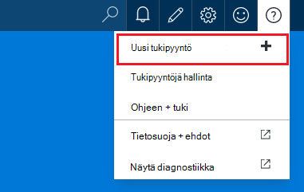

**Valitse resurssi-sivu**

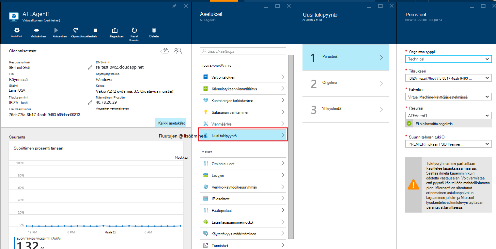

## Perusteet
Tuen pyynnön prosessin ensimmäisessä vaiheessa kerää perustietoja ongelmaa sekä tuki-suunnitelma.

Voit esimerkiksi: olet vastakkaisten teknisiä ongelmia virtuaalikoneen kanssa ja epäilet verkko connectivity-ongelma.
Prosessi, jossa saaminen ongelman service ("Virtual Machine käyttöjärjestelmässä") ja resurssin (virtuaalikoneen nimi) valitseminen ohjatun toiminnon ensimmäisessä vaiheessa käynnistyy.

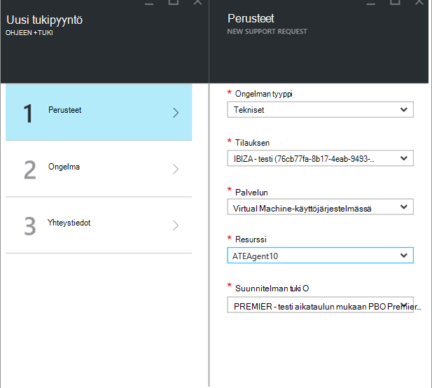

>[AZURE.NOTE] Azure tukee rajoittamaton tilausten hallinta (esimerkiksi laskutus ja tilin siirrot kiintiön muutokset). Tekninen tuki sinun on tuki suunnitelma. [Lisätietoja tuki palvelupaketin](https://azure.microsoft.com/support/plans).

## Ongelma
Ohjatun toiminnon toinen vaihe kerää lisätietoja ongelman. Tarkat tiedot tässä vaiheessa antamisen pystyy tapaus reitittämiseen parhaat tukihenkilö ongelmaan ja aloita ohjelmistossa ongelmasta mahdollisimman pian.

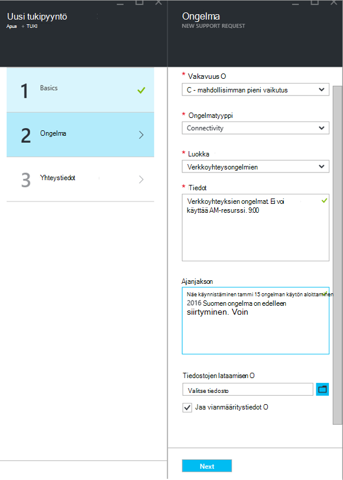

Jatkamista virtuaalikoneen connectivity Esimerkki edellä täytä tämän lomakkeen avulla voit ilmaista verkkoyhteysongelman ja antaa lisätietoja ongelmasta, mukaan lukien lähes aikaa, kun ongelma ilmeni.

## Aiheeseen liittyviä ohjeita
Joidenkin ongelmien linkeissä Aiheeseen liittyvät ohjeet ongelman ratkaisemiseen. Jos suositeltujen asiakirjojen ei auta, voit jatkaa luodaan tukipyynnön kautta.
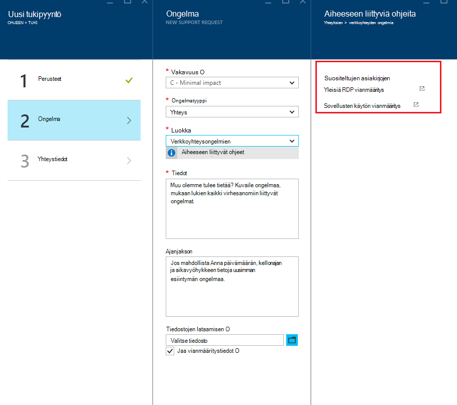

## Yhteystiedot
Ohjatun toiminnon viimeisessä vaiheessa vahvistaa yhteystietojen, jotta Microsoft tietää, miten voit saavuttamiseksi.
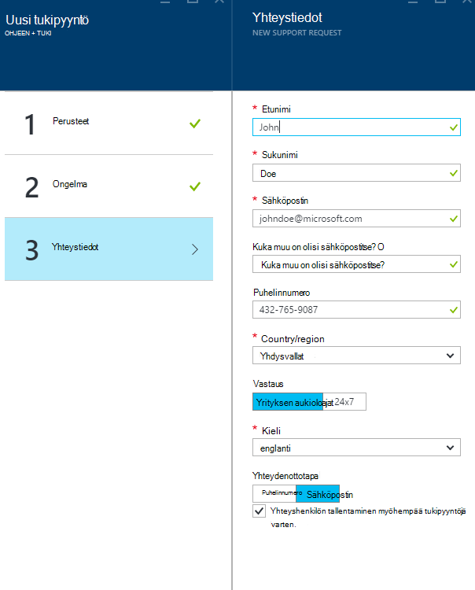

Sen mukaan, ongelmaa vakavuus sinulta pyydetään ilmaisemaan, jos haluat ottaa sinuun yhteyttä aikana aukioloajat tai jos haluat mieluummin 24 x 7 vastauksen, mikä tarkoittaa sitä, emme voi ottaa sinuun milloin tahansa.
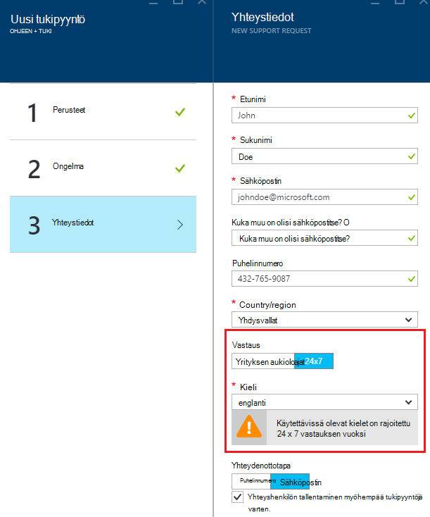

## Tukipyyntöjä hallinta
Kun olet luonut tukipyyntö, voit tarkastella tietoja **Hallinta tukevat palvelupyynnöt** -sivulle.

**Valitse yläreunan siirtymispalkista**

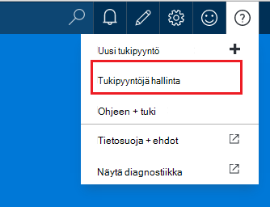

**Hallinnoi tukipyyntöjä** -sivulla voit tarkastella kaikkia tukipyyntöjä ja niiden tiloista.
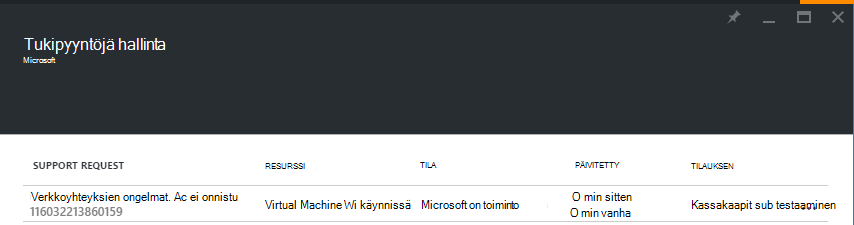

Voit tarkastella tietoja, myös vakavuus ja vastata tukihenkilö kestää odotettua ajankohdan tukipyyntö valitseminen
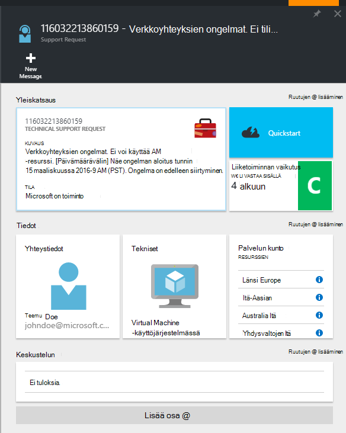

Jos haluat muuttaa pyynnön vakavuus, napsauta **Business vaikutus** -ruutua. Esimerkiksi kuin edellä olevissa olevassa esimerkissä pyyntö on määritetty vakavuus C.

Napsauttamalla ruudun avulla voit määrittää Avaa tukipyyntö severities luettelo.

>[AZURE.NOTE] Tärkeys-tason palvelustasi riippuu tuki. [Lisätietoja tuki palvelupaketin](https://azure.microsoft.com/support/plans).

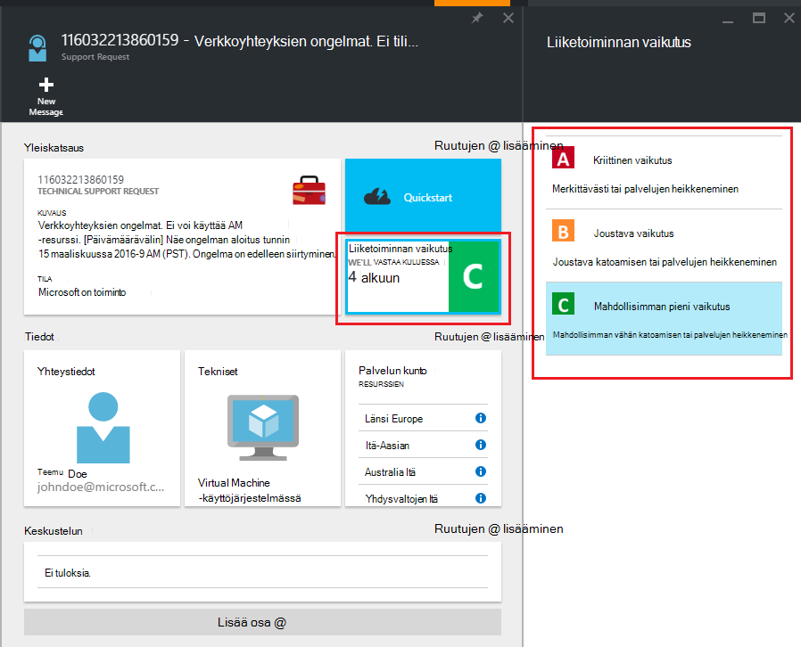

## Palaute
Emme aina Avaa palaute ja ehdotukset! Lähetä meille [ehdotuksia](https://feedback.azure.com/forums/266794-support-feedback). Lisäksi voit valtuutettua kanssamme [Twitter-](https://twitter.com/azuresupport) tai [MSDN-keskustelupalstoilla](https://social.msdn.microsoft.com/Forums/azure).

## Opi lisää
[Azure tuki usein kysytyt kysymykset](https://azure.microsoft.com/support/faq)
