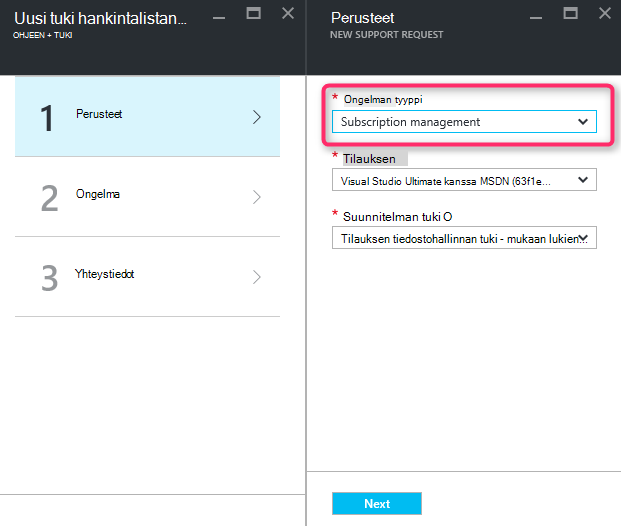
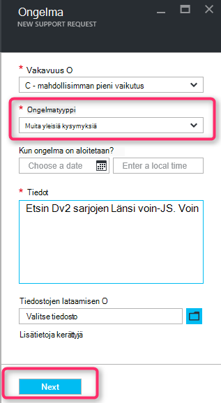
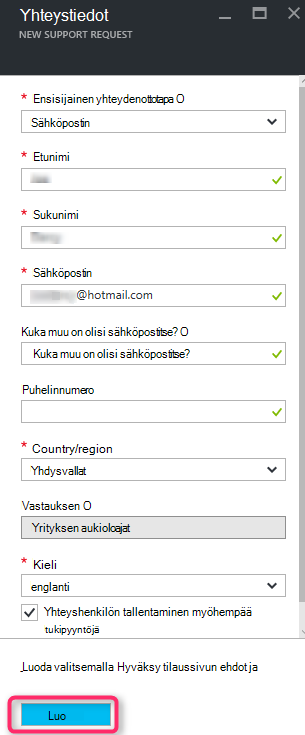

<properties
     pageTitle="TUOTE sarjan ei käytettävissä | Microsoft Azure"
     description="Jotkin SKU sarjan eivät ole käytettävissä tällä alueella valitun tilaus."
     services="Azure Supportability"
     documentationCenter=""
     authors="ganganarayanan"
     manager="scotthit"
     editor=""/>

<tags
     ms.service="azure-supportability"
     ms.workload="na"
     ms.tgt_pltfrm="na"
     ms.devlang="na"
     ms.topic="article"
     ms.date="08/12/2016"
     ms.author="gangan"/>

# TUOTE sarjan ei ole käytettävissä

Joidenkin alueiden tiettyjä tuotteissa eivät ole automaattisesti käytettävissä uusissa tilauksissa.  Tämä voi ilmetä, kun [tehokkaampia tuotteissa julkaistavassa alueen](https://azure.microsoft.com/updates/announcing-new-dv2-series-virtual-machine-size/) ja vanha suosion SKU kiellä.
"*Jotkin SKU sarjan eivät ole käytettävissä tällä alueella valitun tilaus*" viesti näkyy tukipyynnön niin, että Laske core kiintiön luotaessa.

Voit tarkastella SKU käytettävyys [alueittain Azure palvelut](https://azure.microsoft.com/regions/#services) -sivulla. 

TUOTE, joka on rajoitettu tilauksesi käyttöoikeuden pyytäminen "Tilausten hallinta" tukipyynnön luominen

- Valitse Perustiedot-sivun Valitse ongelman tyyppi kuin "Tilausten hallinta" ja valitse "Seuraava".

- Ongelma sivulla Valitse "Muita yleisiä kysymyksiä" ongelmatyyppi ja kirjoita tarkka alue ja versiot eivät näe.
Näin nopeuttamiseksi tuki-prosessin.

- Valitse yhteystiedot-sivulla Kirjoita yhteystiedon tiedot ja sitten "Luo".

## Palaute
Emme aina Avaa palaute ja ehdotukset! Lähetä meille [ehdotuksia](https://feedback.azure.com/forums/266794-support-feedback). Lisäksi voit valtuutettua kanssamme [Twitter-](https://twitter.com/azuresupport) tai [MSDN-keskustelupalstoilla](https://social.msdn.microsoft.com/Forums/azure).

## Opi lisää
[Azure tuki usein kysytyt kysymykset](https://azure.microsoft.com/support/faq)
