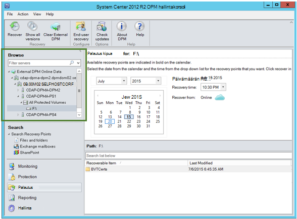
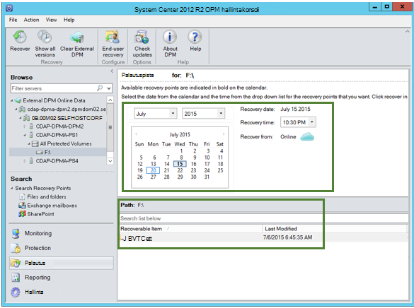
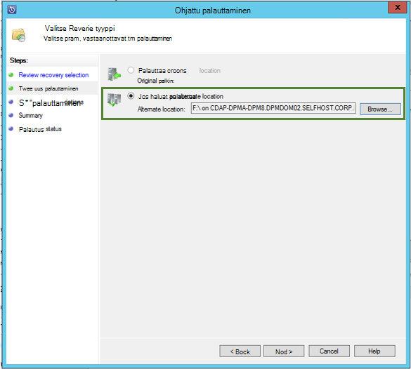

<properties
    pageTitle="Tietojen palauttaminen toiselta DPM palvelimelta, varmuuskopioi säilöön | Microsoft Azure"
    description="Palauttaa tietoja, on suojattu Azure varmuuskopiointi-säilö mistä tahansa kyseisen säilö rekisteröity DPM-palvelimesta."
    services="backup"
    documentationCenter=""
    authors="nkolli1"
    manager="shreeshd"
    editor=""/>

<tags
    ms.service="backup"
    ms.workload="storage-backup-recovery"
    ms.tgt_pltfrm="na"
    ms.devlang="na"
    ms.topic="article"
    ms.date="08/08/2016"
    ms.author="giridham;jimpark;trinadhk;markgal"/>

# Tietojen palauttaminen toisesta DPM palvelimesta varmuuskopion säilöön
Voit nyt palauttaa Azure varmuuskopiointi-säilö on suojattu mistä tahansa DPM palvelimesta rekisteröity kyseisen säilö tiedot. Prosessi, jossa se on täysin integroitu DPM hallintakonsoli ja muistuttaa palautus-työnkulut.

Tietojen palauttaminen toiseen DPM palvelimeen varmuuskopion säilöön tarvitset [System Center Data Protection Manager UR7](https://support.microsoft.com/en-us/kb/3065246) ja [uusimmat Azure Backup agentti](http://aka.ms/azurebackup_agent).

## Tietojen palauttaminen toiseen DPM palvelimeen
Tietojen palauttaminen toiseen DPM-palvelimeen:

1. Valitse DPM hallintakonsoli **palautus** -välilehdessä **Lisää ulkoisen DPM** (osoitteessa näytön vasemmassa yläreunassa).

    

2. Uusi **säilö tunnistetietojen** lataamisesta **DPM palvelimen** , jossa tiedot on palautettu liittyvät säilöstä DPM palvelimen DPM palvelinten varmuuskopion säilö rekisteröityjä luettelosta ja anna DPM-palvelimeen, jonka tiedot on palautettu liittyvä **salauksen salasana** .

    

    >[AZURE.NOTE] Vain saman rekisteröinnin säilö liittyvät DPM-palvelimet palauttaa toistensa tietoja.

    Kun ulkoiset DPM palvelimen lisännyt, voit selata ulkoiseen DPM palvelimeen ja paikallisen DPM palvelimen **palautus** -välilehdestä tiedot.

3. Selaa tuotannon palvelinten suojattu ulkoisen DPM palvelimen käytettävissä luettelo ja valitse haluamasi tietolähde.

    

4. Valitse **kuukausi ja vuosi** **palautus pisteiden** avattava, valitse pakollinen **palautus päivämäärä** , kun palautus-kohta on luotu ja valitse **palautus-aika**.

    Tiedostojen ja kansioiden luettelo tulee näkyviin alaruudun mitkä selatut ja palauttaa mihin tahansa kohtaan.

    

5. Napsauta haluamasi kohde ja valitse sitten **Palauta**.

    

6. Tarkista, **Palauta valinta**. Tarkista tiedot ja palautetaan varmuuskopio-aika sekä lähde, josta varmuuskopio on luotu. Jos valinta on virheellinen, valitse **Peruuta** , jos haluat palata palautus-välilehteä ja valitse haluamasi palautuspiste. Jos valinta on oikein, valitse **Seuraava**.

    

7. Valitse **Palauta vaihtoehtoiseen sijaintiin**. **Selaa** oikeaan paikkaan palauttamiseen.

    

8. Valitse **Luo kopio**, **Ohita**tai **Korvaa**-vaihtoehto.
    - **Luo kopio** luo tiedoston kopion tapahtuma on nimi ristiriitoja.
    - **Ohita** ohittaa tiedoston palauttamisesta tapahtuma on nimi ristiriitoja.
    - **Korvaa** korvaa aiemmin luotu kopioiminen nimi tapauksissa, joissa määritettyyn sijaintiin.

    Valitse haluamasi vaihtoehto Palauta **Suojaus**. Voit käyttää sen kohde tietokoneen, jossa tiedot on palautettu suojausasetukset tai suojausasetuksia, jotka olivat käytettävissä tuotteen, kun palautus-kohta on luotu.

    Selvitä, onko **ilmoitus** lähetetään, kun palautus on valmis.

    

9. **Yhteenveto** -ikkunassa näkyvät valitut mennessä vaihtoehdot. Kun valitset **Palauta'**, tiedot voidaan palauttaa tarvittavat paikallisen haluamaasi kohtaan.

    

    >[AZURE.NOTE] Palautus-työ voidaan valvoa DPM palvelimen **valvonta** -välilehdessä.

    

10. Voit valita **Poista ulkoinen DPM** DPM, johon haluat poistaa ulkoiset DPM palvelimen näkymän **palautus** -välilehdessä.

    

## Vianmääritys virhesanomat
|Ei. |  Virhesanoma | Vianmääritysohjeita |
| :-------------: |:-------------| :-----|
|1.|        Tämä palvelin ei ole rekisteröity säilö tunnistetieto määritetyn säilö.|  **Syy:** Tämä virhesanoma tulee näyttöön, kun valittu säilö tunnistetiedon tiedosto ei kuulu varmuuskopiointi säilö liittyvät DPM palvelimeen, jossa palautus on liikaa.   **Tarkkuus:** Lataa säilö tunnistetiedon tiedosto, johon DPM-palvelin on rekisteröity varmuuskopion säilöstä.|
|2.|        Palauttaa tietoja ei ole käytettävissä tai valittu palvelin ei ole DPM-palvelin.|   **Syy:** On palvelimia ei ole muita DPM kanssa DPM 2012 R2 UR7 rekisteröity varmuuskopiointi säilö DPM-palvelinten DPM 2012 R2 UR7 on ei ole vielä ladattu metatiedot tai valittu palvelin ei ole DPM-palvelimessa (eli Windows Server tai Windows-asiakas).   **Tarkkuus:** Jos määritettynä on rekisteröity varmuuskopion säilö DPM muihin palvelimiin, varmista SCDPM 2012 R2 UR7 ja uusimmat Azure varmuuskopion agentti on asennettu.  Jos määritettynä on rekisteröity ja DPM 2012 R2 UR7 varmuuskopion säilö DPM muihin palvelimiin, odota päivän UR7 palautus Aloita asennuksen jälkeen. Yöllä työn lataavat aiemmin suojatun varmuuskopioiden cloud metatiedot. Tiedot ovat käytettävissä palauttamista varten.|
|3.|        Ei ole DPM-palvelinta ei rekisteröity tämän säilö.|   **Syy:** Ei ole muihin DPM palvelimiin jossa DPM 2012 R2 UR7 tai uudempi versio, joka on rekisteröity säilö, josta palautus yritetään. **Tarkkuus:** Jos määritettynä on rekisteröity varmuuskopiointi säilö DPM muihin palvelimiin, varmista SCDPM 2012 R2 UR7 ja uusimmat Azure varmuuskopiointi agentti on asennettu. Jos määritettynä on rekisteröity ja DPM 2012 R2 UR7 varmuuskopion säilö DPM muihin palvelimiin, odota päivän UR7 palautus Aloita asennuksen jälkeen. Yöllä työn lataavat aiemmin suojatun varmuuskopioiden cloud metatiedot. Tiedot ovat käytettävissä palauttamista varten.|
|4.|        Annettu salauksen salasana ei vastaa liittyvät seuraavat palvelimen salasana:**<server name>**|  **Syy:** Parhaillaan salaamaan tiedot DPM palvelimen tiedoista, jotka on palautettu käytetään salausta salasana ei vastaa annettu salauksen salasana. Agentti ei salauksen tiedot. Näin ollen palautus epäonnistuu. **Tarkkuus:** Anna täsmälleen saman salauksen salasana liittyvät DPM-palvelimeen, jonka tiedot on palautettu.|

## Usein kysyttyjä kysymyksiä:
1. **Miksi en voi lisätä ulkoiseen DPM palvelimeen toisesta DPM palvelimesta UR7 ja uusimmat Azure Backup agentti asentamisen jälkeen?**

    A), aiemmin tietolähteillä, jotka on suojattu pilveen (aiempi Update Rollup 7 käyttämällä päivityskokoelma) DPM-palvelimet-sinulla odota vähintään yksi päivä UR7 ja uusimmat Azure Backup agentti Avaa *Lisää ulkoisen DPM palvelimen*asentamisen jälkeen. Tämä on tarpeen lataaminen Azure DPM suojaus-ryhmien metatiedot. Tämä tapahtuu yöllä työn kautta ensimmäisen kerran.

2. **Mikä on Azure Backup-agentti tarvitaan vähintään versio?**

    A), Azure varmuuskopiointi agentti pienin versio toiminto on 2.0.8719.0.  Azure varmuuskopiointi-agentti versio voidaan varmistaa siirtymällä Ohjauspaneelin **>** kaikki Ohjauspaneelin kohteita **>** ohjelmat ja toiminnot **>** Microsoft Azure palautus Services Agent. Jos versio on pienempi kuin 2.0.8719.0, Lataa [uusin Azure Backup agentti](https://go.microsoft.com/fwLink/?LinkID=288905) ja asenna.

    

## Seuraavat vaiheet:
• [Azure varmuuskopion usein kysytyt kysymykset](backup-azure-backup-faq.md)
