<properties
    pageTitle="Näennäiskoneiden palauttaminen varmuuskopiosta Azure-portaalissa | Microsoft Azure"
    description="Palauttaa Azure virtuaalikoneen palautus pisteestä Azure-portaalissa"
    services="backup"
    documentationCenter=""
    authors="markgalioto"
    manager="cfreeman"
    editor=""
    keywords="Palauta varmuuskopio; palauttaminen; palautuspiste;"/>

<tags
    ms.service="backup"
    ms.workload="storage-backup-recovery"
    ms.tgt_pltfrm="na"
    ms.devlang="na"
    ms.topic="article"
    ms.date="08/10/2016"
    ms.author="trinadhk; jimpark;"/>

# Palauttaa näennäiskoneiden Azure portal avulla

> [AZURE.SELECTOR]
- [Palauttaa VMs Classic-portaalissa](backup-azure-restore-vms.md)
- [Palauttaa VMs Azure-portaalissa](backup-azure-arm-restore-vms.md)

Tietojen suojaaminen tehokkaasta tietojen tilannevedosten määritetyn väliajoin. Nämä tilannevedoksia kutsutaan palautus pistettä ja ne on tallennettu palautus services vaults. Jos tai on tarpeen korjaaminen tai muodostaminen uudelleen AM, voit palauttaa AM mistä tahansa tallennetun palautus asioista. Palautuspiste palauttaminen palauttavat tai palauta tilaan AM, kun palautus-kohta on tehty. Tässä artikkelissa kerrotaan, miten voit palauttaa AM.

> [AZURE.NOTE] Azure on kaksi käyttöönoton mallien luominen ja käyttäminen resurssit: [Resurssienhallinta ja perinteinen](../resource-manager-deployment-model.md). Tässä artikkelissa on tietoja ja menetelmiä VMs käyttöön Resurssienhallinta mallin palauttamista varten.

## Palauttaa palautuspiste

1. Kirjautuminen [Azure portal](http://portal.azure.com/)

2. Azure-valikosta valitsemalla **Selaa** ja kirjoita palveluluettelosta, **Palautus-palvelut**. Palveluluetteloon säätää kirjoittamasi tiedot. Kun näet **palautus Services vaults**, valitse se.

    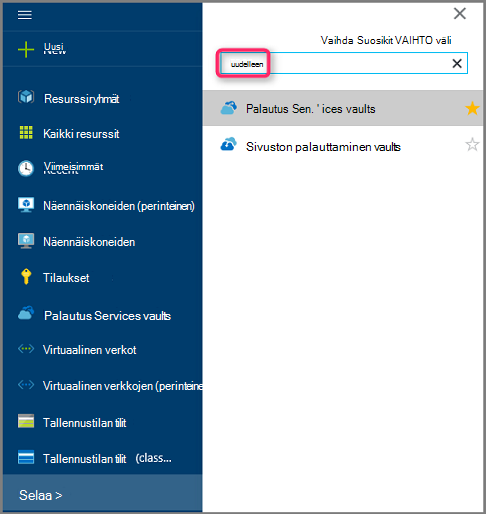

    Valitse tilauksen vaults luettelo tulee näkyviin.

    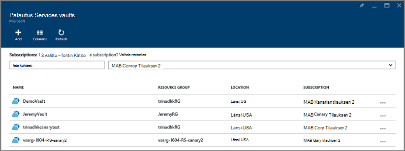

3. Valitse palautettavan AM liittyvät säilö-luettelosta. Kun napsautat säilö, sen raporttinäkymät-ikkuna avautuu.

    

4. Nyt kun olet säilö raporttinäkymät-ikkunassa. **Varmuuskopiointi kohteet** -ruutu, valitse **Azuren näennäiskoneiden** säilö liittyvät VMs näytettävä.

    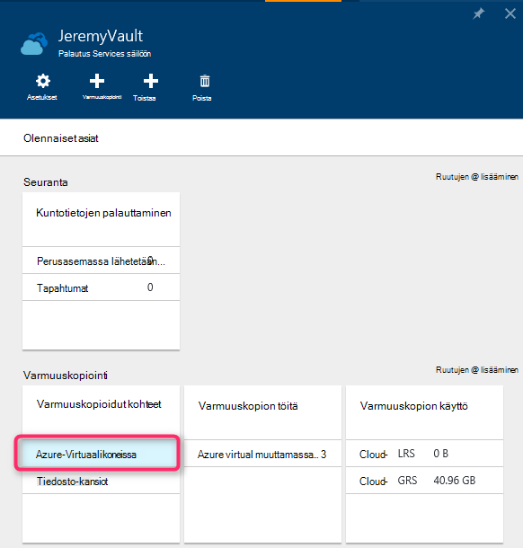

    **Varmuuskopiointi-kohteita** -sivu aukeaa ja näyttää Azuren näennäiskoneiden luettelo.

    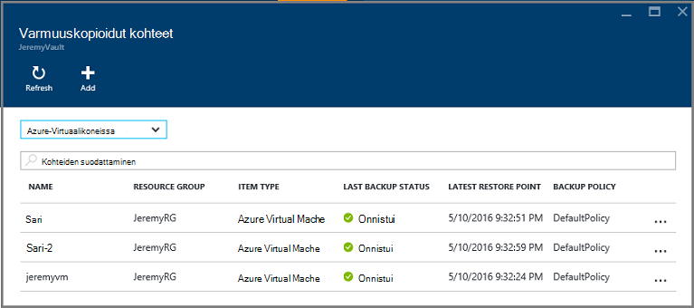

5. Valitse AM avaa koontinäyttö-luettelosta. Seuranta-alue, joka sisältää palauttaminen pisteet-ruutu avautuu AM Raporttinäkymät-ikkunan.

    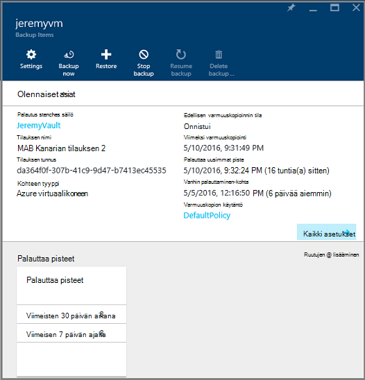

6. Valitse AM raporttinäkymät-valikko **palauttaminen**

    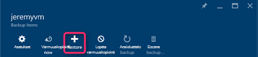

    Palauta-sivu avautuu.

    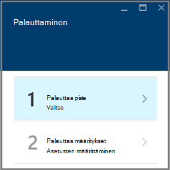

7. Valitse **Palauta** -sivu **palauttaa kohdan** Avaa **Valitse palauttaa** -sivu.

    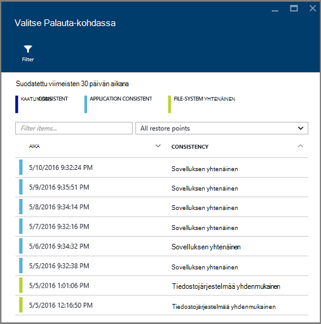

    Valintaikkuna näyttää oletusarvon mukaan kaikki palauttaminen pisteet viimeisten 30 päivän aikana. Käytä **suodatinta** muuttaa aikavälin palautuksen asioista, joka näkyy. Palauta kaikki yhdenmukaisuuden kohtiin näytetään oletusarvoisesti. **Kaikki palauttaa pisteiden** suodattimen voit valita tietyn yhtenäisyyden palauttaminen pisteiden muokkaaminen. Lisätietoja erityyppisiin palautus on kohdassa [tietojen yhdenmukaisuuden](./backup-azure-vms-introduction.md#data-consistency)selitys.  
    - Valitse **Palauta-kohdassa yhdenmukaisuuden** tästä luettelosta:
        - Kaatua yhdenmukaisia palauttaminen pisteet
        - Sovelluksen yhdenmukaisia palauttaminen pisteet
        - Tiedoston järjestelmän yhdenmukaisen palauttaminen pisteet
        - Kaikki palauttaa pistettä.  

8. Palauta-kohtaa ja valitse **OK**.

    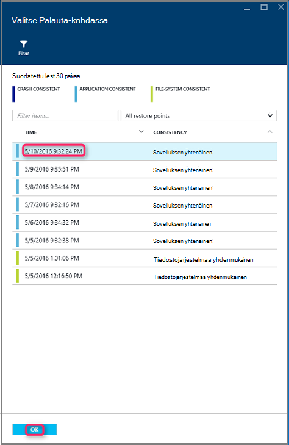

    **Palauta** -sivu näyttää Palauta-kohdassa on määritetty.

    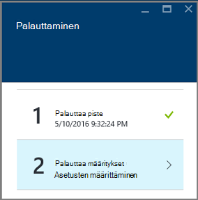

9. Valitse **Palauta** -sivu **palauttaa määritykset** aukeaa automaattisesti, kun palautus-kohta on määritetty.

    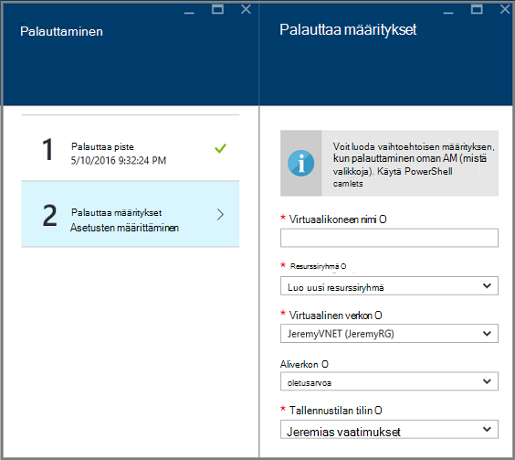

## AM palauttaminen kokoonpano

Nyt kun olet valinnut Palauta-kohdassa, valitse määritysten palautettavaksi AM. Vaihtoehtojen määrittäminen palautettu AM on käytettävä: Azure portal tai PowerShell.

> [AZURE.NOTE] Portaalissa on palautettu AM nopea luominen-vaihtoehto. Jos haluat mukauttaa to-be palautettu AM AM määritykset, PowerShellin avulla palauttaa levyjen varmuuskopioida ja liitä ne valinta AM-määritys. Katso [palauttaminen AM määräten verkon määritysten kanssa](#restoring-vms-with-special-network-configurations).

1. Jos et ole jo olemassa, siirry **palauttaminen** -sivu. Varmista **palauttaa kohta** on valittuna ja valitse Avaa **palautus määritys** -sivu **palauttaa määritykset** .

    

2. **Palauttaa määritys** -sivu Kirjoita tai valitse arvot kunkin seuraavat kentät:
    - **Virtuaalikoneen nimi** - AM nimi. Nimen on oltava yksilöllinen resurssiryhmä (for Resurssienhallinta käyttöön AM) tai pilvipalvelussa (for perinteinen AM). Et voi korvata virtuaalikoneen, jos se on jo tilaus.
    - **Resurssiryhmä** - resurssin ryhmän tai luoda uuden. Jos palautat perinteinen AM-kentän avulla voit määrittää uuden pilvipalvelussa nimi. Jos luot uuden resurssin ryhmän/pilvipalveluun, nimen on oltava yksilöivä. Yleensä cloud palvelunimi on liitetty julkisen URL - esimerkiksi: [cloudservice]. cloudapp.net. Jos yrität käyttää resurssin ryhmän/cloud pilvipalvelussa, joka on jo käytetty nimi, Azure määrittää resurssien ryhmä-/ pilvipalvelussa on sama nimi kuin AM. Azure näyttää resurssin ryhmät/pilvipalveluihin ja VMs ei ole liitetty affiniteetti ryhmät. Lisätietoja on artikkelissa [siirtäminen affiniteetti ryhmistä alueellisen Virtual verkkoon (VNet)](../virtual-network/virtual-networks-migrate-to-regional-vnet.md).
    - **VPN** - Valitse virtual verkon (VNET) AM luotaessa. Kenttä sisältää kaikkien VNETs tilaukseen liittyvää. Resurssiryhmä AM, näkyy sulkeissa.
    - **Aliverkon** - Jos VNET on aliverkosta, ensimmäinen aliverkon on valittuna oletusarvoisesti. Jos määritettynä on muita aliverkosta, valitse haluamasi aliverkon.
    - **Tallennustilan tilin** - valikossa näkyvät samassa sijainnissa kuin palautus Services säilö tallennustilan-tilit. Tallennustilan tilin valittaessa Valitse tili, joka jakaa palautus Services säilö samaan sijaintiin. Tallennustilan tilit, jotka ovat tarpeettomia vyöhykkeen ei tueta. Jos ei ole tallennustilan tili ja eri sijaintiin kuin palautus Services säilö, sinun on luotava eteen palautustoiminto alkaen. Tallennustilan tilin replikoinnin tyyppi on mainittu sulkeissa.

    > [AZURE.NOTE] Jos palautat Resurssienhallinta käyttöön AM, sinun on tunnistettava virtual verkon (VNET). Virtuaalinen verkon (VNET) on valinnainen perinteinen AM.

3. Valitse **OK** palauttaminen Viimeistele **palauttaa määritys** -sivu.

4. Valitse **Palauta** -sivu käynnistettävän palautustoiminto **palauttaminen** .

    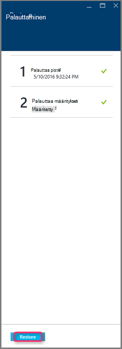

## Seurata palautus

Kun palautus käynnistäminen, varmuuskopiointi-palvelu luo työn seurannassa palautustoiminto. Varmuuskopiointi-palvelu luo myös ja näyttää ilmoituksen tilapäisesti ilmoitusalueen portaalin. Jos ilmoituksessa, joka ei ole näkyvissä, voit valita aina tarkastelemaan ilmoitukset ilmoitukset-kuvaketta.

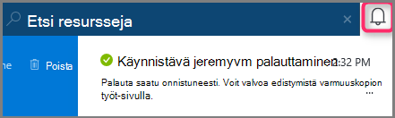

Voit tarkastella toiminnon, kun se käsittelee tai silloin, kun se on valmis, Avaa varmuuskopio Projektit-luettelossa.

1. Azure-valikosta valitsemalla **Selaa** ja kirjoita palveluluettelosta, **Palautus-palvelut**. Palveluluetteloon säätää kirjoittamasi tiedot. Kun näet **palautus Services vaults**, valitse se.

    

    Valitse tilauksen vaults luettelo tulee näkyviin.

    

2. Valitse liittyvä AM, voit palauttaa säilö-luettelosta. Kun napsautat säilö, sen raporttinäkymät-ikkuna avautuu.

3. Säilö koontinäytön **Varmuuskopiointi työt** -ruutu, valitse **Azuren näennäiskoneiden** näyttämään säilö liittyvät työt.

    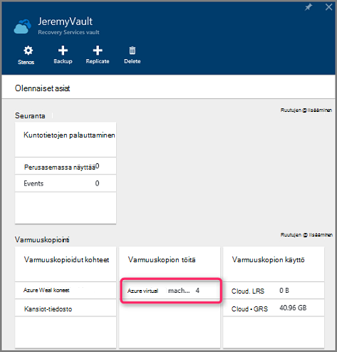

    **Varmuuskopiointi työt** -sivu aukeaa ja näyttää töiden luettelo.

    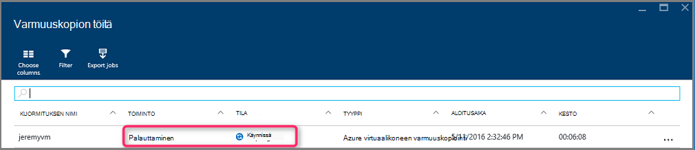

## Erityiset verkon määritysten VMs palauttaminen
Se on mahdollista varmuuskopioiminen ja palauttaminen VMs seuraavat määräten verkon määritykset kanssa. Määritysten edellyttävät kuitenkin joitakin erityistä huomiota samalla, kun palautus loppuun.

- VMs kuormituksen (sisäisten ja ulkoisten)-kohdassa
- VMs kanssa useita varattu IP-osoitteet
- VMs useita NIC kanssa

>[AZURE.IMPORTANT] Luodessasi VMs määräten verkon määritystä, sinun on käytettävä PowerShell VMs luominen palauttaa levyjä.

Voit luoda täysin näennäiskoneiden levylle palautuksen jälkeen uudelleen seuraavasti:

1. Palauttaa levyjen [PowerShellin](../backup-azure-vms-automation.md#restore-an-azure-vm) palautus palvelut-säilö

2. Luo tarvittavat kuormituksen AM määritys / useita NIC/useita varattu IP, käyttämällä PowerShell cmdlet-komentoja ja käytä AM, Luo haluttu määritys.
    - Luo AM pilvipalvelussa [sisäinen kuormituksen](https://azure.microsoft.com/documentation/articles/load-balancer-internal-getstarted/) kanssa
    - Luo AM muodostaa [Internet vastakkaisten kuormituksen] (https://azure.microsoft.com/en-us/documentation/articles/load-balancer-internet-getstarted/)
    - Luo AM [useita NIC](https://azure.microsoft.com/documentation/articles/virtual-networks-multiple-nics/)
    - Luo AM [useita varattu IP-osoitteet](https://azure.microsoft.com/documentation/articles/virtual-networks-reserved-public-ip/)

## Seuraavat vaiheet
Nyt, voit palauttaa käyttäjän VMs, on artikkelissa vianmäärityksen tietoja yleisten virheiden VMs käyttöön. Tutustu myös, että VMs tehtävien hallinnasta on artikkelissa.

- [Vianmääritys](backup-azure-vms-troubleshoot.md#restore)
- [Näennäiskoneiden hallinta](backup-azure-manage-vms.md)
