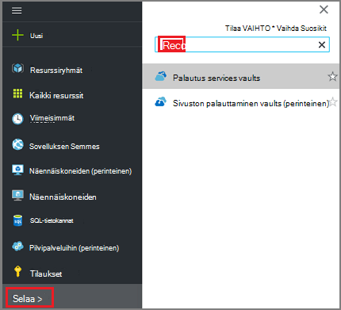
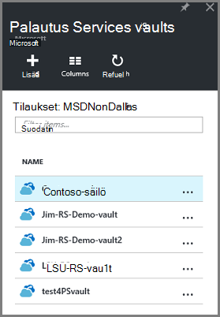
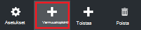
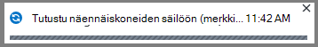
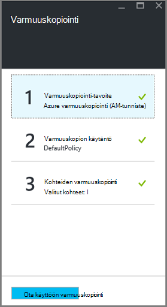
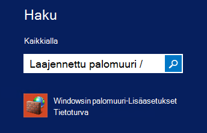
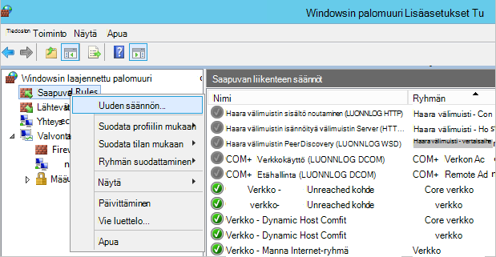
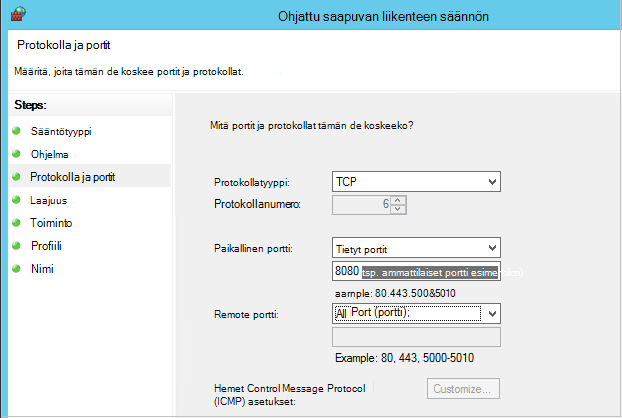

<properties
    pageTitle="Resurssienhallinta käyttöön näennäiskoneiden varmuuskopioida ympäristön valmisteleminen | Microsoft Azure"
    description="Varmista, että ympäristösi on valmistettu varmuuskopioiminen näennäiskoneiden Azure-tietokannassa"
    services="backup"
    documentationCenter=""
    authors="markgalioto"
    manager="cfreeman"
    editor=""
    keywords="varmuuskopioiden; Varmuuskopiointi;"/>

<tags
    ms.service="backup"
    ms.workload="storage-backup-recovery"
    ms.tgt_pltfrm="na"
    ms.devlang="na"
    ms.topic="article"
    ms.date="08/21/2016"
    ms.author="trinadhk; jimpark; markgal;"/>


# <a name="prepare-your-environment-to-back-up-resource-manager-deployed-virtual-machines"></a>Paikallinen ympäristö valmistellaan Resurssienhallinta käyttöön näennäiskoneiden varmuuskopioiminen

> [AZURE.SELECTOR]
- [Resurssien hallinnan malli](backup-azure-arm-vms-prepare.md)
- [Perinteinen malli](backup-azure-vms-prepare.md)

Tässä artikkelissa on ohjeita valmistelemiseksi ympäristön varmuuskopioida Resurssienhallinta käyttöön virtual koneen (AM). Azure-portaalin käyttäminen menettelyt kuvatut toimet.  

Azure varmuuskopiointi-palvelu on kahdentyyppisiä oman VMs suojaamisessa käytettävät vaults (vaults ja palautus services vaults varmuuskopioiminen). Varmuuskopion säilö suojaa VMs käyttöön perinteinen käyttöönotto-mallin avulla. Palautus-palveluiden säilö suojaa **sekä perinteinen käyttöön tai Resurssienhallinta käyttöön VMs** . Sinun on käytettävä palautus Services säilö suojaaminen Resurssienhallinta käyttöön AM.

>[AZURE.NOTE] Azure on kaksi käyttöönoton mallien luominen ja käyttäminen resurssit: [Resurssienhallinta ja perinteinen](../resource-manager-deployment-model.md). Lisätietoja [Azure-virtuaalikoneissa varmuuskopioida ympäristön valmisteleminen](backup-azure-vms-prepare.md) perinteinen käyttöönoton mallin VMs käyttämiseen.

Ennen kuin voit suojata tai varmuuskopioida Resurssienhallinta käyttöön virtual koneen (AM), varmista, että seuraavat edellytykset ovat olemassa:

- Luo palautus-palveluiden säilö (tai tunnistaa aiemmin palautus-palveluiden säilö) *-kohdassa AM samaan sijaintiin*.
- Valitse skenaario, Määritä varmuuskopion käytäntö ja suojaaminen kohteiden määrittäminen.
- Tarkista virtuaalikoneen AM agentti asennettuun.
- Tarkista verkkoyhteys

Jos tiedät, että nämä ehdot jo ympäristössäsi jatketaan [varmuuskopioida VMs-artikkelissa](backup-azure-vms.md). Jos haluat määrittää tai tarkistaa, mitä tahansa näistä edellytyksistä tämän artikkelin ohjaa seuraavien ohjeiden avulla, että edellytyksenä valmisteleminen.


## <a name="limitations-when-backing-up-and-restoring-a-vm"></a>Kun varmuuskopiointia ja palauttamista AM rajoitukset

Ennen kuin lisätietoja ympäristön valmistelemisesta ymmärrät rajoitukset.

- Varmuuskopiointi näennäiskoneiden on yli 16 tietojen levyjen kanssa ei tueta.
- Varmuuskopiointi näennäiskoneiden on varattu IP-osoite ja määritetty päätepistettä ei tueta.
- Varmuuskopion Linux näennäiskoneiden Docker tunniste ei tueta. 
- Varmuuskopiotiedot ei ole otettu käyttöön verkkoasemat liitetty AM. 
- Korvaa aiemmin luotu virtuaalikoneen palauttamisen aikana ei tueta. Jos yrität palauttaa AM AM olemassa, palautustoiminto epäonnistuu.
- Rajat-alueen varmuuskopiointi ja palauttaminen ei tueta.
- Voit varmuuskopioida kaikki julkisen alueilla Azure näennäiskoneiden (Katso tuettujen alueiden [tarkistusluettelon](https://azure.microsoft.com/regions/#services) ). Jos etsit valitun alueen ei tueta tänään, se ei tule avattavassa luettelossa säilö luonnin aikana.
- Voit varmuuskopioida näennäiskoneiden vain select käyttöjärjestelmien varten:
  - **Linux**: Azure varmuuskopiointi tukee [luettelo, joka on vahvistettava Azure jaot](../virtual-machines/virtual-machines-linux-endorsed-distros.md) Core OS Linux lukuun ottamatta.  Tuo-Your-omistaja-Linux muiden jaot myös ehkä toimi, kunhan AM-agentti ei ole käytettävissä virtuaalikoneen ja tuki Python olemassa.
  - **Windows Server**: Windows Server 2008 R2 vanhemmat versiot eivät ole tuettuja.
- Toimialueen ohjauskoneen palauttaminen (Ohjauskoneen), joka on osa usean Ohjauskoneen määrityksen AM tuetaan vain PowerShellin kautta. Lisätietoja [palauttaminen usean Ohjauskoneen toimialueen ohjauskoneen](backup-azure-restore-vms.md#restoring-domain-controller-vms).
- Palauttaminen näennäiskoneiden, joka on erityisen verkon seuraavat määritykset tuetaan vain PowerShellin kautta. Luotu Palauta työnkulku käyttöliittymässä VMs ei ole verkon määritysten, kun palautus on valmis. Lisätietoja on artikkelissa [Palauttaminen VMs määräten verkon määritysten kanssa](backup-azure-restore-vms.md#restoring-vms-with-special-netwrok-configurations).
  - Valitse kuormituksen tasauspalvelun kokoonpano (sisäisten ja ulkoisten) näennäiskoneiden
  - Näennäiskoneiden useita varattu IP-osoitteet
  - Näennäiskoneiden useita verkkosovittimien kanssa

## <a name="create-a-recovery-services-vault-for-a-vm"></a>Luo AM palautus palvelut-säilö

Palautus-palveluiden säilö on kohteen, joka tallentaa varmuuskopiointi ja palauttaminen pistettä, jotka on luotu ajan kuluessa. Palautus services säilö sisältää myös suojatun näennäiskoneiden liittyvät varmuuskopion käytännöt.

Voit luoda palautus-palveluiden säilö seuraavasti:

1. Kirjautuminen [Azure portal](https://portal.azure.com/).

2. Valitse toiminto-valikosta valitsemalla **Selaa** ja kirjoita resurssien luetteloa, **Palautus-palvelut**. Kun alat kirjoittaa, luettelo suodattaa syötettäsi perusteella. Valitse **palautus-palveluiden säilö**.

     <br/>

    Palautus Services vaults luettelo tulee näkyviin.

3. **Palautus Services vaults** -valikosta **Lisää**.

    

    Palautus Services säilö-sivu avautuu, kannattaa antaa **nimi**, **tilauksen**, **resurssiryhmä**ja **sijainti**.

    

4. Kirjoita kutsumanimi tunnistavan säilö **nimi**. Nimen on oltava yksilöllinen Azure-tilausta. Kirjoita nimi, joka sisältää 2 – 50 merkkiä. Se on alettava kirjaimella, ja voivat sisältää vain kirjaimia, numeroita ja väliviivoja.

5. Valitse **tilaus** tilaukset käytettävissä luettelossa. Jos et ole varma, mikä tilaus käyttämään, käytä oletusarvoa (tai ehdotetut) tilaukseen. On useita vaihtoehtoja vain, jos organisaation tilillä on liitetty useita Azure-tilauksia.

6. **Resurssiryhmä** käytettävissä luettelo resurssin ryhmien tai valitse **Uusi** ja luo uusi resurssiryhmä. Resurssiryhmät Lisätietoja on artikkelissa [Azure resurssien hallinnan yleiskatsaus](../azure-resource-manager/resource-group-overview.md)

7. Valitse **sijainti** Valitse säilö maantieteellinen alue. Säilö **on** oltava sama alue kuin näennäiskoneiden, jonka haluat suojata.

    >[AZURE.IMPORTANT] Jos ole varma, onko sijainnista, jossa oman AM sijaitsee, sulje ulos säilö luominen-valintaikkuna ja siirry näennäiskoneiden luettelo-portaalissa. Jos sinulla on useita alueilla näennäiskoneiden, sinun on palautus Services säilö luominen kunkin alueen. Luo säilö ensimmäiseen kohtaan ennen kuin siirryt seuraavaan sijaintiin. Ei tarvita, jos haluat määrittää tallennustilan tilit varmuuskopiotiedot--palautus Services säilö tallentamiseen ja Azure varmuuskopion palvelun käsitellä tämä automaattisesti.

8. Valitse **Luo**. Se voi viedä aikaa palautus Services säilö luodaan. Seurata tilailmoitukset portaalin oikeassa yläkulmassa-alueella. Kun oman säilö on luotu, se näkyy palautus-palveluiden vaults luettelo.

    

    Nyt kun olet luonut lisääminen säilöön, lisätietoja tallennustilan replikoinnin määrittämisestä.

## <a name="set-storage-replication"></a>Tallennustilan replikoinnin määrittäminen

Tallennustilan replikoinnin-asetuksen avulla voit valita geo ylimääräinen ja paikallisesti tarpeettomat välillä. Oman säilö on oletusarvoisesti geo ylimääräinen. Jätä arvoksi geo ylimääräinen, jos kyseessä on ensisijainen varmuuskopiointi-vaihtoehto. Jos haluat halvempaa vaihtoehto, joka ei ole aivan kestävät, valitse paikallisesti ylimääräinen. Lue lisätietoja [geo tarpeettomat](../storage/storage-redundancy.md#geo-redundant-storage) ja [paikallisesti tarpeettomat](../storage/storage-redundancy.md#locally-redundant-storage) tallennusasetukset [Azuren tallennustilaan replikoinnin yleiskatsaus](../storage/storage-redundancy.md).

Voit muokata tallennustilan replikoinnin asetusta seuraavasti:

1. Valitse oman säilö Avaa säilö Raporttinäkymät-ikkunan ja asetukset-sivu. Jos **asetukset** -sivu ei avaudu, valitse **kaikki asetukset** säilö Raporttinäkymät-ikkunan.

2. Valitse **asetukset** -sivu **Varmuuskopiointi infrastruktuurin** > **Varmuuskopioinnin määrittäminen** Avaa **Varmuuskopio-määritys** -sivu. Valitse **Varmuuskopiointi määritys** -sivu lisääminen säilöön replikoinnin tallennuspaikka.

    

    Sen jälkeen, että säilö tallennustilan-vaihtoehdon valitseminen olet valmis AM liitettävä säilö. Aloita suhteen olisi löydä ja rekisteröi Azure-virtuaalikoneissa.


## <a name="select-a-backup-goal-set-policy-and-define-items-to-protect"></a>Valitse Varmuuskopioi tavoite, määrittää käytännön, ja suojata kohteiden määrittäminen

Ennen rekisteröitymistä AM säilöön, jonka Suorita etsiminen prosessi varmistaa, että uusi näennäiskoneiden, jotka on lisätty tilaukseen tunnistetaan. Prosessin kyselyt Azure näennäiskoneiden tilauksen, lisätietoja sekä luettelo, kuten cloud palvelun nimen ja haluamasi alue. Azure-portaalissa skenaarion viittaa mitä aiot laittaa palautus services säilö. Käytäntö on kun ja aikavälin palautuksen pisteiden otetaan aikataulua. Käytännön myös säilytys alueen palautus kohdeosoite.

1. Jos sinulla on jo palautus Services säilö on avoinna, siirry vaiheeseen 2. Jos ei ole palautus-palveluiden Avaa säilöön, mutta Azure-portaalissa on toiminto-valikosta valitsemalla **Selaa**.

  - Kirjoita resurssit-luettelosta **Palautus-palvelut**.
  - Kun alat kirjoittaa, luettelo suodattaa syötettäsi perusteella. Kun näet **palautus Services vaults**, napsauttamalla sitä.

     <br/>

    Palautus Services vaults luettelo tulee näkyviin.
  - Palautus Services vaults luettelosta säilöön.

    Valitun säilö raporttinäkymät-ikkuna avautuu.

    

2. Valitse säilö raporttinäkymät-valikko **Varmuuskopiointi** Avaa varmuuskopio-sivu.

    

    Kun sivu avautuu, varmuuskopiointi-palvelun etsii kaikki uudet VMs-tilaus.

    

3. Valitse Varmuuskopiointi-sivu **Varmuuskopiointi tavoitteen** Avaa varmuuskopio-tavoite-sivu.

    

4. Varmuuskopion tavoite-sivu Määritä **jossa havainnollistamiseen on käynnissä** Azure ja **mitä voit tehdä varmuuskopion haluat** Virtual tietokoneeseen, valitse **OK**.

    Varmuuskopiointi-tavoite-sivu sulkeutuu ja varmuuskopiointi käytäntö-sivu avautuu.

    

5. Valitse Varmuuskopiointi käytäntö-sivu varmuuskopion käytännön koske säilö ja valitse **OK**.

    

    Oletuskäytäntö tiedot näkyvät tiedot. Jos haluat luoda uuden käytännön, valitse **Luo uusi** avattavasta valikosta. Avattava valikko on myös vaihtoehdon voit siirtyä aika, kun tilannevedos on tehty, 7 PM. Ohjeita varmuuskopion käytännön määrittämisestä on artikkelissa [varmuuskopion käytännön määrittäminen](backup-azure-vms-first-look-arm.md#defining-a-backup-policy). Kun valitset **OK**, varmuuskopion käytäntö on liitetty säilö.

    Valitse seuraavaksi VMs liitettävä säilö.

6. Valitse näennäiskoneiden määritettyä käytäntöä liittäminen ja valitse sitten **Valitse**.

    

    Jos et näe haluamaasi AM, tarkista, että se on palautus Services säilö Azure samaan sijaintiin.

7. Nyt kun olet määrittänyt kaikki säilö varmuuskopiointi-sivu-asetukset valitse **Käyttöön varmuuskopiointi** sivun alareunassa. Tämä ottaa käyttöön käytännön säilö ja VMs.

    

Seuraava vaihe valmistelussa asentaa AM-agentti tai varmistetaan, että AM-agentti asennettu.


## <a name="install-the-vm-agent-on-the-virtual-machine"></a>Asenna virtuaalikoneen AM-agentti

Azure AM agentti on oltava asennettuna Azure virtuaalikoneen toimimaan varmuuskopiointi-tunnisteeseen. Jos yhteyttä AM luotiin Azure-valikoimasta, AM-agentti on jo olemassa virtuaalikoneen. Nämä tiedot ovat edellyttäen missä tilanteissa *ei* AM avulla luotu Azure - valikoimasta esimerkiksi AM siirretty kohteesta paikallisen palvelinkeskukseen. Tässä tapauksessa AM-agentti on asenneta, jotta voit suojata virtuaalikoneen.

Lisätietoja [AM agentti](https://go.microsoft.com/fwLink/?LinkID=390493&clcid=0x409) ja [asentamisesta AM-agentti](../virtual-machines/virtual-machines-windows-classic-manage-extensions.md).

Jos sinulla on ongelmia Azure AM varmuuskopioiminen, tarkista, että Azure AM agentti on asennettu oikein virtuaalikoneen (Katso alla olevaa taulukkoa). Jos olet luonut mukautettuja AM, [Varmista, että **Asenna AM Agent** -valintaruutu on valittu](../virtual-machines/virtual-machines-windows-classic-agents-and-extensions.md) ennen virtuaalikoneen on valmisteltu.

Seuraavassa taulukossa on lisätietoja AM Agent for Windowsista tai Linux VMs.

| **Toiminto** | **Windows** | **Linux** |
| --- | --- | --- |
| Asentaminen AM-agentti | <li>Lataa ja asenna [MSI-agentti](http://go.microsoft.com/fwlink/?LinkID=394789&clcid=0x409). Sinun on järjestelmänvalvojan oikeudet ja viimeistele asennus. <li>[AM-ominaisuuden päivittäminen](http://blogs.msdn.com/b/mast/archive/2014/04/08/install-the-vm-agent-on-an-existing-azure-vm.aspx) osoittamaan, että agentti on asennettu. | <li> Asenna uusimmat [Linux agentti](https://github.com/Azure/WALinuxAgent) GitHub. Sinun on järjestelmänvalvojan oikeudet ja viimeistele asennus. <li> [AM-ominaisuuden päivittäminen](http://blogs.msdn.com/b/mast/archive/2014/04/08/install-the-vm-agent-on-an-existing-azure-vm.aspx) osoittamaan, että agentti on asennettu. |
| Päivittäminen AM-agentti | AM-agentti päivittämisestä on pelkästään uudelleenasentaminen [AM agentti binaaritiedostot](http://go.microsoft.com/fwlink/?LinkID=394789&clcid=0x409). <br>Varmista, että mitään varmuuskopioinnin ei käytössä, kun AM-agentti päivitetä. | Päivityksiä [Linux AM agentti ](../virtual-machines-linux-update-agent.md)ohjeiden mukaisesti. <br>Varmista, että mitään varmuuskopioinnin ei käytössä, kun AM-agentti päivitetä. |
| AM Agent-asennuksen tarkistaminen | <li>Siirry Azure AM *C:\WindowsAzure\Packages* -kansioon. <li>Löydät tulisi esitä WaAppAgent.exe tiedoston.<li> Tiedostoa hiiren kakkospainikkeella, valitse **Ominaisuudet**ja valitse **tiedot** -välilehti. Tuoteversio-kentässä on oltava 2.6.1198.718 tai uudempi versio. | PUUTTUU |


### <a name="backup-extension"></a>Varmuuskopion tunniste

Kun AM-agentti asennettu virtuaalikoneen, Azure varmuuskopion palvelu asentaa varmuuskopion tunniste AM-agentti. Azure varmuuskopion palvelun päivittää saumattomasti ja korjaa varmuuskopion tunniste.

Varmuuskopion laajennus on asennettu varmuuskopiointi-palvelun riippumatta siitä, AM on käynnissä. Käynnissä olevat AM on eniten mahdollisuutta käytön sovelluksen yhdenmukaisia palautus-kohta. Azure varmuuskopiointi-palvelun säilyy kuitenkin varmuuskopiointi AM, vaikka se on poistettu käytöstä ja laajennus ei voitu asentaa. Tätä kutsutaan offline-tilassa AM. Tässä tapauksessa palautus-kohta on *yhtenäinen kaatumisen*.


## <a name="network-connectivity"></a>Verkkoyhteyden

Jotta voit hallita AM tilannevedoksia, varmuuskopion tunniste on yhteys Azure julkiseen IP-osoitteisiin. Oikea Internet-yhteys ilman virtual machine HTTP-pyyntöjen aikakatkaisu ja varmuuskopiointi epäonnistuu. Jos käyttöönoton on käyttörajoitukset paikassa (kautta verkon käyttöoikeusryhmän (NSG), esimerkiksi), valitse jokin seuraavista vaihtoehdoista tarjoamiseksi Tyhjennä polku varmuuskopion tietoliikenteen:

- [Whitelist Azure palvelinkeskuksen IP-alueita](http://www.microsoft.com/en-us/download/details.aspx?id=41653) – katso ohjeet artikkelista siitä, miten voit whitelist IP-osoitteet.
- Ota käyttöön HTTP-välityspalvelin reitittää liikenteen.

Asetus, kun valitsemisessa valinnat ovat hallittavuuden, hajautetun ohjausobjekti ja kustannukset.

|Vaihtoehto|Hyvät puolet|Huonot puolet|
|------|----------|-------------|
|Whitelist IP-alueita| Et lisäkustannuksia.<br><br>Avaamiseen access NSG, käytä <i>Määrittäminen AzureNetworkSecurityRule</i> cmdlet-komento. | KOMPLEKSI sellaisiin hallita IP-alueita muuttuvat ajan kuluessa.<br><br>Tarjoaa Azure ja eikä vain tallennustilan kokonaisuuteen.|
|HTTP-välityspalvelin| Hajautetun ohjausobjekti-välityspalvelimen kautta sallittu tallennustilan URL-osoitteet.<br>VMs yhden pisteen, Internet-yhteyttä.<br>Ei veloittaa Azure IP-osoite muuttuu.| Lisää kustannuksiin käynnissä AM välityspalvelimen-ohjelmistolla.|

### <a name="whitelist-the-azure-datacenter-ip-ranges"></a>Whitelist Azure palvelinkeskuksen IP-alueita

Voit whitelist Azure palvelinkeskuksen IP-alueita, katso lisätietoja [Azure sivuston](http://www.microsoft.com/en-us/download/details.aspx?id=41653) IP-alueita ja ohjeita.

### <a name="using-an-http-proxy-for-vm-backups"></a>HTTP-välityspalvelin käyttämällä AM varmuuskopioiden hakeminen
Kun varmuuskopiointi AM tunniste on varmuuskopioinnin käyttöön AM lähettää tilannevedoksen hallinta-komennot Azuren tallennustilaan HTTPS-Ohjelmointirajapinnan käyttäminen. Reitittää HTTP-välityspalvelin varmuuskopion tunniste liikenne, koska se on määritetty Julkinen Internet-yhteyden vain osan.

>[AZURE.NOTE] Ei ole toiminnon, jota käytetään välityspalvelimen ohjelmiston. Varmista, että olet valinnut välityspalvelin, joka on yhteensopiva määritysten ohjeita.

Alla olevassa esimerkissä kuvassa näkyy kolme määritysvaiheet tarvitse käyttää HTTP-välityspalvelin:

- Sovelluksen AM reitittää sidottu julkisen Internetin kautta välityspalvelimen AM kaikki HTTP-liikenne.
- Välityspalvelimen AM sallii saapuvan liikenteen VMs virtual verkossa.
- Verkon suojauksen ryhmän (NSG) nimeltä NSF lukitus on suojauksen säännön salliminen Internet liikenteen välityspalvelimen AM kohteesta.


Voit käyttää HTTP-välityspalvelin, julkinen Internet-yhteyden, toimimalla seuraavasti:

#### <a name="step-1-configure-outgoing-network-connections"></a>Vaihe 1. Lähtevän postin verkkoyhteyksien määrittäminen

###### <a name="for-windows-machines"></a>Windows-tietokoneissa
Tämä asennuksen paikallisen järjestelmän tilin välityspalvelimen asetukset.

1. Lataa [PsExec](https://technet.microsoft.com/sysinternals/bb897553)
2. Suorita seuraava komento laajennettuja kehote

     ```
     psexec -i -s "c:\Program Files\Internet Explorer\iexplore.exe"
     ```
     Se avautuu internet explorer-ikkunassa.
3. -Valitsemalla Työkalut > Internet-asetukset -> yhteydet -> Lähiverkon asetukset.
4. Tarkista järjestelmätilin välityspalvelimen. Määritä välityspalvelimen IP-osoite ja portin.
5. Sulje Internet Explorer.

Tämä määrittää tietokoneen välityspalvelimen määritysten ja käytetään lähtevän HTTP/HTTPS-tietoliikenteen.

Jos sinulla välityspalvelimen asetukset Nykyinen käyttäjätilin (ei paikallisen järjestelmätilin), käytä seuraavaa komentosarjaa koskee SYSTEMACCOUNT:

```
   $obj = Get-ItemProperty -Path Registry::”HKEY_CURRENT_USER\Software\Microsoft\Windows\CurrentVersion\Internet Settings\Connections"
   Set-ItemProperty -Path Registry::”HKEY_USERS\S-1-5-18\Software\Microsoft\Windows\CurrentVersion\Internet Settings\Connections" -Name DefaultConnectionSettings -Value $obj.DefaultConnectionSettings
   Set-ItemProperty -Path Registry::”HKEY_USERS\S-1-5-18\Software\Microsoft\Windows\CurrentVersion\Internet Settings\Connections" -Name SavedLegacySettings -Value $obj.SavedLegacySettings
   $obj = Get-ItemProperty -Path Registry::”HKEY_CURRENT_USER\Software\Microsoft\Windows\CurrentVersion\Internet Settings"
   Set-ItemProperty -Path Registry::”HKEY_USERS\S-1-5-18\Software\Microsoft\Windows\CurrentVersion\Internet Settings" -Name ProxyEnable -Value $obj.ProxyEnable
   Set-ItemProperty -Path Registry::”HKEY_USERS\S-1-5-18\Software\Microsoft\Windows\CurrentVersion\Internet Settings" -Name Proxyserver -Value $obj.Proxyserver
```

>[AZURE.NOTE] Jos huomaat "(407) välityspalvelimen todennus vaaditaan" välityspalvelimen palvelimen lokista, tarkista käyttöoikeuksien asetukset on määritetty oikein.

######<a name="for-linux-machines"></a>Linux tietokoneissa

Lisää seuraava rivi, ```/etc/environment``` tiedosto:

```
http_proxy=http://<proxy IP>:<proxy port>
```

Lisää seuraavat rivit ```/etc/waagent.conf``` tiedosto:

```
HttpProxy.Host=<proxy IP>
HttpProxy.Port=<proxy port>
```

#### <a name="step-2-allow-incoming-connections-on-the-proxy-server"></a>Vaihe 2. Salli yhteyksiä välityspalvelimen:

1. Avaa välityspalvelinta, Windowsin palomuuri. Helpoin tapa käyttää palomuurin on etsiä Windowsin laajennettu palomuuri.

    

2. Valitse Windowsin palomuuri-valintaikkunasta **Saapuvan liikenteen säännöt** hiiren kakkospainikkeella ja valitse **Uusi sääntö...**.

    

3. Valitse **Ohjattu saapuvan liikenteen säännön** **Sääntötyyppi** **Mukautettu** -vaihtoehto ja valitse **Seuraava**.
4. **Ohjelma**, valitse **Kaikki ohjelmat** ja valitse **seuraavalla**sivulla.

5. Valitse **protokolla ja portit** -sivulla seuraavat tiedot ja valitse **Seuraava**:

    

    - *Protokollatyyppi* : Valitse *TCP*
    - *paikallisen* portin valita *Tietyt portit*, Määritä alla olevaan kenttään ```<Proxy Port>``` , joka on määritetty.
    - Valitse *Kaikki portit* *Remote portti*

    Ohjatun toiminnon muiden aivan loppuun ja kirjoita tämän säännön nimi.

#### <a name="step-3-add-an-exception-rule-to-the-nsg"></a>Vaihe 3. Lisää poikkeussäännön NSG:

Kirjoita PowerShellin Azure komentokehote seuraava komento:

Seuraava komento lisää poikkeus NSG. Tätä poikkeusta sallii TCP-tietoliikenteen mihin tahansa porttiin 10.0.0.5 porttiin 80 (HTTP) tai 443 (HTTPS) minkä tahansa Internet-osoite. Jos asetat tiettyyn porttiin julkinen Internet, muista lisätä kyseisen portin ```-DestinationPortRange``` paikan päällä.

```
Get-AzureNetworkSecurityGroup -Name "NSG-lockdown" |
Set-AzureNetworkSecurityRule -Name "allow-proxy " -Action Allow -Protocol TCP -Type Outbound -Priority 200 -SourceAddressPrefix "10.0.0.5/32" -SourcePortRange "*" -DestinationAddressPrefix Internet -DestinationPortRange "80-443"
```


*Nämä vaiheet käytetään tässä esimerkissä nimet ja arvot. Käytä nimet ja arvot käyttöönoton kirjoittamisessa, tai leikkaaminen ja liittäminen koodisi tiedot.*


Nyt kun tiedät, että sinulla on verkkoyhteys, olet valmis varmuuskopioida oman AM. Katso [Resurssienhallinta käyttöön VMs varmuuskopioida](backup-azure-arm-vms.md).

## <a name="questions"></a>Kysymyksiä?
Jos sinulla on kysymyksiä tai jos mikä tahansa ominaisuus, jonka haluat nähdä sisältää, [Lähetä meille palautetta](http://aka.ms/azurebackup_feedback).

## <a name="next-steps"></a>Seuraavat vaiheet
Nyt kun olet valmistellut ympäristön oman AM varmuuskopiointia, että loogisia seuraavaksi varmuuskopion luominen. Suunnitteluoppaan artikkelissa VMs varmuuskopioiminen tarkempia tietoja.

- [Näennäiskoneiden varmuuskopiointi](backup-azure-vms.md)
- [AM-varmuuskopion infrastruktuurin suunnitteleminen](backup-azure-vms-introduction.md)
- [Virtual machine-varmuuskopiot hallinta](backup-azure-manage-vms.md)
