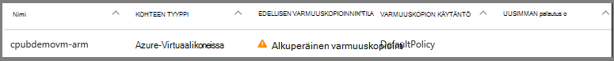
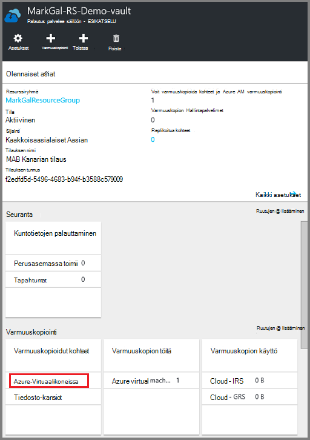
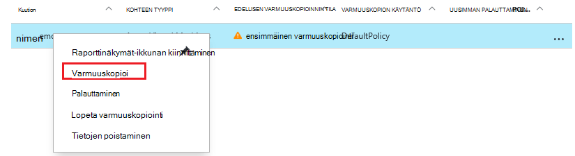
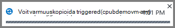
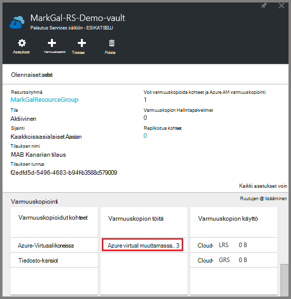
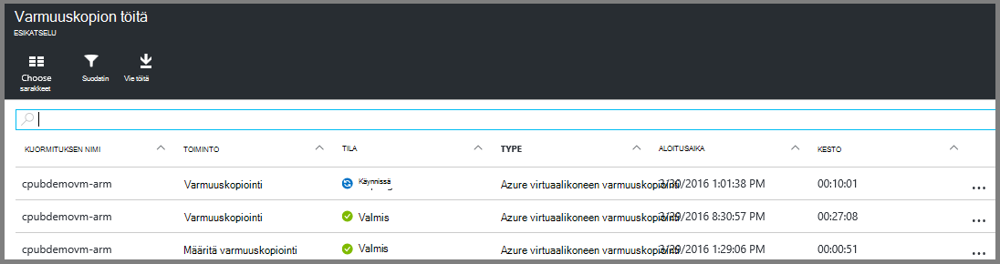

<properties
    pageTitle="Varmuuskopioi Azure VMs palautus Services säilöön | Microsoft Azure"
    description="Tutustu Rekisteröi ja varmuuskopioi Azuren näennäiskoneiden palautus-palveluiden säilö näitä toimintosarjoja Azure virtuaalikoneen varmuuskopion kanssa."
    services="backup"
    documentationCenter=""
    authors="markgalioto"
    manager="cfreeman"
    editor=""
    keywords="virtuaalikoneen varmuuskopiointi; virtual machine; varmuuskopiointi Varmuuskopiointi- ja tietojen palauttaminen; ARM AM varmuuskopiointi"/>

<tags
    ms.service="backup"
    ms.workload="storage-backup-recovery"
    ms.tgt_pltfrm="na"
    ms.devlang="na"
    ms.topic="article"
    ms.date="07/29/2016"
    ms.author="trinadhk; jimpark; markgal;"/>

# Varmuuskopioi Azure VMs palautus palvelut-säilö

> [AZURE.SELECTOR]
- [Varmuuskopioi VMs palautus palvelut-säilö](backup-azure-arm-vms.md)
- [Varmuuskopioi VMs varmuuskopiointi-säilö](backup-azure-vms.md)

Tässä artikkelissa kuvatulla tavalla, varmuuskopioimalla palautus Services säilö Azure VMs (sekä Resurssienhallinta on otettu käyttöön ja perinteinen on otettu käyttöön). Työn VMs varmuuskopioiminen useimpia siirtyy valmistelussa. Ennen kuin voit varmuuskopioida tai suojata AM, sinun on suoritettava [edellytykset](backup-azure-arm-vms-prepare.md) oman VMs suojaamisessa käytettävät lisätietoja ympäristön valmistelemisesta. Kun olet suorittanut edellytykset, voit aloittaa varmuuskopioidaan-toiminto ottaa yhteyttä AM tilannevedosten.

>[AZURE.NOTE] Azure on kaksi käyttöönoton mallien luominen ja käyttäminen resurssit: [Resurssienhallinta ja perinteinen](../resource-manager-deployment-model.md). Voit suojata Resurssienhallinta käyttöön VMs ja perinteinen VMs palautus Services vaults kanssa. Lisätietoja [Varmuuskopioi Azuren näennäiskoneiden](backup-azure-vms.md) perinteinen käyttöönoton mallin VMs käyttämiseen.

Lisätietoja on artikkeleissa [Azure AM varmuuskopio-infrastruktuuria suunnittelu](backup-azure-vms-introduction.md) ja [Azure-virtuaalikoneissa](https://azure.microsoft.com/documentation/services/virtual-machines/).

## Käynnistävä työn varmuuskopioiminen

Palautus palvelut-säilö liittyvän käytännön Varmuuskopioi määrittää, kuinka usein ja milloin varmuuskopiointi suoritetaan. Oletusarvon mukaan ensimmäisen ajoitettu varmuuskopiointi on alkuperäinen varmuuskopion. Ennen kuin ensimmäinen varmuuskopioinnin ilmenee, viimeisen varmuuskopioinnin tilan **Varmuuskopiointityöt** -sivu näyttää **Varoitus (alkuperäinen varmuuskopio odottaa)**.

Ellei Aloita hyvin pian määräaikana ensimmäisen varmuuskopion, on suositeltavaa, että suoritat **Varmuuskopioi**. Seuraavassa alkaa säilö Raporttinäkymät-ikkunan. Tämä toiminto on suorittamisen alkuperäinen varmuuskopiointityön, kun olet suorittanut kaikki edellytykset. Jos ensimmäinen varmuuskopiointityön on jo suoritettu, tämä toiminto ei ole käytettävissä. Liitetty varmuuskopion käytäntö määrittää seuraavan varmuuskopiointityön.  

Voit suorittaa alkuperäinen varmuuskopiointityön seuraavasti:

1. Valitse **Azuren näennäiskoneiden**säilö raporttinäkymien, **Varmuuskopiointi** -ruutu.  
    

    **Varmuuskopiointi-kohteita** -sivu avautuu.

2. Valitse **Varmuuskopiointi kohteet** -sivu säilöön, jonka haluat varmuuskopioida hiiren kakkospainikkeella ja valitse **Varmuuskopioi**.

    

    Työ käynnistyy.  

    

3. Voit tarkastella, että ensimmäinen varmuuskopiointi on valmis, säilö koontinäytössä **Varmuuskopiointityöt** -ruutu valitsemalla **Azure-virtuaalikoneissa**.

    

    Varmuuskopiointi työt-sivu avautuu.

4. **Varmuuskopiointi työt** -sivu näet kaikki töiden tilan.

    

    >[AZURE.NOTE] Varmuuskopiointi osana Azure varmuuskopion palvelun ongelmien vianmääritys kunkin virtual machine Tyhjennä kaikki kirjoituksia ja ota yhdenmukaisia tilannevedoksen varmuuskopion laajennuksen komennon.

    Kun varmuuskopiointityön on valmis, tila on *Valmis*.

## Vianmääritys
Jos käytössä ilmenee ongelmia, kun varmuuskopioiminen virtuaalikoneen ylös, lue lisätietoja [AM vianmääritysartikkeliin](backup-azure-vms-troubleshoot.md) ohjeita.

## Seuraavat vaiheet

Nyt kun olet suojannut oman AM, Kuittaa ulos seuraavissa artikkeleissa varten muita toimintoja, voit tehdä oman VMs ja palauttaminen VMs.

- [Hallinta ja että näennäiskoneiden valvonta](backup-azure-manage-vms.md)
- [Palauttaa näennäiskoneiden](backup-azure-arm-restore-vms.md)
