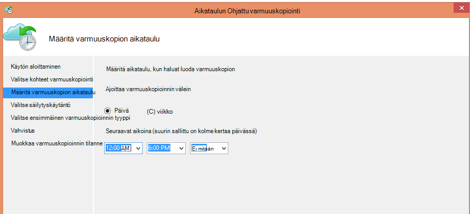
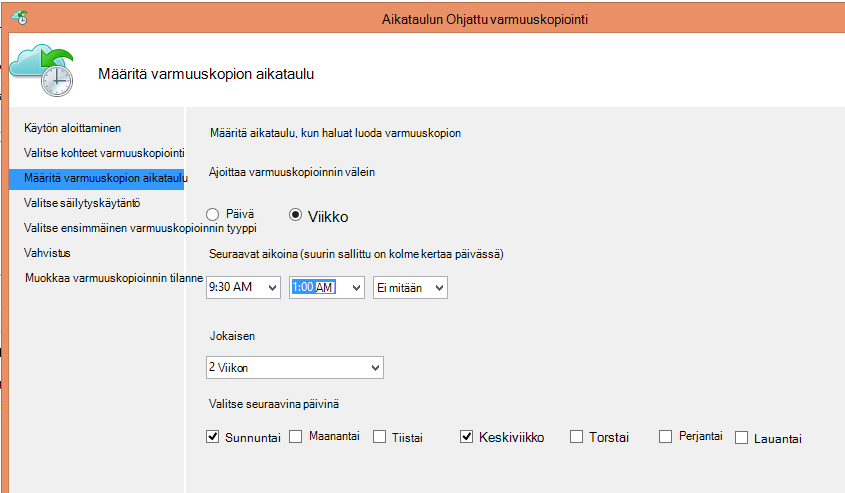
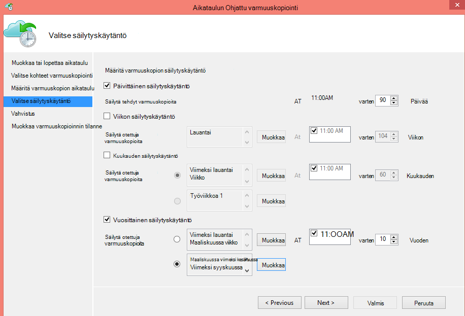
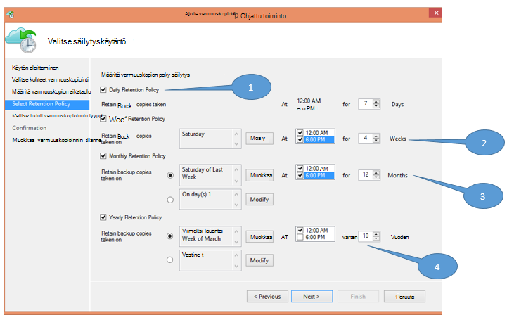
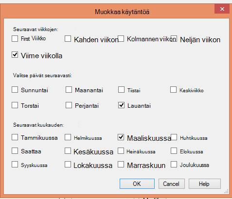

<properties
   pageTitle="Korvaa nauha-infrastruktuurin Azure varmuuskopioinnin avulla | Microsoft Azure"
   description="Lue, miten Azure varmuuskopion tarjoaa nauha kaltaisessa semantiikkaan liittyvien, jonka avulla voit varmuuskopioida ja palauttaa Azure tiedot"
   services="backup"
   documentationCenter=""
   authors="trinadhk"
   manager="vijayts"
   editor=""/>
<tags
   ms.service="backup"
   ms.devlang="na"
   ms.topic="article"
   ms.tgt_pltfrm="na"
   ms.workload="storage-backup-recovery"
   ms.date="09/27/2016"
   ms.author="jimpark;trinadhk;markgal"/>

# Azure varmuuskopioinnin avulla voit korvata nauha-infrastruktuuri

Azure varmuuskopiointi- ja System Center tietojen suojauksen hallinta asiakkaat voivat

- Varmuuskopioi tiedot aikatauluja, jotka sopivat parhaiten organisaation tarpeiden mukaan.
- Säilytä varmuuskopiotiedot pitkällä
- Varmista Azure niiden pitkään säilyttäminen osa on (sijaan nauha).

Tässä artikkelissa kerrotaan, kuinka asiakkaat voivat saada varmuuskopiointi-ja säilytys. Asiakkaat, jotka käyttävät nauha sähköpostiosoite niiden pitkän-aikavälillä-säilyttäminen tarvitsee on nyt tehokkaita ja kannattavia vaihtoehtoinen käytettävissä tätä ominaisuutta. Ominaisuus on käytössä uusin versio Azure varmuuskopion (joka on saatavilla [tähän](http://aka.ms/azurebackup_agent)). System Center DPM asiakkaiden on päivitettävä, vähintään DPM 2012 R2 UR5 ennen kuin käytät DPM Azure varmuuskopiointi-palvelussa.

## Mikä on varmuuskopioinnin aikatauluun?
Varmuuskopioinnin aikataulu osoittaa varmuuskopiointia taajuus. Esimerkiksi seuraavassa ruudussa asetukset osoittavat, että varmuuskopiot otetaan päivittäin kello 6 ja keskiyöhön.

Asiakkaat voivat ajoittaa myös viikoittain varmuuskopion. Esimerkiksi seuraavassa ruudussa asetukset osoittavat, että varmuuskopiot otetaan jokaisen vaihtoehtoinen sunnuntai & keskiviikko osoitteessa 9 6.30 – 1:00 AM.

## Mikä on säilytyskäytäntö?
Säilytyskäytännön määrittää keston, jonka varmuuskopio on tallennettu. Sen sijaan, että vain määrittäminen "tasainen käytäntöä" varmuuskopion pisteiden, asiakkaat voit määrittää eri säilytyskäytännöt varmuuskopioinnin otettaessa perusteella. Ottaa päivittäin, varmuuskopion piste, jota on toiminnassa palautus-piste, esimerkiksi säilytetään 90 päivää. Ottaa valvonta tarkoituksiin kunkin vuosineljänneksen lopussa varmuuskopion pisteen säilytetään pidentää kestoa.

"Säilytys pistettä" tämän käytännön kokonaismäärä on 90 (päivittäin pistettä) + 40 (yksi kullekin neljännesvuoden 10 vuotta) = 130.

## Esimerkki – laajennettujen molemmat yhdessä

1. **Päivittäinen säilytyskäytäntö**: varmuuskopiot päivittäin otettava tallennetaan seitsemän päivän ajan.
2. **Viikoittainen säilytyskäytäntö**: ottaa päivittäin keskiyön ja 6 PM lauantai varmuuskopioiden säilytetään neljän viikon ajan
3. **Kuukausittainen säilytyskäytäntö**: varmuuskopioiden otettava keskiyön ja 6 pm kunkin kuukauden viimeisen lauantaihin säilytetään 12 kuukautta
4. **Vuosittainen säilytyskäytäntö**: varmuuskopioiden otettava jokaisen maaliskuun viimeinen lauantai keskiyöhön säilytetään 10 vuotta

"Säilytys pisteiden" kokonaismäärä (pistettä, josta asiakas voi palauttaa tietoja) edellä olevassa kaaviossa lasketaan seuraavasti:

- kaksi osoittaa seitsemän päivää = 14 päivää kohden palautus pisteet
- kaksi osoittaa viikossa neljän viikon = 8 palautus pisteet
- kaksi osoittaa 12 kuukautta = 24 kuukautta kohti palautus pisteet
- yhden pisteen per vuosi per 10 vuotta = 10 palautus animoiminen

Palautus pisteiden kokonaismäärän on 56.

> [AZURE.NOTE] Azure varmuuskopiointi ei rajoitus palautus pisteiden lukumäärä.

## Määritysten Lisäasetukset
Valitsemalla **Muokkaa** edellisen näytön asiakkaiden on edelleen joustavuutta säilytysaikatauluja.

## Seuraavat vaiheet
Saat lisätietoja Azure varmuuskopio:

- [Johdanto Azure varmuuskopiointi](backup-introduction-to-azure-backup.md)
- [Kokeile Azure varmuuskopiointi](backup-try-azure-backup-in-10-mins.md)
