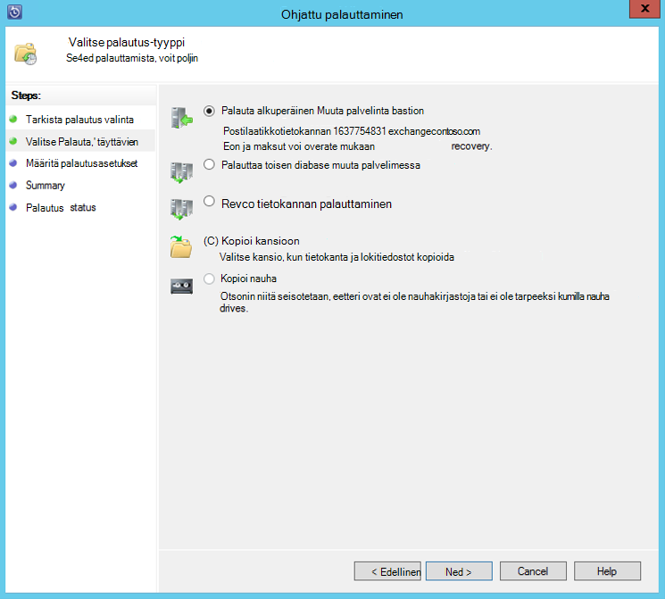

<properties
    pageTitle="Varmuuskopioi Azure-varmuuskopioiminen System Center 2012 R2 DPM Exchange-palvelimen | Microsoft Azure"
    description="Lue, miten voit varmuuskopioida Azure varmuuskopio käyttämällä System Center 2012 R2 DPM Exchange-palvelimessa"
    services="backup"
    documentationCenter=""
    authors="MaanasSaran"
    manager="NKolli1"
    editor=""/>

<tags
    ms.service="backup"
    ms.workload="storage-backup-recovery"
    ms.tgt_pltfrm="na"
    ms.devlang="na"
    ms.topic="article"
    ms.date="08/15/2016"
    ms.author="anuragm;jimpark;delhan;trinadhk;markgal"/>

# Exchange-palvelimessa varmuuskopioida System Center 2012 R2 DPM Azure-varmuuskopioiminen
Tässä artikkelissa käsitellään System Center 2012 R2: n tietojen suojauksen hallinta (DPM) palvelimen varmuuskopioiminen Microsoft Exchange server Azure varmuuskopioinnin määrittäminen.  

## Päivitykset
Voit rekisteröidä onnistuneesti DPM server Azure varmuuskopioimalla, sinun on asennettava uusin päivityskokoelma System Center 2012 R2 DPM ja Azure Backup Agent uusimman version. Hanki uusin päivityskokoelma [Microsoft-luettelossa](http://catalog.update.microsoft.com/v7/site/Search.aspx?q=System%20Center%202012%20R2%20Data%20protection%20manager).

>[AZURE.NOTE] Tämän artikkelin esimerkkejä Azure Backup Agent 2.0.8719.0 versio on asennettu ja päivityskokoelma 6 on asennettu System Center 2012 R2 DPM.

## Edellytykset
Ennen kuin jatkat, varmista, että kaikki Microsoft Azure varmuuskopioinnin avulla voit suojata työmääriä [edellytykset](backup-azure-dpm-introduction.md#prerequisites) täyttyvät. Nämä edellytykset ovat seuraavat:

- Varmuuskopion säilö Azure-sivustossa on luotu.
- Agentti ja säilöön tunnistetiedot on ladattu DPM palvelimeen.
- Agentti on asennettu DPM-palvelimeen.
- Säilö tunnistetietojen käytettiin rekisteröidä DPM palvelimeen.
- Jos suojaat Exchange 2016, Päivitä DPM 2012 R2 UR9 tai uudempi versio

## DPM protection-agentti  
Asenna DPM protection-agentti Exchange-palvelimeen, toimi seuraavasti:

1. Varmista, palomuurit on määritetty oikein. Kohdassa [Määritä palomuuripoikkeukset agentti](https://technet.microsoft.com/library/Hh758204.aspx).

2. Asenna agentti Exchange-palvelimeen valitsemalla **hallinta > agenttien vuoksi > Asenna** DPM järjestelmänvalvojan konsolissa. Saat yksityiskohtaiset ohjeet [asentaa DPM protection-agentti](https://technet.microsoft.com/library/hh758186.aspx?f=255&MSPPError=-2147217396) .

## Luo Exchange-palvelimen suojaus-ryhmä

1. DPM järjestelmänvalvojan konsolissa **Suojaus**ja valitse sitten **Uusi** työkalu avaa **Luo uusi ryhmä-suojauksen** ohjattu valintanauhan.

2. Valitse **ohjatun toiminnon aloitusnäyttö** **Seuraava**.

3. **Valitse Suojaus-ryhmätyyppi** näytössä Valitse **palvelimia** ja valitse **Seuraava**.

4. Valitse Exchange server-tietokantaan, jonka haluat suojata, ja valitse **Seuraava**.

    >[AZURE.NOTE] Jos suojaat Exchange 2013, tarkista [Exchange 2013 edellytykset](https://technet.microsoft.com/library/dn751029.aspx).

    Seuraavassa esimerkissä Exchange 2010-tietokannan on valittuna.

    

5. Valitse tiedot-suojaustapa.

    Suojaus-ryhmä nimi ja valitse sitten toinen seuraavista vaihtoehdoista:

    - Haluan lyhytkestoinen suojaus-levyn avulla.
    - Haluan online suojaus.

6. Valitse **Seuraava**.

7. Valitse **Suorita Eseutil tarkistamaan tietojen eheys** -vaihtoehto, jos haluat tarkistaa Exchange Server-tietokannat eheys.

    Kun valitset tämän vaihtoehdon, varmuuskopion yhtenäisyyden tarkistaminen suoritetaan palvelimessa DPM välttää i/o liikenteestä, joka on luonut Exchange-palvelimessa **eseutil** -komennon.

    >[AZURE.NOTE]Voit käyttää tätä asetusta, voit kopioida Ese.dll ja Eseutil.exe tiedostot C:\Program Files\Microsoft System Center 2012 R2\DPM\DPM\bin-kansiossa DPM-palvelimessa. Muussa tapauksessa käynnistyy seuraavan virheilmoituksen:  
    

8. Valitse **Seuraava**.

9. Valitse tietokanta **Kopioi**varmuuskopion ja valitse sitten **Seuraava**.

    >[AZURE.NOTE] Jos et valitse "Varmuuskopiot" vähintään yksi DAG kopiota tietokannan, lokit ei katkaistaan.

10. Tavoitteiden määrittäminen **lyhytkestoinen varmuuskopiointi**ja valitse sitten **Seuraava**.

11. Tarkista vapaata kiintolevytilaa ja valitse sitten **Seuraava**.

12. Valitse aika, jolla DPM palvelimen luodaan ensimmäisen replikoinnin ja valitse sitten **Seuraava**.

13. Yhdenmukaisuuden valintaruudun asetukset ja valitse sitten **Seuraava**.

14. Valitse tietokanta, jonka haluat varmuuskopioida Azure ja valitse sitten **Seuraava**. Esimerkki:

    

15. Määritä **Azure varmuuskopiointi**aikataulua ja valitse sitten **Seuraava**. Esimerkki:

    

    >[AZURE.NOTE] Huomaa Online palautus pisteiden perustuvat express täysi palautus pistettä. On vuoksi ajoittaa online palautuspiste ajan, joka on määritetty express täydellinen palautus kohdan jälkeen.

16. Säilytyskäytännön määrittäminen **Azure varmuuskopiointi**ja valitse sitten **Seuraava**.

17. Replikoinnin online-vaihtoehto ja valitse **Seuraava**.

    Jos sinulla on tietokanta on suuri, se saattaa kestää kauan alkuperäinen varmuuskopion luominen verkossa. Voit välttää tämän ongelman, voit luoda offline-tilassa varmuuskopion.  

    

18. Vahvista asetukset ja valitse sitten **Luo ryhmä**.

19. Valitse **Sulje**.

## Exchange-tietokannan palauttaminen

1. Palauttaa Exchange-tietokantaa, valitse **palautus** DPM järjestelmänvalvojan konsolissa.

2. Etsi Exchange-tietokanta, jonka haluat palauttaa.

3. Valitse online palautus-kohdan *Palautumisaika* avattavasta luettelosta.

4. Valitse Käynnistä **Ohjattu palauttaminen** **palauttaa** .

Kohdeosoite online palautus on viisi palautus-tyyppiä:

- **Palauttaminen alkuperäiseen Exchange Server-sijaintiin:** Tietoja palautetaan alkuperäisen Exchange-palvelimeen.
- **Palauttaa toisen tietokannan Exchange-palvelimessa:** Tiedot voidaan palauttaa toisen tietokannan toisen Exchange-palvelimessa.
- **Yhteyden palauttaminen tietokantaan palauttaa:** Tietoja voi palauttaa, Exchange palauttaminen tietokantaan (RDB).
- **Kopioi verkkokansioon:** Tietoja palautetaan verkkokansioon.
- **Kopioi nauha:** Jos sinulla on nauha kirjastoon tai erillinen nauha-asema, joka on liitetty ja määrittänyt DPM palvelimelle, palautus-kohdan kopioidaan vapaa nauha.

    

## Seuraavat vaiheet

- [Azure varmuuskopion usein kysytyt kysymykset](backup-azure-backup-faq.md)
