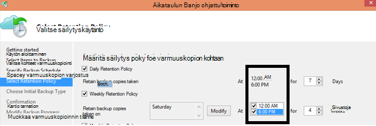

<properties
   pageTitle="Azure varmuuskopion usein kysytyt kysymykset | Microsoft Azure"
   description="Etsi vastauksia usein kysyttyihin kysymyksiin varmuuskopion palvelu, backup agentti, varmuuskopiointi- ja säilytys-palautus, suojaus ja muut usein kysyttyihin kysymyksiin varmuuskopiointi- ja tietojen palauttaminen."
   services="backup"
   documentationCenter=""
   authors="markgalioto"
   manager="jwhit"
   editor=""
   keywords="Varmuuskopiointi- ja tietojen palauttaminen; Varmuuskopiointi-palvelu"/>

<tags
   ms.service="backup"
   ms.workload="storage-backup-recovery"
     ms.tgt_pltfrm="na"
     ms.devlang="na"
     ms.topic="get-started-article"
     ms.date="10/21/2016"
     ms.author="trinadhk; giridham; arunak; markgal; jimpark;"/>

# <a name="azure-backup-service--faq"></a>Azure varmuuskopiointi palvelun usein kysytyt kysymykset


Tässä artikkelissa on luettelo usein kysytyt kysymykset (ja vastaaviin vastauksia) Azure varmuuskopiointi-palvelusta. Yhteisön vastaukset nopeasti, ja jos kysymys on usein kysytyt, lisäämme se tässä artikkelissa. Vastauksia kysymyksiin viittaus on yleensä tai tukitiedot. Voit kysyä kysymyksiä Azure varmuuskopiointi tämän artikkelin tai liittyvässä artikkelissa Disqus-osassa. Voit myös lähettää kysymyksiä Azure varmuuskopiointi-palvelun [tuoteluettelon](https://social.msdn.microsoft.com/forums/azure/home?forum=windowsazureonlinebackup).


## <a name="what-is-the-list-of-supported-operating-systems-from-which-i-can-back-up-to-azure-using-azure-backup-br"></a>Tuetut käyttöjärjestelmät, josta voit varmuuskopioida Azure Azure varmuuskopioinnista, luettelo-ominaisuudet <br/>
Azure varmuuskopiointi tukee käyttöjärjestelmät seuraavassa luettelossa tiedostokansio Varmuuskopiointi-sovelluksen varmuuskopio käyttämällä Azure varmuuskopio-palvelimen nimen ja SCDPM.

| Käyttöjärjestelmä        | Käyttöympäristö           | TUOTE  |
| :------------- |-------------| :-----|
| Windows 8: ssa ja uusimmat SPs      | 64-bittinen | Yrityksen, Pro |
| Windows 7 ja uusimmat SPs      | 64-bittinen | Ultimate, yrityksen, Professional ja Home Premium-Home Basic-Starterissa |
| Windows 8.1- ja uusimmat SPs | 64-bittinen      |    Yrityksen, Pro |
| Windows 10: ssä      | 64-bittinen | Enterprise-, Pro-kotisivu |
|Windows Server 2012 R2 ja uusimmat SPs| 64-bittinen| Vakio-Palvelinkeskukseen, Foundation|
|Windows Server 2012 ja uusimmat SPs|    64-bittinen| Palvelinkeskukseen, Foundation-standardin|
|Windows Storage Server 2012 R2 ja uusimmat SPs  |64-bittinen|    Vakio-työryhmä|
|Windows Storage Server 2012 ja uusimmat SPs |64-bittinen |Vakio-työryhmä
|Windows Server 2012 R2 ja uusimmat SPs  |64-bittinen|    Olennaiset|
|Windows Server 2008 R2 SP1 |64-bittinen|    Vakio, yrityksen, Palvelinkeskukseen, Foundation|
|Windows Server 2008: n SP2:    |64-bittinen|    Vakio, yrityksen, Palvelinkeskukseen, Foundation|

Azure AM varmuuskopioinnista

- **Linux**: Azure varmuuskopiointi tukee [luettelo, joka on vahvistettava Azure jaot](../virtual-machines/virtual-machines-linux-endorsed-distros.md) Core OS Linux lukuun ottamatta.  Tuo-Your-omistaja-Linux muiden jaot myös ehkä toimi, kunhan AM-agentti ei ole käytettävissä virtuaalikoneen ja tuki Python olemassa.
- **Windows Server**: Windows Server 2008 R2 vanhemmat versiot eivät ole tuettuja.

## <a name="where-can-i-download-the-latest-azure-backup-agent-br"></a>Mistä voin ladata uusimman Azure Backup agent? <br/>
Voit ladata uusimman agentti varmuuskopioiminen Windows Server, System Center DPM tai Windows-asiakasohjelmaan [täältä](http://aka.ms/azurebackup_agent). Jos haluat varmuuskopioida virtual machine, käytä AM agentti (joka asentuu automaattisesti ERISNIMI-tunniste). AM-agentti on jo luotu Azure valikoimasta näennäiskoneiden.

## <a name="which-version-of-scdpm-server-is-supported-br"></a>Mitä SCDPM Serverin versiota tuetaan? <br/>
Suosittelemme, että asennat [uusimman](http://aka.ms/azurebackup_agent) Azure Backup agent SCDPM uusin päivityskokoelma (elokuu 2016 vuodesta UR11)

## <a name="when-configuring-the-azure-backup-agent-i-am-prompted-to-enter-the-vault-credentials-do-vault-credentials-expire"></a>Azure Backup agent määritettäessä saan kehotteen ja kirjoita säilö tunnistetiedot. Säilö tunnistetietojen käyttöoikeus?
Kyllä, säilö tunnistetietojen vanhenevat 48 tuntia. Jos tiedosto vanhenee, kirjaudu sisään Azure-portaaliin ja säilöön tunnistetiedot tiedostojen lataaminen oman säilöstä.

## <a name="is-there-any-limit-on-the-number-of-vaults-that-can-be-created-in-each-azure-subscription-br"></a>Onko olevien vaults, joka voidaan luoda jokaisen Azure tilauksen määrän määrää rajoitettu? <br/>
Kyllä. Vuodesta syyskuu 2016 voit luoda 25 varmuuskopion vaults tilauskohtaisten. Voit luoda enintään 25 palautus Services vaults Azure varmuuskopiointi tilauskohtaisten tuetut kunkin alueittain. Jos tarvitset lisää vaults, Luo uusi tilaus.

## <a name="are-there-any-limits-on-the-number-of-serversmachines-that-can-be-registered-against-each-vault-br"></a>Mitä tahansa rajoitukset palvelimia/koneet, joita voi rekisteröidä vastaan kunkin säilö määrän? <br/>
Kyllä, voit rekisteröidä enintään 50 koneet säilö kohden. Azure IaaS näennäiskoneiden on 200 VMs säilö kohden. Jos haluat rekisteröidä Lisää koneet, Luo uusi säilö.

## <a name="how-do-i-register-my-server-to-another-datacenterbr"></a>Miten palvelin toiseen palvelinkeskukseen rekisteröidä?<br/>
Palautettavat tiedot lähetetään säilö, johon se on rekisteröity palvelinkeskukseen. Voit muuttaa sen palvelinkeskuksen helpoin tapa on agentti ja agentti Asenna ja rekisteröi uusi säilö, joka kuuluu haluamasi palvelinkeskukseen.

## <a name="what-happens-if-i-rename-a-windows-server-that-is-backing-up-data-to-azurebr"></a>Mitä tapahtuu, jos Windows-palvelin, jossa on varmuuskopioimalla tiedot Azure nimetä uudelleen?<br/>
Kun nimeät palvelimeen, kaikki määritettyjen varmuuskopiot pysäytetään.
Sinun täytyy rekisteröidä uusi nimi palvelimen varmuuskopiointi säilö. Kun luot uuden rekisteröinti, ensimmäinen varmuuskopiointi on varmuuskopiot ja ei lisäävän varmuuskopioinnin. Jos haluat palauttaa tietoja, jotka on aiemmin varmuuskopioinut säilö vanha palvelimen nimen kanssa, voit palauttaa **Palauta** ohjatun [**toiseen palvelimeen**](backup-azure-restore-windows-server.md#recover-to-an-alternate-machine) -toiminnolla tiedot.

## <a name="what-types-of-drives-can-i-backup-files-and-folders-from-br"></a>Minkä tyyppisiä asemat voit varmuuskopioida tiedostot ja kansiot? <br/>
Seuraavat joukko asemat ja asemat eivät pääse varmuuskopio:

- Siirrettävässä tietovälineessä: Asema on raportoitava kiinteä on käytettävä varmuuskopion kohteen lähde.
- Vain luku-asemat: äänenvoimakkuuden on oltava kirjoitettava aseman varjostus kopio-palvelun (VSS)-funktion.
- Offline-tilassa asemat: Äänenvoimakkuuden on oltava online VSS-funktiolle.
- Verkkoresurssista: äänenvoimakkuuden on oltava paikallinen varmuuskopioitavien varmuuskopioinnista online-palvelimeen.
- BitLocker suojatun asemat: äänenvoimakkuuden on oltava lukitus, ennen kuin varmuuskopiointi voi ilmetä.
- Järjestelmän tiedostotunniste: NTFS on vain tiedostojärjestelmän tueta tässä versiossa varmuuskopion online-palvelun.

## <a name="what-file-and-folder-types-can-i-back-up-from-my-serverbr"></a>Tiedostojen ja kansioiden mitä voit varmuuskopioida omat palvelimesta?<br/>
Tukee seuraavia:

- Salattu
- Pakattu
- Lyhyet
- Pakattu + lyhyet
- Linkit: Ei tueta, ohitettu
- Uudelleenjäsennyskohta: Ei tueta, ohitettu
- Salattu + pakattu: Ei tueta, ohitettu
- Salatun + lyhyet: Ei tueta, ohitettu
- Pakattu virta: Ei tueta, ohitettu
- Lyhyet muodossa: Ei tueta, ohitetaan

## <a name="whats-the-minimum-size-requirement-for-the-cache-folder-br"></a>Vähimmäiskokovaatimus välimuistin kansion ominaisuudet <br/>
Välimuistikansion kokoa määrittää varmuuskopioidaan tietojen määrään. Välimuistikansion pitäisi olla 5 prosenttia tietojen tallentamista varten tarvittava tila.

## <a name="if-my-organization-has-one-vault-how-can-i-isolate-one-servers-data-from-another-server-when-restoring-databr"></a>Jos organisaation on yksi säilöön, kuinka voin erottaa yhden palvelimen tiedot toisesta palvelimesta kun tietojen palauttaminen?<br/>
Jokaisessa palvelimessa, joka on rekisteröity saman säilö palauttaa muiden palvelimissa *, jotka käyttävät samaa salasana*varmuuskopioida tiedot. Jos sinulla on palvelinten varmuuskopiotiedot, jonka haluat erottaa organisaation muiden palvelimien, käytä nimettyjen salasana näiden palvelimia. Esimerkiksi Henkilöstöhallinto palvelinten käyttää yksi salauksen salasana accounting palvelinten toiseen ja tallennustilaa palvelinten kolmannen.

## <a name="can-i-migrate-my-backup-data-or-vault-between-subscriptions-br"></a>Voit "siirrän" Oma varmuuskopiotiedot tai säilö tilausten välillä? <br/>
Ei. Säilö luodaan tilauksen hierarkiatasolla ja ei voi määrittää uudelleen toiseen tilaukseen, kun se on luotu.

## <a name="does-the-azure-backup-agent-work-on-a-server-that-uses-windows-server-2012-deduplication-br"></a>Azure Backup-agentti toimi palvelimessa, joka käyttää Windows Server 2012 kopioinnin peruuttaminen <br/>
Kyllä. Agent-palvelu muuntaa Normaali tietojen deduplicated tiedot, kun se valmistelee varmuuskopiointia. Se optimoi varmuuskopiointi tiedot, salaa tiedot ja lähettää salattujen tietojen varmuuskopioinnin online-palvelua.

## <a name="if-i-cancel-a-backup-job-once-it-has-started-is-the-transferred-backup-data-deleted-br"></a>Jos Perun varmuuskopiointityön, kun se on alkanut, siirretyt palautettavat tiedot poistetaan? <br/>
Ei. Varmuuskopion säilö tallentaa varmuuskopioidut tiedot, jotka oli siirretty kohtaan peruutuksesta. Azure varmuuskopiointi käyttää tarkistuspiste järjestelmä lisää toisinaan tarkistuspisteet varmuuskopiotiedot varmuuskopioinnin aikana. Koska liittyy tarkistuspisteet varmuuskopiotiedot, seuraava varmuuskopiointia voit tarkistaa tiedostojen eheyden. Seuraava varmuuskopioinnin saatu olisi vaiheittainen tiedot, jotka oli ole varmuuskopioinut aikaisemmin päälle. Lisäävän varmuuskopioinnin tarjoaa paremman käyttö kaistanleveyttä niin, että sinun ei tarvitse siirtää samat tiedot toistuvasti.

Kun työ on peruutettu, siirretyt tiedot ohitetaan Azure AM varmuuskopiointi- ja tuore varmuuskopio vaiheittainen tietoja voi siirtää aiemmin onnistuneen varmuuskopiointityön.

## <a name="why-am-i-seeing-the-warning-azure-backups-have-not-been-configured-for-this-server-even-though-i-had-scheduled-regular-backups-previously-br"></a>Miksi näen "Azure varmuuskopioita ei ole määritetty tälle palvelimelle" Varoitus, vaikka oli ajoitettu säännöllisen varmuuskopioinnin suunnittelu aiemmin? <br/>
Varoitus tapahtuu, kun paikallinen palvelimeen tallennettu aikataulun asetukset eivät ole sama kuin varmuuskopion säilö tallennetut asetukset. Kun tai palvelimen asetuksia on palautettu toimivaan tilaan, varmuuskopion aikatauluja voidaan menettää synkronointi. Jos näyttöön tulee tämä varoitus, [varmuuskopion käytännön määrittäminen uudelleen](backup-azure-manage-windows-server.md) ja valitsemalla sitten **Suorita Varmuuskopioi** synkronoitava paikallisen Azure palvelimeen uudelleen.

## <a name="what-firewall-rules-should-be-configured-for-azure-backup-br"></a>Mitä palomuurin säännöt muokkauskielelle Azure varmuuskopiointi? <br/>
Saumaton suojaus käyttöön-paikallisen-,-Azure ja työmäärää Azure-on suositeltavaa Salli palomuurin seuraavat URL-osoitteet yhteydessä:

- WWW.msftncsi.com
- \*. Microsoft.com-sivustosta
- \*. WindowsAzure.com
- \*. microsoftonline.com
- \*. windows.net

##<a name="can-i-install-the-azure-backup-agent-on-an-azure-vm-already-backed-by-the-azure-backup-service-using-the-vm-extension-br"></a>Voinko asentaa Azure Backup agent varmuuskopioidaan jo Azure varmuuskopiointi-palvelun käyttäminen AM-tunniste Azure-AM? <br/>
Täysin. Azure varmuuskopiointi tarjoaa AM tason varmuuskopiointi Azure VMs käyttäminen AM-tunniste. Voit asentaa Azure Backup agent Vieras Windows-Käyttöjärjestelmää, tiedostoja ja kansioita, Vieras OS suojaaminen.

## <a name="can-i-install-the-azure-backup-agent-on-an-azure-vm-to-back-up-files-and-folders-present-on-temporary-storage-provided-by-the-azure-vm-br"></a>Voinko asentaa Azure Backup agent Azure-AM haluat varmuuskopioida tiedostot ja kansiot esitä Azure AM myöntämä väliaikaisten? <br/>
Voit varmuuskopioida tiedostot ja kansiot väliaikaisten ja Azure Backup agent asentaminen Vieras Windows-Käyttöjärjestelmää. Ota Huomaa kuitenkin, että varmuuskopiot eivät toimi, kun väliaikaisten tiedot on tietojen poiston yhteydessä. Myös, jos väliaikaisten tiedot on poistettu, voit palauttaa vain haluat säilyvän.

## <a name="i-have-installed-azure-backup-agent-to-protect-my-files-and-folders-can-i-now-install-scdpm-to-work-with-azure-backup-agent-to-protect-on-premises-applicationvm-workloads-to-azure-br"></a>Asennan Azure Backup agentti suojaaminen Omat tiedostot ja kansiot. Voit nyt asentaa SCDPM Azure Backup agentti suojaaminen paikallisen sovelluksen/AM työmääriä, Azure-käyttöä varten? <br/>
Azure varmuuskopiointi käytettäväksi SCDPM, se on suositeltavaa SCDPM asenna ensin ja vasta sitten Asenna Azure Backup agentti. Tämä varmistaa saumattomasti Azure Backup agent SCDPM kanssa ja suojaaminen tiedostot ja kansiot, sovelluksen toiminnoista ja VMs Azure-SCDPM hallinta-konsolin avulla. Asentaminen SCDPM asennettuasi Azure varmuuskopiointi agentti edellä mainituista tarkoituksiin on vahinkojen tai ei tueta.

## <a name="what-is-the-length-of-file-path-that-can-be-specified-as-part-of-azure-backup-policy-using-azure-backup-agent-br"></a>Mikä on tiedostopolku, joka on määritetty osana Azure varmuuskopiointi käytännön avulla Azure Backup agentti pituuden? <br/>  
Azure Backup agentti on riippuvainen NTFS. [Tiedostopolku pituus määritykset rajoittavat Windows API](https://msdn.microsoft.com/library/aa365247.aspx#fully_qualified_vs._relative_paths). Jos Varmuuskopiointi-tiedostoja, joissa tiedoston polku pituus suurempi kuin määrittämää Windows API niistä asiakkaat voivat valita varmuuskopiointiin pääkansion tai levyaseman varmuuskopioiden.  

## <a name="what-characters-are-allowed-in-file-path-of-azure-backup-policy-using-azure-backup-agent-br"></a>Tiedostopolku Azure varmuuskopiointi käytännön avulla Azure Backup agentti sallitut merkit? <br>  
 Azure Backup agentti on riippuvainen NTFS. Sen avulla tiedostomäärityksen osana [NTFS tuettu merkkiä](https://msdn.microsoft.com/library/aa365247.aspx#naming_conventions) .  

## <a name="can-i-use-azure-backup-server-to-create-a-bare-metal-recovery-bmr-backup-for-a-physical-server-br"></a>Ajoneuvon metalli palauttaminen (BMR) varmuuskopion fyysinen palvelimen luominen Azure varmuuskopion palvelimen avulla? <br/>
Kyllä.

## <a name="can-i-configure-the-backup-service-to-send-mail-if-a-backup-job-fails-br"></a>Lähettää sähköpostia, jos varmuuskopiointityön epäonnistuu varmuuskopiointi-palvelun määrittäminen <br/>
Kyllä, varmuuskopiointi-palvelu sisältää useita tapahtumaan perustuva ilmoituksia, jotka voidaan käyttää PowerShell-komentosarjaa. Katso täydellinen kuvaus- [ilmoitukset](backup-azure-manage-vms.md#alert-notifications)

## <a name="is-there-a-limit-on-the-size-of-each-data-source-being-backed-up-br"></a>Onko kunkin tietolähteen varmuuskopioidaan koon rajoitusta? <br/>
Kun säilö tasolla ei ole, voit varmuuskopioida tietojen määrää rajoitettu, Azure varmuuskopion määrätä rajoitus (kaikki käytännön tarkoituksiin nämä raja-arvot ovat erittäin suuri)-tietolähteen enimmäiskoon. Tuetut käyttöjärjestelmät enimmäiskoko tietolähde on elokuussa 2015:

|S.No | Käyttöjärjestelmä |  Tietolähteen enimmäiskoko |
| :-------------: |:-------------| :-----|
|1| Windows Server 2012: n tai uudemman| 54400 GT|
|2| Windows 8 tai uudempi| 54400 GT|
|3| Windows Server 2008, Windows Server 2008 R2 | 1700 GT|
|4| Windows 7: ssä | 1700 GT|

Seuraavassa taulukossa kerrotaan, miten kukin tietojen lähteen koko määräytyy.

|   Tietolähde  |   Tiedot |
| :-------------: |:-------------|
|Avauksen ja vaihdon |Yksittäisen asemasta palvelin tai asiakas-koneen varmuuskopioida määrä, jota|
|Hyper-V virtuaalikoneen | Summan kaikki varmuuskopioidaan virtuaalikoneen näennäiskiintolevyt tiedot.|
|Microsoft SQL Server-tietokantaan | Yksittäisen SQL-tietokannan koko varmuuskopioidaan koosta |
|Microsoft SharePoint |Summan alueella varmuuskopioidaan SharePoint-klusterin sisältö ja määritys-tietokannat.|
|Microsoft Exchange |Summan varmuuskopioidaan Exchange-palvelimessa kaikki Exchange-tietokannat.|
|BMR/järjestelmän tila |Jokainen yksittäisiä kopio varmuuskopioidaan koneen BMR tai järjestelmän kunto|

## <a name="are-there-limits-on-the-number-of-times-a-backup-job-can-be-scheduled-per-daybr"></a>Onko, kuinka monta kertaa varmuuskopiointityön voidaan ajoittaa päivässä rajoitukset?<br/>
Kyllä, voit suorittaa varmuuskopiointityön Windows Server- tai Windows-asiakasohjelman enintään kolme kertaa päivässä. Voit suorittaa varmuuskopiointityön System Center DPM kahdesti päivässä ylöspäin. Voit suorittaa varmuuskopiointityön varten IaaS VMs kerran päivässä.

## <a name="is-there-a-difference-between-the-scheduling-policy-for-dpm-and-windows-server-ie-on-windows-server-without-dpm-br"></a>Onko DPM ajoituksen käytäntö ja Windows Server (eli-Windows Server ilman DPM) välinen ero? <br/>
Kyllä. Käytä DPM, voit määrittää päivittäin, viikoittain, kuukausittain ja vuosittaisen aikatauluja. Windows Server (ilman DPM) avulla voit määrittää vain päivittäin ja viikoittain aikatauluja.

## <a name="is-there-a-difference-between-the-retention-policy-for-dpm-and-windows-serverclient-ie-on-windows-server-without-dpmbr"></a>Onko DPM säilytyskäytäntö ja Windows Server/client (eli käytössä Windows Server ilman DPM) välinen ero?<br/>
Ei, sekä DPM ja Windows Server-/ asiakas on päivittäin, viikoittain, kuukausittain ja vuosittaisen säilytyskäytäntöjä.

## <a name="can-i-configure-my-retention-policies-selectively--ie-configure-weekly-and-daily-but-not-yearly-and-monthlybr"></a>Voin määrittää omat säilytys käytännöt valikoivasti – eli määrittäminen viikoittain ja päivittäin, mutta ei vuosittain ja kuukausittain?<br/>
Kyllä, Azure varmuuskopiointi säilytys rakenteen avulla voit on koko sivuston määrittäminen säilytyskäytäntö tarpeen mukaan.

## <a name="can-i-schedule-a-backup-at-6pm-and-specify-retention-policies-at-a-different-timebr"></a>Voit "ajoittaa varmuuskopioinnin" kello 6 ja määrittää "säilytyskäytännöt" eri aikaan?<br/>
Ei. Säilytyskäytännöt voi käyttää vain varmuuskopion pistettä. Säilytyskäytännön on määritetty otettava 12 am ja 6 pm varmuuskopioiden hakeminen seuraavan kuvan mukaisesti. <br/>


<br/>

## <a name="is-an-incremental-copy-transferred-for-the-retention-policies-scheduled-br"></a>Vaiheittainen kopio on siirretty, ajoitettu säilytyskäytännöt <br/>
Ei, vaiheittainen kopion ei lähetetä varmuuskopioinnin ajoitus-sivulla mainitusta ajan perusteella. Pisteet, joita voidaan säilyttää, millaisia säilytyskäytäntö perusteella.

## <a name="if-a-backup-is-retained-for-a-long-duration-does-it-take-more-time-to-recover-an-older-data-point-br"></a>Jos varmuuskopion säilyttää pitkän ajan, menee enemmän aikaa palauttamaan vanhempia arvopiste? <br/>
 Ei – aika, joka palauttaa vanhimmasta tai uusin piste on sama. Kunkin palautuspiste-funktio vastaa koko kohtaa.

## <a name="if-each-recovery-point-is-like-a-full-point-does-it-impact-the-total-billable-backup-storagebr"></a>Jos kunkin palautuspiste on esimerkiksi koko kohtaa, se vaikuttaa laskutettavan varmuuskopion kokonaistallennustila?<br/>
Tyypillinen pitkään säilytys pisteen tuotteiden tallentaa varmuuskopiotiedot koko pistettä. Koko pisteet ovat tallennustilan *tehotonta* , mutta ne ja nopeuttaa palauttaminen. Vaiheittainen kopiot ovat tallennustilan *tehokasta* , mutta edellyttää, että palauttaa tietoja, jotka vaikuttaa palautus päätät ajastasi yhdistettyjen. Azure varmuuskopiointi tallennustilan arkkitehtuuri tutustutaan sekä maailman paras optimaalisesti tallentamalla tiedot nopeasti palauttaa ja sille vähän tallennustilaa kustannukset. Tietoja tallennustilan tämän menetelmän varmistetaan, että tunkeutumisen ja ulospääsy kaistanleveys on käytetty tehokkaasti. Tietoja tallennustilan ja voit palauttaa tiedot, tarvittava aika on käytettävissä pienenä. Lue lisätietoja siitä, miten [lisäävän varmuuskopioinnin](https://azure.microsoft.com/blog/microsoft-azure-backup-save-on-long-term-storage/) Tallenna ovat tehokas.

## <a name="is-there-a-limit-on-the-number-of-recovery-points-that-can-be-createdbr"></a>Onko palautus pisteet, joita voidaan luoda määrän rajoitusta?<br/>
Ei. Olemme palautus animoiminen rajoitukset on poistettu. Voit luoda mahdollisimman paljon palautus pisteitä Microsoftiin.

## <a name="why-is-the-amount-of-data-transferred-in-backup-not-equal-to-the-amount-of-data-i-backed-upbr"></a>Miksi tietojen määrää on siirretty varmuuskopiointi eri suuri kuin voin varmuuskopioida tietojen määrää?<br/>
 Kaikki tiedot, jotka varmuuskopioidaan Azure Backup agentti tai SCDPM tai Azure varmuuskopiointi Server on pakattu ja salattu ennen siirrettävän. Kun pakkaaminen ja salauksen otetaan käyttöön, tietojen varmuuskopioinnin säilö on 30 – 40 % pienempi.

## <a name="is-there-a-way-to-adjust-the-amount-of-bandwidth-used-by-the-backup-servicebr"></a>Onko voi säätää kaistanleveyden varmuuskopiointi-palvelu?<br/>
 Kyllä, käyttää **Ominaisuuksien muuttaminen** -vaihtoehto Backup Agent-kaistanleveyden. Säädä kaistanleveys ja ajat, kun käytät, että kaistanleveys. Lisätietoja on kohdassa [Verkon rajoitusta](../backup-configure-vault.md#enable-network-throttling).

## <a name="my-internet-bandwidth-is-limited-for-the-amount-of-data-i-need-to-back-up-is-there-a-way-i-can-move-data-to-a-certain-location-with-a-large-network-pipe-and-push-that-data-into-azure-br"></a>Internet-kaistanleveys on rajoitettu haluat varmuuskopioida tietomäärää varten. Onko tietojen tietyssä paikassa suuret verkon pipe ja push-tietojen tuominen Azure voit siirtää tavalla? <br/>
Voit varmuuskopioida tietojen tuominen Azure kautta standard online varmuuskopiointia tai Azure Tuo/Vie-palvelun avulla voit siirtää tietoja blob storage Azure-tietokannassa. On ei ole muita tapoja saada varmuuskopion päivämäärän Azure varastoon. Lisätietoja siitä, miten voit käyttää Azure varmuuskopioimalla Azure Tuo/Vie-palvelua, [offline-tilassa varmuuskopiointi työnkulun](backup-azure-backup-import-export.md) -artikkelissa.

## <a name="how-many-recoveries-can-i-perform-on-the-data-that-is-backed-up-to-azurebr"></a>Kuinka monta saadut oleville tiedoille varmuuskopioidaan Azure voi suorittaa?<br/>
Ei ole rajoitettu saadut Azure varmuuskopiosta määrän.

## <a name="do-i-have-to-pay-for-the-egress-traffic-from-azure-data-center-during-recoveriesbr"></a>Onko minun Azure tietokeskuksen juniin tietoliikenteen aikana saadut maksaa?<br/>
 Ei. Oman saadut ovat ilmaisia ja juniin liikenne ei perittävän.

## <a name="is-the-data-sent-to-azure-encrypted-br"></a>Tiedot lähetetään Azure salattu? <br/>
Kyllä. Tiedot salataan käyttämällä AES256 paikallisen palvelimen ja asiakkaan/SCDPM tietokoneeseen ja tiedot lähetetään suojatun HTTPS-linkin kautta.

## <a name="is-the-backup-data-on-azure-encrypted-as-wellbr"></a>Onko varmuuskopiotiedot Azure salattu sekä?<br/>
 Kyllä. Azure lähetetyt tiedot säilyvät salattuja (ja muut). Microsoft ei salauksen varmuuskopiotiedot milloin tahansa. Azure varmuuskopion riippuvainen virtuaalikoneen salaamista eli jos että AM salataan Azure salauksen tai joitakin muita salaustekniikkaa Azure AM varmuuskopiointi-Azure varmuuskopio-salauksella, tietojen suojaamiseen.

## <a name="what-is-the-minimum-length-of-encryption-key-used-to-encrypt-backup-data-br"></a>Mikä on salausavain salataan varmuuskopiotiedot vähimmäispituus? <br/>
 Salausavaimen on oltava vähintään 16 merkkiä.

## <a name="what-happens-if-i-misplace-the-encryption-key-can-i-recover-the-data-or-can-microsoft-recover-the-data-br"></a>Mitä tapahtuu, jos voin misplace salausavaimen? Voinko palauttaa tiedot (tai) Microsoft palauttaa tiedot? <br/>
Palautettavat tiedot salataan avain on käytettävissä vain asiakas paikallinen. Microsoft ei enää Azure kopio ja ei ole mitään käyttää avainta. Jos asiakkaan misplaces avaimen, Microsoft ei voi palauttaa palautettavat tiedot.

## <a name="how-do-i-change-the-cache-location-specified-for-the-azure-backup-agentbr"></a>Miten voin muuttaa määritetty Azure Backup agent välimuistin sijaintia?<br/>
 Siirry peräkkäin luettelomerkeillä varustettu luettelo välimuistin sijainnin muuttaminen ohjeita.
- Pysäytä suorittamalla seuraavan komennon järjestelmänvalvojan oikeuksin suoritettava komentokehote Varmuuskopiointi-ohjelma:

  ```PS C:\> Net stop obengine```

- Älä siirrä tiedostoja. Sen sijaan kopioida välimuistin tila-kansion eri levyasemaa, jossa on tarpeeksi tilaa. Alkuperäinen välimuistissa välilyönti poistaa varmuuskopioista käsittelevät uuden välimuistin tilan vahvistamisen jälkeen.

- Päivitä seuraavat rekisterimerkinnät välimuistissa välilyönti kansion polku.<br/>

|Rekisteripolku | Rekisteriavain | Arvo |
| ------ | ------- | ------|
| `HKEY_LOCAL_MACHINE\SOFTWARE\Microsoft\Windows Azure Backup\Config` | ScratchLocation | *Uuden välimuistin kansiosijainti* |
| `HKEY_LOCAL_MACHINE\SOFTWARE\Microsoft\Windows Azure Backup\Config\CloudBackupProvider` | ScratchLocation | *Uuden välimuistin kansiosijainti* |

- Varmuuskopiointi-ohjelma uudelleen suorittamalla seuraavan komennon järjestelmänvalvojan oikeuksin suoritettava komentokehote:

  ```PS C:\> Net start obengine```

  Kun varmuuskopion luominen on suoritettu onnistuneesti välimuistin uuteen sijaintiin, voit poistaa alkuperäiseen kansioon.

## <a name="where-can-i-put-the-cache-folder-for-the-azure-backup-agent-to-work-as-expectedbr"></a>Jos välimuisti-kansio toimii odotetulla tavalla Azure Backup-agentti laittaa?<br/>
Ei suositella välimuisti-kansion seuraavista sijainneista:

- Jaa tai siirrettävässä tietovälineessä: välimuisti-kansio on oltava paikallinen palvelimeen, joka on oltava online varmuuskopioinnista varmuuskopioiminen. Verkkosijainnit tai siirrettävässä tietovälineessä, kuten USB-asemat eivät ole tuettuja.
- Offline-tilassa asemat: Välimuisti-kansio on oltava online arvioidut varmuuskopio käyttämällä Backup Azure-agentti.

## <a name="are-there-any-attributes-of-the-cache-folder-that-are-not-supportedbr"></a>Mitä tahansa välimuisti-kansion määritteet, joita ei tueta?<br/>
 Välimuistin-kansion ei tueta määritteet tai niiden yhdistelmiä:

- Salattu
- Poista kaksoiskappale
- Pakattu
- Lyhyet
- Uudelleenjäsennyskohta

On suositeltavaa, että kumpaakaan välimuisti-kansion metatiedot Näennäiskiintolevyn on määritteet yläpuolella Azure Backup agent arvioidut toimintaan.
