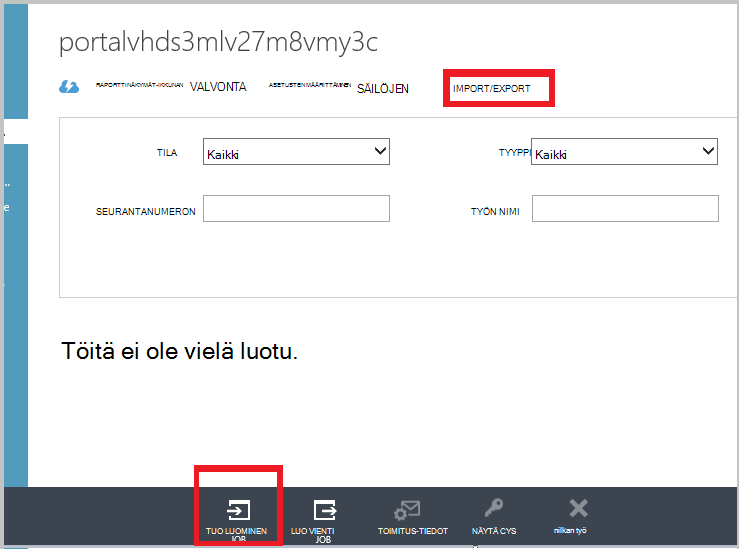

<properties
   pageTitle="Azure varmuuskopiointi - offline-tilassa varmuuskopiointi- ja Azure Tuo/Vie-palveluun alkuperäinen valuuttamuunnosten | Microsoft Azure"
   description="Katso, miten Azure varmuuskopion avulla voit lähettää tietoja ulos verkosta Azure Tuo/Vie-palvelun avulla. Tässä artikkelissa kerrotaan, offline-tilassa valuuttamuunnosten alkuperäisen varmuuskopiointitiedon Azure Tuo Vie-palvelun avulla."
   services="backup"
   documentationCenter=""
   authors="saurabhsensharma"
   manager="shivamg"
   editor=""/>
<tags
   ms.service="backup"
   ms.devlang="na"
   ms.topic="article"
   ms.tgt_pltfrm="na"
   ms.workload="storage-backup-recovery"
   ms.date="08/16/2016"
   ms.author="jimpark;saurabhsensharma;nkolli;trinadhk"/>

# Offline-tilassa varmuuskopiointi työnkulun Azure varmuuskopiointi
Azure varmuuskopiointi on useita valmiita tehokkuus, joka tallentaa tiedot Azure alkuperäinen koko varmuuskopioinnin aikana verkko- ja tallennustilaa kustannukset. Alkuperäinen koko varmuuskopiot yleensä siirtää suurten tietomäärien ja edellyttävät myöhemmin varmuuskopiot, jotka siirtävät vain deltas/incrementals verrattaessa kaistanleveys. Azure varmuuskopiointi pakkaa alkuperäinen varmuuskopiot. Luettelokohteiden offline-tilassa valuuttamuunnosten Azure varmuuskopion avulla levyjen lataaminen Azure pakattu alkuperäinen varmuuskopiotiedot offline-tilassa.  

Offline-tilassa valuuttamuunnosten prosessin Azure varmuuskopion on integroitu tiivisti [Azure Tuo/Vie-palvelu](../storage/storage-import-export-service.md) , jonka avulla voit siirtää tietoja Azure käyttämällä levyjä. Jos sinulla on teratavua (TBs), alkuperäinen varmuuskopiotiedot on siirretty viive ja hidas verkossa, voit offline-tilassa valuuttamuunnosten työnkulun toimitettavan alkuperäinen varmuuskopio vähintään yksi kiintolevyillä Azure palvelinkeskukseen. Tässä artikkelissa on yleiskatsaus vaiheet, jotka työnkulku on valmis.

## Yleiskatsaus

Offline-tilassa valuuttamuunnosten ominaisuuksien Azure varmuuskopiointi-ja Azure Tuo/Vie on yksinkertainen ladataan Azure tietoja offline-tilassa käyttämällä levyjä. Sen sijaan, että siirtäminen alkuperäisen koko kappaleen verkossa, varmuuskopiotiedot kirjoitetaan *väliaikaisen sijainti*. Kun väliaikaisen sijaintiin kopio on valmis Azure Tuo/Vie-työkalun avulla, tiedot kirjoitetaan vähintään yksi SATA asemat tietojen määrän mukaan. Nämä asemat toimitetaan myöhemmin lähimpään Azure palvelinkeskukseen.

[Elokuussa 2016 Päivitä Azure varmuuskopion (ja uudempi)](http://go.microsoft.com/fwlink/?LinkID=229525) sisältää *Azure levyn valmistelu työkalu*nimeltä AzureOfflineBackupDiskPrep, joka:

   - Auttaa asemat valmisteleminen Azure tuo Azure Tuo/Vie-työkalun avulla.
   - Luo automaattisesti Azure tuonti-työ Azure Tuo/Vie-palvelun [Azure perinteinen portal](https://manage.windowsazure.com) verrattuna luominen sama manuaalisesti Azure varmuuskopiointi aiempien versioiden kanssa.

Kun Azure varmuuskopiotiedot lataus on valmis, Azure varmuuskopion kopioi varmuuskopiotiedot varmuuskopion säilö ja lisäävän varmuuskopioinnin ajoitetaan.

  > [AZURE.NOTE] Azure-levyn valmistelu-työkalun käyttäminen varmistaa, jota olet asentanut elokuussa 2016-päivityksen Azure varmuuskopion (tai uudempi) ja kaikki työnkulun sitä toimien. Jos käytät Azure varmuuskopiointi vanhempi versio, voit valmistella SATA-asema Azure Tuo/Vie-työkalun avulla myöhemmin osissa on tämän artikkelin esitetyllä tavalla.

## Edellytykset

- [Tutustu Azure Tuo/Vie työnkulku](../storage/storage-import-export-service.md).
- Ennen kuin aloitetaan työnkulun, varmista seuraavat:
    - Azure varmuuskopiointi-säilö on luotu.
    - Säilö tunnistetiedot on ladattu.
    - Azure Backup agent on asennettu Windows Server ja Windows-asiakas-tai System Center tietojen suojauksen hallinta-palvelimelle ja tietokone on rekisteröity Azure varmuuskopiointi säilö.
- Tietokone, jonka aiot takaisin ylös tietojen [lataaminen Azure julkaista tiedoston-asetukset](https://manage.windowsazure.com/publishsettings) .
- Valmistele väliaikaisen sijainnin, joka voi olla jaettuun verkkoresurssiin tai muita asema tietokoneeseen. Väliaikaisen sijainti on lyhytkestoisia tallennus ja käyttämisestä on tämän työnkulun aikana. Varmista, että väliaikaisen sijainti on riittävästi levytilaa alkuperäinen kopio. Jos yrität Varmuuskopioi 500 Gigatavun tiedostopalvelimeen varmistaa, että väliaikainen alue on vähintään 500 Gigatavua. (Pienempi summa käytetään vuoksi pakkaamisen.)
- Varmista, että käytössä on tuettu asema. Tuo tai Vie-palvelun kanssa käytettäväksi tuetaan vain 3,5 tuuman SATA III tai II kiintolevyillä. Suurempi kuin 8 TT kiintolevyillä ei tueta. Voit liittää SATA III tai II DVD-levyllä ulkoisesti useimmissa tietokoneissa SATA II/III USB-sovittimen avulla. Ohjeissa asemista, joka tukee palvelun uusimman joukko Azure Tuo/Vie.
- Ota käyttöön BitLocker tietokoneessa, johon on liitetty SATA asema writer.
- [Lataa Azure Tuo/Vie-työkalu](http://go.microsoft.com/fwlink/?LinkID=301900&clcid=0x409) SATA asema, johon writer tietokoneeseen on yhdistetty. Tämä vaihe ei tarvita, jos olet ladannut ja asentanut elokuussa 2016 päivityksen Azure varmuuskopion (tai uudempi).

## Työnkulun
Tämän osan tietojen avulla voit suorittaa offline-tilassa varmuuskopiointi-työnkulun niin, että tietosi toimitettu Azure palvelinkeskukseen- ja ladata Azure-tallennustilan. Jos sinulla on kysyttävää tuonti-palvelua tai prosessin haluamallasi tavalla, on viitattu aiemmin [Tuo yleistä](../storage/storage-import-export-service.md) ohjeissa.

### Aloita offline-tilassa varmuuskopiointi

1. Kun ajoitat varmuuskopion, näkyviin tulee seuraava viesti (kohdassa Windows Server, Windows-asiakasohjelman tai System Center tietojen suojauksen hallinta).

    

    System Center tietojen suojauksen Managerin on vastaava näytön:  
    

    Syötteiden kuvaus on seuraavanlainen:

    - **Väliaikaisen sijainti**:, johon on kirjoitettu alkuperäinen varmuuskopio Väliaikainen tallennuspaikka. Tämä voi johtua jaettuun verkkoresurssiin tai paikallisessa tietokoneessa. Jos lähde ja kopioi tietokoneen eri, on suositeltavaa, että määrität koko verkkopolun väliaikaisen sijainnin.
    - **Azure tuo työn nimi**: Azure mitä tuomisessa palvelu ja Azure varmuuskopiointi seurata lähetettyjen tietojen siirto levyille Azure yksilöllinen nimi.
    - **Azure Julkaisuasetukset**: XML-tiedosto, joka sisältää tilauksen profiilin tietoja. Se sisältää myös suojatun tunnistetiedot, jotka liittyvät tilauksen. Voit [ladata tiedoston](https://manage.windowsazure.com/publishsettings). Anna Julkaise-asetustiedosto paikallinen polku.
    - **Azure Tilaustunnus**: Azure Tilaustunnus aiot aloittaa Azure tuo työ-tilausta. Jos sinulla on useita tilauksia Azure, käytä tilaus, jonka haluat liittäminen Tuontityön tunnus.
    - **Azure-tallennustilan tilin**: annettu Azure tilauksen, joka on liitetty Azure tuo työn perinteinen tyyppi tallennustilan tilin.
    - **Azure-tallennustilan säilö**: kohde tallennustilan blob-kohtaa, johon tämä työ tiedot on tuotu Azure-tallennustilan tilin nimi.

    > [AZURE.NOTE] Jos olet rekisteröinyt palvelimellesi Azure palautus palvelut-säilö, [Azure portal](https://portal.azure.com) -varmuuskopiot ja eivät ole Cloud ratkaisu Provider (CSP)-tilauksessa, voit edelleen perinteinen tyyppi-tallennustilan tilin luominen Azure-portaalista ja käyttää sitä offline-tilassa varmuuskopiointi-työnkulun.

    Tallentaa kaikki tiedot, koska haluat kirjoittamalla se uudelleen, valitse toimet. Vain *Väliaikainen sijainti* on pakollinen, jos valmisteleminen levyjen Azure levyn valmistelu-työkalun avulla.    

2. Työnkulku ja valitse sitten **Varmuuskopioi** Azure varmuuskopion hallintakonsoli aloittaa offline-tilassa varmuuskopiointi-kopion. Alkuperäinen varmuuskopioinnin kirjoitetaan väliaikaisen alueen osana tätä vaihetta.

    

    Viimeistele vastaavan työnkulun System Center tietojen suojauksen Managerin kakkospainikkeella **Suojaus-ryhmä**ja valitse sitten **Luo palautus** -asetusta. Valitse **Online Protection** -vaihtoehto.

    

    Kun toiminto on valmis, väliaikaisen sijainti on valmis käytettäväksi levyn valmistelu.

    

### Valmistele SATA-asema ja Azure Tuo projektin luominen Azure levyn valmistelu-työkalun avulla
Azure-levyn valmistelu-työkalu on käytettävissä asennuksen kansion palauttaminen Services edustajan (elokuu 2016 päivittäminen ja sitä uudemmissa versioissa) seuraavassa polussa.

   *\Microsoft* *Azure* *Palautus* *Palvelujen* * Agent\Utils\*

1. Siirry kansioon, ja kopioi **AzureOfflineBackupDiskPrep** hakemiston kopio tietokoneeseen, valmistella asemat on otettu käyttöön. Varmista kopio tietokoneeseen osalta seuraavasti:

      - Kopioi tietokone käyttää offline-tilassa valuuttamuunnosten työnkulun väliaikaisen sijainti käyttämällä samaa verkkopolun, joka on annettu **offline-tilassa varmuuskopiointi aloittaa** työnkulun.

      - Tietokoneessa on käytössä BitLocker.

      - Azure-portaalia voidaan käyttää tietokoneen.

      Tarvittaessa kopioi tietokoneessa voi olla sama kuin lähde.

2. Avaa Kopioi tietokoneeseen järjestelmänvalvojan oikeuksin suoritettava komentokehote Azure levyn valmistelu tool-kansiossa kuin nykyiseen kansioon ja suorittamalla seuraavan komennon:

      *.\AzureOfflineBackupDiskPrep.exe* s <*Väliaikaisen polku*> [p: <*PublishSettingsFile polku*>]

| Parametri | Kuvaus
|-------------|-------------|
|s <*Väliaikaisen polku*> | Pakollinen syöte, jota käytetään **offline-tilassa varmuuskopiointi aloittaa** työnkulun syöttämäsi väliaikaisen sijainnin polku. |
|p: <*PublishSettingsFile polku*> | Valinnainen syöte, jota käytetään **offline-tilassa varmuuskopiointi aloittaa** työnkulun edistymistietojen mukainen **Azure Julkaisuasetukset** -tiedoston polku. |

> [AZURE.NOTE] &lt;PublishSettingFile polku&gt; arvo on pakollinen lähde ja kopioi tietokoneen erot.

Kun suoritat komennon, työkalun pyytää Azure tuo työ, joka vastaa asemat, jotka valmisteltava valintaa. Jos vain yksi Tuontityön liittyy väliaikaisen sijainnista, näkyviin tulee viesti, esimerkiksi se, jota seuraa.

     
3. Kirjoita kirjain ilman lopussa olevia kaksoispiste liitetyn levy, johon haluat siirtää Azure valmisteleminen. Vahvista muotoilun aseman pyydettäessä.

Valmistele palautettavat tiedot sisältävän levyn alkaa sitten työkalu. Joudut ehkä liittää muita levyjä pyydettäessä työkalun siltä varalta, että annettu levyllä ei ole tarpeeksi tilaa palautettavat tiedot.  

Työkalun onnistuneen suorittamisen lopussa yhdelle tai usealle levylle, jonka ilmoitit ovat valmiita Azure toimittamista varten. Azure-perinteinen portaalissa luodaan tuonti-projektin aikana **offline-tilassa varmuuskopiointi aloittaa** työnkulun annettu nimi. Lopuksi työkalu tuo Azure palvelinkeskukseen, jossa levyjen täytyy toimitetaan toimitusosoite ja Etsi Tuontityön Azure perinteinen portaalissa-linkki.

    
4. Toimita levyjen osoitteeseen, joka työkalu ja pidä seurantanumeron myöhempää käyttöä varten. 
5. Kun siirryt työkalun näkyvissä olevaa linkkiä, näet **offline-tilassa varmuuskopiointi aloittaa** työnkulun määritetyn Azure-tallennustilan tilin. Tässä näet tallennustilan tilin **TUO/VIE** -välilehdessä juuri luomasi Tuontityön.

    
6. Valitse **Lähetys tiedot** sivun alareunassa päivitä yhteyshenkilön tietojen seuraavassa kuvassa esitetyllä tavalla. Microsoft käyttää näitä tietoja toimitetaan levyjen takaisin Tuo projektin päätyttyä.

    
7. Anna toimitustiedot Valitse seuraavassa näytössä. Anna **Toimituksen Carrier** ja **Seurantanumero** tiedot, jotka vastaavat levyjä, jotka Azure palvelinkeskukseen toimitettu.

    

### Työnkulku
Tuo projektin päätyttyä alkuperäinen varmuuskopiotiedot on käytettävissä tilissäsi tallennustilan. Palautus Services agentti sitten kopiot tältä tililtä tietojen varmuuskopioinnin säilöön tai palautus Services sisällön vault, kumpi on käytettävissä. Seuraava ajoitettu varmuuskopiota Azure Backup agentti suorittaa lisäävän varmuuskopioinnin alkuperäinen varmuuskopio päälle.

> [AZURE.NOTE] Seuraavissa osissa koskevat aiempien versioiden käyttäjien Azure varmuuskopiointi, joka ei ole käyttöoikeutta Azure levyn valmistelu-työkalu.

### Valmistele SATA-asema

1. Lataa [Microsoft Azure Tuo/Vie työkalun](http://go.microsoft.com/fwlink/?linkid=301900&clcid=0x409) kopion tietokoneeseen. Varmista, että väliaikaisen sijainti on käytettävissä tietokoneesta, johon aiot Suorita seuraava komennot. Tarvittaessa kopioi tietokoneessa voi olla sama kuin lähde.

2. Pura WAImportExport.zip-tiedosto. Suorita WAImportExport-työkalua, joka muotoilee SATA-asema, kirjoittaa varmuuskopiotiedot SATA-asema ja salaa sitä. Ennen kuin suoritat seuraavan komennon, varmista, että tietokoneessa on käytössä BitLocker.  

    *.\WAImportExport.exe PrepImport /j: <* JournalFile*> .jrn /id: <*istunto*> /sk: <*StorageAccountKey*> /BlobType:**PageBlob* * /t: <*TargetDriveLetter*>/muotoileminen / salaa /srcdir: <*väliaikaisen sijainti*> /dstdir: <*DestinationBlobVirtualDirectory*>/*

    > [AZURE.NOTE] Jos olet asentanut elokuussa 2016-päivityksen Azure varmuuskopion (tai uudempi), varmista, että syöttämäsi väliaikaisen sijainnin on sama kuin yksi **Varmuuskopioi** -näytössä ja sisältää AIB ja Base Blob-tiedostot.

| Parametri | Kuvaus
|-------------|-------------|
| /j: <*JournalFile*>| Päivyri-tiedoston polku. Kunkin aseman on oltava täsmälleen yhden Päivyri-tiedosto. Päivyri-tiedostoa ei saa olla kohdeasema. Päivyrin tiedostotunniste on .jrn ja luodaan osana tämän komennon suorittamista.|
|/ID: <*istunto*> | Istunnon tunnus tunnistaa kopioi istunnon. Sillä voidaan varmistaa tarkkoja palautus keskeytetty kopio-istunnon. Kopioi istunnossa kopioituja tiedostoja on tallennettu hakemiston istunnon tunnus kohde-asemassa jälkeen.|
| /SK: <*StorageAccountKey*> | Tallennustilan tilin, joihin tiedot on tuotu tili-näppäintä. Avain on oltava sama kuin se on kirjoitettu varmuuskopion käytännön/suojaus ryhmän luomisen aikana.|
| / BlobType | Blob-objektien tyyppi. Tämä työnkulku onnistuu vain, jos **PageBlob** on määritetty. Tämä ei ole oletusasetus ja mainita Tämä komento. |
|/ t: <*TargetDriveLetter*> | Kopioi istunnon kohde-kiintolevyä lopussa kaksoispiste ilman kirjain.|
|Format | Voit muotoilla asemaa. Määritä tämä parametri, jos asema tarvitsee muotoillaan; Muussa tapauksessa ohita se. Ennen työkalun muotoilee asema, se kehottaa vahvistamaan konsolin. Jos et halua vahvistuksen, Määritä /silentmode-parametrin.|
|/ salaaminen | Voit salata asemaa. Määritä tämä parametri, jos asema ei vielä ole salata BitLockerilla ja on salattu-työkalu. Jos asema on jo salattu BitLockerilla, tämä parametri jätetään pois, Määritä /bk-parametri ja anna aiemmin BitLocker-näppäintä. Jos määrität Format-parametrin, sinun on myös määritettävä / salaa parametria. |
|/srcdir: <*SourceDirectory*> | Lähdekansio, joka sisältää kohteen asemaan kopioitavat tiedostot. Varmista, että määritetyn kansionimi on koko sijaan suhteellinen polku.|
|/dstdir: <*DestinationBlobVirtualDirectory*> | Kohteen näennäiskansio Azure-tallennustilan tilin polku. Muista käyttää kelvollisen säilön nimiä, kun määrität kohteen Näennäiskansiot tai BLOB-objektit. Ota huomioon, että säilö nimet on kirjoitettava pienellä.  Säilön nimen tulisi olla varmuuskopiointi käytännön/suojaus ryhmän luomisen aikana kirjoittamasi haluamasi vaihtoehto.|

  > [AZURE.NOTE] Päivyrin tiedosto luodaan WAImportExport kansio, joka kuvaa koko tiedot työnkulun. Tarvitset tätä tiedostoa luotaessa Tuontityön Azure-portaalissa.

  

### Tuo projektin luominen Azure-portaalissa
1. Siirry [Azure perinteinen portal](https://manage.windowsazure.com/)-tallennustilan tilin, valitse **Tuo/Vie**ja sitten **Luo tuontityö** -tehtäväruudussa.

    

2. Ohjatun toiminnon vaiheessa 1 osoittaa, että olet valmistellut levyasemasta ja että sinulla on käytettävissä asema Päivyri-tiedosto.
3. Ohjatun toiminnon vaiheessa 2 on henkilö, joka on vastuussa Tuontityön yhteystiedot.
4. Vaiheessa 3 lataa asema Päivyri tiedostot, jotka olet hankkinut edellisessä osassa.
5. Kirjoita vaiheessa 4 Tuontityön varmuuskopion käytännön/suojaus ryhmän luomisen aikana antamaasi kuvaava nimi. Lisää nimen voivat sisältää vain pieniä kirjaimia, numeroita, väliviivoja ja alaviivoja, on alettava kirjaimella, eikä se saa sisältää välilyöntejä. Nimi, joka on valittava käytetään seurata työt, kun ne ovat käynnissä ja sen jälkeen, kun ne ovat valmiit.
6. Valitse seuraavaksi palvelinkeskuksen alue-luettelosta. Palvelinkeskuksen alueen ilmaisee palvelinkeskuksen ja osoite, johon on toimitettava paketti.

    

7. Vaiheessa 5 Valitse Palauta carrier luettelosta ja kirjoita carrier asiakasnumero. Microsoft käyttää tämän tilin toimitettava asemat takaisin Tuo projektin päätyttyä.

8. Toimita levyn ja kirjoita seurantanumeron seurata toimituksen tila. Kun levyn saapuu joten-tallennustilan tilin kopioidaan ja tila päivitetään.

    

### Työnkulku
Kun ensimmäisen varmuuskopiotiedot on käytettävissä tilissäsi tallennustilan, Microsoft Azure palautus Services-agentti kopioi tiedot sisällön tämän tilin varmuuskopion säilö tai palautus Services säilöön, kumpi käytettävissä. Seuraavan aikataulun varmuuskopion kerran Azure Backup agentti suorittaa lisäävän varmuuskopioinnin alkuperäinen varmuuskopio päälle.

## Seuraavat vaiheet
- Azure Tuo/Vie työnkulun liittyviä kysymyksiä viitata [käyttää Microsoft Azure Tuo/Vie palvelua siirtää Blob-objektien tallennustilaan tiedot](../storage/storage-import-export-service.md).
- Lisätietoja Azure varmuuskopion [usein kysytyt kysymykset](backup-azure-backup-faq.md) kysyttävää työnkulun offline-tilassa varmuuskopiointi-osassa.
