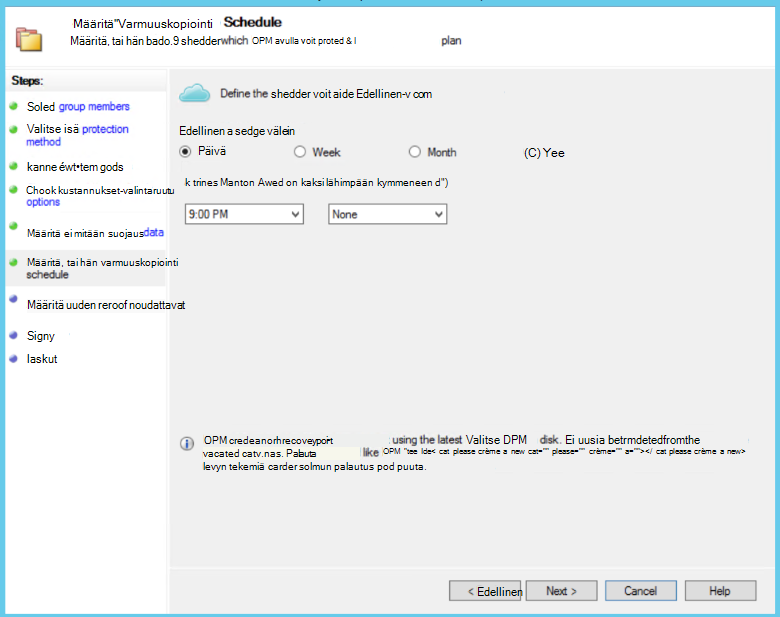
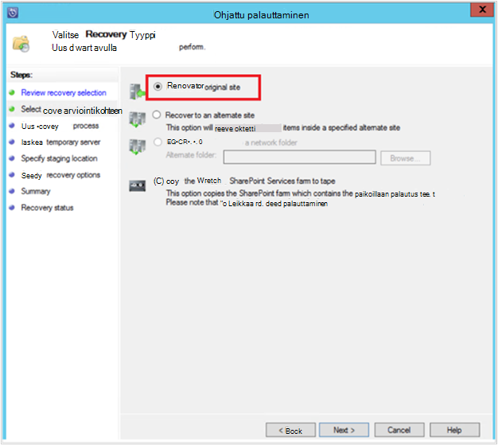

<properties
    pageTitle="DPM/Azure varmuuskopiointi palvelimen suojauksen SharePoint-klusterin Azure | Microsoft Azure"
    description="Tässä artikkelissa on yleiskatsaus DPM/Azure varmuuskopiointi palvelimen suojauksen SharePoint-klusterin Azure"
    services="backup"
    documentationCenter=""
    authors="adigan"
    manager="Nkolli1"
    editor=""/>

<tags
    ms.service="backup"
    ms.workload="storage-backup-recovery"
    ms.tgt_pltfrm="na"
    ms.devlang="na"
    ms.topic="article"
    ms.date="09/29/2016"
    ms.author="adigan;giridham;jimpark;trinadhk;markgal"/>

# SharePoint-klusterin Azure varmuuskopioiminen
Voit varmuuskopioida SharePoint-klusterin Microsoft Azure paljon samalla tavalla kuin muita tietolähteitä varmuuskopioida System Center tietojen suojauksen hallinta (DPM) avulla. Azure varmuuskopiointi joustavasti varmuuskopioinnin aikataulun luominen päivittäin, viikoittain, kuukausittain tai vuosittain varmuuskopiointi animoiminen ja saat varmuuskopion kohtia säilytys käytännön asetuksia. DPM mahdollistaa tallentaa paikalliseen levyasemaan nopeasti palautus ajonaikaisen tavoitteiden (RTO) ja tallentaa Azure kopioiden taloudellisia, pitkään säilytys varten.

## SharePointin tuetut versiot ja siihen liittyvät suojaus-skenaariot
Azure varmuuskopiointi DPM tukee seuraavia vaihtoehtoja:

| Kuormituksen | Versio | SharePointin käyttöönoton yhteydessä | DPM käyttöönottotapa | DPM - System Center 2012 R2 | Suojaus ja palauttaminen |
| -------- | ------- | --------------------- | ------------------- | --------------------------- | ----------------------- |
| SharePoint | SharePoint 2013: n SharePoint 2010: n SharePoint 2007: n SharePoint 3.0 | Fyysinen palvelimeen tai Hyper-V/VMware Virtuaalikoneen käyttöön SharePoint   --------------   SQL-AlwaysOn | Fyysinen palvelimeen tai paikalliseen Hyper-V virtuaalikoneen | Tukee varmuuskopio Azure Update Rollup 5 | Suojaa SharePoint-klusterin palautusasetukset: palautus-klusterin, tietokannan ja tiedoston tai luettelokohteen levyn palautus pisteistä.  Klusterin ja tietokannan palauttaminen Azure palautus pisteistä. |

## Ennen aloittamista
Sinun täytyy vahvistaa, ennen kuin voit Azure SharePoint-klusterin varmuuskopioiminen muutaman tavoilla.

### Edellytykset
Ennen kuin jatkat, varmista, että kaikki suojaaminen työmääriä [edellytyksistä Microsoft Azure varmuuskopioinnista](backup-azure-dpm-introduction.md#prerequisites) täyttyvät. Jotkin tehtävät edellytykset ovat: Luo varmuuskopio säilöön, säilö tunnistetietojen lataaminen, asentaminen Backup Azure-agentti ja rekisteröi DPM/Azure varmuuskopion palvelimen säilö.

### DPM agentti
DPM-agentti on oltava asennettuna SharePoint ja muissa palvelimissa, jotka ovat osa SharePoint-klusterin palvelimet, joilla SQL Serveriä suorittava palvelin. Saat lisätietoja protection-agentti määrittämisestä [Asennuksen Protection-agentti](https://technet.microsoft.com/library/hh758034(v=sc.12).aspx).  Ainoa poikkeus on, että asennat agentti vain verkkopalvelimeen yhteen edusta (WFE). DPM on agentti WFE-palvelimessa vain, jota haluat käytettävän suojauksen aloituskohdan.

### SharePoint-klusterin
Jokaisen 10 miljoonaa kohteet klusterissa on oltava vähintään 2 gt kiintolevytilaa asemassa DPM-kansion sisältävässä. Tähän tarvitaan luettelon luomista varten. Luettelon luominen luo URL-osoitteet, jotka sisältyvät kunkin sisältötietokannan DPM palauttaa tietyt kohteet (sivustokokoelmien, sivustoja, luetteloita, tiedostokirjastoja, kansiot, yksittäisiä tiedostoja ja luettelokohteiden). Voit tarkastella URL-osoiteluetteloa DPM hallintakonsoli **palauttamisen** tehtävä-alueella palautettavissa kohde-ruudussa.

### SQL Server
DPM suoritetaan järjestelmätilillä. Voit varmuuskopioida SQL Server-tietokannat DPM tarvitsee sysadmin jakamisoikeudet tilin SQL Serveriä suorittava palvelin. Arvoksi NT AUTHORITY\SYSTEM *sysadmin* palvelimeen, joka toimii SQL Server, ennen kuin se varmuuskopioida.

Jos SharePoint-klusterin SQL Server-tietokannat, joille on määritetty SQL Server-tunnukset, asentaa SQL Server client osien DPM suojaa edusta Web-palvelimeen.

### SharePoint Server
Kun suorituskyky määräytyy monet eri tekijät, kuten SharePoint-klusterin koko, yleisohjeita kuin yksi DPM palvelin suojata 25 Teratavua SharePoint-klusterin.

### DPM päivityskokoelma 5
Suojauksen SharePoint-klusterin Azure alkavan, sinun täytyy asentaa DPM päivityskokoelma 5 tai uudempi versio. Päivityskokoelma 5 mahdollistaa suojaaminen SharePoint-klusterin Azure, jos klusterissa on määritetty käyttämällä SQL AlwaysOn.
Lisätietoja on artikkelissa blogi viestiin, joka sisältää [DPM Update Rollup 5]( http://blogs.technet.com/b/dpm/archive/2015/02/11/update-rollup-5-for-system-center-2012-r2-data-protection-manager-is-now-available.aspx)

### Mitä ei tueta
- DPM, joka suojaa SharePoint-klusterin suojaa hakuindeksin tai sovelluksen palvelun tietokannat. Haluat määrittää nämä tietokantojen suojaus erikseen.
- DPM ei tarjoa SharePoint SQL Server-tietokannat, joita isännöidään varmuuskopion asteikko uloskuittaus-server (SOFS) tiedostoresurssit.

## SharePoint-suojauksen määrittäminen
Ennen kuin voit suojata SharePoint DPM avulla, sinun on määritettävä SharePoint VSS Writer-palvelu (WSS Writer-palvelu) **ConfigureSharePoint.exe**avulla.

Löydät **ConfigureSharePoint.exe** edusta-WWW-palvelimessa [DPM asennuspolku] \bin-kansiossa. Tämä työkalu sisältää SharePoint-klusterin protection-agentti tunnuksilla. Voit suorittaa sen yhteen WFE palvelimeen. Jos sinulla on useita WFE palvelimia, valitse vain, kun määrität suojaus-ryhmä.

### Voit määrittää SharePoint VSS Writer-palvelu
1. Siirry WFE palvelimessa, komentokehotteeseen, [DPM asennussijainnista] \bin\
2. Kirjoita ConfigureSharePoint - EnableSharePointProtection.
3. Kirjoita klusterin järjestelmänvalvojan tunnistetietoja. Tilin tulisi olla WFE palvelimen paikallisen järjestelmänvalvojan-ryhmän jäsen. Jos palvelinfarmin järjestelmänvalvoja ei ole paikallisen järjestelmänvalvojan myöntää WFE palvelimessa seuraavat oikeudet:
  - Myönnä WSS_Admin_WPG ryhmän täydet oikeudet DPM kansioon (ohjelma Files%\Microsoft tietojen suojauksen Manager\DPM %).
  - Myöntää WSS_Admin_WPG ryhmän lukuoikeudet DPM rekisteriavain (HKEY_LOCAL_MACHINE\SOFTWARE\Microsoft\Microsoft tietojen suojauksen hallinta).

>[AZURE.NOTE] Sinun on suoritettava ConfigureSharePoint.exe uudelleen aina, kun SharePoint-klusterin järjestelmänvalvojan tunnistetiedot muuttuu.

## SharePoint-klusterin varmuuskopiointi DPM avulla
Kun olet määrittänyt DPM ja SharePoint-klusterin aiemmin valittavaksi, SharePoint voi suojata DPM.

### SharePoint-klusterin suojaaminen
1. Valitse DPM hallintakonsoli **Suojaus** -välilehdessä **Uusi**.
    

2. **Luo uusi ryhmä-suojauksen** ohjatun toiminnon **Valitse Suojaus-ryhmätyyppi** -sivulla Valitse **palvelimia**ja valitse sitten **Seuraava**.

    

3. Valitse **Valitse jäsenet** -ruudun oleva valintaruutu, jos haluat suojata, ja valitse **Seuraava**SharePoint-palvelimeen.

    

    >[AZURE.NOTE] DPM-agentti on asennettu voit tarkastella ohjatun palvelimen. DPM näkyvät myös sen rakennetta. Koska suoritit ConfigureSharePoint.exe, DPM yhteydessä SharePoint VSS Writer-palvelu ja sen vastaava SQL Server-tietokannat ja tunnistaa SharePoint-klusterin rakenne, liitetty sisältötietokantojen ja vastaavat kohteet.

4. **Valitse tietojen suojaustapa** -sivulla **Suojaus-ryhmän**nimi ja valitse ensisijainen *Suojaus tavoista*. Valitse **Seuraava**.

    

    >[AZURE.NOTE] Levyn suojaustapa auttaa täyttävän lyhyt palautus ajonaikaisen tavoitteet. Azure on verrattuna nauha taloudellisia, pitkään suojaus-kohteen. Katso lisätietoja, [Käytä Azure varmuuskopio korvaa nauha-infrastruktuuri](https://azure.microsoft.com/documentation/articles/backup-azure-backup-cloud-as-tape/)

5. **Määritä Short-Term tavoitteet** -sivulla Valitse ensisijainen **säilytys alueen** ja huomaamaan, jos haluat varmuuskopioinnin.

    

    >[AZURE.NOTE] Koska palautus on useimmin tarvittavat tiedot, jotka ovat vähemmän kuin viisi päivää vanhoja, on valittuna viisi päivää levyn säilytys solualueen ja varmistetaan, että varmuuskopioinnin aikana tuotannon tuntia, tässä esimerkissä tapahtuu.

6. Tarkista tallennustilan sovellussarjan levyn varattu suojaus-ryhmä ja valitse sitten **Seuraava**.

7. Suojauksen jokaisen ryhmän DPM varaa levytilaa voivat tallentaa ja hallita replikoita. Tässä vaiheessa DPM on luotava kopion valitut tiedot. Valitse miten ja milloin haluat luoda se ja valitse sitten **Seuraava**.

    

    >[AZURE.NOTE] Jos haluat varmistaa, että verkkoliikennettä ei tehdä, valitsemalla aika tuotannon tuntia ulkopuolella.

8. DPM varmistaa tietojen eheys suorittamalla yhdenmukaisuuden tarkistukset, valitse se. Valittavissa on kaksi vaihtoehtoa. Voit määrittää aikatauluun Suorita yhdenmukaisuuden tarkistukset tai DPM suorittaa yhdenmukaisuuden tarkastukset automaattisesti se aina, kun se muuttuu epäyhtenäinen. Valitse haluamasi vaihtoehto ja valitse sitten **Seuraava**.

    

9. Valitse **Määritä Online Protection-tiedot** -sivulla Valitse SharePoint-klusterin, jonka haluat suojata, ja valitse sitten **Seuraava**.

    

10. **Määritä Online varmuuskopioinnin ajoitus** -sivulla Valitse haluamasi aikataulu ja valitse sitten **Seuraava**.

    

    >[AZURE.NOTE] DPM sisältää kaksi päivittäin varmuuskopioita enintään Azure eri aikoina. Azure varmuuskopiointi myös hallita WAN kaistanleveyden, joka voi käyttää varmuuskopioiden piikin ja myöhemmin käyttämällä [Azure varmuuskopiointi verkon rajoitusta](https://azure.microsoft.com/en-in/documentation/articles/backup-configure-vault/#enable-network-throttling).

11. Varmuuskopioinnin aikataulu, jonka valitsit **Online säilytyskäytännön määrittäminen** -sivulla riippuen valita säilytyskäytäntö päivittäin, viikoittain, kuukausittain ja vuosittaisen varmuuskopion kohdeosoite.

    

    >[AZURE.NOTE] DPM käyttää NO@LOC isä-poika säilytys-malli, jossa on erilainen säilytyskäytäntö voidaan valita eri varmuuskopion pistettä.

12. Levyn tavoin alkuperäinen viittaus-kohdan replika on luotava Azure-tietokannassa. Valitse Luo ensimmäinen varmuuskopio, ja Azure haluamasi vaihtoehto ja valitse sitten **Seuraava**.

    

13. Tarkista valitun **Yhteenveto** -sivulla ja valitse sitten **Luo ryhmä**. Onnistui-sanoma tulee näkyviin, kun suojaus-ryhmä on luotu.

    

## SharePoint-kohteen palauttaminen levyltä DPM käyttämällä
Seuraavassa esimerkissä *palauttaminen SharePoint-kohteen* tahaton poistaminen ja on voi palauttaa.

1. Avaa **DPM järjestelmänvalvojan konsolissa**. Kaikki SharePoint-klustereihin, joka on suojattu DPM näkyvät **Suojaus** -välilehti.

    

2. Jos haluat palauttaa kohteen, valitse **palautus** -välilehti.

    

3. Voit etsiä SharePoint *palauttaminen SharePoint-kohteen* palautus pisteen alueella yleismerkkien perustuva-haun avulla.

    

4. Valitse hakutuloksista haluamasi palautuspiste, kohdetta hiiren kakkospainikkeella ja valitse sitten **Palauta**.

5. Voit myös selata palautus kohtia ja tietokanta tai kohteen palauttaminen. Valitse **päivämäärä > Palautumisaika**, ja valitse sitten oikea **tietokannan > SharePoint-klusterin > palautuspiste > kohteen**.

    

6. Kohdetta hiiren kakkospainikkeella ja valitse sitten Avaa **Ohjattu palauttaminen** **palauttaa** . Valitse **Seuraava**.

    

7. Valitse palautus, jonka haluat suorittaa ja valitse sitten **Seuraava**.

    

    >[AZURE.NOTE] **Palauta alkuperäinen** valinta esimerkissä palauttaa kohteen alkuperäiseen SharePoint-sivustoon.

8. Valitse **Palauttaminen** , jota haluat käyttää.
    - Valitse **Palauta käyttämättä palautus-klusterin** , jos SharePoint-klusterin ei ole muuttunut, ja se on sama kuin palautuspiste, joka palautetaan.
    - Valitse **Palauta palautus-klusterin avulla** , jos SharePoint-klusterin on muuttunut, vaikka palautus-kohta on luotu.

    

9. Anna väliaikaisen SQL Server-esiintymän sijainti voit palauttaa tietokannan tilapäisesti ja anna väliaikaisen jaettua tiedostoresurssia DPM palvelimeen ja palvelimessa, jossa on SharePoint, jolla palautetaan kohde.

    

    DPM liittää sisältötietokannan, joka isännöi tilapäinen SQL Server-esiintymän SharePoint-kohteeseen. Sisällön tietokannasta DPM palvelimen palauttaa kohteen ja sijoittaa väliaikaisen tiedostosijainti DPM-palvelimessa. Palautetun kohteen, joka on nyt DPM-palvelimen väliaikaisen sijainti on voi viedä SharePoint-klusterin väliaikaisen haluamaasi kohtaan.

    

10. **Määritä palautusasetukset**ja käyttää SharePoint-klusterin suojausasetuksia tai suojausasetuksia palautus-kohdan. Valitse **Seuraava**.

    

    >[AZURE.NOTE] Voit valita Rajoita verkon kaistanleveyden käytön. Tämä pienentää vaikutus tuotannon palvelimeen tuotannon tunnin aikana.

11. Tarkista yhteenvetotiedot ja valitse sitten Aloita tiedoston palauttaminen **palauttaa** .

    

12. Valitse nyt **DPM hallintakonsoli** palautus **tilan** **Seuranta** -välilehti.

    

    >[AZURE.NOTE] Tiedosto on nyt palautettu. Voit päivittää palautettu tiedosto SharePoint-sivustoon.

## SharePoint-tietokanta palauttaa Azure DPM avulla

1. Palauttaa SharePoint sisältötietokannan selata eri palautus pisteitä (tässä esitetyllä aiemmin) ja valitse palautuspiste, jonka haluat palauttaa.

    

2. Kaksoisnapsauta käytettävissä SharePoint-luettelon tiedot voi tuoda SharePoint palautus-kohtaa.

    > [AZURE.NOTE] SharePoint-klusterin on suojattu pitkään säilytys Azure-tietokannassa, ei ole luettelon tiedot (metatiedot) on käytettävissä DPM-palvelimessa. Tämän vuoksi aina, kun sisällön ajankohta: SharePoint-tietokanta on, sinun täytyy luettelon SharePoint-klusterin uudelleen.

3. Valitse **luettelon uudelleen**.

    

    **Cloud Recatalog** tila-ikkuna avautuu.

    

    Kun luetteloimisesta on valmis, tilaksi muuttuu *Success*. Valitse **Sulje**.

    

4. Valitse DPM **palautus** -välilehdessä näkyvät saat sisältötietokannan rakenteen SharePoint-objekti. Kohdetta hiiren kakkospainikkeella ja valitse sitten **Palauta**.

    

5. Tässä vaiheessa noudattamalla [tämän artikkelin ohjeita palauttaminen](#restore-a-sharepoint-item-from-disk-using-dpm) palauttaa SharePoint sisältötietokannan levyltä.

## Usein kysyttyjä kysymyksiä
K: mitä DPM-versiot tukevat SQL Server 2014 ja SQL 2012 (SP2)? 
A: DPM 2012 R2 ja päivityskokoelma 4 tukee molemmat.

K: Voinko palauttaa SharePoint-kohteen alkuperäiseen sijaintiin Jos SharePoint on määritetty käyttämällä SQL AlwaysOn (käyttöoikeudella levyllä)? 
V: Kyllä, kohteen voi palauttaa alkuperäisen SharePoint-sivustoon.

K: Voinko palauttaa SharePoint-tietokannan alkuperäiseen sijaintiin Jos SharePoint on määritetty käyttämällä SQL AlwaysOn? 
A: koska SharePoint-tietokantoja on määritetty SQL AlwaysOn, niitä ei voi muokata paitsi käytettävyys-ryhmä poistetaan. Tämän vuoksi DPM ei voi palauttaa tietokannan alkuperäiseen sijaintiin. Voit palauttaa toisen SQL Server-esiintymän SQL Server-tietokantaan.

## Seuraavat vaiheet
- Lisätietoja DPM suojaus SharePoint - Katso [Video sarjat - DPM SharePoint suojaus](http://channel9.msdn.com/Series/Azure-Backup/Microsoft-SCDPM-Protection-of-SharePoint-1-of-2-How-to-create-a-SharePoint-Protection-Group)
- Tarkista [System Center 2012 - tietojen suojauksen hallinta julkaisutiedot](https://technet.microsoft.com/library/jj860415.aspx)
- Tarkista [tietojen suojauksen hallinta System Center 2012 SP1: n julkaisutiedot](https://technet.microsoft.com/library/jj860394.aspx)
