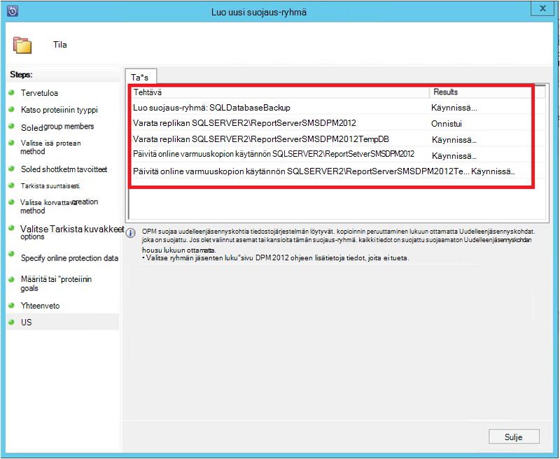

<properties
    pageTitle="SQL Server työmääriä käyttämällä DPM Azure varmuuskopiointi | Microsoft Azure"
    description="Johdanto varmuuskopioiminen SQL Server-tietokannat Azure varmuuskopiointi-palvelun avulla"
    services="backup"
    documentationCenter=""
    authors="adigan"
    manager="Nkolli1"
    editor=""/>

<tags
    ms.service="backup"
    ms.workload="storage-backup-recovery"
    ms.tgt_pltfrm="na"
    ms.devlang="na"
    ms.topic="article"
    ms.date="09/27/2016"
    ms.author="adigan;giridham; jimpark;markgal;trinadhk"/>

# SQL Server työmääriä käyttämällä DPM Azure varmuuskopiointi

Tässä artikkelissa ohjaa SQL Server-tietokantoja, joissa Azure varmuuskopion varmuuskopion määritysvaiheet.

Voit varmuuskopioida Azure SQL-tietokannoista, sinun on Azure-tili. Jos sinulla ei ole tiliä, voit luoda ilmainen kokeiluversio tili vain muutamaan minuuttiin. Lisätietoja on artikkelissa [Azure maksuttoman kokeiluversion](https://azure.microsoft.com/pricing/free-trial/).

SQL Server-tietokannan varmuuskopiointi Azure ja Azure palauttamisesta hallinnointi on kolme vaihetta:

1. Luo varmuuskopio käytäntö suojaaminen SQL Server-tietokannat Azure.
2. Luo tarvittaessa varmuuskopioiden Azure.
3. Tietokannan palauttaminen Azure.

## Ennen aloittamista
Ennen kuin aloitat, varmista, että kaikki Microsoft Azure varmuuskopioinnin avulla voit suojata työmääriä [edellytykset](../backup-azure-dpm-introduction.md#prerequisites) täyttyvät. Edellytykset kattaa tehtävät: luominen varmuuskopion säilöön, säilö tunnistetietojen lataaminen, asentaminen Backup Azure-agentti ja palvelimen rekisteröimistä säilö.

## Suojaa SQL Server-tietokannat Azure varmuuskopio-käytännön luominen

1. DPM palvelimessa Valitse **Suojaus** -työtila.

2. Valitse työkalu-valintanauhassa **Uusi** ja luo uusi suojaus-ryhmä.

    

3. DPM näkyy aloitusnäytön kanssa ohjeet luominen **Suojaus-ryhmä**. Valitse **Seuraava**.

4. Valitse **palvelimiin**.

    

5. Laajenna SQL Server-tietokoneeseen, jossa varmuuskopioitavien tietokannat ovat näkyvissä. DPM näkyy eri tietolähteistä, joita voit varmuuskopioida kyseisestä palvelimesta. Laajenna **Kaikki SQL-osakkeet** ja valitse varmuuskopioitavien tietokantoja (Tässä tapauksessa emme valittuna raporttipalvelimen$ MSDPM2012 ja raporttipalvelimen$ MSDPM2012TempDB). Valitse **Seuraava**.

    

6. Suojaus-ryhmän nimi ja valitse **haluan, että online Protection** -valintaruutu.

    

7. **Määritä Short-Term tavoitteet** -näytön Sisällytä tarvittavat syötteiden Luo varmuuskopio pisteiden levylle.

    Tähän näemme, että **säilytys alue** on määritetty *5 päivää*, **synkronoinnin korkojakso** on määritetty kerran välein *15 minuuttia* , jolla varmuuskopiointi otetaan korkojakso eli. **Express varmuuskopiointi** on määritetty *8:00 P.M*.

    

    >[AZURE.NOTE] Kello 8:00 (mukaan näytön syöttö) varmuuskopion kohtaa luodaan päivittäin siirtämällä edelliseen päivään 20:00:00 varmuuskopio pisteestä tiedot, joita on muokattu. Tätä prosessia kutsutaan **Express varmuuskopiot**. Tapahtuman lokit synkronoidaan 15 minuutin välein, kun silloin ei tarvitse palauttaa tietokannan kello 9:00 – sitten kohta luoma estotoimintoja edellisen lokit express täydellistä varmuuskopion pisteen (Tässä tapauksessa 8 pm).

8. Valitse **Seuraava**

    DPM näyttää käytettävissä yleinen tallennustilaa ja mahdolliset levyn tilan käyttö.

    

    Oletusarvon mukaan DPM luo yhden aseman tietolähteen (SQL Server-tietokantaan) koon muuttamiseen tarkoitettu alkuperäinen varmuuskopion kohden. Käytä tätä tapaa, loogisen levyn hallinta (LDM) rajaa DPM suojaus 300 tietolähteisiin (SQL Server-tietokannat). Voit kiertää tämän rajoituksen, valitse **Etsi yhtä DPM tallennustilan resurssivarannon tiedot**-vaihtoehto. Jos käytät tätä vaihtoehtoa, DPM käyttää yksittäisen aseman useista tietolähteistä, joka sallii DPM suojaaminen jopa 2 000 SQL-tietokannat.

    Jos **kasvaa automaattisesti asemat** -vaihtoehto on valittuna, parantavat varmuuskopion äänenvoimakkuuden voit tilin DPM kun tuotannon tiedot kasvaa. Jos **kasvaa automaattisesti asemat** -vaihtoehto ei ole valittu, DPM rajoittaa varmuuskopion tallennustilaa tietolähteisiin suojaa-ryhmässä.

9. Järjestelmänvalvojat saavat valinta siirtäminen manuaalisesti (käytöstä verkon) ensimmäisen varmuuskopiointi kaistanleveys, jotta tai verkossa. Ne voit myös määrittää ajan, jossa ensimmäinen siirto voi tapahtua. Valitse **Seuraava**.

    

    Alkuperäinen varmuuskopio edellyttää siirron koko tietolähteen (SQL Server-tietokantaan) tuotannon palvelimesta (SQL Server machine) DPM palvelimeen. Näitä tietoja voi olla suuri ja tietojen siirtäminen verkossa voi ylittää kaistanleveyden. Tästä syystä järjestelmänvalvojat voit myös siirtää alkuperäisen varmuuskopiointi: **manuaalisesti** (joko siirrettävässä tietovälineessä) välttää **automaattisesti verkon kautta** tai kaistanleveyden kuormitettu (määritettynä ajankohtana).

    Kun ensimmäisen varmuuskopiointi on valmis, varmuuskopioista loput ovat vaiheittainen varmuuskopioiden alkuperäinen varmuuskopio. Lisäävän varmuuskopioinnin yleensä pieni ja siirretään helposti verkossa.

10. Valitse, kun haluat yhdenmukaisuuden-valintaruutu ja valitse **Seuraava**.

    

    DPM voi suorittaa yhdenmukaisuuden valintaruudun valinta eheyden varmuuskopiointi pisteen. Ohjelma laskee tuotannon server (SQL Server-tietokoneeseen tässä skenaariossa) ja varmuuskopioidut tiedot varmuuskopiotiedoston osoitteessa DPM tiedoston tarkistussumma. Kyseessä on ristiriita oletetaan, että DPM varmuuskopioidut tiedosto on vioittunut. DPM rectifies varmuuskopioidut tiedot vastaavat tarkistussumma ei täsmää lohkot lähettämällä. Yhdenmukaisuuden-valintaruutu on paljon suorituskyky-toimintoa, järjestelmänvalvojilla on ajoituksen yhdenmukaisuuden-valintaruutu tai käynnissä automaattisesti.

11. Määritä tietolähteet online protection valitsemalla tietokantoja voi suojata Azure ja valitse **Seuraava**.

    

12. Järjestelmänvalvojat valita varmuuskopiointi aikatauluja ja säilytyskäytännöt, jotka sopivat organisaation käytännöt.

    

    Tässä esimerkissä varmuuskopioiden otetaan kerran päivässä 12:00 PM ja 8 PM (näytön alaosassa)

    >[AZURE.NOTE] Se on hyvä niissä on muutama lyhytkestoinen palautus levyllä nopeasti palauttamista varten. Näiden palautus pisteiden käytetään "toiminnallisia palauttaminen". Azure on hyvä käyttö etäyhteyden kautta paikassa, jossa on suurempi palvelutasosopimuksia ja taata käytettävyyttä.

    **Paras käytäntö**: Varmista, että Azure varmuuskopioiden ajoitetaan paikalliseen levyasemaan varmuuskopiot käyttämällä DPM päättymisen jälkeen. Näin uusimmat varmuuskopiointiin Azure kopioidaan.

13. Valitse säilytys käytännön aikatauluun. Säilytyskäytännön toiminnasta tiedot on tarkoitettu, [Käytä Azure varmuuskopio korvaa nauha infrastruktuuri-artikkelissa](backup-azure-backup-cloud-as-tape.md).

    

    Tässä esimerkissä:

    - Varmuuskopioiden otetaan kerran päivässä 12:00 PM ja 8 PM (näytön alaosassa) ja säilyvät 180 päivän ajan.
    - Kello 12:00 lauantaihin varmuuskopiointi säilyttää 104 viikkoa
    - Valitse viimeinen lauantai kello 12:00 varmuuskopiointi säilytetään 60 kuukautta
    - Valitse viimeinen lauantai kello 12:00 maaliskuun varmuuskopiointi säilyttää 10 vuotta

14. Valitse **Seuraava** ja valitse haluamasi vaihtoehto siirrettäessä alkuperäinen varmuuskopio Azure. Voit valita **automaattisesti verkon kautta** tai **Offline-tilassa varmuuskopioinnin**.

    - **Automaattisesti verkossa** siirtää varmuuskopiotiedot Azure valinnut varmuuskopioinnin aikataulun mukaan.
    - **Offline-tilassa varmuuskopiointi** toiminta on selitetty [Azure varmuuskopiointi offline-tilassa varmuuskopiointi työnkulussa](backup-azure-backup-import-export.md).

    Valitseminen alkuperäinen varmuuskopio lähettäminen Azure ja valitse **Seuraava**asiaa siirron, jolla.

15. Kun olet tarkistanut käytännön tiedot **Yhteenveto** -näytössä, valitse työnkulun **Luo ryhmä** -painike. Voit **sulkemispainiketta** ja seurata projektin edistymisen seuranta-työtilassa.

    

## Tarvittaessa varmuuskopion SQL Server-tietokantaan
Kun edellisessä vaiheessa luotu varmuuskopion käytäntö, "palautuspiste" luodaan vain, kun ensimmäinen varmuuskopiointi tapahtuu. Sen sijaan, että odotetaan ajoitus käyttö käynnistimen palautuksen luominen alla olevia ohjeita osoittamalla manuaalisesti.

1. Odota, kunnes suojaus ryhmän tilana näkyy **OK** tietokannan ennen kuin luot palautus-kohta.

    

2. Tietokannan hiiren kakkospainikkeella ja valitse **Luo palautus piste**.

    

3. Valitse avattavasta valikosta **Online Protection** ja valitse **OK**. Tämä käynnistää palautuspiste luominen Azure-tietokannassa.

    

4. Voit tarkastella projektin edistymisen osassa näkyvät kohdassa edistymisen **Seuranta** -työtilan työ, kuten seuraavassa kuvassa.

    

## Palauttaa Azure SQL Server-tietokantaan
Suojatun kohteen (SQL Server-tietokantaan) palauttaminen Azure edellyttää seuraavia ohjeita.

1. Avaa DPM server Management Console. Siirry **palautus** työtilan kohtaa näet DPM varmuuskopioida palvelimiin. Selaa (tämän palvelupyynnön raporttipalvelimen$ MSDPM2012) edellyttää tietokannan. Valitse joka päättyy **Online** **palauttamisesta** aika.

    

2. Napsauta tietokannan nimi ja valitse **Palauta**.

    

3. DPM näkyy palautus-kohdan tiedot. Valitse **Seuraava**. Korvaa tietokannan, valitse **Palauta alkuperäinen SQL Server-esiintymän**palauttaminen tyyppi. Valitse **Seuraava**.

    

    Tässä esimerkissä DPM avulla tietokannan palauttaminen toiseen SQL Server-esiintymän tai erillinen verkko-kansioon.

4. Valitse **Määritä palautusasetukset** näytön palautusasetukset kuten verkon kaistanleveyden käytön rajoittaminen palautus käyttämän kaistanleveyden. Valitse **Seuraava**.

5. **Yhteenveto** -näytön näet kaikki annettu mennessä palautus määritykset. Valitse **Palauta**.

    Palautus-tila näkyy tietokannan palautetaan. Voit valita, **Sulje** Sulje ohjattu toiminto ja tarkastella edistymisen **Seuranta** -työtilassa.

    

    Kun palautus on valmis, palautettu tietokanta on yhtenäinen sovelluksen.

### Seuraavat vaiheet:

• [Azure varmuuskopion usein kysytyt kysymykset](backup-azure-backup-faq.md)
