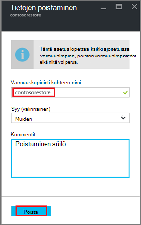

<properties
   pageTitle="Poista Azure varmuuskopiointi-säilö | Microsoft Azure"
   description="Voit poistaa Azure varmuuskopiointi-säilö. Vianmääritys, miksi et voi poistaa varmuuskopion säilö. "
   services="service-name"
   documentationCenter="dev-center-name"
   authors="markgalioto"
   manager="cfreeman"
   editor=""/>

<tags
   ms.service="backup"
   ms.devlang="na"
   ms.topic="article"
   ms.tgt_pltfrm="na"
   ms.workload="storage-backup-recovery"
   ms.date="08/29/2016"
   ms.author="markgal;trinadhk"/>

# Poista Azure varmuuskopiointi-säilö

Azure varmuuskopiointi-palvelu on kahdentyyppisiä vaults - säilö varmuuskopiointi ja palauttaminen palvelut-säilö. Varmuuskopiointi-säilö oli ensimmäinen. Valitse palautus-palveluiden säilö oli tukemaan laajennettu Resurssienhallinta-käyttöönotoissa. Laajennettu ominaisuuksia ja tietoja riippuvuudet, jotka on tallennettu säilö poistaminen palautus palvelut-säilö voi olla näyttävyyttä kuin sen on oltava.

|**Käyttöönottotapa**|**Portal**|**Säilö nimi**|
|--------------|----------|---------|
|Perinteinen|Perinteinen|Varmuuskopion säilöön|
|Resurssien hallinta|Azure|Palautus Services säilöön|

> [AZURE.NOTE] Varmuuskopion vaults ei voi suojata Resurssienhallinta käyttöön ratkaisuja. Voit kuitenkin classically käyttöön palvelimia ja VMs suojaaminen palautus palvelut-säilö.  

Tässä artikkelissa Käytämme termi, säilö, voit viitata varmuuskopiointi säilöön tai palautus Services säilö yleinen lomakkeeseen. Käytämme muodollinen nimi, varmuuskopion säilöön tai palautus Services säilöön, kun se on tarpeen erottaa vaults.

## Poistaminen palautus palvelut-säilö

Poistaminen palautus palvelut-säilö on sujuu prosessi - *annettu säilö ei sisällä resursseja*. Ennen kuin voit poistaa palautus Services säilöön, poista tai poista säilö kaikki resurssit. Jos yrität poistaa säilö, joka sisältää resursseja, saat virheilmoituksen, kuten seuraavassa kuvassa.

  

Ennen kuin olet poistanut säilö resurssit, valitsemalla **uudelleen** tuottaa saman virheen. Jos olet jumissa, tämä virhesanoma tulee näyttöön, valitse **Peruuta** ja noudattamalla seuraavia ohjeita voit poistaa resurssien palautuksen palvelut-säilöön.

### Kohteiden poistaminen säilöstä, AM suojaaminen

Jos sinulla on jo Avaa palautus Services säilö, siirry toinen vaihe.

1.  Avaa Azure portaalin ja koontinäytöstä säilöön, jonka haluat poistaa.

    Jos sinulla ei ole kiinnitetty Raporttinäkymät-ikkunan, valitse toiminto-valikosta palautus Services säilö valitsemalla **Lisää palveluja** ja kirjoita resurssien luetteloa, **Palautus-palvelut**. Kun alat kirjoittaa, luettelon suodattimet kirjoittamiesi tietojen perusteella. Valitse **palautus-palveluiden vaults**.

      

    Palautus Services vaults luettelo tulee näkyviin. Valitse luettelosta säilöön, jonka haluat poistaa.

    

2. Tarkista säilöön-näkymässä **Essentials** -ruudussa. Jos haluat poistaa säilöön, ei voi olla suojattu kohteet. Jos näet jollakin muulla kuin nolla, **Varmuuskopiointi kohteita** tai **Varmuuskopiointi hallinta-palvelimet**-kohdassa kohteet on poistettava ennen kuin voit poistaa säilö.

    

    VMs tiedostot ja kansiot pidetään varmuuskopiointi kohteet ja näkyvät Essentials-ruudussa **Varmuuskopiointi kohteet** -alueella. DPM palvelimen näkyy Essentials-ruudussa **Varmuuskopiointi Management Server** -alueella. **Kopioida kohteita** koskevat Azure sivuston palautus-palveluun.

3. Voit aloittaa suojatun kohteiden poistaminen säilö, Etsi kohteet säilö. Säilö raporttinäkymät-ikkunassa **asetukset**ja valitse sitten **Varmuuskopiointi kohteiden** avaa kyseisen sivu.

    

    **Varmuuskopiointi-kohteita** -sivu on erillinen luettelot-kohteen lajin perusteella: Azuren näennäiskoneiden tai tiedostokansioihin-(Katso kuvaa). Oletusarvoinen kohteen tyyppi-luettelossa näkyvää on Azuren näennäiskoneiden. Jos haluat tarkastella tiedostokansioihin kohteiden luettelo säilö, valitse **Tiedostokansioihin** avattavasta valikosta.

4. Ennen kuin voit poistaa kohteen AM suojaaminen säilöstä, Lopeta kohteen varmuuskopioinnin ja poistaa palautus pisteen tiedot. Jokaisen kohteen osalta säilö toimi seuraavasti:

    a. **Varmuuskopioidut kohteet** -sivu-kohdetta hiiren kakkospainikkeella ja valitse pikavalikosta **Lopeta varmuuskopiointi**.

    

    Lopeta varmuuskopiointi-sivu avautuu.

    b. Valitse **Lopeta varmuuskopion** sivu **Valitse vaihtoehto** -valikossa **Poista varmuuskopiotiedot** > kohteen nimi > ja valitse **Pysäytä varmuuskopion**.

      Kirjoita vahvistamiseksi, jos haluat poistaa sen kohteen nimi. **Lopeta varmuuskopiointi** -painike ei voi aktivoida, ennen kuin olet varmistanut voit lopettaa kohteen. Ei ole näkyvissä valintaikkunassa varmuuskopion kohteen nimen kirjoittamisen, jos olet valinnut **Säilyttää varmuuskopiotiedot** -vaihtoehto.

    

      Vaihtoehtoisesti voit antaa syytä, miksi tiedot poistetaan ja lisätä kommentteja. **Lopeta varmuuskopiointi**napsauttamisen jälkeen Salli Poista työn päättymistä, ennen kuin yrität poistaa säilö. Varmista, että työ on valmis, tarkista Azure-viestit .  
   Kun työ on valmis, näyttöön tulee viesti, jossa ilmoitetaan varmuuskopiointi keskeytettiin ja varmuuskopiotiedot on poistettu kyseiselle kohteelle.

    c-näppäinyhdistelmää. Kohteen **Varmuuskopioinnin kohteet** -valikon-luettelosta poistamisen jälkeen valitsemalla **Päivitä** näkyviin säilö jäljellä olevia kohteita.

      

      Kun luettelo ei ole kohteita, siirry varmuuskopiointi säilö sivu **Essentials** -ruutu. Ei ei kannata olla **Varmuuskopiointi kohteita**, **Varmuuskopiointi hallinta-palvelimia**tai **replikoitu kohteet** . Jos kohteet näkyvät edelleen säilö, palaa vaiheeseen 3 yllä ja valitse toinen kohde laji-luettelosta.  

5. Kun säilö työkalurivillä ei ole useita kohteita, valitse **Poista**.

    

6. Kun sinua pyydetään tarkistamaan, että haluat poistaa säilö, valitse **Kyllä**.

    Säilö poistetaan ja portaalin palauttaa **Uusi** palvelu-valikosta.

## Entä jos voin pysäytetty varmuuskopiointia, mutta säilyttää tiedot?

Jos lopetit varmuuskopiointia, mutta vahingossa *säilyttää* tiedot, sinun on poistettava varmuuskopiotiedot ennen kuin voit poistaa säilö. Voit poistaa varmuuskopiotiedot seuraavasti:

1. Valitse **Varmuuskopioidut kohteet** -sivu kohdetta hiiren kakkospainikkeella ja valitse pikavalikosta **Poista palautettavat tiedot**.

    

    **Poista varmuuskopiointi tiedot** -sivu avautuu.

2. **Poista varmuuskopiointi tiedot** -sivu-kohteen nimi ja valitse **Poista**.

    

    Kun olet poistanut tiedot, siirry vaiheeseen 4c yläpuolella, ja jatka prosessi.

## Poista säilö, suojataan DPM-palvelin

Ennen kuin voit poistaa säilöön, suojataan DPM palvelimeen, poista palautus pisteitä, jotka on luotu ja unregister palvelin säilöstä.

Poista suojaus-ryhmä liittyviä tietoja:

1. DPM järjestelmänvalvojan konsolissa **Suojaus**, valitse Suojaus-ryhmä, valitse Suojaus-ryhmäjäsen ja valitse työkalu-valintanauhassa **Poista**. Valitse jäsen näkyvät työkalu-valintanauhan **Poista** -painiketta. Esimerkissä on **dummyvm9**. Jos määritettynä on useita jäseniä suojaus-ryhmä, pidä Ctrl-näppäimen avulla Valitse useita jäseniä.

    

    **Lopeta suojaus** -valintaikkuna avautuu.

2. **Lopeta suojaus** -valintaikkunan Valitse **Poista suojatut tiedot**ja valitse **Lopeta suojaus**.

    

    Et halua säilyttää suojattuja tietoja, koska haluat tyhjentää säilö, jotta voit poistaa sen. Sen mukaan, kuinka monta palautus pistettä ja kuinka paljon tietoja on suojaus-ryhmä, se saattaa kestää joitakin sekunteja muutaman minuutin kuluttua voit poistaa tietoja. **Lopeta suojaus** -valintaikkuna tulee näyttöön tila, kun työ on valmis.

    

3. Jatka kaikkien suojaus-ryhmien jäsenten tätä prosessia.

    Sinun on poistettava kaikki suojatut tiedot ja suojaus-ryhmistä.

4. Kun olet poistanut kaikki jäsenet ryhmän suojaus, siirry Azure-portaaliin. Avaa säilö Raporttinäkymät-ikkunan ja varmista, että **Varmuuskopiointi kohteita**, **Varmuuskopiointi hallinta palvelimia**tai **replikoitu kohteita**ei voi. Työkalurivin säilö valitsemalla **Poista**.

    

    Jos määritettynä on Varmuuskopiointi hallinta palvelinten rekisteröity säilö, et voi poistaa säilö, vaikka ei ole tietoja säilö. Jos olet määritetty poistettu varmuuskopiointi hallinta-palvelimet liittyvät säilö, mutta ovat edelleen **Essentials** -ruudussa näkyvät palvelimet-kohdassa [Etsi rekisteröity säilö varmuuskopiointi hallinta-palvelimiin](backup-azure-delete-vault.md#find-the-backup-management-servers-registered-to-the-vault).

5. Kun sinua pyydetään tarkistamaan, että haluat poistaa säilö, valitse **Kyllä**.

    Säilö poistetaan ja portaalin palauttaa **Uusi** palvelu-valikosta.

## Poista säilö, suojataan tuotannon palvelimeen

Ennen kuin voit poistaa säilöön, suojataan tuotannon palvelimeen, poista tai unregister palvelin säilöstä.

Voit poistaa säilö liittyvän tuotannon palvelimeen seuraavasti:

1. Azure-portaalissa, Avaa säilö Raporttinäkymät-ikkunan ja sitten **asetukset** > **Varmuuskopiointi infrastruktuurin** > **Tuotannon palvelimiin**.

    

    **Tuotannon palvelimet** -sivu avautuu ja näyttää kaikki tuotannon palvelimet säilö.

    

2. **Tuotannon palvelimissa** , sivu-palvelimesta napsauttamalla hiiren kakkospainikkeella ja valitse **Poista**.

    

    **Poista** -sivu avautuu.

    

3. Vahvista **poistaminen** -sivu ja valitse **Poista**-palvelimen nimi. Syötettävä oikein, **Poista** -painikkeen aktivoiminen palvelimen nimi.

    Kun säilö on poistettu, näyttöön tulee viesti, jossa ilmoitetaan säilö on poistettu. Kun olet poistanut kaikki palvelimet säilö, vieritä takaisin säilö Raporttinäkymät-ikkunan Essentials-ruutuun.

4. Säilö, koontinäytön Varmista, että **Varmuuskopiointi kohteita**, **Varmuuskopiointi hallinta palvelimia**tai **replikoitu kohteita**ei voi. Työkalurivin säilö valitsemalla **Poista**.

5. Kun sinua pyydetään tarkistamaan, että haluat poistaa säilö, valitse **Kyllä**.

    Säilö poistetaan ja portaalin palauttaa **Uusi** palvelu-valikosta.

## Poista varmuuskopiointi-säilö

Seuraavat ohjeet koskevat poistaminen varmuuskopiointi-säilö perinteinen-portaalissa. Säilö varmuuskopiointi ja palauttaminen Services säilö ovat samat: ennen kuin voit poistaa säilö, kohteet ja säilytetä tietojen poistaminen.

1. Avaa Classic-portaali.

2. Varmuuskopion vaults luettelosta säilöön, jonka haluat poistaa.

    

    Säilö raporttinäkymät-ikkuna avautuu. Tarkista Windows-palvelimien ja/tai Azure näennäiskoneiden säilö liittyvä määrä. Tarkista myös kulutettu Azure-tallennustilan. Tarvitset varmuuskopion töitä lopettaminen ja poistaa olemassa olevia tietoja ennen poistamista säilö.

3. **Suojattu kohteet** -välilehti ja valitse sitten **Lopeta suojaus**

    

    **Lopeta 'lisääminen säilöön' suojaus** -valintaikkuna tulee näyttöön.

4. **Lopeta 'lisääminen säilöön' suojaus** -valintaikkunan Valitse **liittyvien tietojen poistaminen** ja sitten .  
   Voit halutessasi valita lopettamisen suojaus syy ja lisätä kommentin.

    

    Kun olet poistanut säilö kohteet, säilö on tyhjä.

    

5. Valitse sarkaimet luettelo on **Rekisteröity kohteet**. Kunkin kohteen, joka on rekisteröity säilö Valitse kohde ja valitse **Poista**.

    

6. Valitse luettelosta välilehtiä, kyseisen välilehden **raporttinäkymät-ikkunan** . Tarkista ei ole rekisteröity palvelimia tai Azuren näennäiskoneiden suojattu pilveen. Varmista myös, ei ole tietoja tallennustilan. Valitse poistettava säilö **poistaminen** .

    

    Poista varmuuskopiointi säilö vahvistusnäytössä avautuu. Valitse haluamasi vaihtoehto, miksi poistettava säilö ja valitse .  

    

    Säilö poistetaan ja palaa perinteiseen portaalin koontinäyttöön.

### Varmuuskopiointi hallinta palvelimiin rekisteröity säilö

Jos sinulla on useita palvelimia rekisteröity säilöön, voi olla vaikea muistaa ne. Katso rekisteröity säilö palvelimet ja poista ne:

1. Avaa säilö Raporttinäkymät-ikkunan.

2. Valitse **Essentials** -ruudun **asetukset** avaa kyseisen sivu.

    

3. Valitse **Asetukset-sivu** **Varmuuskopiointi-infrastruktuuria**.

4. Valitse **Varmuuskopiointi infrastruktuuri** -sivu **Varmuuskopiointi hallinta-palvelimiin**. Varmuuskopiointi hallinta-palvelimet-sivu avautuu.

    

5. Palvelimen poistaminen luettelosta, palvelimen nimeä hiiren kakkospainikkeella ja valitse sitten **Poista**.
    **Poista** -sivu avautuu.

6. Valitse **Poista** -sivu on palvelimen nimi. Jos kyseessä on pitkä nimi, voit kopioida ja liittää sen varmuuskopiointi hallinta palvelinten luettelosta. Valitse **Poista**.  
