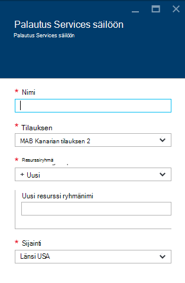

<properties
    pageTitle="Johdanto Azure DPM varmuuskopiointi | Microsoft Azure"
    description="Johdanto varmuuskopioiminen DPM palvelinten Azure varmuuskopiointi-palvelun avulla"
    services="backup"
    documentationCenter=""
    authors="Nkolli1"
    manager="shreeshd"
    editor=""
    keywords="System Center tietojen suojauksen hallinta-tietojen suojauksen hallinta, dpm varmuuskopiointi"/>

<tags
    ms.service="backup"
    ms.workload="storage-backup-recovery"
    ms.tgt_pltfrm="na"
    ms.devlang="na"
    ms.topic="article"
    ms.date="08/08/2016"
    ms.author="trinadhk;giridham;jimpark;markgal;adigan"/>

# Voit varmuuskopioida työmääriä Azure kanssa DPM valmisteleminen

> [AZURE.SELECTOR]
- [Azure varmuuskopion Server](backup-azure-microsoft-azure-backup.md)
- [SCDPM](backup-azure-dpm-introduction.md)
- [Azure varmuuskopiointi Server (perinteinen)](backup-azure-microsoft-azure-backup-classic.md)
- [SCDPM (perinteinen)](backup-azure-dpm-introduction-classic.md)

Tässä artikkelissa esitellään työmääriä huolehtivat System Center tietojen suojauksen hallinta (DPM) palvelinten Microsoft Azure Varmuuskopiointi-apuohjelman avulla. Luettavaksi, tietoja:

- Azure DPM palvelimen varmuuskopiointi toiminta
- Tavoitteet varmuuskopiointi tasainen edellytykset
- Tyypillinen virheet ja miten voit käsitellä niitä
- Tuetut tilanteet

> [AZURE.NOTE] Azure on kaksi käyttöönoton mallien luominen ja käyttäminen resurssit: [Resurssienhallinta ja perinteinen](../resource-manager-deployment-model.md). Tässä artikkelissa on tietoja ja menetelmiä VMs käyttöön Resurssienhallinta mallin palauttamista varten.

System Center DPM varmuuskopioi tiedoston ja sovelluksen tiedot. DPM varmuuskopioida tiedot olla tallennettuna nauha-levyllä, tai Azure Microsoft Azure varmuuskopioimalla varmuuskopioida. DPM toimii Azure varmuuskopioimalla seuraavasti:

- **DPM käyttöön kuin fyysinen palvelimeen tai paikalliseen virtual-koneen** — Jos DPM on otettu käyttöön, fyysistä palvelinta tai paikalliseen Hyper-V virtuaalikoneen voit varmuuskopioida tietojen palauttaminen palvelut-säilö levy ja nauha lisäksi voit varmuuskopion.
- **DPM käyttöön kuin Azure virtuaalikoneen** – System Center 2012 R2 ja Päivitä 3, valitse DPM otetaan käyttöön Azure virtuaalikoneen nimellä. Jos DPM otetaan käyttöön kuin Azure virtuaalikoneen, voit varmuuskopioida tiedot Azure-levyjen liitetty DPM Azure virtuaalikoneen tai voit purku tietojen tallentaminen mukaan varmuuskopioiminen palautus Services säilö ylöspäin.

## Miksi varmuuskopiointi-DPM Azure?

Liiketoiminnan etuja Azure varmuuskopioinnista, varmuuskopioiminen DPM palvelimet ovat:

- Paikallisen DPM käyttöönoton voit Azure vaihtoehtona nauha pitkään käyttöönoton.
- DPM käyttöönotoissa Azure-tietokannassa Azure varmuuskopiointi avulla voit purku tallennustilan Azure-levyltä, jonka avulla voi skaalata tallentamalla vanhat tiedot palautus Services säilö ja uudet tiedot levylle.

## Edellytykset
Valmistele Azure varmuuskopio varmuuskopioida DPM tiedot seuraavasti:

1. **Luo palautus Services säilö** – Luo säilöön Azure-portaalissa.
2. **Lataa säilö tunnistetiedot** – Lataa tunnistetietojen avulla voit rekisteröidä palautus Services säilö DPM palvelimeen.
3. **Asenna Azure Backup Agent** – Azure varmuuskopiosta Asenna agentti kunkin DPM-palvelimeen.
4. **Rekisteröi palvelin** – Rekisteröi palautus Services säilö DPM palvelimeen.

### 1. Luo palautus palvelut-säilö
Voit luoda palautus-palveluiden säilö seuraavasti:

1. Kirjautuminen [Azure portal](https://portal.azure.com/).

2. Valitse toiminto-valikosta valitsemalla **Selaa** ja kirjoita resurssien luetteloa, **Palautus-palvelut**. Kun alat kirjoittaa, luettelo suodattaa syötettäsi perusteella. Valitse **palautus-palveluiden säilö**.

    

    Palautus Services vaults luettelo tulee näkyviin.

3. **Palautus Services vaults** -valikosta **Lisää**.

    

    Palautus Services säilö-sivu avautuu, kannattaa antaa **nimi**, **tilauksen**, **resurssiryhmä**ja **sijainti**.

    

4. Kirjoita kutsumanimi tunnistavan säilö **nimi**. Nimen on oltava yksilöllinen Azure-tilausta. Kirjoita nimi, joka sisältää 2 – 50 merkkiä. Se on alettava kirjaimella, ja voivat sisältää vain kirjaimia, numeroita ja väliviivoja.

5. Valitse **tilaus** tilaukset käytettävissä luettelossa. Jos et ole varma, mikä tilaus käyttämään, käytä oletusarvoa (tai ehdotetut) tilaukseen. On useita vaihtoehtoja vain, jos organisaation tilillä on liitetty useita Azure-tilauksia.

6. **Resurssiryhmä** käytettävissä luettelo resurssin ryhmien tai valitse **Uusi** ja luo uusi resurssiryhmä. Resurssiryhmät Lisätietoja on artikkelissa [Azure resurssien hallinnan yleiskatsaus](../azure-resource-manager/resource-group-overview.md)

7. Valitse **sijainti** Valitse säilö maantieteellinen alue.

8. Valitse **Luo**. Se voi viedä aikaa palautus Services säilö luodaan. Seurata tilailmoitukset portaalin oikeassa yläkulmassa-alueella.
Kun oman säilö on luotu, se avautuu portaalissa.

### Tallennustilan replikoinnin määrittäminen

Tallennustilan replikoinnin-asetuksen avulla voit valita geo ylimääräinen ja paikallisesti tarpeettomat välillä. Oman säilö on oletusarvoisesti geo ylimääräinen. Jätä arvoksi geo ylimääräinen, jos kyseessä on ensisijainen varmuuskopiointi-vaihtoehto. Jos haluat halvempaa vaihtoehto, joka ei ole aivan kestävät, valitse paikallisesti ylimääräinen. Lue lisätietoja [geo tarpeettomat](../storage/storage-redundancy.md#geo-redundant-storage) ja [paikallisesti tarpeettomat](../storage/storage-redundancy.md#locally-redundant-storage) tallennusasetukset [Azuren tallennustilaan replikoinnin yleiskatsaus](../storage/storage-redundancy.md).

Voit muokata tallennustilan replikoinnin asetusta seuraavasti:

1. Valitse oman säilö Avaa säilö Raporttinäkymät-ikkunan ja asetukset-sivu. Jos **asetukset** -sivu ei avaudu, valitse **kaikki asetukset** säilö Raporttinäkymät-ikkunan.

2. Valitse **asetukset** -sivu **Varmuuskopiointi infrastruktuurin** > **Varmuuskopioinnin määrittäminen** Avaa **Varmuuskopio-määritys** -sivu. Valitse **Varmuuskopiointi määritys** -sivu lisääminen säilöön replikoinnin tallennuspaikka.

    

    Sen jälkeen, että säilö tallennustilan-vaihtoehdon valitseminen olet valmis AM liitettävä säilö. Aloita suhteen olisi löydä ja rekisteröi Azure-virtuaalikoneissa.

### 2. säilö tunnistetietojen lataamisesta

Säilö tunnistetiedot-tiedosto on kunkin varmuuskopion säilö portaalin luoma varmenne. Portaalin lataa sitten julkisella avaimella, Access ohjausobjektin Service (ACS). Varmenteen yksityinen avain on saatavana osana työnkulun, joka on määritetty tietokoneen rekisteröinti työnkulun syötteeksi käyttäjä. Tämä todentaa koneen varmuuskopiotiedot lähettäminen tunnistettujen säilöön, Azure varmuuskopio-palvelussa.

Säilö tunnistetieto käytetään vain rekisteröinti työnkulun aikana. On käyttäjän varmistamisesta, että säilö tunnistetiedot-tiedostoa ei käsiin. Jos se osuu päivittämättömien kuka tahansa käyttäjä kädet, tiedosto säilöön tunnistetiedot voidaan rekisteröidä muiden laitteiden vastaan samaan säilö. Kuitenkin kuin varmuuskopiotiedot on salattu salasana, johon kuuluu asiakkaalle, ei käsiin aiemmin palautettavat tiedot. Tämä huolta pienentämään säilö tunnistetiedot on määritetty päättyy 48hrs. Säilö tunnistetietojen palautus-palvelujen voi ladata kaikki määrän kertoja –, mutta vain uusimmat säilö tunnistetiedon tiedosto on käytettävissä rekisteröinti työnkulun aikana.

Säilö tunnistetiedon tiedosto ladataan Azure-portaalista suojatun kanavan kautta. Azure varmuuskopiointi-palvelu ei tunnista sertifikaatin yksityinen avain ja yksityinen avain ei säilytetä portaalin tai palvelu. Seuraavien vaiheiden avulla voit ladata säilöön tunnistetiedon tiedoston paikalliseen tietokoneeseen.

1. Kirjautuminen [Azure portal](https://portal.azure.com/).

2. Avaa, johon palautus Services säilöön, jonka haluat rekisteröidä DPM koneen.

3. Asetukset-sivu avautuu oletusarvoisesti. Jos se on suljettu, valitse **asetukset** -säilö raporttinäkymä asetukset-sivu. Valitse asetukset-sivu Valitse **Ominaisuudet**.

    

4. Valitse ominaisuudet-sivulla **Varmuuskopiointi tunnistetiedot**kohdassa **Lataa** . Portaalin Luo säilöön tunnistetiedon tiedosto, joka tehdään ladattavaksi.

    

Portaalin Luo säilöön-tunnistetietojen avulla yhdistelmä säilö nimi ja nykyisen päivämäärän. **Tallenna** säilöön-tunnistetietojen lataamisesta paikallisen tilin tiedostot-kansiossa tai valitse Määritä sijainti säilö tunnistetietoja Tallenna-valikon Tallenna nimellä. Kestää hetken luotavan tiedoston.

### Huomautus
- Varmista, että säilö tunnistetiedot-tiedosto tallennetaan sijaintiin, jossa niitä voi käyttää tietokoneesta. Jos se on tallennettu tiedosto Jaa/SMB, Tarkista käyttöoikeudet.
- Säilö tunnistetietojen tiedostoa käytetään vain rekisteröinti työnkulun aikana.
- Säilö tunnistetietojen tiedoston 48hrs vanhentuu ja voi ladata portaalin.

### 3. Asenna Backup agentti

Kun olet luonut Azure varmuuskopiointi säilö, agentti on asennettava kunkin oman Windows koneet (Windows Server, Windows-asiakas, System Center tietojen suojauksen hallinta server tai Azure varmuuskopiointi palvelimen), joka mahdollistaa Varmuuskopioi tiedot ja Azure-sovellukset.

1. Avaa, johon palautus Services säilöön, jonka haluat rekisteröidä DPM koneen.

2. Asetukset-sivu avautuu oletusarvoisesti. Jos se on suljettu, valitse **asetukset** , Avaa asetukset-sivu. Valitse asetukset-sivu Valitse **Ominaisuudet**.

    

3. Valitse asetukset-sivun **Azure Backup Agent**-kohdassa **Lataa** .

    

   Kun agentti on ladattu, kaksoisnapsauta MARSAgentInstaller.exe käynnistää Azure Backup agent asennusta. Valitse asennuksen kansio ja agentti vaaditaan työtilan kansion. Välimuistin määritetyssä on oltava tilaa, jossa on vähintään 5 prosenttia palautettavat tiedot.

4.  Jos käytät välityspalvelinta internet,-yhteys **välityspalvelimen määritys** -näytössä ja anna välityspalvelimen palvelimen tiedot. Jos käytät edellyttävän välityspalvelimen kautta, kirjoita käyttäjän nimi ja salasana tiedot tämän näytön.

5.  Azure Backup agent asentaa .NET Framework 4.5 ja Windows PowerShellin (jos se ei ole käytettävissä jo) ja viimeistele asennus.

6.  Kun agentti on asennettu, **Sulje** ikkuna.

    

7. Voit **rekisteröidä DPM palvelimen** säilö, **hallinta** -välilehdessä valitsemalla **Online**. Valitse **Rekisteröi**. Se avautuu ohjattu määritystoiminto Rekisteröi.

8. Jos käytät välityspalvelinta internet,-yhteys **välityspalvelimen määritys** -näytössä ja anna välityspalvelimen palvelimen tiedot. Jos käytät edellyttävän välityspalvelimen kautta, kirjoita käyttäjän nimi ja salasana tiedot lisäämisvaihtoehtoa.

    

9. Tunnistetietojen säilöön-näytön selaamalla ja valitse säilöön tunnistetiedot tiedosto, jonka aiemmin ladattu.

    

    Säilö tunnistetiedot-tiedosto on voimassa vain 48 tuntia (sen jälkeen, kun se ladataan-portaalista). Jos käytössä ilmenee jokin virhe tässä näytössä (esimerkiksi "säilö tunnistetietojen annettua tiedostoa on päättynyt"), kirjaudu Azure portaalin ja lataa säilö tunnistetietojen tiedosto uudelleen.

    Varmista, että säilö tunnistetiedot-tiedosto on käytettävissä sijainnissa, joita voit käyttää sovelluksen. Jos käytössä ilmenee käyttää liittyvät virheet, säilö tunnistetiedot-tiedoston kopioiminen tämän tietokoneen tilapäinen sijainti ja yritä uudelleen.

    Jos saat virheilmoituksen Virheellinen säilö tunnistetiedon (esimerkiksi "Virheellinen säilö tunnistetiedot edellyttäen") tiedosto on vahingoittunut tai ei ole on uusin tunnistetiedot palautus-palveluun liitetyn. Yritä jälkeen uusi säilö tunnistetiedon tiedoston lataamisen-portaalista. Tämä virhe yleensä tarkastella, jos käyttäjä valitsee Azure-portaalissa nopeasti peräkkäin **Lataa säilö tunnistetiedot** -asetus. Tässä tapauksessa vain toinen säilö tunnistetiedon tiedosto on voimassa.

10. Voit hallita verkon kaistanleveyden käytön aikana työ- ja vapaa-aika-tunnit **Rajoittimen asetukset** -näytössä voit määrittää kaistanleveyden käyttörajoitukset ja määritä työmäärä ja vapaa-aika tuntia.

    

11. Selaa kansioon, johon Azure ladatut tiedostot tilapäisesti valmistella **Palautus kansion asetukset** -näytössä.

    

12. **Salauksen asetukset** -näytön Luo salasana tai Anna salasana (vähintään 16 merkkiä). Muista tallentaa salasana turvalliseen paikkaan.

    

    > [AZURE.WARNING] Jos salasana katoaa tai unohtanut; Microsoft voi auttaa palauttamisessa palautettavat tiedot. Peruskäyttäjän omistaa salauksen salasana ja Microsoft ei voi käyttää käyttäjän salasana näkyvyys. Tallenna tiedosto turvalliseen paikkaan, kun se on tarpeen palautumistoiminnon aikana.

13. Kun napsautat **Rekisteröi** -painiketta, tietokoneen on rekisteröity onnistuneesti säilö ja voit nyt jatkaa Microsoft Azure varmuuskopion.

14. Kun käytät tietojen suojauksen hallinta, voit muokata asetuksissa määritettyä rekisteröinti työnkulun aikana valitsemalla valitsemalla **online-palvelun** **hallinta** -välilehden **Määritä** -asetus.

## Vaatimukset (ja rajoituksia)

- DPM voi olla käynnissä fyysistä palvelinta tai Hyper-V virtual machine-asennuksen System Center 2012 SP1 tai System Center 2012 R2: n. Se on käytössä myös nimellä Azure virtual-tietokoneessa, jossa on vähintään System Center 2012 R2 ja valitse DPM 2012 R2: n päivityskokoelma 3 tai Windows-virtual machine-VMWare käytössä vähintään System Center 2012 R2 ja Update Rollup 5.
- Jos käytössäsi on DPM System Center 2012 SP1: een Asenna päivitys aikaisempi 2 ylöspäin System Center Data Protection Manager SP1. Tämä on pakollinen, ennen kuin asennat Azure Backup-agentti.
- DPM palvelin on oltava Windows PowerShell- ja .net Framework 4.5 asennettuna.
- DPM voit varmuuskopioida useimmat työmääriä Azure varmuuskopion. Mikä on tuettu Katso täysi luettelo Azure-varmuuskopiointi tue kohteiden alla.
- Azure varmuuskopiointi tallennettuja tietoja ei voi palauttaa "Kopioi nauha"-vaihtoehto.
- Tarvitset Azure-tili Azure varmuuskopiointi-toiminto on käytössä. Jos sinulla ei ole tiliä, voit luoda ilmainen kokeiluversio tili vain muutaman minuutin. Lisätietoja [Azure varmuuskopiointi hinnat](https://azure.microsoft.com/pricing/details/backup/).
- Azure varmuuskopioinnista edellyttää Azure Backup Agent on asennettava palvelimissa, jotka haluat varmuuskopioida. Kunkin palvelimen on oltava vähintään 5 prosenttia varmuuskopioidaan, paikallinen lisätallennustilaa maksutta käytettävissä olevat tiedot koon. Esimerkiksi 100 gt tietoja varmuuskopioiminen edellyttää vähintään 5 gt vapaata tilaa taittopöydällä sijainti.
- Tiedot tallennetaan Azure säilö muistiin. Ei ole voit voit takaisin ylös Azure-varmuuskopiointi vault tietojen määrää rajoitettu mutta tietolähde (esimerkiksi virtuaalikoneen tai tietokannan) koko ei kannata suurempi kuin 54400 Gigatavua.

Tiedostotyyppejä tuetaan takaisin ylös Azure:

- Salattu (vain koko varmuuskopiot)
- Pakattu (lisäävän varmuuskopioinnin tuettu)
- Lyhyet (lisäävän varmuuskopioinnin tuettu)
- Pakattu ja lyhyet (käsitellään Sparse)

Ja nämä ei tueta:

- Kirjainkoon tiedostojärjestelmän palvelimiin ei tueta.
- Linkit (ohitettu)
- Uudelleenjäsennyskohdat (ohitettu)
- Salattujen ja pakattu (ohitettu)
- Salattujen ja lyhyet (ohitettu)
- Pakattu virta
- Lyhyet muodossa

>[AZURE.NOTE] Valitse System Center 2012 DPM alkaen SP1: Voit varmuuskopioida toiminnoista, jotka on suojattu DPM Azure käyttämällä Microsoft Azure varmuuskopioinnin määrittäminen.
