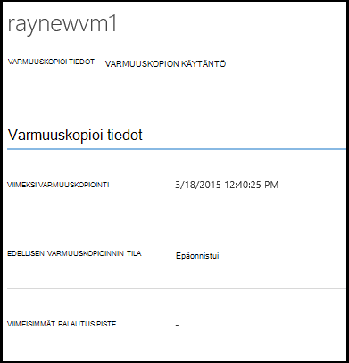

<properties
    pageTitle="Hallinta ja valvonta Azure virtual machine-varmuuskopiot | Microsoft Azure"
    description="Lue, miten voit valvoa Azure virtual machine-varmuuskopiot"
    services="backup"
    documentationCenter=""
    authors="trinadhk"
    manager="shreeshd"
    editor=""/>

<tags
    ms.service="backup"
    ms.workload="storage-backup-recovery"
    ms.tgt_pltfrm="na"
    ms.devlang="na"
    ms.topic="article"
    ms.date="08/31/2016"
    ms.author="trinadhk; jimpark; markgal;"/>

# <a name="manage-and-monitor-azure-virtual-machine-backups"></a>Hallinta ja Azure virtual machine-varmuuskopiot valvonta

> [AZURE.SELECTOR]
- [Azure AM varmuuskopioiden hallinta](backup-azure-manage-vms.md)
- [Perinteinen AM varmuuskopioiden hallinta](backup-azure-manage-vms-classic.md)

Tässä artikkelissa on tietoja yleisiä hallinnan ja seurannan tehtävät perinteinen mallin näennäiskoneiden suojattu Azure-tietokannassa.  

>[AZURE.NOTE] Azure on kaksi käyttöönoton mallien luominen ja käyttäminen resurssit: [Resurssienhallinta ja perinteinen](../resource-manager-deployment-model.md). Lisätietoja [Azure-virtuaalikoneissa varmuuskopioida ympäristön valmisteleminen](backup-azure-vms-prepare.md) perinteinen käyttöönoton mallin VMs käyttämiseen.

## <a name="manage-protected-virtual-machines"></a>Suojatun näennäiskoneiden hallinta

Voit hallita suojatun näennäiskoneiden seuraavasti:

1. Voit tarkastella ja hallita virtual machine varmuuskopiointiasetuksia Valitse **Suojatut osat** -välilehti.

2. Valitse suojattu kohteen **Varmuuskopioinnin tiedot** -välilehdestä, jossa näkyy tietoja edellisen varmuuskopioinnin Nähdäksesi nimi.

    

3. Voit tarkastella ja hallita varmuuskopion käytännön virtual tietokoneen asetukset valitse **käytännöt** -välilehti.

    

    **Varmuuskopiointi käytännöt** -välilehdessä näkyy aiemmin käytännön. Voit muokata haluamallasi tavalla. Jos haluat luoda uuden käytännön valitsemalla **Luo** **määrittäminen** -sivulla. Huomaa, että jos haluat poistaa käytännön sitä ei kannata minkä tahansa näennäiskoneiden liittyy.

    

4. Saat lisätietoja toiminnot ja tila virtual machine, valitse **Projektit** -sivulla. Valitse luettelosta tarkempia job tai suodattaa tietyn virtual machine töitä.

    

## <a name="on-demand-backup-of-a-virtual-machine"></a>Tarvittaessa varmuuskopion virtual machine
Voi tehdä tarvittaessa virtual konetta varmuuskopion, kun se on määritetty suojaus. Jos ensimmäinen varmuuskopioinnin odottaa virtuaalikoneen, tarvittaessa varmuuskopiointi luo kopio virtuaalikoneen Azure varmuuskopion säilöön. Jos ensimmäinen varmuuskopiointi on valmis, tarvittaessa varmuuskopion näkyy vain Lähetä muutokset edellisen varmuuskopiosta Azure varmuuskopiointi vault eli se on aina vaiheittainen.

>[AZURE.NOTE] Tarvittaessa varmuuskopiointi säilytys solualue on määritetty päivittäinen säilyttäminen varmuuskopio AM vastaavaa käytäntöä säilytys-arvo.  

Voit ottaa tarvittaessa virtual konetta varmuuskopion seuraavasti:

1. **Suojatut osat** -sivulle ja **tyypiksi **Azure virtuaalikoneen** (Jos ei valittuna)** ja valitse **sitten** -painiketta.

    

2. Valitse virtuaalikoneen, jossa haluat tehdä tarvittaessa varmuuskopion ja valitse **Nyt varmuuskopio** -painikkeen sivun alareunassa.

    

    Tämä toiminto luo varmuuskopiointityön valitun virtuaalikoneen. Säilytys-alueen luoman työn palautus-kohdan on sama kuin liittyvän virtuaalikoneen käytännön määritetty.

    

    >[AZURE.NOTE] Voit tarkastella liittyvän virtual machine-käytännön, virtual machine **Suojatut osat** -sivulle siirtyminen ja Avaa varmuuskopio käytäntö-välilehti.

3. Kun työ on luotu, voit valita **Näytä työ** painiketta ilmoitukseen Nähdäksesi vastaavan projektin työt-sivu.

    

4. Työn onnistumiseen, kun palautuspiste luodaan, joiden avulla voit palauttaa virtuaalikoneen. Tämä kasvattaa palautus pisteen sarakkeen arvon myös 1 **Suojatut osat** -sivulle.

## <a name="stop-protecting-virtual-machines"></a>Lopeta näennäiskoneiden suojaaminen
Voit lopettaa uudet varmuuskopiot virtual koneen kanssa seuraavista vaihtoehdoista:

- Säilytä varmuuskopion virtual machine Azure varmuuskopion säilöön liittyviä tietoja
- Poista virtuaalikoneen liittyvät varmuuskopiotiedot

Jos olet valinnut säilyttää varmuuskopion virtuaalikoneen liittyviä tietoja, voit palauttaa virtuaalikoneen palautettavat tiedot. Saat hinnoittelua tiedot, kuten näennäiskoneiden napsauttamalla [tätä](https://azure.microsoft.com/pricing/details/backup/).

Jos haluat lopettaa virtual machine suojaus:

1. **Suojatut osat** -sivulle ja tyypiksi **Azure virtuaalikoneen** suodatin (Jos ei valittuna) ja valitse **sitten** -painiketta.

    

2. Valitse virtuaalikoneen ja valitse sitten **Lopeta suojaus** -sivun alareunaan.

    

3. Oletusarvon mukaan Azure varmuuskopion ei poista virtuaalikoneen liittyvät palautettavat tiedot.

    

    Jos haluat poistaa varmuuskopiotiedot, valitse valintaruutu.

    

    Valitse lopettamisen varmuuskopioinnin syy. Kun tämä on valinnainen, antamisen syy avulla Azure varmuuskopio käyttäminen palaute ja priorisoida asiakkaan käyttötavoista.

4. Napsauta **Lähetä** -painike lähettää **Lopeta suojaus** -työ. Valitse **Näytä työ** vastaaviin projektin **työt** -sivu.

    

    Jos et ole valinnut **Poista liittyvät varmuuskopiotiedot** vaihtoehto aikana ohjattu **Lopeta suojaus** ja valitse Julkaise projektin valmistumisen, suojaus-tilaksi muuttuu **Suojaus pysäyttää**. Tiedot pysyvät Azure varmuuskopioimalla, kunnes se poistetaan erikseen. Voit aina poistaa tiedot valitsemalla virtuaalikoneen **Suojatut osat** -sivulle ja valitsemalla **Poista**.

    

    Jos olet valinnut Poista **liittyvien tietojen** , virtuaalikoneen ei ole **Suojattu kohteet** -sivun osa.

## <a name="re-protect-virtual-machine"></a>Suojaa uudelleen virtuaalikoneen
Jos et ole valinnut **Poista associate varmuuskopiotiedot** vaihtoehto **Lopeta suojaus**, voit suojata virtuaalikoneen uudelleen samalla rekisteröity näennäiskoneiden varmuuskopiointi ohjeiden mukaisesti. Kun suojattu, virtual tämä tietokone on palautettavat tiedot säilyvät Lopeta suojaus ennen ja jälkeen luodut palautus pistettä uudelleen suojaa.

Sen jälkeen uudelleen suojaa virtual machine tilaa muutetaan **suojatun** Jos arvopisteitä on palauttamista ennen **Lopeta suojaus**.

  

>[AZURE.NOTE] Kun suojaat virtuaalikoneen uudelleen, voit valita eri käytäntö kuin käytäntö, jonka virtuaalikoneen on suojattu aluksi.

## <a name="unregister-virtual-machines"></a>Unregister näennäiskoneiden

Jos haluat poistaa virtuaalikoneen varmuuskopion säilöstä:

1. Valitse sivun alareunassa **Poista** -painiketta.

    

    Saapuvan ilmoitus näkyy pyytää vahvistusta näytön alareunassa. Jatka valitsemalla **Kyllä** .

    

## <a name="delete-backup-data"></a>Varmuuskopiointi-tietojen poistaminen
Voit poistaa liittyvät virtual-koneen joko palautettavat tiedot.

- Lopeta suojaus työn aikana
- Lopeta suojaus jälkeen työ on valmis virtual tietokoneeseen

Voit poistaa varmuuskopiotiedot virtual tietokoneeseen, *Suojauksen pysäytetty* -tilassa eli kirjaaminen **Lopettaa** varmuuskopiointityön onnistumiseen:

1. Siirry **Suojatut osat** -sivulle ja * **Azure virtuaalikoneen** tyypiksi* ja **Valitse** -painiketta.

    

2. Valitse virtuaalikoneen. Virtuaalikoneen on **Pysäytetty suojaus** -tilaan.

    

3. Valitse sivun alareunassa **Poista** -painiketta.

    

4. **Poista varmuuskopiotiedot** ohjatun toiminnon Valitse syy poistaminen varmuuskopiotiedot (suositellaan) ja valitse **Lähetä**.

    

5. Tämä luo työn, voit poistaa valitun virtuaalikoneen palautettavat tiedot. Valitse **Näytä työ** Nähdäksesi vastaavan projektin työt-sivu.

    

    Kun työ on valmis, vastaava virtuaalikoneen tapahtuma poistetaan **suojatut osat** -sivulta.

## <a name="dashboard"></a>Raporttinäkymät-ikkunan
**Dashboard** -sivulla voit tarkastella tietoja Azuren näennäiskoneiden, niiden tallennustilan ja niihin liittyvät viimeisen 24 tunnin aikana työt. Voit tarkastella varmuuskopioinnin tilan ja liittyvän varmuuskopion virheitä.


>[AZURE.NOTE] Koontinäytön arvot päivitetään 24 tunnin välein.

## <a name="auditing-operations"></a>Toimintojen tarkistaminen
Azure varmuuskopioinnin tarkastaminen-toiminnon lokit"varmuuskopio-toimintoa henkilöistä ja katso täsmälleen mitä hallintatoiminnot on suorittaa varmuuskopioinnin säilö asiakkaan käynnistämä. Toimintojen lokitiedot käyttöön hyvien jälkiselvittely ja valvonta backup toimille tuki.

Toimintojen lokit kirjataan seuraavat toimenpiteet:

- Rekisteröidy
- Unregister
- Määritä suojaus
- Varmuuskopiointi (molemmat ajoitettu sekä tarvittaessa varmuuskopiointi BackupNow kautta)
- Palauttaminen
- Lopeta suojaus
- Tietojen poistaminen
- Lisää käytäntö
- Poista käytäntö
- Päivitä käytäntö
- Työn peruuttaminen

Voit tarkastella toimintojen lokit vastaavat varmuuskopion säilö seuraavasti:

1. Siirry Azure-portaalissa **hallintapalvelut** ja valitse sitten **Toimintojen lokit** -välilehti.

    

2. Valitse suodattimet- *tyypiksi **varmuuskopion** * ja määritä varmuuskopion säilö nimi *palvelunimi* ja valitse sitten **Lähetä**.

    

3. Valitse Toiminnot-lokit toiminnon ja **tiedot** vastaavat toiminnon tiedot näkyviin valitsemalla.

    

    **Tiedot ohjatun** sisältää tietoja työn tunnus, resurssi, toiminto käynnistyy ja Aloitusaika toiminto käynnistetään, toiminto.

    

## <a name="alert-notifications"></a>Ilmoitukset
Saat mukautettu ilmoitus ilmoitukset työt-portaalissa. Tämä saavutetaan määrittämällä PowerShell ilmoitusten sääntöjen toiminnallisia lokit tapahtumista. Suosittelemme, että käytät *PowerShell versio 1.3.0 muistia*.

Voit määrittää mukautetun ilmoituksen ilmoitus varmuuskopioinnin virheet, malli-komento näyttää:

```
PS C:\> $actionEmail = New-AzureRmAlertRuleEmail -CustomEmail contoso@microsoft.com
PS C:\> Add-AzureRmLogAlertRule -Name backupFailedAlert -Location "East US" -ResourceGroup RecoveryServices-DP2RCXUGWS3MLJF4LKPI3A3OMJ2DI4SRJK6HIJH22HFIHZVVELRQ-East-US -OperationName Microsoft.Backup/backupVault/Backup -Status Failed -TargetResourceId /subscriptions/86eeac34-eth9a-4de3-84db-7a27d121967e/resourceGroups/RecoveryServices-DP2RCXUGWS3MLJF4LKPI3A3OMJ2DI4SRJK6HIJH22HFIHZVVELRQ-East-US/providers/microsoft.backupbvtd2/BackupVault/trinadhVault -Actions $actionEmail
```

**ResourceId**: Saat tämän toimintojen lokitiedot ponnahdusikkuna kuvatulla tavalla osan yläpuolella. Tiedot-ponnahdusikkunasta toiminnon ResourceUri on cmdlet toimitettavat ResourceId.

**OperationName**: Tämä on muodossa "Microsoft.Backup/backupvault/<EventName>" EventName on rekisteriä, poista, ConfigureProtection, varmuuskopioiminen, palauttaminen, StopProtection, DeleteBackupData, CreateProtectionPolicy, DeleteProtectionPolicy, UpdateProtectionPolicy

**Tila**: tuetut arvot ovat-aloittaminen onnistui ja epäonnistui.

**ResourceGroup**: ResourceGroup resurssin, jossa toiminto käynnistyy. Voit hankkia ResourceId arvosta. ResourceGroup arvo arvo kentät */resourceGroups/* ja */providers/* ResourceId arvon välillä.

**Nimi**: ilmoitusten säännön nimi.

**CustomEmail**: Määritä mukautettu sähköpostiosoite, johon haluat lähettää ilmoituksen ilmoitus

**SendToServiceOwners**: Tämä vaihtoehto lähettää ilmoituksen ilmoituksen kaikille järjestelmänvalvojille ja apuyhteyshenkilöiden Tilauksen. Sen avulla voidaan **Uusi AzureRmAlertRuleEmail** cmdlet-komento

### <a name="limitations-on-alerts"></a>Ilmoitusten rajoitukset
Tapahtuman Hakupohjaisten ilmoitusten on tehtävä seuraavat rajoitukset:

1. Valitse kaikki näennäiskoneiden varmuuskopion säilöön Hälytykset käynnistetään. Voit mukauttaa sen saada ilmoitukset tietyt näennäiskoneiden varmuuskopion säilöön.
2. Tämä ominaisuus on esikatselussa. [Opi lisää](../monitoring-and-diagnostics/insights-powershell-samples.md#create-alert-rules)
3. Saat ilmoitukset "alerts-noreply@mail.windowsazure.com". Tällä hetkellä ei voi muokata sähköpostin lähettäjä.

## <a name="next-steps"></a>Seuraavat vaiheet

- [Palauttaa Azure VMs](backup-azure-restore-vms.md)
