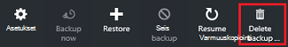

<properties
    pageTitle="Hallitse Resurssienhallinta käyttöön virtual machine-varmuuskopiot | Microsoft Azure"
    description="Lue, miten voit valvoa Resurssienhallinta käyttöön virtual machine-varmuuskopiot"
    services="backup"
    documentationCenter=""
    authors="trinadhk"
    manager="shreeshd"
    editor=""/>

<tags
    ms.service="backup"
    ms.workload="storage-backup-recovery"
    ms.tgt_pltfrm="na"
    ms.devlang="na"
    ms.topic="article"
    ms.date="08/11/2016"
    ms.author="jimpark; markgal; trinadhk"/>

# Azure virtual machine-varmuuskopiot hallinta

> [AZURE.SELECTOR]
- [Azure AM varmuuskopioiden hallinta](backup-azure-manage-vms.md)
- [Perinteinen AM varmuuskopioiden hallinta](backup-azure-manage-vms-classic.md)

Tässä artikkelissa on ohjeita hallinnasta AM varmuuskopiot ja kerrotaan portaalin Raporttinäkymät-ikkunan varmuuskopion ilmoitusten tietoihin. Tämän artikkelin ohjeet koskevat VMs käyttäminen palautus Services vaults. Tässä artikkelissa ei käsitellä näennäiskoneiden luominen eikä kerrotaan, miten voit suojata näennäiskoneiden. Katso askeleet, valitse suojata Azure Resurssienhallinta käyttöön VMs Azure-tietokannassa palautus Services säilöön, [ensin kohde: Varmuuskopioi VMs palautus palvelut-säilö](backup-azure-vms-first-look-arm.md).

## Vaults ja suojatun virtual koneet hallinta

Azure-portaalissa palautus Services säilö Raporttinäkymät-ikkunan pääsee tietoja säilö mukaan lukien:

- viimeisimmän varmuuskopioinnin tilannevedoksen, joka on myös uusimmat Palauta-kohdassa < br\>
- varmuuskopion käytännön < br\>
- kaikki varmuuskopion tilannevedoksia koko yhteensä < br\>
- luku, joka on suojattu säilö näennäiskoneiden < br\>

Monta hallintatehtäviä virtuaalikoneen varmuuskopioimalla alkavat avaaminen säilö koontinäytön. Koska vaults voidaan suojata useita kohteita (tai useita VMs) tietyn AM tietoja, Avaa säilö kohteen Raporttinäkymät-ikkunan. Seuraavien ohjeiden avulla voit avata *säilö Raporttinäkymät-ikkunan* ja jatka sitten *säilö kohteen Raporttinäkymät-ikkunan*. Sekä ohjeita, jotka osoittavat, miten voit lisätä säilö ja säilöön kohteen Azure koontinäyttö käyttämällä Raporttinäkymät-ikkunan komento PIN-koodi on "Vihjeitä". Raporttinäkymät-ikkunan kiinnittäminen on tapa säilöön tai kohteen pikakuvakkeen luominen. Voit suorittaa yleiset komennot pikakuvaketta.

>[AZURE.TIP] Jos sinulla on useita raporttinäkymien ja lavat Avaa, dian edestakaisin Azure Raporttinäkymät ikkunan alareunassa Tumma sininen liukusäätimen avulla.

### Avaa palautus Services säilö koontinäytön:

1. Kirjautuminen [Azure portal](https://portal.azure.com/).

2. Valitse toiminto-valikosta valitsemalla **Selaa** ja kirjoita resurssien luetteloa, **Palautus-palvelut**. Kun alat kirjoittaa, luettelon suodattimet kirjoittamiesi tietojen perusteella. Valitse **palautus-palveluiden säilö**.

      

    Palautus-palveluiden vaults näkyvät luettelossa.

      

    >[AZURE.TIP] Jos kiinnität säilö Azure-koontinäyttö, että säilö on heti käytettävissä, kun avaat Azure portaalin. Jos haluat kiinnittää säilö koontinäyttö, säilöön-luettelossa, napsauttamalla sitä hiiren kakkospainikkeella säilö ja valitse **Kiinnitä Raporttinäkymät-ikkunan**.

3. Valitse Avaa sen Raporttinäkymät-ikkunan säilö vaults-luettelosta. Kun valitset säilö, Avaa säilö Raporttinäkymät-ikkunan ja **asetukset** -sivu. Seuraavassa kuvassa on korostettuna **Contoso-säilö** Raporttinäkymät-ikkunan.

    

### Säilö kohteen Raporttinäkymät-ikkunan avaaminen

Valitse edellisessä vaiheessa avasit säilö Raporttinäkymät-ikkunan. Avaa säilö kohteen Raporttinäkymät-ikkunan seuraavasti:

1. Valitse **Azuren näennäiskoneiden**säilö raporttinäkymien, **Varmuuskopiointi kohteet** -ruutu.

    

    **Varmuuskopioidut kohteet** -sivu näyttää kunkin kohteen viimeisen varmuuskopiointityön. Tässä esimerkissä on yksi virtual machine-demovm-markgal suojattu säilö tässä.  

    

    >[AZURE.TIP] Aputoiminnot voit kiinnittää Azure Raporttinäkymät-ikkunan säilöön-kohteeseen. Jos haluat kiinnittää säilöön-kohteen säilö kohdeluettelon, kohdetta hiiren kakkospainikkeella ja valitse **Kiinnitä Raporttinäkymät-ikkunan**.

2. Valitse Avaa säilö kohteen Raporttinäkymät-ikkunan kohde **Varmuuskopiointi kohteet** -sivu.

    

    Säilö kohteen Raporttinäkymät-ikkunan ja avaa sen **asetukset** -sivu.

    

    Säilö kohteen Koontinäytöstä voit tehdä monta tärkeimmät hallintatehtävät, kuten:

    - muuttaa käytännöt tai luoda uuden varmuuskopion käytännön < br\>
    - Näyttää palauttaminen pistettä ja tarkastella niiden yhdenmukaisuuden tilaan < br\>
    - tarvittaessa varmuuskopion virtual machine < br\>
    - Lopeta suojaaminen näennäiskoneiden < br\>
    - Jatka suojaus virtual koneen < br\>
    - Poista varmuuskopiotiedot (tai palautuspiste) < br\>
    - [Palauta varmuuskopio (tai palautuspiste)](./backup-azure-arm-restore-vms.md#restore-a-recovery-point) < br\>

Tämän osion toimenpiteistä aloituskohdan on säilö kohteen Raporttinäkymät-ikkunan.

## Varmuuskopion käytäntöjen hallinta

1. [Säilö kohteen Raporttinäkymät-ikkunan](backup-azure-manage-vms.md#open-a-vault-item-dashboard)Valitse **Kaikki asetukset** Avaa **asetukset** -sivu.

    

2. Valitse **asetukset** -sivu **Varmuuskopiointi käytännön** avaa kyseisen sivu.

    Valitse sivu-varmuuskopioinnin korkojakso ja säilytyskäytäntöjä alueen tiedot ovat näkyvissä.

    

3. **Valitse Varmuuskopioi käytäntö** -valikosta:
    - Jos haluat muuttaa käytäntöjä, valitse eri käytäntö ja valitse **Tallenna**. Uuden käytännön mukautuu automaattisesti säilö. < br\>
    - Käytännön luomisesta, valitse **Luo uusi**.

    

    Ohjeita varmuuskopion käytännön luomisesta on artikkelissa [varmuuskopion käytännön määrittäminen](backup-azure-manage-vms.md#defining-a-backup-policy).

[AZURE.INCLUDE [backup-create-backup-policy-for-vm](../../includes/backup-create-backup-policy-for-vm.md)]

## Tarvittaessa varmuuskopion virtual machine
Voi tehdä tarvittaessa virtual konetta varmuuskopion, kun se on määritetty suojaus. Jos ensimmäinen varmuuskopioinnin odottaa, tarvittaessa varmuuskopiointi luo kopio virtuaalikoneen palautus Services säilö. Jos ensimmäinen varmuuskopiointi on valmis, tarvittaessa varmuuskopiointi vain lähettää muutokset edellisen tilannevedoksen, valitse palautus-palveluiden säilö. Toisin sanoen myöhemmin varmuuskopiot ovat aina vaiheittainen.

>[AZURE.NOTE] Tarvittaessa varmuuskopiointi säilytys-alue on määritetty käytännön päivittäisen varmuuskopioinnin pisteen säilytys-arvo. Jos mikään päivittäisen varmuuskopioinnin kohta on valittuna, viikoittain varmuuskopion pisteen käytetään.

Käynnistettävän virtual machine tarvittaessa-varmuuskopion:

- Valitse **Varmuuskopioi** [säilö kohteen Raporttinäkymät-ikkunan](backup-azure-manage-vms.md#open-a-vault-item-dashboard).

    

    Portaalin varmistetaan, että haluat aloittaa tarvittaessa varmuuskopiointityön. Käynnistä valitsemalla **Kyllä** varmuuskopiointityön.

    

    Varmuuskopiointityön Luo palautus-kohtaa. Palautus-kohdan säilytys-alue on sama kuin liittyvän virtuaalikoneen käytännön määritetyn säilytys alueen. Edistymisen työn säilö raporttinäkymät-ikkunassa, napsauta **Varmuuskopiointi työt** -ruutua.  

## Lopeta näennäiskoneiden suojaaminen
Jos haluat lopettaa suojaaminen virtual machine, sinua pyydetään haluat säilyttää palautus kohdeosoite. Voit lopettaa suojaaminen näennäiskoneiden kahdella tavalla:
- Peruuta kaikki varmuuskopion tulevien projektien ja poista palautus pisteiden tai
- Lopeta kaikki tulevaisuudessa varmuuskopion työt, mutta jättää palautus pisteet  

Tällä jättää palautus pisteet tallennustilan liittyvät kustannukset. Jätä palautus pisteet etuna on kuitenkin voit palauttaa virtuaalikoneen myöhemmin tarvittaessa. Tietoja, jätä palautus pisteet kustannus on artikkelissa [hinnat tiedot](https://azure.microsoft.com/pricing/details/backup/). Jos haluat poistaa palautus pisteiden, et voi palauttaa virtuaalikoneen.

Jos haluat lopettaa virtual machine suojaus:

1. [Säilö kohteen Raporttinäkymät-ikkunan](backup-azure-manage-vms.md#open-a-vault-item-dashboard)Valitse **Lopeta varmuuskopiointi**.

    

    Lopeta varmuuskopiointi-sivu avautuu.

    

2. Valitse **Lopeta varmuuskopion** sivu, säilytetäänkö vai poistetaanko palautettavat tiedot. Tiedot-ruutu on valittua tietoja.

    

3. Jos haluat säilyttää varmuuskopiotiedot, siirry vaiheeseen 4. Jos haluat poistaa varmuuskopiotiedot, varmista, että haluat lopettaa varmuuskopion työt ja poista palautus - kohtien Kirjoita kohteen nimi.

    

    Jos et ole varma napsauttamalla kohteen nimen, osoitinta huutomerkki voit tarkastella nimeä. Kohteen nimi on myös kohdassa **Pysäytä varmuuskopiointi** sivu yläreunassa.

4. Voit myös antaa **syy** tai **Kommentti**.

5. Lopeta nykyisen kohteen varmuuskopiointityön napsauttamalla  

    Ilmoitus kertoo varmuuskopion työt pysäyttämisestä.

    

## Jatka suojausta virtual koneen
Jos **Säilyttää Varmuuskopioi tietoja** -asetus on valittu, kun virtuaalikoneen suojaus keskeytyi, on mahdollista, kun haluat jatkaa suojaus. Jos **Varmuuskopiointi tietojen poisto** on valittu, ei voi jatkaa virtuaalikoneen suojaus.

Kun haluat jatkaa virtuaalikoneen suojaus

1. [Säilö kohteen Raporttinäkymät-ikkunan](backup-azure-manage-vms.md#open-a-vault-item-dashboard)valitsemalla **Jatka varmuuskopion**.

    

    Varmuuskopiointi-käytäntö-sivu avautuu.

    >[AZURE.NOTE] Kun suojaat virtuaalikoneen uudelleen, voit valita eri käytäntö kuin käytäntö, jonka virtuaalikoneen on suojattu aluksi.

2. [Muuta käytännöt tai Luo uusi varmuuskopion käytäntö](backup-azure-manage-vms.md#change-policies-or-create-a-new-backup-policy), noudattamalla voit määrittää virtuaalikoneen käytännön.

    Kun varmuuskopioinnin käytäntö otetaan käyttöön virtuaalikoneen, näyttöön tulee seuraava sanoma.

    

## Varmuuskopiointi-tietojen poistaminen
Voit poistaa virtual machine liittyvät varmuuskopiotiedot **lopettaa varmuuskopioinnin** aikana tai milloin tahansa varmuuskopioinnin jälkeen työ on valmis. Vaikka voi olla hyödyllistä odottamaan päivinä tai viikkoina ennen poistamista palautus kohdeosoite. Toisin kuin palauttaminen palautus pisteet, poistettaessa varmuuskopiotiedot, et voi valita tiettyjä palautus viittaa poistaminen. Jos haluat poistaa varmuuskopion tietoja, voit poistaa kaikki liittyvät kohteen palautuspisteet.

Oletetaan, virtuaalikoneen varmuuskopiointityön on pysäytetty tai poistettu käytöstä. Kun työ on poistettu käytöstä, **Jatka varmuuskopiointi** ja **Poista varmuuskopiointi** -asetukset ovat käytettävissä säilö kohteen raporttinäkymät-ikkunassa.

Voit poistaa varmuuskopiotiedot virtual tietokoneessa, jossa *varmuuskopion käytöstä*seuraavasti:

1. [Säilö kohteen Raporttinäkymät-ikkunan](backup-azure-manage-vms.md#open-a-vault-item-dashboard)Poista **varmuuskopion**.

    

    **Poista varmuuskopiointi tiedot** -sivu avautuu.

    

2. Kirjoita Vahvista poistettavien palautus pisteet kohteen nimi.

    

    Jos et ole varma napsauttamalla kohteen nimen, osoitinta huutomerkki voit tarkastella nimeä. Kohteen nimi on myös **Varmuuskopiointi tietojen poisto** sivu yläreunassa.

3. Voit myös antaa **syy** tai **Kommentti**.

4. Voit poistaa valitun kohteen varmuuskopioidut tiedot valitsemalla  

    Ilmoitus kertoo varmuuskopiotiedot on poistettu.

## Seuraavat vaiheet

Lisätietoja luomisesta uudelleen virtual koneen palautus pisteestä Tutustu [Palauttaa Azure VMs](backup-azure-restore-vms.md). Jos haluat lisätietoja siitä, että näennäiskoneiden suojaaminen, katso [ensin kohde: Varmuuskopioi VMs palautus Services säilö](backup-azure-vms-first-look-arm.md). Lisätietoja tapahtumien seuranta on artikkelissa [Azure virtual machine-varmuuskopiot ilmoitusten näyttö](backup-azure-monitor-vms.md).
