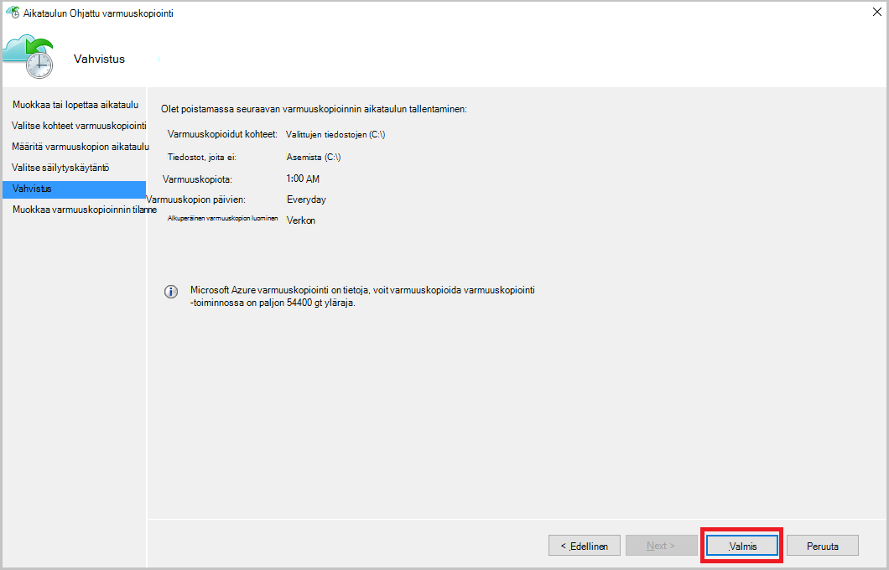

<properties
    pageTitle="Hallitse Azure varmuuskopiointi vaults ja perinteinen käyttöönoton mallin Azure-palvelimet | Microsoft Azure"
    description="Opi hallitsemaan Azure varmuuskopiointi vaults ja palvelinten Tässä opetusohjelmassa avulla."
    services="backup"
    documentationCenter=""
    authors="markgalioto"
    manager="jwhit"
    editor="tysonn"/>

<tags
    ms.service="backup"
    ms.workload="storage-backup-recovery"
    ms.tgt_pltfrm="na"
    ms.devlang="na"
    ms.topic="article"
    ms.date="09/27/2016"
    ms.author="jimpark;markgal"/>

# Azure varmuuskopiointi vaults ja perinteinen käyttöönoton mallin palvelinten hallinta

> [AZURE.SELECTOR]
- [Resurssien hallinta](backup-azure-manage-windows-server.md)
- [Perinteinen](backup-azure-manage-windows-server-classic.md)

Tässä artikkelissa löydät kautta Azure perinteinen portaalin ja Microsoft Azure Backup agentti varmuuskopion hallintatehtäviä yleiskatsaus.

[AZURE.INCLUDE [learn-about-deployment-models](../../includes/learn-about-deployment-models-classic-include.md)]Resurssien hallinnan käyttöönottomalli.

## Portaalin hallintatehtävät
1. Kirjautuminen [hallinta-portaalin](https://manage.windowsazure.com).

2. Valitse **Palautus palvelut**ja valitse sitten varmuuskopion säilöön, voit tarkastella Pika-aloitus-sivun nimi.

    

Näet käytettävissä hallintatehtäviä valitsemalla Pika-aloitus-sivun yläosassa asetukset.

### Raporttinäkymät-ikkunan
Valitse **raporttinäkymät-ikkunan** käyttö esiin palvelimen. **Käyttö yleiskatsaus** sisältää:

- Windows-palvelimien määrä rekisteröity pilveen
- Azuren näennäiskoneiden cloud suojattu määrä
- Kulutettu Azure-tallennustilan
- Viimeisimmät töiden tilan

Koontinäytön alareunassa voit suorittaa seuraavia tehtäviä:

- **Hallinta-varmenteen** – Jos varmenne on käytetty rekisteröidä palvelimen ja valitse tämän toiminnon avulla voit päivittää varmenne. Jos käytössäsi on säilö tunnistetiedot, älä käytä **hallinta-varmenteen**.
- **Poista** - poistaa nykyisen varmuuskopioinnin säilö. Jos varmuuskopion säilö käytetään enää, voit poistaa sen ja vapauttaa tilaa. **Poistaa** vain käytössä, kun rekisteröidyt jokaisessa palvelimessa on poistettu säilöstä.

## Rekisteröity kohteet
Valitse **Rekisteröity kohteiden** tarkasteleminen, joka on rekisteröity tämän säilöön-palvelimien nimet.

**Tyyppi** -suodatin oletusarvoisesti Azure Virtual Machine. Jos haluat tarkastella, joka on rekisteröity tämän säilö palvelinten nimet, valitse **Windows server** avattavassa valikossa.

Täällä voit suorittaa seuraavia tehtäviä:

- **Salli uudelleen-rekisteröinti** – kun tämä asetus on valittu palvelimen avulla voit **Rekisteröinnistä** : paikallisen Microsoft Azure Backup agentti rekisteröidä palvelimen varmuuskopion säilö toisen kerran. Voit joutua muuttamaan rekisteröidä uudelleen varmenteen virheen vuoksi tai jos palvelin oli muodostetaan uudelleen.
- Palvelimen **poistaminen** - poistaa varmuuskopion säilöstä. Kaikki liittyvät palvelimeen tallennetut tiedot poistetaan heti.

    

## Suojatun kohteet
Valitse Näytä kohteet, jotka-palvelimet varmuuskopioida **Suojatut osat** .

## Asetusten määrittäminen

**Määritä** -välilehdestä voit valita haluamasi redundancy tallennuspaikka. Löydät parhaan mahdollisen ajan tallennustilan redundancy-vaihtoehto on oikea säilöön luomisen jälkeen ja ennen kuin se on rekisteröity missään.

>[AZURE.WARNING] Kun kohde on rekisteröity säilö, redundancy tallennuspaikka on lukittu, eikä sitä voi muokata.

Katso tästä artikkelista lisätietoja [tallennustilan redundanssin](../storage/storage-redundancy.md).

## Microsoft Azure varmuuskopiointi agentti tehtävät

### Konsolin

Avaa **Microsoft Azure Backup agentti** (löydät sen koneen hakemalla *Microsoft Azure varmuuskopiointi*).

**Toiminnot** käytettävissä backup agentti-konsolin oikeassa voit suorittaa seuraavat hallintatehtäviä:

- Rekisteröi-palvelin
- Ajoita varmuuskopiointi
- Varmuuskopioi
- Ominaisuuksien muuttaminen

>[AZURE.NOTE] **Palauta tiedot**-kohdassa [Palauta tiedostot Windows server- tai Windows-asiakaskoneeseen](backup-azure-restore-windows-server.md).

### Muokkaa olemassa oleva varmuuskopio

1. Valitse Microsoft Azure Backup agent **Ajoita varmuuskopiointi**.

    

2. **Aikataulun Ohjattu varmuuskopiointi** Jätä **muutosten tekeminen varmuuskopioidut kohteet tai ajat** -asetus on valittuna ja valitse **Seuraava**.

    

3. Jos haluat lisätä tai muokata kohteita, valitse **Valitse kohteita** -näytössä **Lisää kohteita**.

    Voit myös määrittää **Pois jätettyjen asetukset** ohjatun tältä sivulta. Jos haluat jättää pois tiedostot tai tiedostotyypit lue ohjeet lisääminen [pois jätettyjen asetukset](#exclusion-settings).

4. Valitse tiedostot ja kansiot, jotka haluat varmuuskopioida ja valitse **OK**.

    

5. Määritä **varmuuskopioinnin aikataulu** ja valitse **Seuraava**.

    Voit ajoittaa (on enintään 3 kertaa päivässä) päivittäin tai viikoittain varmuuskopiot.

    

    >[AZURE.NOTE] Tässä [artikkelissa](backup-azure-backup-cloud-as-tape.md)kerrotaan varmuuskopioinnin ajoituksen määrittäminen.

6. **Säilytyskäytännön** varmuuskopion ja valitse **Seuraava**.

    

7. **Vahvistusnäytössä** Tarkista tiedot ja valitse **Valmis**.

8. Kun ohjattu toiminto päättyy, **aikataulun**luominen, valitse **Sulje**.

    Muokattuasi suojaus voit vahvistaa, että varmuuskopiot käynnistävät siirtymällä **työt** -välilehti ja varmistamalla, että muutokset näkyvät varmuuskopion työt oikein.

### Verkon rajoittimen käyttöönotto  
Azure Backup agent on Throttling-välilehdestä, jossa voit määrittää, miten kaistanleveys käytetään tiedonsiirrossa. Ohjausobjektin voi olla hyödyllinen, jos haluat varmuuskopioida tiedot aikana työaika, mutta et halua varmuuskopiointia voi häiritä muiden internet-liikenne. Tietojen rajoittaminen siirto koskee varmuuskopioiminen ja palauttaminen toimintoja.  

Jos haluat ottaa käyttöön rajoitusta:

1. Valitse **Backup agentti** **Ominaisuuksien muuttaminen**.

2. Valitse **internet-kaistanleveyden käytön rajoittaminen backup toimille käyttöön** -valintaruutu.

    

3. Kun olet ottanut rajoitusta, määritä sallitut kaistanleveyden varmuuskopiotiedot siirron **työtuntien** ja **Muut työtuntien**aikana.

    Kaistanleveyden arvot alkaa 512 kilotavua sekunnissa (Kbps), ja voit siirtyä 1023 megatavua sekunnissa (Mbps). Voit myös nimetä alku ja lopetuksen **työtuntien**ja mitkä viikonpäivien pidetään työn päivää. Nimetty työtuntien ulkopuolella aika pidetään työtunnit.

4. Valitse **OK**.

## Pois jätettyjen asetukset

1. Avaa **Microsoft Azure Backup agentti** (löydät sen koneen hakemalla *Microsoft Azure varmuuskopiointi*).

    

2. Valitse Microsoft Azure Backup agent **Ajoita varmuuskopiointi**.

    

3. Aikataulun varmuuskopion ohjatun Jätä **muutosten tekeminen varmuuskopioidut kohteet tai ajat** -asetus on valittuna ja valitse **Seuraava**.

    

4. Valitse **Poikkeukset-asetukset**.

    

5. Valitse **Lisää pois jätettyjen**.

    

6. Valitse sijainti ja valitse **OK**.

    

7. Lisää tiedostotunniste **Tiedostotyyppi** -kentässä.

    

    Lisäämällä .mp3-tiedostotunnistetta

    

    Lisää toinen tunniste, valitsemalla **Lisää poikkeus** ja Syötä toinen (lisääminen .jpeg-tunniste) tiedostotyyppiä.

    

8. Kun olet lisännyt kaikki tunnisteet, valitse **OK**.

9. Etene ohjatun aikataulun varmuuskopioinnin valitsemalla **Seuraava** , kunnes **Vahvistus-sivu**ja valitse sitten **Valmis**.

    

## Seuraavat vaiheet
- [Palauttaa Azure Windows Server- tai Windows-asiakas](backup-azure-restore-windows-server.md)
- Lisätietoja Azure varmuuskopiointi-artikkelissa [Azure varmuuskopiointi yleiskatsaus](backup-introduction-to-azure-backup.md)
- Käy [Azure varmuuskopion keskustelupalsta](http://go.microsoft.com/fwlink/p/?LinkId=290933)
