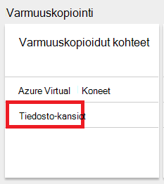
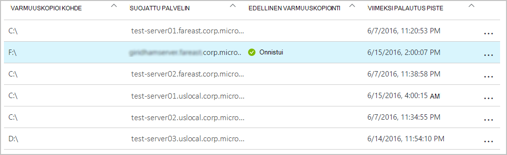

<properties
    pageTitle="Azure palautus services vaults ja palvelinten hallinta | Microsoft Azure"
    description="Opi hallitsemaan Azure palautus services vaults ja palvelinten Tässä opetusohjelmassa avulla."
    services="backup"
    documentationCenter=""
    authors="markgalioto"
    manager="cfreeman"
    editor="tysonn"/>

<tags
    ms.service="backup"
    ms.workload="storage-backup-recovery"
    ms.tgt_pltfrm="na"
    ms.devlang="na"
    ms.topic="article"
    ms.date="10/19/2016"
    ms.author="jimpark; markgal"/>


# <a name="monitor-and-manage-azure-recovery-services-vaults-and-servers-for-windows-machines"></a>Seurata ja hallita Azure palautus services vaults ja palvelinten Windows-tietokoneissa

> [AZURE.SELECTOR]
- [Resurssien hallinta](backup-azure-manage-windows-server.md)
- [Perinteinen](backup-azure-manage-windows-server-classic.md)

Tässä artikkelissa löydät kautta Azure portaalin ja Microsoft Azure Backup agentti varmuuskopion hallintatehtäviä yleiskatsaus.

[AZURE.INCLUDE [learn-about-deployment-models](../../includes/learn-about-deployment-models-rm-include.md)]perinteinen käyttöönottomalli.

## <a name="management-portal-tasks"></a>Portaalin hallintatehtävät

### <a name="access-your-recovery-services-vaults"></a>Käyttää palautus Services vaults

1. Kirjautuminen [Azure Portal](https://portal.azure.com/) Azure-tilauksen käyttäminen.

2. Valitse toiminto-valikosta valitsemalla **Selaa** ja kirjoita resurssien luetteloa, **Palautus-palvelut**. Kun alat kirjoittaa, luettelo suodattaa syötettäsi perusteella. Valitse **palautus-palveluiden vaults**.

     <br/>

2. Valitse Avaa palautus Services säilö dashboard-sivu-luettelosta tarkasteltavat säilö nimi.

     <br/>

## <a name="monitor-jobs-and-alerts"></a>Töiden valvominen ja ilmoitukset
Voit seurata töitä ja palautus Services säilö Raporttinäkymät-ikkunan, on näkyvissä ilmoitukset:

- Varmuuskopion ilmoitusten tiedot
- Tiedostojen ja kansioiden sekä Azuren näennäiskoneiden suojattu pilveen
- Kulutettu Azure-tallennustilan
- Varmuuskopiointityön tilan


Kaikkien näiden ruutujen tiedot valitsemalla Avaa liittyvä sivu, jossa voit hallita liittyvät tehtävät.

Koontinäytön yläreunasta:

- Asetusten avulla voit käyttää käytettävissä varmuuskopion tehtävät.
- Varmuuskopiointi - avulla voit varmuuskopioida uudet tiedostot ja kansiot (tai Azure VMs) palauttaminen Services säilö.
- Poista - Jos palautus-palveluiden säilö käytetään enää, voit poistaa sen ja vapauttaa tilaa. Poista on käytettävissä vain, kun poistetut palvelimilta suojattu säilö.


## <a name="alerts-for-backups-using-azure-backup-agent"></a>Ilmoitusten avulla Azure backup agentti varmuuskopioiden hakeminen:
| Ilmoitusten taso  | Ilmoitusten vastaanottaminen |
| ------------- | ------------- |
| Kriittinen | Varmuuskopioinnin palautus-virhe  |
| Varoitus  | Varmuuskopiointi valmis varoituksia (kun alle sata tiedostot varmuuskopioidaan ei vioittumisongelmien vuoksi ja enemmän kuin miljoona tiedostot varmuuskopioidaan onnistui)  |
| Tiedoksi  | Ei mitään  |
## <a name="manage-backup-alerts"></a>Varmuuskopiointi-ilmoitusten hallinta
Valitse Hallitse ilmoituksia ja Avaa **Varmuuskopio ilmoitukset** -sivu **Varmuuskopiointi ilmoitukset** -ruutu.


Varmuuskopiointi-ilmoitukset-ruutu näkyy määrä:

- Kriittinen ilmoitusten selvittämätöntä viimeisen 24 tunnin aikana
- Varoitus ilmoitusten selvittämätöntä viimeisen 24 tunnin aikana

Linkit valitsemalla Avaa äänimerkkien (kriittisen tai varoitus) suodatetut näkymän **Varmuuskopiointi ilmoitukset** -sivu.

Varmuuskopiointi-ilmoituksia, sivu-voit:

- Valitse sisällytettävät ilmoituksiasi tarvittavat tiedot.

    

- Voit suodattaa ilmoitusten vakavuus, tila ja Aloita/Lopeta-aikoja.

    

- Määritä vakavuus, korkojakso ja vastaanottajat-ilmoitusten sekä ilmoitusten ottaminen käyttöön tai poistaa sen käytöstä.

    

Jos **Ilmoitusten kohden** on valittuna **Ilmoita** -korkojakso ei ryhmittely tai vähentäminen sähköpostitse tapahtuu. Ilmoituksen tulokseksi 1-ilmoituksen. Tämä on oletusarvo ja tarkkuus-sähköpostia myös lähetetään välittömästi.

Jos **Tunnin välein käsittely** on valittuna **Ilmoita** korkojakso yhden sähköposti lähetetään käyttäjän kertoo, että on luotu edellisen tunnin ratkaisemattomat uusien ilmoitukset. Tarkkuus sähköposti lähetetään tunnin lopussa.

Ilmoitukset lähetetään seuraavat vakavuus tasoissa:

- kriittinen
- Varoitus
- tietoja

Ilmoitus, jossa **Poista käytöstä** -painike projektin tiedot-sivu Poista käytöstä. Kun valitset Poista käytöstä, voit antaa tarkkuus muistiinpanot.

Voit valita sarakkeet haluat näkyvän osana ilmoitus, jossa **Valitse sarakkeet** -painiketta.

>[AZURE.NOTE] **Asetukset** -sivu-varmuuskopion ilmoitusten hallinta valitsemalla **Seuranta- ja raporttien > ilmoitukset ja tapahtumat > varmuuskopion ilmoitusten** ja valitsemalla sitten **suodattimen** tai **Määritä ilmoitukset**.

## <a name="manage-backup-items"></a>Varmuuskopiointi hallitseminen
Paikallisen varmuuskopioiden hallinta on nyt saatavilla hallinta-portaalissa. Koontinäytön varmuuskopiointi-osassa **Varmuuskopioidut kohteet** -ruutu näyttää suojattu säilö varmuuskopion kohteiden määrän.

Valitse **Tiedosto-kansiot** varmuuskopiointi kohteet-ruudussa.



Varmuuskopioidut kohteet-sivu avautuu määrittäminen tiedosto-kansio on näkyvissä kunkin kohteen luettelossa tietyn varmuuskopiointi suodatin.



Jos valitset tietyn kohteen varmuuskopioinnin luettelosta, näet kyseisen kohteen olennaiset tiedot.

>[AZURE.NOTE] **Asetukset** -sivu, voit hallita tiedostoja ja kansioita valitsemalla **suojattu kohteet > varmuuskopiointi kohteiden** ja valitsemalla sitten **Tiedostokansioihin** kohdan avattavasta valikosta.


## <a name="manage-backup-jobs"></a>Varmuuskopiointi töiden hallinta
Varmuuskopiointi työt sekä paikalliset (kun on paikallinen palvelin on varmuuskopioimalla Azure) ja koontinäytön näkevät Azure varmuuskopiot.

Koontinäytön varmuuskopiointi-osassa varmuuskopiointi työ-ruutu näkyy töiden määrä:

- käynnissä
- epäonnistui viimeisen 24 tunnin aikana.

Voit hallita varmuuskopion työt valitsemalla **Varmuuskopiointityön** -ruutu, joka avaa varmuuskopiointityöt-sivu.


Voit muokata tietoja, jotka ovat käytettävissä varmuuskopiointi työt-sivu ja **Valitse sarakkeet** -painike sivun yläreunassa.

**Suodatin** -painikkeen avulla voit valita tiedostoista ja kansioista sekä Azure virtuaalikoneen varmuuskopion.

Jos et näe varmuuskopioidut tiedostot ja kansiot, sivun yläreunassa **Suodata** -painiketta ja valitse kohteen tyyppi-valikosta **tiedostot ja kansiot** .

>[AZURE.NOTE] **Asetukset** -sivu-varmuuskopion töiden hallinta valitsemalla **Seuranta- ja raporttien > työt > varmuuskopiointityön** ja valitsemalla sitten **Tiedostokansioihin** kohdan avattavasta valikosta.

## <a name="monitor-backup-usage"></a>Näytön varmuuskopiointi käyttö
Koontinäytön varmuuskopiointi-osassa varmuuskopiointi käyttö-ruutu näyttää kulutettu Azure-tallennustilan. Tallennustilan käyttö on tarkoitettu:
- Cloud LRS tallennustilan käyttöäsi liittyvät säilö
- Cloud GRS tallennustilan käyttöäsi liittyvät säilö

## <a name="production-servers"></a>Tuotannon palvelimet
Voit hallita tuotannon palvelinten, valitsemalla **asetukset**. Valitse hallinta-kohdasta **Varmuuskopiointi infrastruktuurin > tuotannon palvelinten**.

Kaikkien käytettävissä tuotannon palvelinten tuotannon palvelinten sivu-luetteloihin. Valitse Avaa palvelimen tiedot-luettelosta palvelimeen.


## <a name="microsoft-azure-backup-agent-tasks"></a>Microsoft Azure varmuuskopiointi agentti tehtävät

## <a name="open-the-backup-agent"></a>Avaa backup-agentti

Avaa **Microsoft Azure Backup agentti** (kannattaa tutustua tietokoneen hakemalla *Microsoft Azure varmuuskopiointi*).


**Toiminnot** käytettävissä backup agentti-konsolin oikeassa suorittaa seuraavat hallintatehtävät:

- Rekisteröi-palvelin
- Ajoita varmuuskopiointi
- Varmuuskopioi
- Ominaisuuksien muuttaminen


>[AZURE.NOTE] **Palauta tiedot**-kohdassa [Palauta tiedostot Windows server- tai Windows-asiakaskoneeseen](backup-azure-restore-windows-server.md).

## <a name="modify-an-existing-backup"></a>Muokkaa olemassa oleva varmuuskopio

1. Valitse Microsoft Azure Backup agent **Ajoita varmuuskopiointi**.

    

2. **Aikataulun Ohjattu varmuuskopiointi** Jätä **muutosten tekeminen varmuuskopioidut kohteet tai ajat** -asetus on valittuna ja valitse **Seuraava**.

    

3. Jos haluat lisätä tai muokata kohteita, valitse **Valitse kohteita** -näytössä **Lisää kohteita**.

    Voit myös määrittää **Pois jätettyjen asetukset** ohjatun tältä sivulta. Jos haluat jättää pois tiedostot tai tiedostotyypit lue ohjeet lisääminen [pois jätettyjen asetukset](#exclusion-settings).

4. Valitse tiedostot ja kansiot, jotka haluat varmuuskopioida ja valitse **OK**.

    

5. Määritä **varmuuskopioinnin aikataulu** ja valitse **Seuraava**.

    Voit ajoittaa (on enintään 3 kertaa päivässä) päivittäin tai viikoittain varmuuskopiot.

    

    >[AZURE.NOTE] Tässä [artikkelissa](backup-azure-backup-cloud-as-tape.md)kerrotaan varmuuskopioinnin ajoituksen määrittäminen.

6. **Säilytyskäytännön** varmuuskopion ja valitse **Seuraava**.

    

7. **Vahvistusnäytössä** Tarkista tiedot ja valitse **Valmis**.

8. Kun ohjattu toiminto päättyy, **aikataulun**luominen, valitse **Sulje**.

    Muokattuasi suojaus voit vahvistaa, että varmuuskopiot käynnistävät siirtymällä **työt** -välilehti ja varmistamalla, että muutokset näkyvät varmuuskopion työt oikein.

## <a name="enable-network-throttling"></a>Verkon rajoittimen käyttöönotto  
Azure Backup agent on Throttling-välilehdestä, jossa voit määrittää, miten kaistanleveys käytetään tiedonsiirrossa. Ohjausobjektin voi olla hyödyllinen, jos haluat varmuuskopioida tiedot aikana työaika, mutta et halua varmuuskopiointia voi häiritä muiden internet-liikenne. Tietojen rajoittaminen siirto koskee varmuuskopioiminen ja palauttaminen toimintoja.  

Jos haluat ottaa käyttöön rajoitusta:

1. Valitse **Backup agentti** **Ominaisuuksien muuttaminen**.

2. **-Välilehdessä valitsemalla **käyttöön Internetin kaistanleveyden käytön rajoitusten määrittäminen varmuuskopion toimintojen **.

    

    Kun olet ottanut rajoitusta, määritä sallitut kaistanleveyden varmuuskopiotiedot siirron **työtuntien** ja **Muut työtuntien**aikana.

    Kaistanleveyden arvot alkaa 512 kilotavua sekunnissa (Kbps), ja voit siirtyä 1023 megatavua sekunnissa (Mbps). Voit myös nimetä alku ja lopetuksen **työtuntien**ja mitkä viikonpäivien pidetään työn päivää. Nimetty työtuntien ulkopuolella aika pidetään työtunnit.

3. Valitse **OK**.

## <a name="manage-exclusion-settings"></a>Pois jätettyjen asetusten hallinta

1. Avaa **Microsoft Azure Backup agentti** (löydät sen koneen hakemalla *Microsoft Azure varmuuskopiointi*).

    

2. Valitse Microsoft Azure Backup agent **Ajoita varmuuskopiointi**.

    

3. Aikataulun varmuuskopion ohjatun Jätä **muutosten tekeminen varmuuskopioidut kohteet tai ajat** -asetus on valittuna ja valitse **Seuraava**.

    

4. Valitse **Poikkeukset-asetukset**.

    

5. Valitse **Lisää pois jätettyjen**.

    

6. Valitse sijainti ja valitse **OK**.

    

7. Lisää tiedostotunniste **Tiedostotyyppi** -kentässä.

    

    Lisäämällä .mp3-tiedostotunnistetta

    

    Lisää toinen tunniste, valitsemalla **Lisää poikkeus** ja Syötä toinen (lisääminen .jpeg-tunniste) tiedostotyyppiä.

    

8. Kun olet lisännyt kaikki tunnisteet, valitse **OK**.

9. Etene ohjatun aikataulun varmuuskopioinnin valitsemalla **Seuraava** , kunnes **Vahvistus-sivu**ja valitse sitten **Valmis**.

    

## <a name="frequently-asked-questions"></a>Usein kysytyt kysymykset
**Q1. Varmuuskopiointityön tilan näkyy Azure backup agentti valmiiksi miksi ei sen Hae näy heti portaalissa?**

A1. On suurin viive ja 15 minuutin välillä varmuuskopiointityön tilan osoitteessa näkyy Azure backup-agentti ja Azure-portaalin.

**Q.2, kun varmuuskopiointityön epäonnistuu, kuinka kauan menee nostaa ilmoituksen?**

A.2 ilmoituksen korotetaan Azure varmuuskopioinnin 20 minuutin kuluessa.

**Q3. Onko kirjainkoko, jossa sähköpostia ei lähetetä Jos ilmoitukset on määritetty?**

A3. Alla on tapauksissa, kun ilmoitusta ei lähetetä vähentämiseksi ilmoitusten vähentämiseksi:

   - Jos ilmoitukset on määritetty kerran tunnissa ilmoituksen käynnistyy ja ratkaista tunnin kuluessa
   - Työ on peruutettu.
   - Toinen varmuuskopiointityön epäonnistui, koska alkuperäinen varmuuskopiointityön on käynnissä.

## <a name="troubleshooting-monitoring-issues"></a>Seurannan vianmääritys

**Ongelma:** Projektit ja/tai Azure Backup agent ilmoitukset eivät näy portaalissa.

**Vianmääritysohjeet:** Prosessin ```OBRecoveryServicesManagementAgent```, lähettää työn ja ilmoitusten tiedot Azure varmuuskopiointi-palveluun. Joskus prosessia muuttuvat jumissa tai sammuttamisen.

1. Vahvista prosessi ei ole käynnissä, Avaa **Tehtävienhallinta** ja tarkista, onko ```OBRecoveryServicesManagementAgent``` -prosessi käynnissä.

2. Oletetaan, että prosessi ei ole käynnissä, Avaa **Ohjauspaneeli** ja palveluluetteloon. Käynnistä tai Käynnistä **Microsoft Azure palautus palveluiden hallinta Agent**.

    Lisätietoja Selaa lokit etsiminen:<br/>
`<AzureBackup_agent_install_folder>\Microsoft Azure Recovery Services Agent\Temp\GatewayProvider*`. Esimerkki:<br/> `C:\Program Files\Microsoft Azure Recovery Services Agent\Temp\GatewayProvider0.errlog`.

## <a name="next-steps"></a>Seuraavat vaiheet
- [Palauttaa Azure Windows Server- tai Windows-asiakas](backup-azure-restore-windows-server.md)
- Lisätietoja Azure varmuuskopiointi-artikkelissa [Azure varmuuskopiointi yleiskatsaus](backup-introduction-to-azure-backup.md)
- Käy [Azure varmuuskopion keskustelupalsta](http://go.microsoft.com/fwlink/p/?LinkId=290933)
