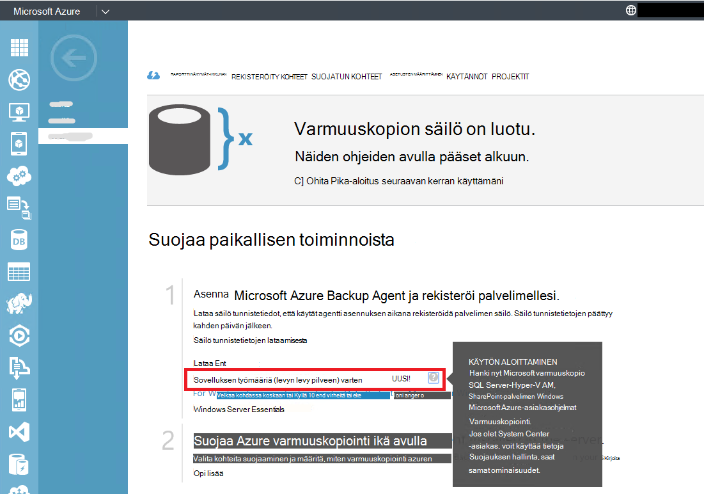

<properties
  pageTitle="Azure varmuuskopiointi Serverissä työmääriä varmuuskopioida ympäristön valmisteleminen | Microsoft Azure"
  description="Varmista, että ympäristösi on valmisteltu varmuuskopioida työmääriä Azure varmuuskopiointi palvelimen käyttäminen"
  services="backup"
  documentationCenter=""
  authors="pvrk"
  manager="shivamg"
  editor=""
  keywords="Azure varmuuskopio-palvelimeen. varmuuskopion säilöön"/>

<tags
  ms.service="backup"
  ms.workload="storage-backup-recovery"
  ms.tgt_pltfrm="na"
  ms.devlang="na"
  ms.topic="article"
  ms.date="08/22/2016"
  ms.author="jimpark;trinadhk;pullabhk; markgal"/>

# <a name="preparing-to-back-up-workloads-using-azure-backup-server"></a>Valmistellaan varmuuskopioida työmääriä Azure varmuuskopiointi palvelimen käyttäminen

> [AZURE.SELECTOR]
- [Azure varmuuskopion Server](backup-azure-microsoft-azure-backup.md)
- [SCDPM](backup-azure-dpm-introduction.md)
- [Azure varmuuskopiointi Server (perinteinen)](backup-azure-microsoft-azure-backup-classic.md)
- [SCDPM (perinteinen)](backup-azure-dpm-introduction-classic.md)


Tässä artikkelissa on tietoja työmääriä Azure varmuuskopiointi Serverissä varmuuskopioida ympäristön valmistelemisesta. Azure varmuuskopiointi-palvelimeen voit suojata sovelluksen toiminnoista, kuten Hyper-V VMs, Microsoft SQL Server, SharePoint Server, Microsoft Exchange ja Windows-asiakkaiden yksittäisen konsolin.

>[AZURE.WARNING] Azure varmuuskopion palvelimen perii työmäärää varmuuskopiointi toiminnallisuuden Data Protection Manager (DPM). Etsii osoittimet DPM ohjeista, jotkin seuraavia ominaisuuksia. Azure palvelimen ei kuitenkin antaa suojaus nauha tai integroida System Center.

## <a name="1-windows-server-machine"></a>1. palvelimen Windows


Ensimmäinen askel saaminen Azure varmuuskopiointi-palvelimen ja käytössä on Windows Server-koneen on.

| Sijainti | Vähimmäisvaatimukset | Lisäohjeita |
| -------- | -------------------- | ----------------------- |
| Azure | Azure IaaS virtuaalikoneen<br><br>A2 Standard: 2 sydämiä 3,5 Gigatavua RAM-Muistia | Voit aloittaa yksinkertainen valikoima Windows Server 2012 R2-palvelinkeskuksen. [Azure varmuuskopiointi Server (DPM) käyttäen suojaaminen IaaS toiminnoista](https://technet.microsoft.com/library/jj852163.aspx) on monta nuances. Varmistaa, että voit lukea artikkelin kokonaan ennen kuin otat koneen. |
| Paikallisen | AM Hyper-V<br> VMWare AM<br> tai fyysinen isäntänimi<br><br>2 Sydämiä ja 4 gt RAM-Muistia | Voit deduplicate käyttämällä Windows Server kopioinnin peruuttaminen DPM-tallennustilan. Lisätietoja [DPM ja kopioinnin peruuttaminen](https://technet.microsoft.com/library/dn891438.aspx) yhteistoiminta kun Hyper-V VMs käyttöön. |

> [AZURE.NOTE] On suositeltavaa, että Azure palvelimen voi asentaa Windows Server 2012 R2 Palvelinkeskus konetta. Edellytykset paljon käsitellään automaattisesti Windows-käyttöjärjestelmän uusimman version kanssa.

Jos haluat liittää toimialueelle joskus tähän palvelimeen, on suositeltavaa toimialueen liittyminen tehtävän tehtävä ennen Azure varmuuskopiointi palvelimen asennusta. Siirtäminen aiemmin Azure varmuuskopiointi Server-koneen verkkotunnuksen käyttöönoton jälkeen *ei tueta*.

## <a name="2-backup-vault"></a>2. varmuuskopion säilöön


Tietojen lähettäminen Azure tai säilyttää sen paikallisesti, ohjelmiston on oltava yhdistettynä Azure. Enemmän tietyn, varmuuskopion Server Azure-koneen on rekisteröitävä varmuuskopion säilö.

Luo varmuuskopio säilö seuraavasti:

1. Kirjautuminen [hallinta-portaalin](http://manage.windowsazure.com/).

2. Valitse **Uusi** > **tietopalvelujen** > **palautus Services** > **varmuuskopion säilö** > **nopea luominen**. Jos sinulla on useita tilauksia organisaation tilisi, valitse ensin oikea tilaus liitettävä varmuuskopion säilö.

3. Kirjoita **nimi**-kenttään kutsumanimi tunnistavan säilö. Tämä on oltava yksilöllinen jokaisen tilauksen.

4. Valitse **alue**-säilö maantieteellinen alue. Yleensä säilö alueen kerätään tietoja paikallisen tietosuojan tai verkon viive rajoitusten perusteella.

    

5. Valitse **Luo säilö**. Voi kestää hetken, luoda varmuuskopion säilö. Seurata tilailmoitukset portaalin alareunassa.

    

6. Viestin vahvistaa, että säilö on luotu ja se merkitään aktiiviseksi palautus palveluita-sivulle.
    

  > [AZURE.IMPORTANT] Varmista, että tarvittavat tallennuspaikka redundancy valitaan oikealle, kun säilö on luotu. Lue lisätietoja [geo tarpeettomat](../storage/storage-redundancy.md#geo-redundant-storage) ja tämä [yleisiä tietoja](../storage/storage-redundancy.md) [paikallisesti tarpeettomat](../storage/storage-redundancy.md#locally-redundant-storage) asetuksia.


## <a name="3-software-package"></a>3 ohjelmistopaketin


### <a name="downloading-the-software-package"></a>Ohjelmiston lataaminen

Samoin kuin säilö tunnistetiedot, voit ladata Microsoft Azure varmuuskopion sovelluksen työmääriä varmuuskopion säilö **Pika-aloitussivu** .

1. Valitse **sovelluksen työmääriä (levyn, levy cloud)**. Tämä siirtää sinut kohtaa, johon voi ladata ohjelmistopaketti Download Centeristä sivulle.

    

2. Valitse **Lataa**.

    

3. Valitse kaikki tiedostot ja valitse **Seuraava**. Kaikki tiedostot, jotka tulevat lataussivulle Microsoft Azure varmuuskopiointi ja Vie kaikki tiedostot samassa kansiossa.


    Lataa kaikki tiedostot ladattavan tiedoston koko on yhdessä > 3G, voi kestää jopa 60 minuutin suorittamiseen ladattavaksi linkki 10 Mbps.


### <a name="extracting-the-software-package"></a>Poimii ohjelmistopaketti

Kun olet ladannut kaikki tiedostot, valitse **MicrosoftAzureBackupInstaller.exe**. **Microsoft Azure varmuuskopiointi ohjatun** Pura asennustiedostot sijaintiin, voit määrittää käynnistyy. Etene ohjatun toiminnon, ja valitse sitten Aloita poiminnan **Pura** -painiketta.

> [AZURE.WARNING] Pura asennustiedostot edellyttää vähintään 4 gt vapaata tilaa.


Kun purkaminen käsitellä valmis, Käynnistä juuri poimitun *setup.exe* napsauttamalla **Valmis** -painiketta ja aloita asennus Microsoft Azure palvelimen valintaruutu.

### <a name="installing-the-software-package"></a>Ohjelmistopaketin asentaminen

1. Valitse **Microsoft Azure varmuuskopiointi** käynnistää ohjatun määritystoiminnon.

    

2. Valitse Tervetuloa-ikkunassa **Seuraava** -painiketta. Tämä avaa *Valmistelevat tarkistaa* -osassa. Tässä näytössä valitsemalla **Tarkista** -painikkeen voit selvittää, jos Azure palvelimen laitteiston ja ohjelmiston edellytykset täyttyvät. Jos kaikki edellytykset eivät ole täyty onnistuneesti, näyttöön tulee sanoma, joka ilmaisee, että tietokone vastaa. Napsauta **Seuraava** -painiketta.

    

3. Microsoft Azure varmuuskopiointi-palvelin vaatii SQL Server Standard- ja Azure palvelimen asennuspaketin sisältää yhdistettyjä tarvittavat SQL Server-binaaritiedostoja tarvitaan. Azure varmuuskopiointi Server-asennuksessa käynnistettäessä tulee Valitse vaihtoehto **Asenna uusi SQL Server-esiintymää tämän määritykset** ja valitse **Tarkista ja asenna** -painike. Kun edellytykset on asennettu onnistuneesti, valitse **Seuraava**.

    

    Jos virhe ilmenee suositus Käynnistä tietokone uudelleen, kiellä ja sitten **Tarkista uudelleen**.

    > [AZURE.NOTE] Azure varmuuskopiointi-palvelin ei toimi remote SQL Server-esiintymän. Azure palvelimen käyttämän esiintymää on oltava paikallinen.

4. Microsoft Azure varmuuskopiointi tiedostojen asennuksen sijainti ja valitse **Seuraava**.

    

    Taittopöydällä sijainti on takaisin Azure ylöspäin. Varmista taittopöydällä sijainti on vähintään 5 prosenttia suunniteltu pilveen varmuuskopioitavien tietojen. Levyn suojaus-erillisten levyjen on määritettävä, kun asennus on valmis. Saat lisätietoja tallennustilan jakavat, [Määritä tallennustilan jakavat ja levytilasta](https://technet.microsoft.com/library/hh758075.aspx).

5. Rajoitettu paikallisten käyttäjätilien vahva salasana ja valitse **Seuraava**.

    

6. Valitse, haluatko *Microsoft Updaten* avulla voit tarkistaa päivitykset ja valitse **Seuraava**.

    >[AZURE.NOTE] On suositeltavaa ottaa Windows Update-sivuston uudelleenohjaus Microsoft Update, joka tarjoaa suojaus ja tärkeät päivitykset Windows ja muihin ohjelmiin, kuten Microsoft Azure varmuuskopiointi Server.

    

7. Tarkista *Yhteenveto asetukset* ja valitse **Asenna**.

    

8. Asennus tapahtuu vaiheet. Ensimmäisessä vaiheessa Microsoft Azure palautus palvelut-agentti asennettu palvelimeen. Ohjatun toiminnon tarkistaa myös Internet-yhteys. Jos Internet-yhteys on käytettävissä voit jatkaa asennusta, jos et, anna välityspalvelimen tiedot, joista Internet-yhteys.

    Seuraavaksi voit määrittää Microsoft Azure palautus palvelut-agentti. Kokoonpanon osana on annettava olet säilö tunnistetietojen rekisteröidä varmuuskopion säilö tietokone. Voit antaa myös salasana ja salaus/salauksen purkaminen Azure ja asiakkaan tilojen välillä lähetettävät tiedot. Voit automaattisesti Luo salasana tai anna oman vähintään 16-merkkisen salasana. Jatka ohjatun toiminnon, kunnes agentti on määritetty.

    

9. Microsoft Azure varmuuskopiointi palvelimen rekisteröinti onnistuu, kun yleinen ohjattu asennus etenee asennuksesta ja määrityksestä ja SQL Server Azure palvelimen osat. SQL Server-osan asennus on valmis, kun Azure palvelimen osat on asennettu.

    


Kun asennus vaihe on valmis, tuotteen työpöydän kuvakkeet luotu sekä. Kaksoisnapsauta juuri käynnistää tuotteen-kuvaketta.

### <a name="add-backup-storage"></a>Lisää tallennustilaa varmuuskopiointi

Ensimmäinen varmuuskopio on käytettävissä säilössä kiinnitetty varmuuskopion Server Azure-koneeseen. Saat lisätietoja lisäämisestä levyjen [määrittäminen tallennustilan jakavat ja levytilasta](https://technet.microsoft.com/library/hh758075.aspx).

> [AZURE.NOTE] Haluat lisätä varmuuskopion tallennustilaa, vaikka tietojen lähettäminen Azure. Azure varmuuskopion palvelimen nykyisen arkkitehtuuri Azure varmuuskopion säilö pitää tiedot *toisen* kopion, kun paikallinen tallennus pitää varmuuskopio ensimmäisen (ja pakollinen).  

## <a name="4-network-connectivity"></a>4 verkkoyhteyden


Azure palvelimen vaativat tuotteen onnistuisi Azure varmuuskopiointi-palveluun. Tarkista, onko koneessa on Azure yhteys, voit käyttää ```Get-DPMCloudConnection``` komentosovelmalla varmuuskopiointi palvelimen PowerShellin Azure-konsolissa. Jos yhteys on luotu, komentosovelmalla tulos on tosi muulla ei ole yhteys.

Yhtä aikaa Azure tilaus on oltava kunnossa-tilaan. Saat lisätietoja tilauksen tilan ja hallita sitä, kirjaudu sisään [tilauksen portal]( https://account.windowsazure.com/Subscriptions).

Kun tiedät tilan Azure yhteydet ja Azure-tilauksen, voit selvittää, varmuuskopiointi ja palauttaminen-toiminto tarjoaa vaikutus alla olevassa taulukossa.

| Yhteyden tila | Azure-tilaus | Azure varmuuskopiointi| Varmuuskopiointi-levylle | Azure palauttaminen | Palauttaa levyltä |
| -------- | ------- | --------------------- | ------------------- | --------------------------- | ----------------------- |
| Yhdistetty | Aktiivinen | Sallittuja | Sallittuja | Sallittuja | Sallittuja |
| Yhdistetty | Vanhentunut | Pysäytetty | Pysäytetty | Sallittuja | Sallittuja |
| Yhdistetty | Käyttömahdollisuus purettu | Pysäytetty | Pysäytetty | Poistaa pysäytetty ja Azure palauttamisen pisteet | Pysäytetty |
| Kadonneiden connectivity > 15 päivää | Aktiivinen | Pysäytetty | Pysäytetty | Sallittuja | Sallittuja |
| Kadonneiden connectivity > 15 päivää | Vanhentunut | Pysäytetty | Pysäytetty | Sallittuja | Sallittuja |
| Kadonneiden connectivity > 15 päivää | Käyttömahdollisuus purettu | Pysäytetty | Pysäytetty |  Poistaa pysäytetty ja Azure palauttamisen pisteet | Pysäytetty |

### <a name="recovering-from-loss-of-connectivity"></a>Valitse menettäminen palauttaminen
Jos sinulla on palomuuri tai välityspalvelin, joka on estää käytön Azure, on whitelist palomuurin tai välityspalvelimen profiilin seuraavat toimialueen osoitteet:

- WWW.msftncsi.com
- \*. Microsoft.com-sivustosta
- \*. WindowsAzure.com
- \*. microsoftonline.com
- \*. windows.net

Kun yhteys Azure on palautettu Azure varmuuskopiointi Server-tietokoneessa, toiminnoista, joita voidaan suorittaa määräytyvät Azure tilauksen osavaltion mukaan. Edellä olevassa taulukossa on tietoja kun tietokone on "yhdistetty" sallitut toiminnot.

### <a name="handling-subscription-states"></a>Tilauksen osavaltioiden käsittely

On mahdollista tehdä Azure tilauksen *vanhentunut* tai *käyttömahdollisuus purettu* tilasta *aktiivista* tilaa. Kuitenkin tässä on joitakin vaikutukset tuotteen toiminnan samalla, kun tila ei ole *käytössä*:

- Tilauksen *käyttömahdollisuus purettu* menettää toimintoja ajaksi, joka on käyttömahdollisuus purettu. Valitse ottaminen *aktiivinen*, varmuuskopiointi ja palauttaminen tuotteen toimintoja on uudelleen käyttöön. Paikallisen levyn varmuuskopiotiedot voi hakea myös jos se on riittävän suuri säilytysaika kanssa uudelleen. Varmuuskopiotiedot Azure-tietokannassa on kuitenkin toimi menetetään, kun tilaus siirtyy *käyttömahdollisuus purettu* -tilaan.
- *Vanhentunut* -tilauksen menettää toiminnot vain, kunnes se on tehty *aktiivinen* uudelleen. Tilaus on *vanhentunut* aikajaksolle ajoitettu varmuuskopiot ei suoriteta.


## <a name="troubleshooting"></a>Vianmääritys

Jos Microsoft Azure varmuuskopion palvelimen epäonnistuu virheellisten aikana asennuksen vaiheessa (tai varmuuskopiointi ja palauttaminen), tutustu tämän [virheen koodit asiakirjan](https://support.microsoft.com/kb/3041338) .
Voit myös katsoa [Azure varmuuskopiointi liittyvät kysymykset ja vastaukset](backup-azure-backup-faq.md)


## <a name="next-steps"></a>Seuraavat vaiheet

Saat yksityiskohtaiset tiedot [DPM lisätietoja ympäristön](https://technet.microsoft.com/library/hh758176.aspx) valmistelemisesta Microsoft TechNet-sivustossa. Se sisältää myös tuetut määritykset, joina Azure palvelimen voidaan ottaa käyttöön ja käyttää tietoja.

Nämä artikkelit avulla voit saada tarkempaa tietoa työmäärää suojauksen Microsoft Azure varmuuskopiointi Serverin avulla.

- [SQL Server varmuuskopiointi](backup-azure-backup-sql.md)
- [SharePoint server varmuuskopiointi](backup-azure-backup-sharepoint.md)
- [Vaihtoehtoinen palvelin varmuuskopiointi](backup-azure-alternate-dpm-server.md)
